# 继续参加西雅图交换黑客马拉松

> 原文：<https://medium.com/capital-one-tech/devexchange-seattle-hackathon-money-movement-api-a1fea9fe00f3?source=collection_archive---------0----------------------->

## 我们第一个实验性的 API- Money 机芯的首次亮相

对于我们 2018 年的第一次黑客马拉松，我们访问了西雅图，太平洋西北部的统治(下雨？)科技中心，以及全新的[南湖联合资本一号咖啡馆](https://www.capitalone.com/local/seattle-southlakeunion/)。西雅图就是西雅图，在我们逗留期间下雨了，我们喝了太多的咖啡，我们在 [AngelHack](https://angelhack.com/) 的合作伙伴在我们周五晚上的启动会议上穿着格子花呢。

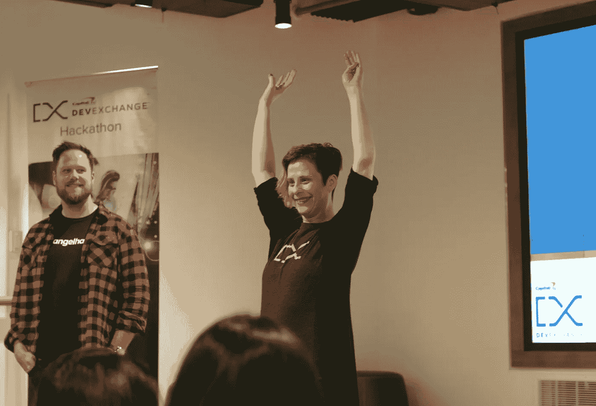

Opening Ceremonies, now with more plaid.

活动进展如何？以下是一些亮点:

# 我们预览了一个新的实验 API

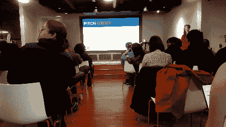

作为我们 2018 年平台战略的一部分，DevExchange 将推出一个新的 API 产品类别，称为*实验 API*。这些 API 使用模拟服务和模拟数据来模拟 API 函数。我们的设计目标是获得关于 API 可取性、功能和设计的早期反馈，我们决定利用西雅图黑客马拉松来首次展示我们的第一个实验性 API 产品— [Money Movement](https://developer.capitalone.com/api-products/money-movement/) 。

> “这些实验性的 API 本质上是敏捷和迭代的，允许我们与我们的开发人员社区共同创造。实验性 API 可以在投资于完整的 API 构建之前，针对需要概念反馈的业务线进行构建，或者测试来自外部开发人员的反馈。”Jeff Hansen——产品营销，Capital One DevExchange

资金移动 API 模拟了在 Capital One 账户之间以及在 Capital One 账户和其他金融机构持有的账户之间转移资金的能力。在当前迭代中，实验 API 可以检索符合条件的账户列表**，**请求转账，检索转账信息，更新转账请求。

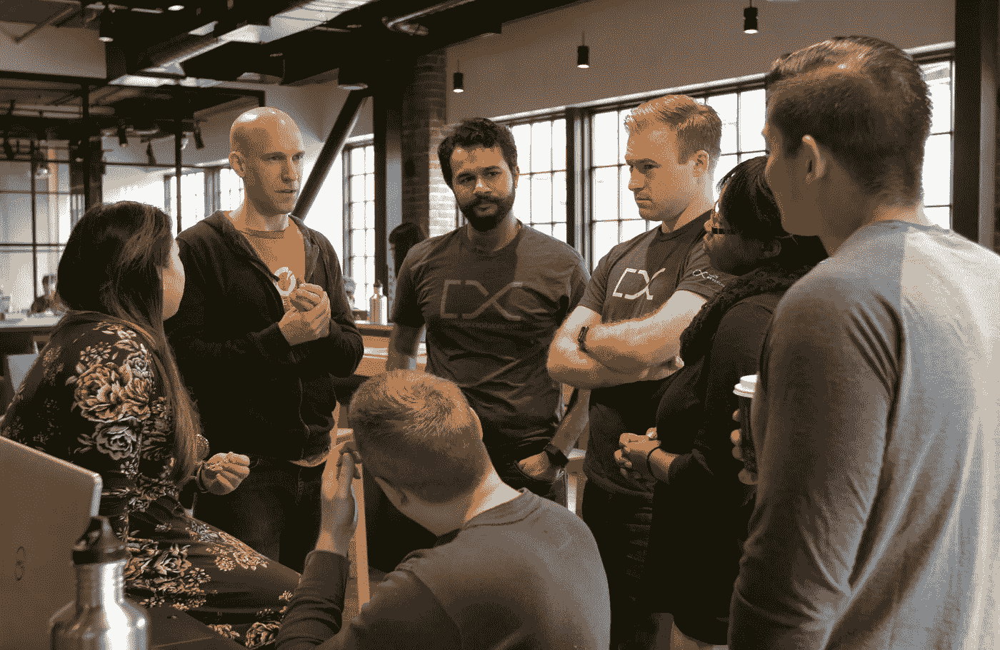

The Money Movement team discusses their Experimental API with participants

在西雅图，Money Movement 产品经理丹·科瓦奇(Dan Kovach)和技术负责人帕拉德普·埃鲁鲁(Andrew Elluru)介绍了其当前的功能集，回答了有关使用和集成的问题，并进行了移情采访，以帮助指导未来的开发。

在西雅图参加比赛的十支队伍中，有八支使用了新的 API，包括获胜者。我们收到了关于当前功能、未来 P2P 或账单支付功能潜力的反馈，并发现了技术和文档中需要调整的一些小领域。

> “我们希望这个 API 在生产时是完整的。它还没有出现，但我们正在利用这样的事件来弄清楚开发商眼中的整体资金流动世界会是什么样子。”Dan Kovach，货币运动产品经理

***想对资金动向做出反馈？加入*** [***吉特***](https://gitter.im/CapitalOne-DevExchange/money-movement) ***上的对话。***

# 我们向 Cortana 引入了团队

2018 年，我们与[微软 Cortana](https://www.microsoft.com/en-us/windows/cortana) 团队合作，向我们的参与者介绍他们的虚拟语音助理设备。这包括入门培训课程以及 Cortana 技能套件项目经理 Dorrene Brown 的实际操作指导和故障排除。

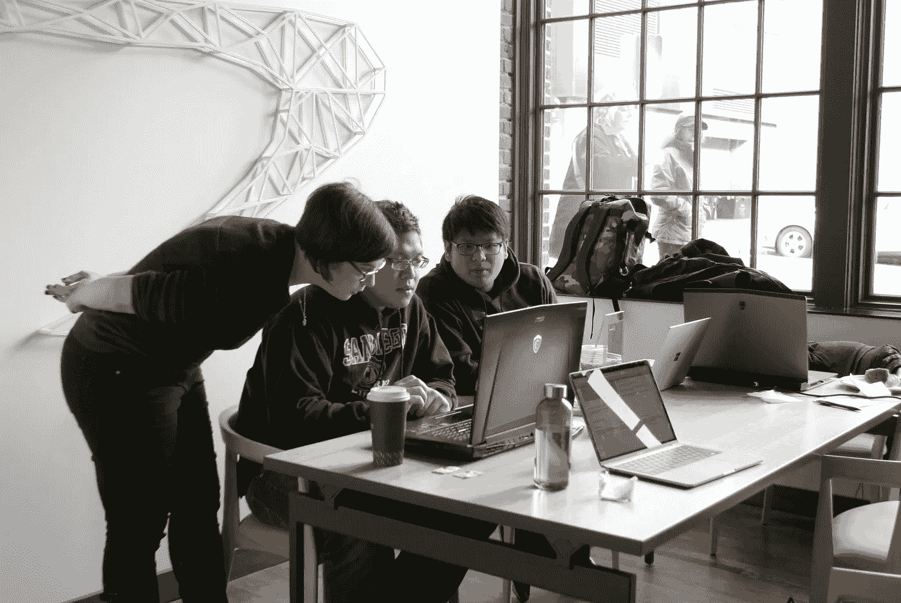

Dorrene Brown helps participants with their Cortana skills

# 无模运动继续获得动力

在成功举办 SXSW 之后，我们将我们的无赠品活动带到了西雅图，将我们的赠品预算捐赠给了两家有价值的当地非营利组织——[技术访问基金会(TAF)](https://techaccess.org/) 和 [Ada 开发者学院](https://www.adadevelopersacademy.org/)。我们的黑客马拉松参与者没有收到品牌 t 恤和钢笔，而是通过 Twitter 投票，决定我们 2400 美元的奖金预算中应该有多少用于这些非营利组织。最后，投票结果是 53%的 TAF 和 47%的阿达，我们的预算也相应地进行了分配。

> “在 2018 年做无 Swagless 感觉很棒。言语无法表达我有多高兴在 SXSW 的 Capital One House 这样的活动中看到没有赃物。对我来说，这就像我们问了一个问题，‘我们能改变世界吗？’或者‘我们可以播种而不是送花吗？’我们得到的回答是“是的！”“— Kenya Fields，Capital One DevExchange 的营销协调员

# 获胜的队伍

好东西来了！我们在 2018 年西雅图黑客马拉松比赛中邀请了一些有着出色想法的顶级参与者——下面是一些获奖者的介绍。

## 亚军

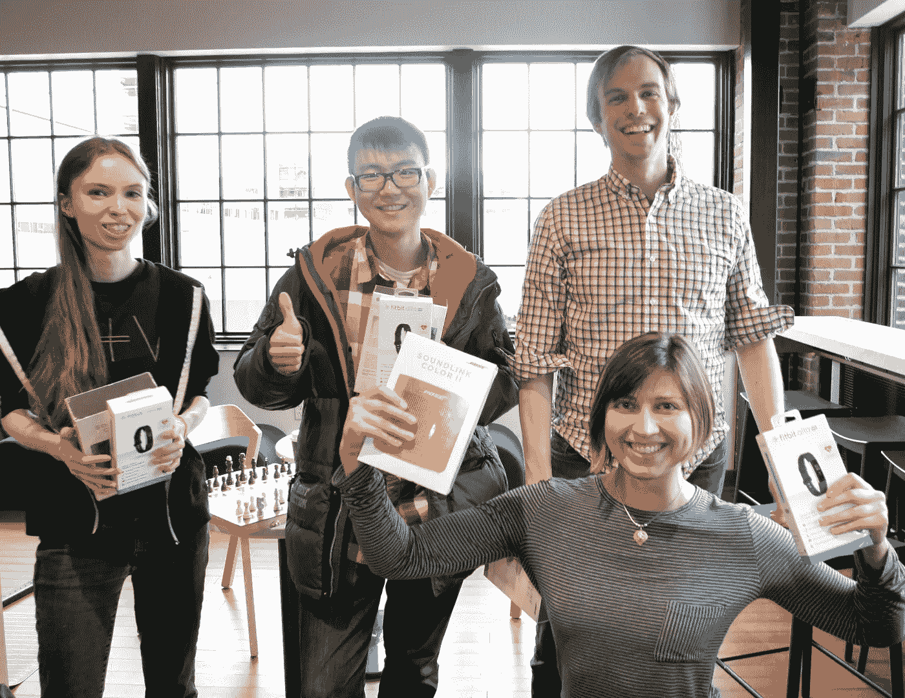

团队许愿井用了 jQuery，蓝牙，Node.js，还有 HS110 智能插头；以及我们的银行账户启动器和资金流动 APIs 创造一种互动的、积极的强化体验，这种体验只需要最少的努力就能帮助你实现目标。我们喜欢他们的演示，以及他们在舞台上的物联网体验。

## 优胜者

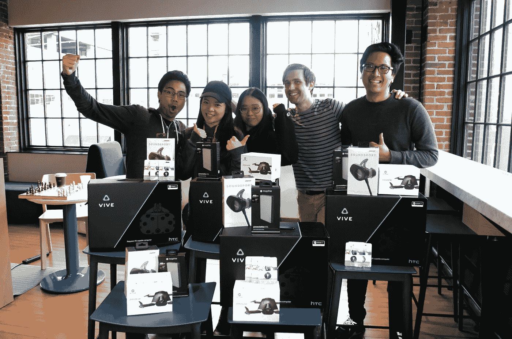

香蕉分裂队用了 Swift 和 Xcode 以及我们的资金流动 API 让分摊账单变得有趣又简单。

> “我们的应用程序旨在解决当你试图在晚餐时在朋友之间分摊账单时，你会想，‘天哪，你是怎么做到的？’我们创建了一个应用程序，只需点击一个按钮，账单就会在几个人之间分摊！”——香蕉船队

[https://Twitter . com/CapitalOneDevEx/status/978359716517765120](https://twitter.com/CapitalOneDevEx/status/978359716517765120)

## 《士师记》

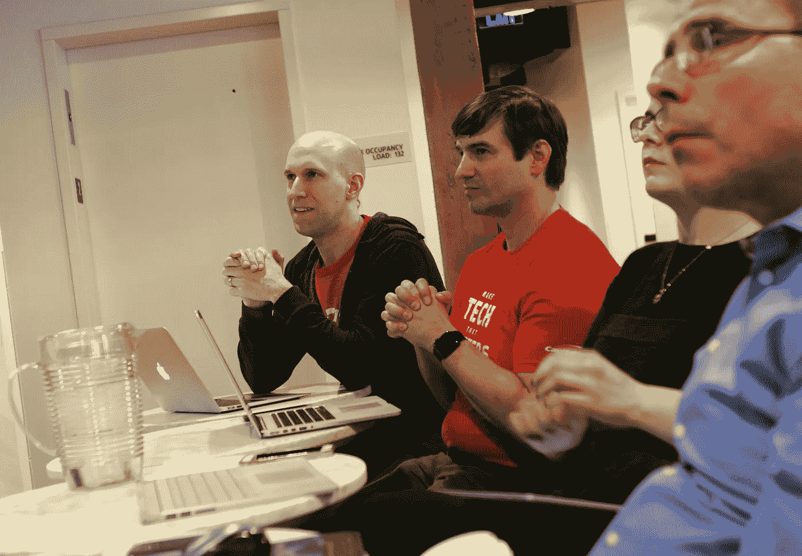

Our judges hard at work

我们要为我们伟大的评委鼓掌。

*   dorrene Brown——Cortana 技能套件项目经理
*   Dan kova ch——货币运动产品经理
*   Dave Niederkrome——fin curate 的联合创始人兼首席执行官
*   迈克尔·沃克——第一资本公司软件工程总监

感谢您参加我们的活动，并为评审过程贡献您的专业知识。

# 接下来是什么！

*   **黑客马拉松** —今年六月在[丹佛，我们将举办 2018 年第二届黑客马拉松。这将是我们第二次来到](https://developer.capitalone.com/event-info/hackathon-list/)[联合车站 LoDo 咖啡厅](https://www.capitalone.com/local/denver-unionstationlodo/)，我们很高兴看到丹佛今年为我们准备了什么！
*   **API**——我们将继续使资金流动社会化，收集必要的反馈来规划这个实验性 API 的未来。如果您想对资金流动提供反馈，请加入 [Gitter](https://gitter.im/CapitalOne-DevExchange/money-movement) 上的对话。另外，请关注我们的[门户](https://developer.capitalone.com/products/)，了解未来的实验性 API 发布和公告。
*   **# GoSWAGless**—2018 年全年，我们将在精选的会议和黑客马拉松上继续我们的无现金活动。

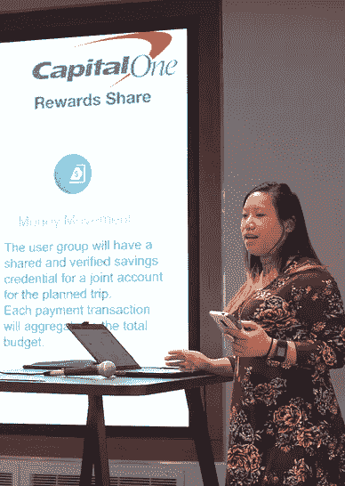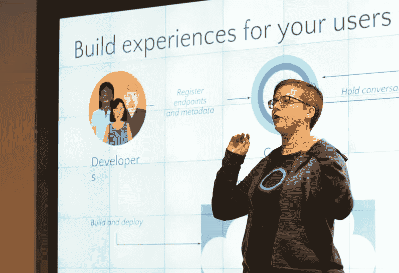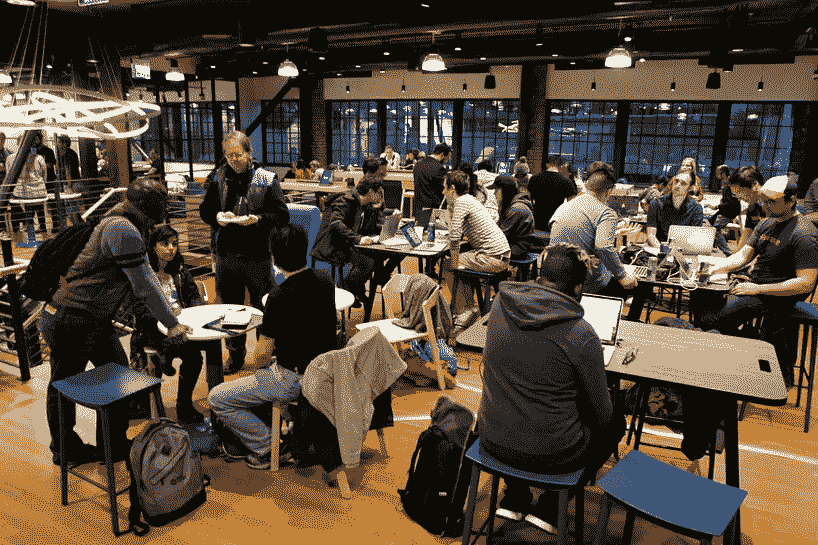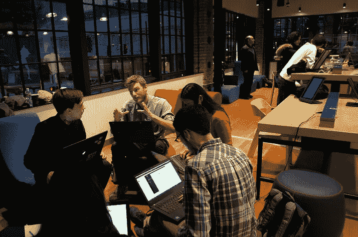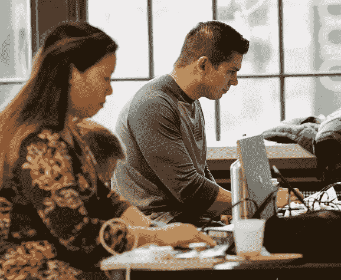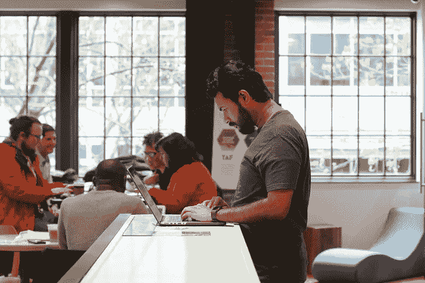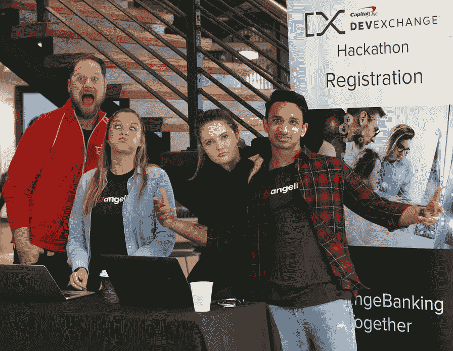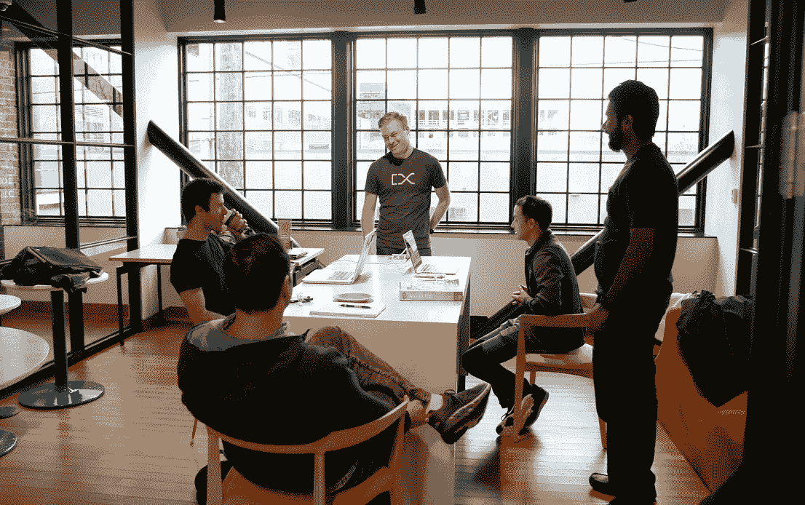

## 相关链接

[我们从举办黑客马拉松中学到的 5 件事](/capital-one-developers/5-things-we-learned-from-hosting-hackathons-1781b9728fde)

[关于我们的 API，托管黑客马拉松教会了我们什么](/capital-one-developers/what-hosting-hackathons-taught-us-about-our-apis-b48d8304b74d)

*声明:这些观点是作者的观点。除非本帖中另有说明，否则 Capital One 不属于所提及的任何公司，也不被其认可。使用或展示的所有商标和其他知识产权都是其各自所有者的所有权。本文为 2018 首都一。*