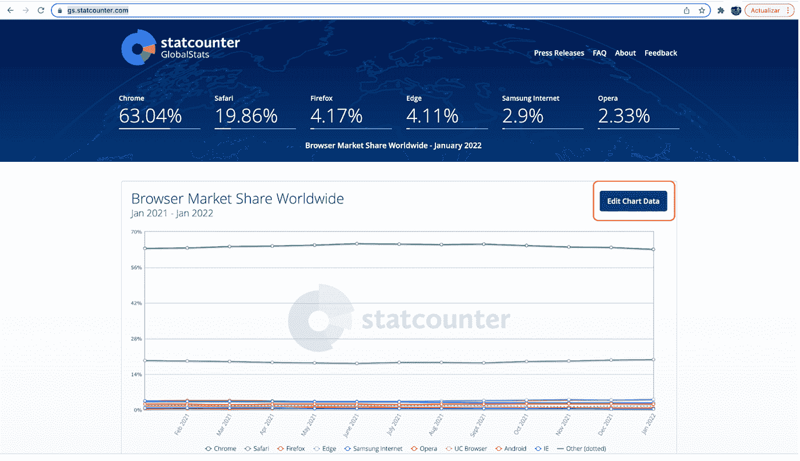
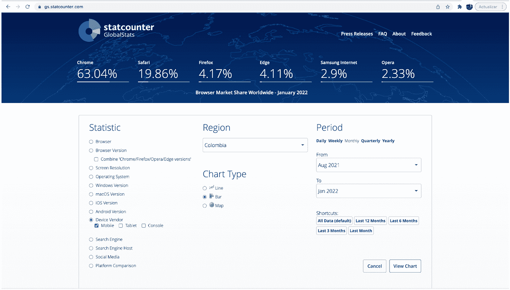
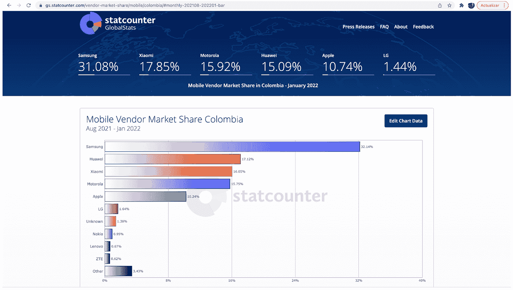
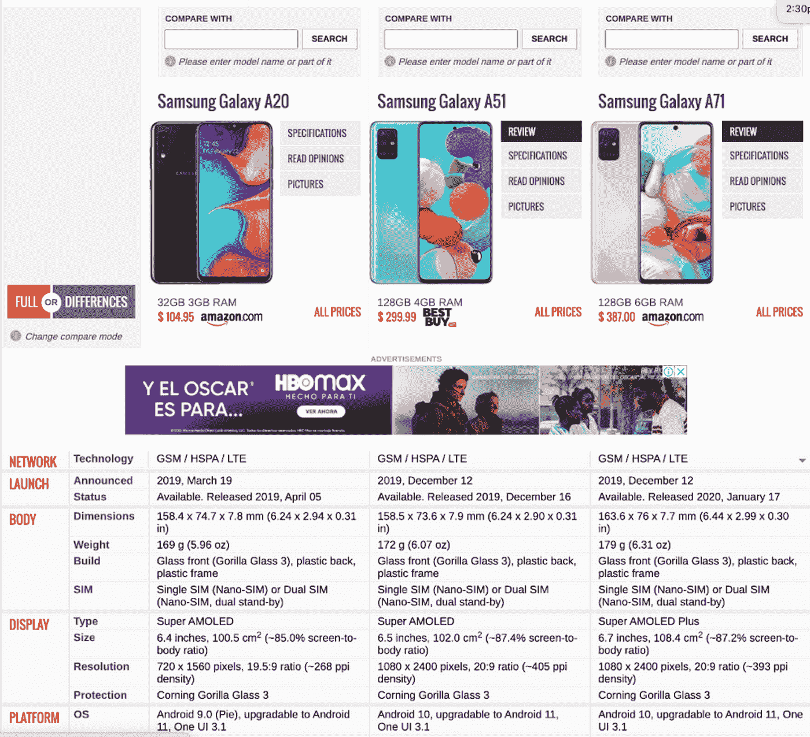
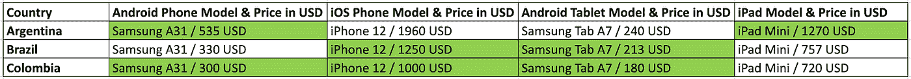
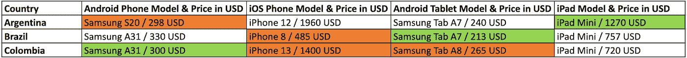
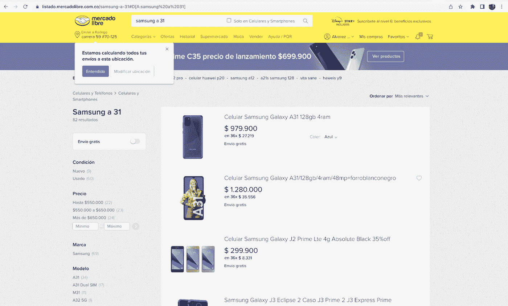

# 测试应用程序何时在新地区推出的设备策略。

> 原文：<https://medium.com/globant/device-strategy-on-testing-when-an-app-will-be-launched-in-a-new-region-96ee9aeac77d?source=collection_archive---------0----------------------->

**由** [撰写**罗德里戈**撰写](https://medium.com/u/54f29d938826?source=post_page-----96ee9aeac77d--------------------------------)

大公司正在寻找另一种方法和新策略，总能给他们带来更多收入。其中一个策略是建立可以在不同地区使用的全球应用程序。这就是我们要在这篇文章中看到的主题。

当他们考虑这个问题时，他们必须记住一些事情，如范围内的国家、语言、国内测试、每个国家应该分配哪些设备、基于市场份额的覆盖范围等。

如果你不得不制定一个类似的策略，这里有一些对你有用的提示。让我们想象一下，你是一个有编程技能的人，你在你居住的国家开发了一个应用程序，例如:美国，过了一段时间，它获得了比你想象的更多的客户。有一天你说，如果同样的应用程序在拉丁美洲、欧洲或亚洲的一些国家推出，会怎么样？。你开始和一些朋友谈论这个疯狂的想法，并通过谷歌搜索这些地区或国家是否有像你这样的应用程序。结果向您展示了类似的应用，但您认为您的应用具有其他可以产生影响的功能，这就是为什么您决定去不同的地区，例如黎巴嫩、EMEA、APAC 等，您可以从其中一个地区开始，之后，您可以根据成功情况考虑其他地区。

让我们试着想象一下这个挑战的范围:地区:拉丁美洲，国家:阿根廷、哥伦比亚和墨西哥，语言:西班牙语，范围内的设备:移动(手机和平板电脑(Android & iOS))和桌面，国内测试？:是的，每个国家有多少台设备:5 台，等等。

好了，让我们开始检查一个国家(哥伦比亚)每个平台最受欢迎的设备。如果你愿意，你可以在阅读文章后检查其他国家的相同情况，步骤是相同的，唯一的区别是地区字段上的国家选项，这里有一个很好的页面，你可以使用它[https://gs.statcounter.com/](https://gs.statcounter.com/)

**步骤:**

*   点击编辑图表数据。

*   更改默认过滤器:
*   在统计选择设备供应商和你想要的类型(手机，平板电脑，或控制台=浏览器)，我建议你一个一个地检查。
*   地区:你想研究的国家。
*   图表类型:条形图。
*   点击最近 6 个月。
*   点击查看图表。

现在你可以看到结果了。在此基础上，根据您实施此策略的预算，深入检查其他主题，如流行度、模型和操作系统。

你的问题可能是，我怎么做？让我们学习如何做它。例如:您可以分析设备型号、价格、显示信息、机身、内存等的页面太多，例如:[https://www.gsmarena.com/compare.php3?&idphone 1 = 10149&idphone 2 = 9963&idphone 3 = 9995](https://www.gsmarena.com/compare.php3?&idPhone1=10149&idPhone2=9963&idPhone3=9995)

在那里，您可以同时比较 3 种设备，然后根据我们前面提到的结果和您的预算，您将准备好免费使用真实信息做出最佳决定。为了澄清这一点，我们用了一个例子:我们比较了三星移动设备，因为上面屏幕上的报告告诉我们，这是哥伦比亚最常见的移动设备，我们选择这个国家进行这个计划。设备:三星 A20、A51 和 A71，请看下面的截图。

让我们试着想象一下，你的项目没有很多预算资金，在这种情况下，让我们放弃三星 A71，因为它是最昂贵的一款，然后让我们试着通过比较操作系统、显示器和人体信息来决定是选择三星 A20 还是 A51。

如果您所参与的项目涉及多个国家，您可以重复相同的步骤，然后根据每个国家的预算和人口确定优先顺序。如果您的项目涵盖所有类型的移动设备，我的建议是每个国家的每个操作系统至少有一台 iPad 或平板电脑和一部手机。例如:范围内的国家:阿根廷、巴西和哥伦比亚。想象一下，在调查了这些设备后，您得到了以下结果:

您必须执行的第一个任务是在所有被定义为 scope 的国家中为相同的型号进行报价，然后您将能够确定在哪个国家中价格比其他国家高。最后，您可以考虑在设备更便宜的国家购买更好的型号，并最终购买。

在 orange 中，您可以看到，由于这些国家的经济状况，我们获得了关于低或高型号的其他报价，在绿色设备上，价格还可以，这意味着 orange + green 是该项目的最终分销渠道。

要获取报价，您可以与 MercadoLibre 合作，作为对比 Latam 价格的参考页面，或者您可以查看谷歌的其他选项，每个 Latam 国家都有 MercadoLibre 的 URL 页面，例如阿根廷:[https://www.mercadolibre.com.ar/](https://www.mercadolibre.com.ar/)巴西:[https://www.mercadolivre.com.br/](https://www.mercadolivre.com.br/)哥伦比亚:[https://www.mercadolibre.com.co/](https://www.mercadolibre.com.co/)等。

您正在创建的实验室中需要记住的其他内容:

*   自己关闭更新。
*   尝试在不同的操作系统版本中使用类似的设备。
*   在您的范围内包括一台您可以测试 Beta 操作系统**的设备。

* *对于 iOS 设备，您可以在所有设备上安装测试版，但是对于 Android，仅允许 Pixel 设备检查测试版。

最后但并非最不重要的是，如果您没有足够的预算，您可以检查其他选项，如仿真器、模拟器或设备群，这是对每一个利弊的简短解释:

模拟器是一个行为类似于其他事物的系统。

优点:模拟器可以为您提供虚拟设备实例，具有接近原生的功能和扩展的控制，以调整设备的物理传感器:电池状态和地理位置。

缺点:这些接近本机的功能带来了巨大的性能开销。

**模拟器**是一种软件，它模拟计算机上目标设备的硬件和软件。

优点:价格和速度。

缺点:错误的印象，测试手势，不能测试网络互操作性。

**设备场:**设备场或设备云是一种测试环境，允许 QAs 在大量真实设备上远程测试其网站和移动应用的性能。它提供对来自多个制造商或操作系统的设备的现代和传统版本的访问。

这些选项可能适用于您的测试，这取决于您正在使用的应用程序，因为在某些情况下，一些功能可能无法在这些应用程序上工作，让我给你举个例子:媒体和娱乐应用程序不能使用这些工具来实现视频播放等功能，因为视频是加密的，这些应用程序不支持它们(**数字版权管理** (DRM)是使用技术来控制和管理对版权材料的访问)，但是， 如果你要测试的应用没有这样的问题，你可以使用:浏览器堆栈、测试完成等模拟器，Xcode、Android Studio 等模拟器，或者 AWS、Xamarin 测试云等设备场**。** 这是您可以仔细检查的其他工具列表，根据范围内的设备，您可以选择最佳选项:[https://www . testrigtechnologies . com/mobile-application-testing-tools-in-2020/](https://www.testrigtechnologies.com/mobile-application-testing-tools-in-2020/)

[https://medium . com/@ slava . chernikoff/7-best-device-farms-to-test-your-IOs-and-Android-applications-7 efb 834 dab 25](/@slava.chernikoff/7-best-device-farms-to-test-your-ios-and-android-applications-7efb834dab25)

**结论:**如果您的客户没有向您提供与范围内的市场份额相关的数据，您可以研究并定义一个好的设备策略，但是，在购买任何设备或许可证之前，请征得您的客户方的同意，如果他们要求您做一些更改，请灵活处理。