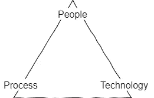
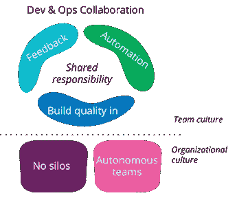
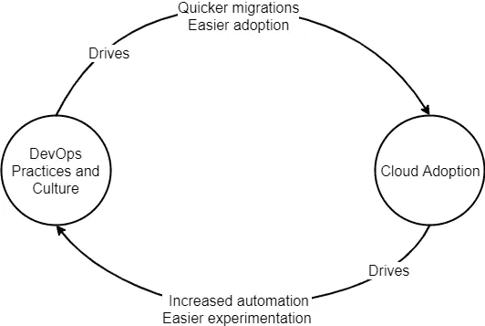

# DevOps 和 Cloud:什么关系？

> 原文：<https://medium.com/version-1/devops-and-cloud-whats-the-relationship-93e14a0c62e?source=collection_archive---------4----------------------->

*正反馈循环:开发运维实施如何推动更快的云采用，以及云采用如何改进开发运维流程。*

Photo by [Tim van der Kuip](https://unsplash.com/@timmykp?utm_source=medium&utm_medium=referral) on [Unsplash](https://unsplash.com?utm_source=medium&utm_medium=referral)

在[的上一篇文章](/version-1/adopting-a-devops-culture-3699da5abe87)中，我写了采用 DevOps 文化的好处和重要性。虽然人员和文化是关键的基石，但技术也很重要。特别是，云的使用对于在企业中实施 DevOps 大有裨益。

The DevOps triangle

积极的反馈循环往往是结果，DevOps 实施推动了更快的云采用，而云采用改善了组织内的 DevOps 文化和流程。

采用云有什么商业好处？87%的企业通过使用云体验到业务加速([影响](https://www.impactmybiz.com/blog-10-cloud-adoption-stats-it-decision-makers-2020/))，65%的《信息周刊》调查受访者表示*“快速满足业务需求的能力”*是企业应该迁移到云环境的最重要原因之一。

# **云和 DevOps —它们如何携手合作？**

## 1.自动化手动操作提高了效率

由于大多数云迁移的“提升和转移”性质，它们经常涉及大量重复，尤其是在较大的环境中。自动化和可重复流程的使用对于简化这项工作非常有益。部署 DevOps 流程使团队能够使用管道和“[迁移工厂](https://aws.amazon.com/migration-acceleration-program/)”方法更快地将应用迁移到云。

显而易见，DevOps 在云迁移中扮演着至关重要的角色，450 名技术领导者表示，54%的人在将应用程序提升和迁移到公共云时已经依赖于他们。[(devops.com)](https://devops.com/survey-finds-devops-playing-key-role-in-cloud-migration/)

整个云迁移过程中多个程序的自动化有助于提高组织效率，并减少将应用程序迁移到云所需的时间。结果，团队的效率大大提高，在使用基于云的应用程序时，他们的工作效率得到了提高，这些应用程序可以转化为除迁移之外的其他功能。

## 2.在更短的时间内进行更频繁的部署

云的采用也有一个互惠的好处—使用云的企业认为增加的灵活性和更快的上市时间是关键的业务好处。根据 [CA Technologies 的一项研究](https://www.ca.com/content/dam/ca/us/files/msf-hub-assets/research-assets/devops-cloud-computing-exploiting-synergy-business-advantage.pdf)，利用 DevOps 和云的欧洲公司的部署性能大幅提高了 129%。

这带来了双重好处:开发运维流程提高了迁移速度，云的采用提高了灵活性并加快了上市时间。快速学习和灵活的文化是 DevOps 流程的基石，因此云有助于提高部署频率，同时减少部署所需的时间，这是一个强大的放大环。

## 3.沟通和协作推动质量

[Martin Fowler](https://martinfowler.com/bliki/DevOpsCulture.html) on DevOps Culture

DevOps 团队紧密团结的工作环境也在云迁移中发挥了关键作用。从历史上看，云迁移经常由于缺乏沟通而出错，而已经养成协作习惯的团队意味着沟通更加频繁，从而降低了出错的风险。迁移涉及组织中许多不同的团队，对技术和业务团队都有影响。

DevOps 文化为工作实践带来了沟通和协调，打破了团队之间的孤岛。这意味着云迁移更有可能成功，因为结构已经到位。

## 4.打破孤岛提高安全性

Cloud Security — Photo by [Nathaniel dahan](https://unsplash.com/@nathdah?utm_source=medium&utm_medium=referral) on [Unsplash](https://unsplash.com?utm_source=medium&utm_medium=referral)

安全团队和其他技术团队之间缺乏沟通和信任通常是安全问题的根本原因。当团队感到他们被专横的安全政策削弱时，他们可以求助于 [Shadow IT](https://www.cloudcodes.com/blog/what-is-shadow-it-and-its-impacts.html) 作为遵循严格规则的替代方案。这通常是通过单独购买云技术来实现的，这反过来会导致安全风险增加和不可追踪的支出。对于一个企业来说，成本可能高达技术支出的 40%!

有 DevOps 或 DevSecOps 实践的公司，如果存在文化交流、透明度和开放性，这种风险要低得多。此外，云的使用使安全性的许多方面变得更容易——增加了审计跟踪的可见性、自动化治理策略，以及实施防护栏而不是设置安全屏障的能力。

消除传统孤岛，让开发运维团队和安全团队合作，将确保云的采用和迁移在生命周期的所有阶段都是安全的。

## 5.基于云的应用程序使开发更容易

一旦应用程序在云中，实现 DevOps 实践就容易多了。基础设施的便捷性使团队能够以更低的成本和更快的速度进行实验。将基础设施作为代码的能力意味着一致的环境不仅仅是一种可能，而是一种常见的实践。将资源分配给小团队而不是拥有单一的应用程序和控制平面也是微不足道的。

越来越多的企业意识到了这一点，并制定计划来更新或迁移他们单一的遗留应用程序。根据[devops.com](https://devops.com/survey-finds-devops-playing-key-role-in-cloud-migration/)的一项调查，67%的受访者计划在未来 12 到 24 个月内迁移或更新至少一半的内部应用。调查发现，28%的受访者计划使用云原生技术和传统技术的组合来重构应用程序，而另外 20%的受访者计划采用某种形式的平台即服务(PaaS)环境。

相比之下，有 20%的人计划在不改变底层代码的情况下，将现有应用程序提升并迁移到云中。另有 20%的受访者表示，他们将用软件即服务(SaaS)应用程序替换现有应用程序。

# 摘要

Cloud and DevOps — Positive Feedback Loop

很明显，当你开始整合 DevOps 文化和实践，同时采用云技术时，一个[正反馈循环](https://itrevolution.com/the-three-ways-principles-underpinning-devops/)就存在了。这可能意味着将应用程序迁移到云，用云原生解决方案重构或替换遗留应用程序，或者简单地使用 SaaS 产品而不是自托管。无论哪种方式，好处都是显而易见的:

1.  DevOps 实践和文化的实施有助于推动更快的云迁移，并且总体上使云的采用更加顺畅。
2.  由于丰富的服务和对各种工具的轻松访问，云在企业中的使用提高了自动化水平。这也为快速试验打开了大门。这有助于推动开发运维在组织内的采用。

有一个很好的理由，这两者经常携手并进，实现其中一个而不实现另一个只会为您的业务带来部分好处。要释放全部潜力，您必须同时驱动两者。

*如果你觉得这很有趣或者有任何反馈，请在评论中告诉我或者在* [*Twitter*](https://twitter.com/deconduino) *或*[*LinkedIn*](https://www.linkedin.com/in/oisindeconduin/)上联系我

**AWS devo PS 入门**

对于那些希望开始使用 DevOps 的人来说， [AWS 为 DevOps 实践者提供了有用的工具和基础设施资源。](https://aws.amazon.com/devops/)如果您有兴趣了解更多关于 [AWS DevOps 文化和组织的信息，请访问此页面](https://aws.amazon.com/modern-apps/faqs/#Culture.2FOrganization)。