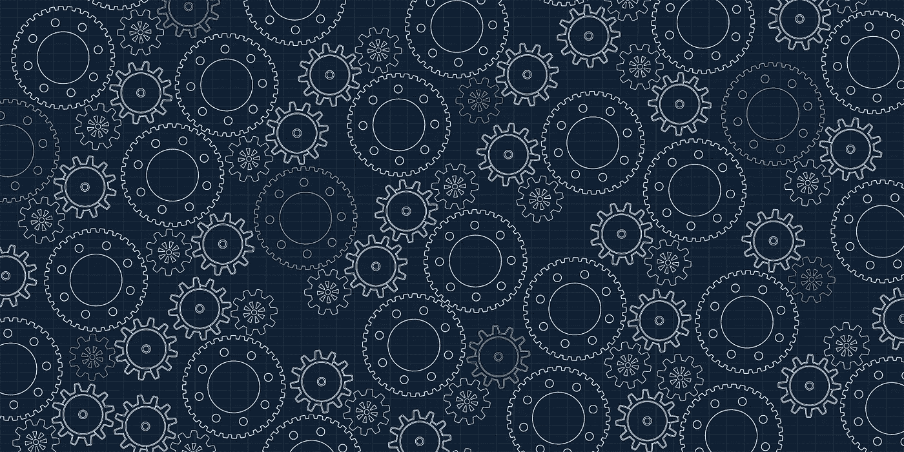

# DevOps 环境中的治理

> 原文：<https://medium.com/capital-one-tech/devops-and-governance-56f6ecae1181?source=collection_archive---------2----------------------->

作为一名拥有 20 年风险管理和审计经验的 Capital One 技术治理总监，我想分享一点审计师对 DevOps 流程的看法。在开发人员不断将代码推向生产的环境中，如何管理风险？有什么防线和控制措施来确保正在生成的代码是安全的和得到良好治理的？

# 什么是治理？

当谈到软件和技术指南时，我们在业内更喜欢使用 ***治理*** 这个词，而不是遵从。为什么要治理？因为我们不希望开发人员对待风险管理的方式就像它是一系列要勾掉的盒子一样。治理意味着积极地理解和管理风险；它是对你所做的一切的意识，它是对一个人的行动的影响的思考，它是为那些行动建立和遵循过程。

考虑治理时使用的一个流行的风险管理框架是[的三道防线框架](https://global.theiia.org/standards-guidance/recommended-guidance/Pages/The-Three-Lines-of-Defense-in-Effective-Risk-Management-and-Control.aspx)(内部审计师协会开发了这个框架，你可以在他们的网站上找到它[)。许多监管机构使用它来帮助评估企业风险管理。](https://na.theiia.org/Pages/IIAHome.aspx)

*   **一线** — *谁拥有风险* —个人开发者和工程师。
*   **二线** — *谁* *制定政策并监控风险* —负责制定政策并每天监控风险的治理和风险职能部门。
*   **三线** — *独立保证* —提供独立保证并直接向审计委员会或董事会报告的内部审计。

除了这种流行的企业技术模型之外，还有一种非正式的第四条线，它在公司外部，但与他们携手合作，以正确地实现治理。

*   **第四行** *—外部合作伙伴*—审计员和监管者，他们必须参与对话，并在开发流程和风险管理中获得完全的透明度。

# 作为一线的一部分，开发者的角色是什么？

首先，是 ***意识到*** 的风险。开发人员需要意识到，他们的工作可能会产生风险，即使是很小的代码更改也会给公司带来后果。俗话说，“要解决一个问题，首先你必须意识到你有一个问题。”了解产生风险的能力是理解和降低风险的第一步。

一旦意识到位，下一步就是 ***对该风险负责*** 。这意味着确保工作以受控的方式进行，并始终遵循最佳实践和控制措施。

## 控制

那么，什么是控制呢？从正式定义的角度来看，*控制是减轻风险的过程*。具体来说，它们是确保运营有效性和效率、可靠的财务报告以及遵守法律法规的活动。例如，让一个人在系统中输入电汇交易，另一个人在付款前批准电汇，这是一个财务系统控制操作的简单例子。

为什么需要控制？在我看来，最好的总结是爱德华·戴明的名言:“不受控制的变化是质量的敌人。”

那么，健壮的企业开发运维流程中有哪些控制？这里我要重点介绍三个具体的控件。

## 两对眼睛

在部署变更之前，一个关键的概念是让两组人来共同审查所有的变更。这要求第二双眼睛有资格进行所讨论的检查。这不是任何开发人员都可以勾选的框。它需要了解所使用的语言、库、环境和产品的人；应用程序做什么；以及变化将会产生什么影响。

## 最小特权

第二个概念是最低特权。这是安全开发管道的一个关键访问概念，确保开发人员无法访问他们不需要的目录或文件。在日常工作中，大多数开发人员是否需要对生产环境的写访问权限？读取权限，是的。写权限，可能没有。通过限制对特定角色的访问，通过根据访问批准规则(即时管理)授予的有时间限制的令牌授予该访问权限，您可以防止围绕谁可以写入生产环境的“狂野西部态度”。否则，拥有太多的访问权限可能会让我们面临不必要的风险。

## 未经授权的变更监控

两对眼睛和最小特权都是*预防性控制，*这意味着它们有助于防止某人无意或恶意地做坏事。对良好管理的开发至关重要的第三个控制是未授权的变更监控。相比之下，这是一个*检测控制*，它记录所有的变更事件，并允许治理功能和管理审查进行了哪些变更，以及它们是否被授权。假设出现了一个非常严重的问题——是代码更改导致的，还是网络中断等外部因素导致的？通过自动证据和日志收集建立的强大监控提供了检测控制，以跟踪和识别潜在问题。

# 付诸实践

> “我见过那么多管道，内部的，外部的，每一个管道我都能找到漏洞。事实上这是我从珍那里学来的。每次我认为我有一个解决办法，珍说，'如果？'我不得不从头开始。这就是我如何学到许多关于治理和控制的东西。“— [拓扑伙伴](https://twitter.com/TopoPal)

开发人员对良好治理的看法通常集中在自动化上，例如:

*   建立在每次提交的基础上。
*   每次构建的静态代码分析。
*   扫描开源漏洞。
*   静态安全扫描。
*   自动化测试。

在 DevOps 和持续交付中，做到以上所有是必不可少的。但是，我们还需要从更高的角度来全面治理我们的 DevOps 流程。最大的障碍往往是一个人无法完成所有工作并保持适当的职责分离。

再次引用我的同事 Topo 的话，为了创建安全且管理良好的 DevOps 环境，采用“[洁净室模型”](https://www.informationweek.com/devops/capital-one-devops-at-its-core/d/d-id/1330515)很有帮助，在该模型中，所有产品管道(无论是应用程序、测试还是基础设施代码)都在源代码控制下进行识别和注册。

这意味着代码变更可以被监控，以确保“两只眼睛”的同行评审发生。这种“最小特权”阻止了开发人员从管道之外访问生产机器。更好的办法是限制每个人的生产权限，只允许通过“洁净室”管道对生产进行更改。“未经授权的变更监控”允许在没有变更单或票证的情况下跟踪生产中的变更。

> “这个特殊的洁净室模型的结果有点令人惊讶。在 Capital One，2016 年我们每天部署多次的产品数量大约是 20 个，到 2017 年是数百个。如果您尝试手动完成这些工作，您将无法做到这一点。你需要干净的房间和控制点来做到这一点。”— [拓扑伙伴](https://twitter.com/TopoPal)

# 结论

仅靠典型的“CI/CD”自动化无法降低风险。至少，这三个控制需要构建到自动化流程中。这只有通过与治理和审计团队的良好伙伴关系才能实现。这允许安全的、治理良好的 DevOps 管道，其中开发团队拥有并可以主动解决他们的风险，而不必等到审计揭示问题。通过早期的合作，您的一线和二线治理团队可以创建流程，以允许开发人员更有效地进行构建，同时适当地维护 DevOps 环境中的风险。

# 相关:

*   [关注 DevOps 管道](/capital-one-developers/focusing-on-the-devops-pipeline-topo-pal-833d15edf0bd)
*   [在监管环境下开源](/capital-one-developers/open-source-in-a-regulated-environment-dc4b4d9af3f8)
*   [开源案例研究——沃尔玛如何将卫生用品扩展到 5000 多个仪表板](/capital-one-developers/how-walmart-scaled-hygieia-the-open-source-devops-dashboard-tool-4fd65f0f589)

*声明:这些观点仅代表作者个人观点。除非本帖中另有说明，否则 Capital One 不属于所提及的任何公司，也不被其认可。使用或展示的所有商标和其他知识产权都是其各自所有者的所有权。本文为 2018 首都一。*