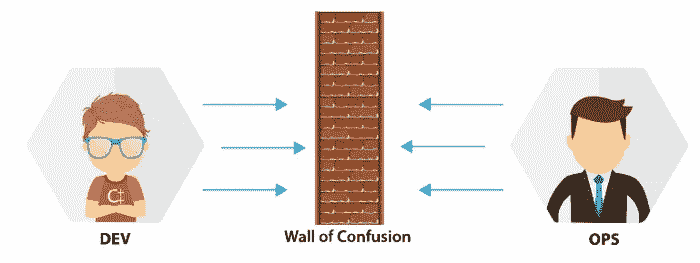
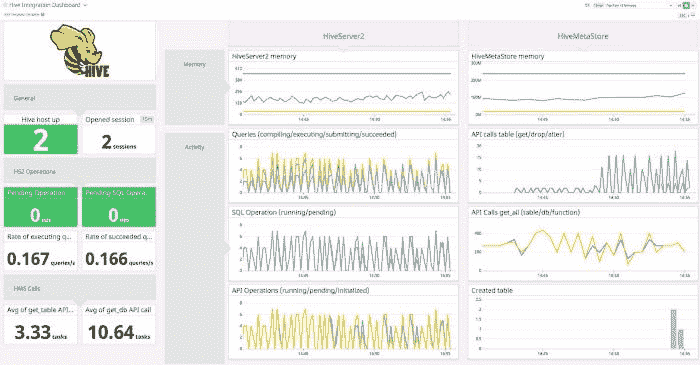
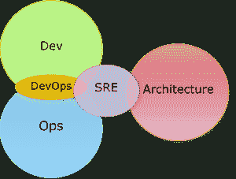

# DevOps，分为 5 个关键领域

> 原文：<https://medium.com/globant/devops-breaking-down-into-5-key-areas-a65363d6140c?source=collection_archive---------0----------------------->

[*西班牙语版本*](https://hernan-david-hd.medium.com/5-pilares-del-sre-devops-f16e45f8d3fd)

SRE 和 DevOps 之间的职责划分非常模糊，尽管许多人认为 **DevOps 不是一个职位，而是一种文化、**或一种工作方法，但我们看到越来越多的“DevOps requested”公告。最终占据系统管理员、开发人员、网络人员甚至电信实施人员的职位。

开发人员负责特性并希望进展更快，而运营商负责稳定性并希望进展更慢。所以 Devops，这个街区的新家伙正在承担一个巨大而令人困惑的责任，所以我在这里把 SRE/DevOps 的基础分解成 5 个关键领域:

1.**减少组织孤岛:**公司和组织中的“孤岛”概念被理解为无法在组成它们的领域或业务单位之间有效工作。缺乏来自领导和团队的良好沟通、反馈和指导，不仅会带来糟糕的工作环境，还会导致流程效率低下。我们可以通过打破团队之间的壁垒并强调彼此之间的协作来减少这些孤岛。

> 我们之间不是竞争，我们是一个团队，如果你顺利，我也是。嗯，基础部门和开发人员都分享最终产品的成功，我们在生产中必须有相同的愿景和方法。

2.接受意外和失败是正常的:计算机是不可靠的，你不能期望完美。当我们把人类引入这个系统时，我们应该预料到更多的不完美。当出现失败时(这种情况总是存在的),不要责怪按下按钮的人，而是应该对流程进行审核，如果这个人遵循了手头的流程，那么错误就不在这个人，而是流程。

> *不管我们发现了什么，我们理解并真诚地相信每个人都根据当时已知的情况、可用的资源和给定的情况尽了最大努力。*

我们可以做一个 RCA 或事后分析，而不用指出罪犯。相反，我们确保事故或失败不会以完全相同的方式发生不止一次。并且存在被认为是正常的故障，因为错误预算被处理，其中系统崩溃是可接受的。

3.**逐步实现变更:**它们不仅是更容易审查的小的和增量的变更，而且在它导致生产中的错误的情况下，它将花费我们更少的时间来恢复服务和进行简单的回滚。

> *避免“大爆炸式部署”,倾向于渐进实施，如金丝雀或蓝绿色部署。*

4.**利用工具&自动化:**我们尽可能地消除手工和重复性工作。我们审查我们有多少紧急工作(toil ),并尝试使用 Bash、Ansible、Gitlab CI、Jenkins 或任何其他工具的脚本来自动化这些任务。

> 例如，当我们有 kubernetes 自动完成时，没有理由让一组工程师 24/7 手动重启或缩放 docker 容器。许多重复性的任务可以由脚本代替。

5.**衡量一切:**系统和人才的衡量标准是成功的基本指标，只衡量标准而不评估是没有用的。如果没有一种方法来衡量前面四个支柱的发展，我们就无法知道它是如何发展的。我们必须测量无故障时间、可伸缩性、人员工作量和系统健康状况。

# 结论

如果我们将 DevOps 视为一种理念，那么 SRE 的目标就是贯彻这种理念，**SRE 实施 DevOps** 并且不一定以与其他公司完全相同的方式实施

> ****共同的目标*** *是打破组织壁垒，更快地交付更好的软件。**

**

*[HD De León Barrios](https://www.linkedin.com/in/achede22/)*

*来源:[https://www.youtube.com/watch?v=uTEL8Ff1Zvk](https://www.youtube.com/watch?v=uTEL8Ff1Zvk)*