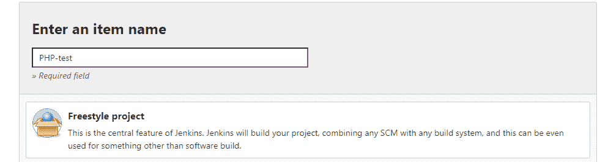

# 适用于初学者的 Devops CI-CD 设置

> 原文：<https://medium.com/globant/devops-ci-cd-setup-for-beginners-b185fc981eed?source=collection_archive---------0----------------------->

本文讨论了在 AWS 中使用 Terraform 模块(IaaC)创建基础设施，在 Jenkins(使用 Publish-Over-SSH 插件)和 Ansible 的帮助下构建和部署 PHP 应用程序。

**本文涵盖了以下几点:**

*   工具介绍。
*   地形安装。
*   先说编码部分。
*   PHP 应用程序的开发 CICD 设置。
*   让我们开始演示吧！
*   常见问题及故障排除步骤。

# **工具介绍:**

Terraform 是一个基础设施，作为一个代码工具，有助于提供和管理基础设施。这个工具与云无关，支持一些著名的公共云供应商(AWS、GCP、Azure、OpenStack 等。).在这里，我们将使用 AWS 作为云提供商。

Jenkins 是一个免费的开源自动化服务器。它有助于自动化与构建、测试和部署相关的软件开发部分，促进持续集成和持续交付。

Ansible 是一个开源工具，用于软件供应、配置管理和应用部署，以实现基础设施即代码(IaaC)。它运行在许多风格的 unix/linux 上，可以用来配置基于 unix 和基于 windows 的机器。

# **地形安装:**

1.  从[https://www.terraform.io/downloads.html](https://www.terraform.io/downloads.html)下载 Terraform(这里我们已经在 C:\)上安装了 windows 64 位版本 14.2)
2.  为了从任何位置运行 terraform 脚本，请按如下方式设置路径变量:

转到控制面板->系统和安全->系统->高级系统设置，然后单击环境变量并编辑路径“c:\”，我们已经提取了我们的 terraform 设置。


3.打开命令提示符类型 **terraform —版本**。

*   Terraform 模块:我们可以创建模块，为多个账户重用代码。
*   我们将为基础架构设置创建以下模块:

-EC2: Jenkins 服务器，Ansible，目标服务器。

-OS: Ubuntu

-RDS: MYSQL

**本演示的文件结构:**


**使用 Terraform 模块**提供 Jenkins、Ansible、Tomcat 和 RDS 设置。

创建实例模块的先决条件:

1.  IAM 概要文件:IAM 概要文件充当 EC2 实例的 IAM 角色的容器。如果从控制台创建 EC2，控制台将自动附加具有 EC2 角色的 IAM 配置文件，但是在通过 CLI 或 API 创建时，您需要将角色和实例配置文件作为单独的操作来创建。
2.  IAM 角色:这是一个 IAM 身份，您可以在拥有特定权限的帐户中创建。
3.  IAM 策略:它定义了一个操作的权限，而不管您使用什么方法来执行操作。
4.  安全组:它就像一个防火墙，定义了对 EC2 实例流量的允许/拒绝操作。
5.  AMI:它是启动 EC2 实例所需的预配置包，包括操作系统和所需的软件包等。
6.  Userdata:当您在 Amazon EC2 中启动一个实例时，您可以选择将用户数据传递给该实例，该实例可用于执行常见的自动化配置任务，甚至在实例启动后运行脚本。
7.  Keyname:它是一组安全凭证，用于在连接到实例时证明您的身份。从控制台下载密钥，并作为变量传递。
8.  实例类型:要启动的实例的类型。对该字段的更新将触发 EC2 实例的停止/启动。

# **先说编码部分:**

**→资源“aws_instance”创建一个 aws_instance，terraform 将其称为 ansiserver。**

→将 ami 和密钥名作为变量传递，变量将在 vars.tf 中定义，实例类型将为 t2.micro。

→在用户数据下传递外壳脚本文件位置。

→标记将创建一个名为 ansible 的实例，associate_public_ip = true 是可选的，它将公共 ip 关联到 EC2 实例。

```
resource “aws_instance” “ansiserver” {
 ami = “${var.ansi_ami_id}”
 instance_type = “t2.micro”
 key_name = “${var.keyname}”
 vpc_security_group_ids = [aws_security_group.ansiserver.id]
 iam_instance_profile = “${aws_iam_instance_profile.ansi_profile.id}”
 user_data = file(“C:/Users/Dell/Terraform/files/install_ansible.sh”)
 associate_public_ip_address = true
 tags = {
 Name = “ansible”
 }
}
```

**→资源“aws_security_group”将创建一个名为“ansiserver”的安全组。**

→vpc_id 作为变量传递。

→创建 AWS 实例时，首先创建一个安全组，它将安全组 id 作为 vpc_security_group_ids 附加到上述实例。

```
resource “aws_security_group” “ansiserver” {
 name = “ansiserver”
 description = “Allow SSH and Jenkins inbound traffic”
 vpc_id = “${var.vpcid}”
 ingress {
 from_port = 22
 to_port = 22
 protocol = “tcp”
 cidr_blocks = [“0.0.0.0/0”]
 }
 ingress {
 from_port = 8080
 to_port = 8080
 protocol = “tcp”
 cidr_blocks = [“0.0.0.0/0”]
 }
 ingress {
 from_port = 0
 to_port = 0
 protocol = “-1”
 cidr_blocks = [“0.0.0.0/0”]
 }
 egress {
 from_port = 0
 to_port = 0
 protocol = “-1”
 cidr_blocks = [“0.0.0.0/0”]
 }
 }
```

**→资源“aws_iam_role”将创建一个名为 ansi_role 的 iam 角色，它允许 EC2 实例使用 sts 代表用户承担角色来调用 aws 服务。**

→IAM 角色策略附件顾名思义，将策略附加到 ansi_role。

→Count 是元参数，用于管理几个相似的对象，而无需写入单独的块。

→在本例中，我们将计算变量“策略 arn”的长度，将 AWS 管理的策略附加到 ansi_role。

→Count.index 是一个从 0 开始的独特索引号，因为我们在变量 Count(参见下面的 var.tf)中传递了两个 index 会将每个 arn 附加到我们的角色。

```
resource “aws_iam_role” “ansi_role” {
 name = “ansi_role”assume_role_policy = <<EOF
{
 “Version”: “2012–10–17”,
 “Statement”: [
 {
 “Action”: “sts:AssumeRole”,
 “Principal”: {
 “Service”: “ec2.amazonaws.com”
 },
 “Effect”: “Allow”,
 “Sid”: “”
 }
 ]
}
EOF
}
resource “aws_iam_role_policy_attachment” “role-attach” {
 role = aws_iam_role.ansi_role.name
 count = “${length(var.iam_policy_arn)}”
 policy_arn = “${var.iam_policy_arn[count.index]}”
}
resource “aws_iam_instance_profile” “ansi_profile”{
 name = “ansi_profile”
 role = “${aws_iam_role.ansi_role.name}”
}
```

**最终代码可参考 github 账号:**

[https://github.com/vriksha-star/Terraform.git](https://github.com/vriksha-star/Terraform.git)

→同样，RDS、Jenkins、Target server 等其他 terraform 模块的代码可在模块目录下的 Github repos 中找到。

→用于创建 Jenkins、Ansible 和目标服务器的 Shell 脚本将位于 Github 帐户的 files 文件夹下。

下面是 Dev 文件夹下创建的 main.tf 的内容，terraform 需要在这个文件夹下初始化:


**使用地形**

→进入命令提示符，滚动到定义模块的主文件夹，执行**地形初始化**，将得到如下输出:


→在 terraform init 之后执行以下命令，如
- terraform-plan(给出关于资源的蓝图)
- terraform-apply(应用 terraform 配置并创建资源)

→一旦 terraform 应用成功，它将在您的 AWS 帐户中创建 Targetserver-1、Targetserver-2、ansible (controller)、Jenkins server 和 RDS database1，如下图所示。


# **PHP 应用程序的 Devops CICD 设置**

→从这个 [URL](https://docs.aws.amazon.com/AmazonRDS/latest/UserGuide/CHAP_Tutorials.WebServerDB.CreateWebServer.html) 使用 AWS 文档中的 PHP 应用程序，我在我的 GitHub repo 中保存了一份副本。

→登录 Jenkins 控制台。

→Jenkins 与 Ansible 之间的连接将使用 ssh 上的 Publish-over-ssh 来完成，在 Jenkins 上，转到可用的选项卡下的管理插件，添加 **Publish-over-ssh** 插件，无需重启即可安装。

→稍后转到配置系统，并使用 ssh-keygen 从 Ansible 服务器添加私钥。

→将 Jenkins 的公钥添加到 Ansible master 上的授权文件中，然后检查连接。

→如果这不起作用，添加的内容。在“配置系统”下将 pem 密钥作为私钥。

**使用 publish over ssh 配置 Ansible 与 Jenkins:**


→可以通过将公钥从 Ansible 控制器复制到 Ansible 目标上的授权密钥来实现 Ansible 控制器和目标之间的连接。

→在 ansible controller 机器上，创建名为 inventory.txt 的文件，添加目标机器的 ip 地址，并创建包含以下内容的 pingtest.yaml 行动手册。


→编写剧本后，执行命令“**ansi ble-playbook ping test . YAML-I inventory . txt**”，输出如下:


**在可行控制器机器上创建可行剧本:**

*   已创建名为 copyfile.yaml 的文件

```
name: Playbook to deploy app on target Server
hosts: webserver
become: yes
become_user: root
tasks:
  - name: Creates directory
    file:
       path: /var/www/inc
       state: directory
       mode: 0777
  - name: Creates file
    file:
       path: "/var/www/inc/dbinfo.inc"
       state: touch
  - name: Creates Content
    copy:
      content: |
               <?php
               define('DB_SERVER', 'db_instance_endpoint');
               define('DB_USERNAME', 'tutorial_user');
               define('DB_PASSWORD', 'master password');
               define('DB_DATABASE', 'sample');
               ?>
   dest: /var/www/inc/dbinfo
   mode: 0777
  - name: Copy File to ansible target 
   copy:
      src: /home/ubuntu/SamplePHP.php
      dest: /var/www/html
```

**在 Jenkins UI 上执行以下步骤**:

*   在 Jenkins 上创建名为“PHP-test”的自由式项目。
*   在 SCM 上提供您的 GIT url:



# 让我们运行演示

*   触发 Jenkins build，在浏览器上执行[http://ec2-public-IP/sample PHP . PHP(您的](http://server-public-ip/SamplePHP.php(your) php 脚本名)，您将得到如下输出:


# **常见问题及故障排除步骤:**

1.  在构建失败的情况下，检查 copyfile.yaml 是否是在 Ansible 控制器上创建的。
2.  检查构建状态，如果您在配置系统上遇到 Jenkins 构建检查测试连接不稳定的问题。
3.  更新 RDS 安全组上目标服务器的专用 ip。
4.  如果您遇到 mysql 连接问题，请使用“telnet”RDS 端点“3306”检查从目标到 mysql 的连接。
5.  如果您遇到数据库问题，请检查 dbinfo.inc 是否在目标机器上的“var/www/inc”上提供了正确的数据库详细信息。

# **结论**

本文旨在分享对 devops ci-cd 实时场景的基本理解，以及使用 Terraform、Jenkins 和 Ansible 模块的自动化步骤，我们成功部署了一个以 html 为前端、php 为后端、mysql db 为数据库的应用程序。