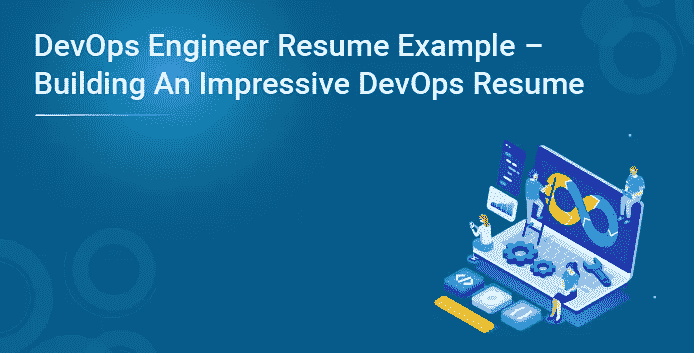
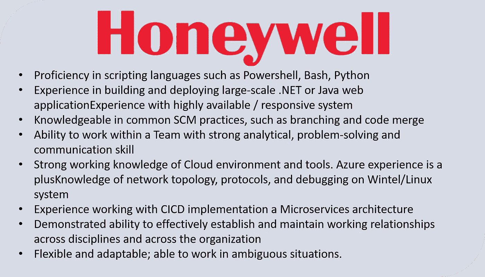
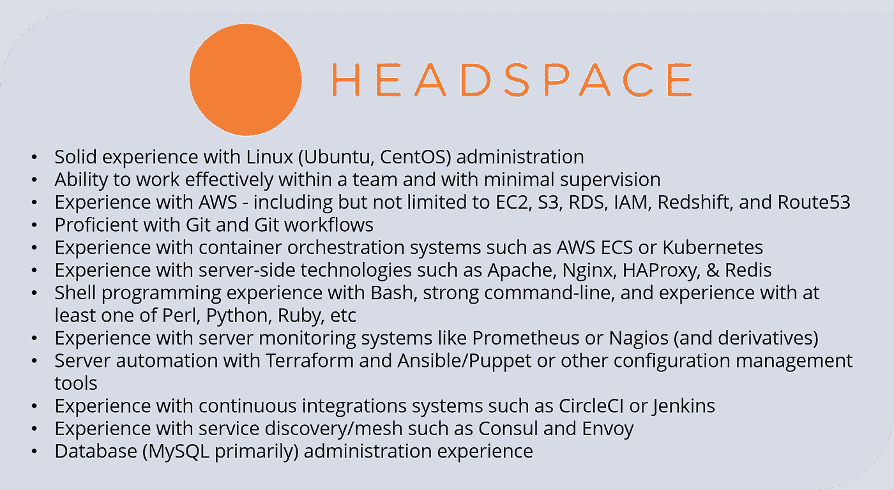
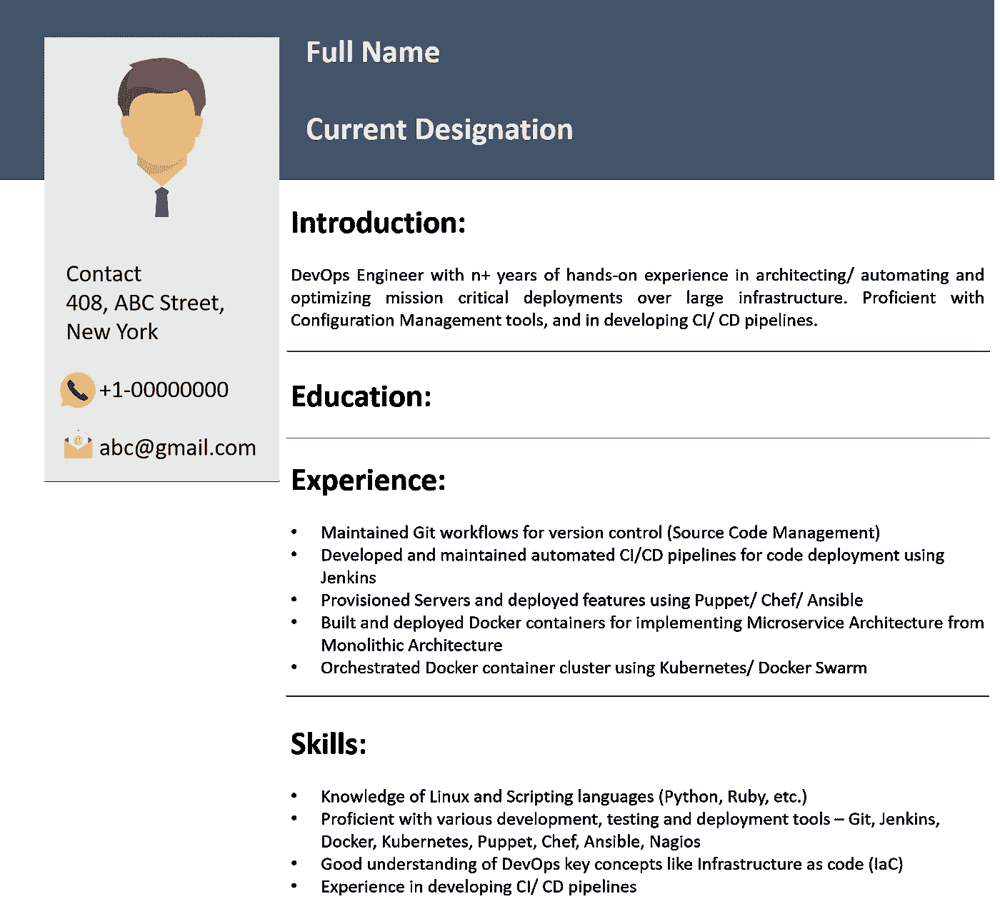

# DevOps 工程师简历示例

> 原文：<https://medium.com/edureka/devops-engineer-resume-f5b21949f3f7?source=collection_archive---------0----------------------->

# DevOps 简历:

我相信您现在已经很好地理解了什么是 DevOps 以及它是如何工作的。在这篇文章中，我将向你解释如何创建一份令人印象深刻的 DevOps 简历来获得你梦想中的 DevOps 工作。永远不要忘记，你只有一次机会用你的简历在招聘人员面前留下第一印象，所以一定要充分利用这个机会。

我发现，生活的挑战在于写一份简历，它不只是简单地讲述你想成为什么样的人，而是讲述你想成为什么样的人。——奥普拉·温弗瑞。

我建议您浏览以下博客，了解 DevOps 以及成为一名成功的 DevOps 工程师所需的技能:

1.  **DevOps 教程**
2.  **DevOps 工程师技能**

在我解释 DevOps 工程师简历是什么样子之前，我先给你看几份 DevOps 工程师的工作描述，这样才公平。

# DevOps 工程师职位描述:

Key takeaways from the Job Description:

开发运维工程师应具备以下技能:

1.  良好的源代码管理(版本控制系统)工具实践知识，如 Git 和 Subversion
2.  精通开发持续集成/交付管道
3.  使用 Jenkins 等自动化/集成工具的经验
4.  了解主要的云服务提供商，如 AWS、Azure 等。
5.  很好地理解作为代码的基础设施(可编程基础设施)，以及如何通过使用 Puppet、Chef、Ansible 等工具来实现这一点。
6.  具有软件容器化平台(如 Docker)和容器编排工具(如 Kubernetes 和 Docker Swarm)的实践知识

现在，让我们创建一份 DevOps 工程师简历样本，您可以根据您的经验和工作要求进行修改。

# DevOps 工程师简历:

就是这样，伙计们，这就把我们带到了这篇文章的结尾。如果你想查看更多关于人工智能、DevOps、道德黑客等市场最热门技术的文章，你可以参考 Edureka 的官方网站。

请留意本系列中解释 DevOps 各个方面的其他文章。

> *1。* [*DevOps 教程*](/edureka/devops-tutorial-89363dac9d3f)
> 
> *2。* [*Git 教程*](/edureka/git-tutorial-da652b566ece)
> 
> *3。* [*詹金斯教程*](/edureka/jenkins-tutorial-68110a2b4bb3)
> 
> *4。* [*Docker 教程*](/edureka/docker-tutorial-9a6a6140d917)
> 
> *5。* [*Ansible 教程*](/edureka/ansible-tutorial-9a6794a49b23)
> 
> *6。* [*傀儡教程*](/edureka/puppet-tutorial-848861e45cc2)
> 
> *7。* [*厨师教程*](/edureka/chef-tutorial-8205607f4564)
> 
> *8。* [*Nagios 教程*](/edureka/nagios-tutorial-e63e2a744cc8)
> 
> *9。* [*如何编排 DevOps 工具？*](/edureka/devops-tools-56e7d68994af)
> 
> 10。 [*连续交货*](/edureka/continuous-delivery-5ca2358aedd8)
> 
> *11。* [*持续集成*](/edureka/continuous-integration-615325cfeeac)
> 
> *12。* [*连续部署*](/edureka/continuous-deployment-b03df3e3c44c)
> 
> *13。* [*连续交付 vs*](/edureka/continuous-delivery-vs-continuous-deployment-5375642865a)
> 
> *14。* [*CI CD 管道*](/edureka/ci-cd-pipeline-5508227b19ca)
> 
> 15。 [*Docker 作曲*](/edureka/docker-compose-containerizing-mean-stack-application-e4516a3c8c89)
> 
> *16。* [*码头工人群*](/edureka/docker-swarm-cluster-of-docker-engines-for-high-availability-40d9662a8df1)
> 
> *17。* [*Docker 联网*](/edureka/docker-networking-1a7d65e89013)
> 
> *18。* [*天穹*](/edureka/ansible-vault-secure-secrets-f5c322779c77)
> 
> *19。* [*可担任的角色*](/edureka/ansible-roles-78d48578aca1)
> 
> *20。* [*适用于 AWS*](/edureka/ansible-for-aws-provision-ec2-instance-9308b49daed9)
> 
> *21。* [*詹金斯*](/edureka/jenkins-pipeline-tutorial-continuous-delivery-75a86936bc92)
> 
> *22。* [*顶级 Docker 命令*](/edureka/docker-commands-29f7551498a8)
> 
> *23。*[*Git vs GitHub*](/edureka/git-vs-github-67c511d09d3e)
> 
> *24。* [*顶级 Git 命令*](/edureka/git-commands-with-example-7c5a555d14c)
> 
> *25。* [*DevOps 面试题*](/edureka/devops-interview-questions-e91a4e6ecbf3)
> 
> 26。 [*谁是 DevOps 工程师？*](/edureka/devops-engineer-role-481567822e06)
> 
> *27。* [*DevOps 生命周期*](/edureka/devops-lifecycle-8412a213a654)
> 
> *28。*[*Git ref log*](/edureka/git-reflog-dc05158c1217)
> 
> 29。 [*不可预见的准备*](/edureka/ansible-provisioning-setting-up-lamp-stack-d8549b38dc59)
> 
> 三十。 [*组织正在寻找的顶尖 DevOps 技能*](/edureka/devops-skills-f6a7614ac1c7)
> 
> 三十。 [*瀑布 vs 敏捷*](/edureka/waterfall-vs-agile-991b14509fe8)
> 
> *31。* [*詹金斯小抄*](/edureka/jenkins-cheat-sheet-e0f7e25558a3)
> 
> *32。* [*易答备忘单*](/edureka/ansible-cheat-sheet-guide-5fe615ad65c0)
> 
> *33。* [*答题面试问答*](/edureka/ansible-interview-questions-adf8750be54)
> 
> *34。* [*50 码头工人面试问题*](/edureka/docker-interview-questions-da0010bedb75)
> 
> *35。* [*敏捷方法论*](/edureka/what-is-agile-methodology-fe8ad9f0da2f)
> 
> *36。* [*詹金斯面试问题*](/edureka/jenkins-interview-questions-7bb54bc8c679)
> 
> *37。* [*Git 面试问题*](/edureka/git-interview-questions-32fb0f618565)
> 
> *38。* [*Docker 架构*](/edureka/docker-architecture-be79628e076e)
> 
> *39。*[*devo PS 中使用的 Linux 命令*](/edureka/linux-commands-in-devops-73b5a2bcd007)
> 
> *40。* [*詹金斯 vs 竹子*](/edureka/jenkins-vs-bamboo-782c6b775cd5)
> 
> *41。* [*Nagios 教程*](/edureka/nagios-tutorial-e63e2a744cc8)
> 
> *42。* [*Nagios 面试问题*](/edureka/nagios-interview-questions-f3719926cc67)
> 
> *43。* [*DevOps 实时场景*](/edureka/jenkins-x-d87c0271af57)
> 
> 44。 [*詹金斯和詹金斯 X 的区别*](/edureka/jenkins-vs-bamboo-782c6b775cd5)
> 
> *45。*[*Windows Docker*](/edureka/docker-for-windows-ed971362c1ec)
> 
> *46。*[*Git vs Github*](http://git%20vs%20github/)

*原载于 2018 年 11 月 6 日*[*https://www.edureka.co*](https://www.edureka.co/blog/devops-resume)*。*