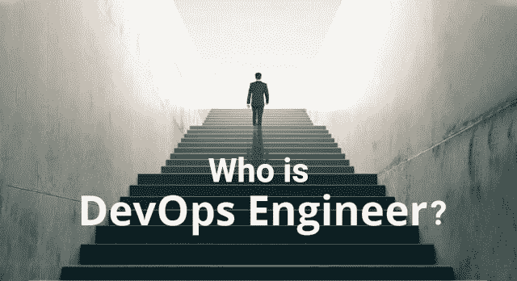
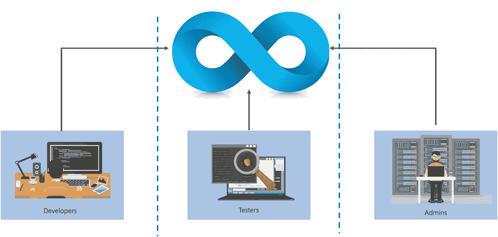
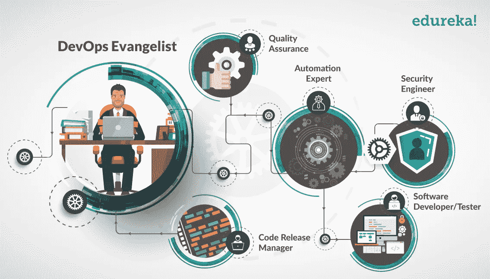
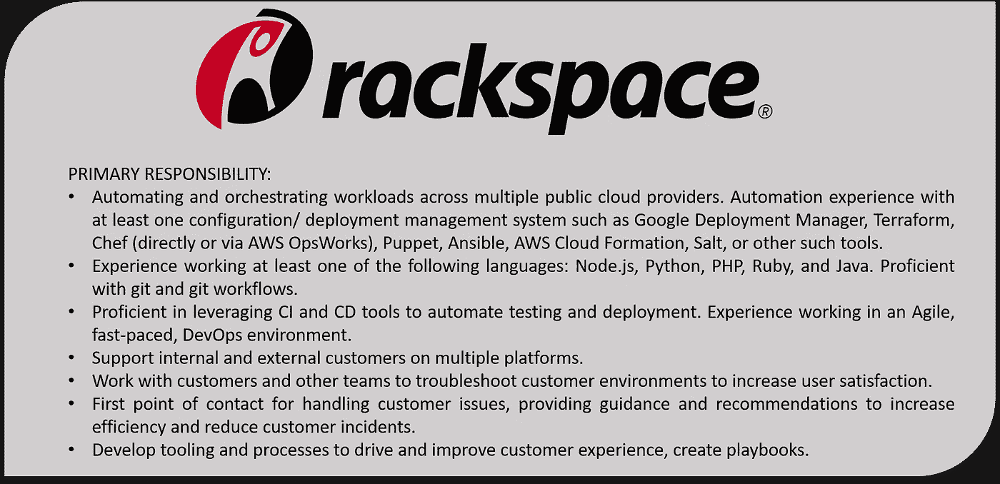
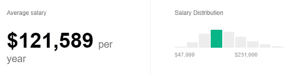
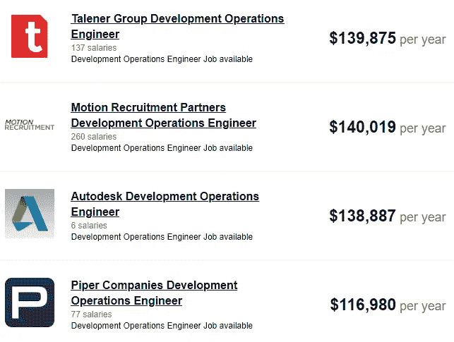

# 谁是 DevOps 工程师？— DevOps 工程师角色和职责

> 原文：<https://medium.com/edureka/devops-engineer-role-481567822e06?source=collection_archive---------0----------------------->

Who is a DevOps Engineer? — Edureka

关于谁是 DevOps 工程师，有很多误解。他是那个写代码还负责一个系统工程师工作的家伙吗？嗯！不完全是。在这篇文章中，我将消除你对一个 DevOps 工程师的**角色和职责的所有疑问。**

但在我们继续之前，让我先简单介绍一下什么是 DevOps？

# DevOps 是什么？

DevOps 是一种软件开发策略，它在开发人员和 IT 人员之间架起了一座桥梁。使用 DevOps，组织可以非常快速地发布小功能，并很快地整合他们收到的反馈。以下是一些其他的好处:

1.  软件故障减少
2.  缩短修复之间的交付时间

它克服了传统瀑布模型的所有限制。DevOps 过程涉及许多用于开发自动化 CI/ CD 管道的开发、测试和部署技术。以下是一些著名的 DevOps 工具:

1.  **Git 和 GitHub** —源代码管理(版本控制系统)
2.  **Jenkins** —自动化服务器，内置用于开发 CI/ CD 管道的插件
3.  **硒** —自动化测试
4.  **Docker** —软件集装箱化平台
5.  **Kubernetes** —容器编排工具
6.  **傀儡** —配置管理和部署
7.  **主厨** —配置管理和部署
8.  **响应** —配置管理和部署
9.  Nagios——持续监控

现在，让我们了解一下谁是 DevOps 工程师？

# 谁是 DevOps 工程师？

DevOps 工程师了解软件开发生命周期，并对开发数字管道(CI/ CD 管道)的各种自动化工具有透彻的了解。

但是问题仍然存在"**谁是 DevOps 工程师？**”

DevOps 工程师与开发人员和 IT 人员一起监督代码发布。他们要么是对部署和网络操作感兴趣的开发人员，要么是对脚本和编码充满热情的系统管理员，并进入开发领域，在那里他们可以改进测试和部署的规划。

但是你在公司的角色是什么？让我们看看 DevOps 的各种工作角色。

# DevOps 工作角色和职责:

让我首先列出各种角色及其描述。

1.  **DevOps 布道者**——负责实施 DevOps 的主要官员(领导)
2.  **发布经理**——发布新特性的人&确保发布后产品的稳定性
3.  **自动化专家** —负责实现自动化&工具编排的家伙
4.  **软件开发人员/测试人员**——开发代码并进行测试的人
5.  **品质保证**——确保产品质量符合其要求的人
6.  **安全工程师** —始终监控产品安全&健康的人

现在，您已经知道了谁是 DevOps 工程师，以及 DevOps 工程师的各种角色和职责，让我们来看看成为一名成功的 DevOps 工程师需要具备哪些条件— **DevOps 技能。**

我们将查看 Rackspace 的 DevOps 工程师职位描述，以了解哪些行业需要 DevOps 工程师。

# DevOps 工程师技能— DevOps 职位描述:

工作描述的要点(需要开发运维技能):

*   了解一个云平台(AWS、Azure、GCP)
*   良好的配置管理和部署工具实践知识，如 Puppet、Ansible、Chef、Terraform 等。
*   精通脚本，Git 和 Git 工作流
*   开发持续集成/持续交付管道(CI/ CD)的经验

嗯，我很肯定你们中的很多人一定想知道 DevOps 工程师的工资是多少，让我在下一部分回答你们的疑问。

# DevOps 工程师工资:

DevOps 工程师是世界上收入最高的工作之一。显然，工资取决于多种因素，如公司、技能、地理位置等。

在过去的 36 个月中，从 18，434 名员工、用户以及过去和现在的招聘广告中估算出的工资。

资料来源:Indeed.com

美国各公司开发运营工程师薪资:

我希望你喜欢我在 DevOps Engineer 上的帖子。如果你想查看更多关于人工智能、Python、道德黑客等市场最热门技术的文章，那么你可以参考 [Edureka 的官方网站。](https://www.edureka.co/blog/?utm_source=medium&utm_medium=content-link&utm_campaign=top-devops-interview-questions-2016)

请留意本系列中的其他文章，它们将解释 DevOps 的各个方面。

> *1。* [*DevOps 教程*](/edureka/devops-tutorial-89363dac9d3f)
> 
> *2。* [*饭桶教程*](/edureka/git-tutorial-da652b566ece)
> 
> *3。* [*詹金斯教程*](/edureka/jenkins-tutorial-68110a2b4bb3)
> 
> *4。* [*Docker 教程*](/edureka/docker-tutorial-9a6a6140d917)
> 
> *5。* [*Ansible 教程*](/edureka/ansible-tutorial-9a6794a49b23)
> 
> *6。* [*傀儡教程*](/edureka/puppet-tutorial-848861e45cc2)
> 
> *7。* [*厨师教程*](/edureka/chef-tutorial-8205607f4564)
> 
> *8。* [*Nagios 教程*](/edureka/nagios-tutorial-e63e2a744cc8)
> 
> 9。 [*如何编排 DevOps 工具？*](/edureka/devops-tools-56e7d68994af)
> 
> *10。* [*连续交货*](/edureka/continuous-delivery-5ca2358aedd8)
> 
> *11。* [*持续集成*](/edureka/continuous-integration-615325cfeeac)
> 
> *12。* [*连续部署*](/edureka/continuous-deployment-b03df3e3c44c)
> 
> *13。* [*连续交付 vs 连续部署*](/edureka/continuous-delivery-vs-continuous-deployment-5375642865a)
> 
> *14。* [*CI CD 管道*](/edureka/ci-cd-pipeline-5508227b19ca)
> 
> *15。* [*Docker 作曲*](/edureka/docker-compose-containerizing-mean-stack-application-e4516a3c8c89)
> 
> *16。* [*码头工人群*](/edureka/docker-swarm-cluster-of-docker-engines-for-high-availability-40d9662a8df1)
> 
> *17。* [*Docker 联网*](/edureka/docker-networking-1a7d65e89013)
> 
> *18。* [*天穹*](/edureka/ansible-vault-secure-secrets-f5c322779c77)
> 
> *19。* [*可担任的角色*](/edureka/ansible-roles-78d48578aca1)
> 
> *20。* [*适用于 AWS*](/edureka/ansible-for-aws-provision-ec2-instance-9308b49daed9)
> 
> *21。* [*詹金斯管道*](/edureka/jenkins-pipeline-tutorial-continuous-delivery-75a86936bc92)
> 
> *22。* [*顶级 Docker 命令*](/edureka/docker-commands-29f7551498a8)
> 
> *23。*[*Git vs GitHub*](/edureka/git-vs-github-67c511d09d3e)
> 
> *24。* [*顶级 Git 命令*](/edureka/git-commands-with-example-7c5a555d14c)
> 
> 25。 [*DevOps 面试问题*](/edureka/devops-interview-questions-e91a4e6ecbf3)
> 
> *26。* [*DevOps 生命周期*](/edureka/devops-lifecycle-8412a213a654)
> 
> *27。*[*Git ref log*](/edureka/git-reflog-dc05158c1217)
> 
> 28。 [*不可预见的准备*](/edureka/ansible-provisioning-setting-up-lamp-stack-d8549b38dc59)
> 
> *29。* [*组织正在寻找的顶尖 DevOps 技能*](/edureka/devops-skills-f6a7614ac1c7)
> 
> 三十。 [*瀑布 vs 敏捷*](/edureka/waterfall-vs-agile-991b14509fe8)
> 
> *31。* [*Maven 用于构建 Java 应用*](/edureka/maven-tutorial-2e87a4669faf)
> 
> *32。* [*詹金斯小抄*](/edureka/jenkins-cheat-sheet-e0f7e25558a3)
> 
> *33。* [*易答备忘单*](/edureka/ansible-cheat-sheet-guide-5fe615ad65c0)
> 
> *34。* [*Ansible 面试问答*](/edureka/ansible-interview-questions-adf8750be54)
> 
> *35。* [*50 码头工人面试问题*](/edureka/docker-interview-questions-da0010bedb75)
> 
> *36。* [*敏捷方法论*](/edureka/what-is-agile-methodology-fe8ad9f0da2f)
> 
> *37。* [*詹金斯面试问题*](/edureka/jenkins-interview-questions-7bb54bc8c679)
> 
> *38。* [*Git 面试问题*](/edureka/git-interview-questions-32fb0f618565)
> 
> *39。* [*Docker 架构*](/edureka/docker-architecture-be79628e076e)
> 
> *40。*[*devo PS 中使用的 Linux 命令*](/edureka/linux-commands-in-devops-73b5a2bcd007)
> 
> *41。* [*詹金斯 vs 竹子*](/edureka/jenkins-vs-bamboo-782c6b775cd5)
> 
> *42。* [*Nagios 面试问题*](/edureka/nagios-interview-questions-f3719926cc67)
> 
> *43。* [*DevOps 实时场景*](/edureka/jenkins-x-d87c0271af57)
> 
> 44。 [*詹金斯和詹金斯 X 的区别*](/edureka/jenkins-vs-bamboo-782c6b775cd5)
> 
> *45。*[*Windows Docker*](/edureka/docker-for-windows-ed971362c1ec)
> 
> *46。*[*Git vs Github*](http://git%20vs%20github/)

*原载于 2016 年 10 月 24 日*[*https://www.edureka.co*](https://www.edureka.co/blog/devops-engineer-role)*。*