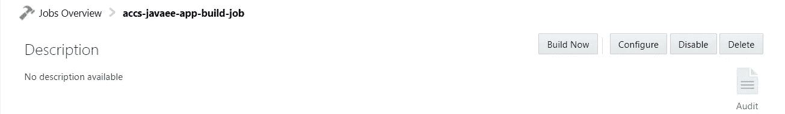

# Oracle 云上 Java EE 7 应用的 CI/CD

> 原文：<https://medium.com/oracledevs/devops-for-java-ee-7-apps-on-oracle-cloud-c92a1eef9b5d?source=collection_archive---------0----------------------->

如果一个应用程序只是躺在你的笔记本电脑上，那它有什么用呢？它需要被部署到一个可以使用它的地方——在现代，“这个地方”就是*云*

除了轻松地将其部署到云，您还应该迭代开发流程，以确保从您的本地开发环境到云的路径顺畅无缝— *持续集成和部署*可以帮助我们实现这一点

在这篇博客中，我们将

*   以一个现有的 [Java EE 7 应用程序](https://github.com/abhirockzz/accs-javaee-hello-world)为例
*   使用 Oracle Developer Cloud service 建立持续集成和部署渠道，
*   利用其与 Oracle PaaS 生态系统的集成，将其部署到 [Oracle 应用容器云](https://cloud.oracle.com/application-container-cloud)

> *这是另一篇博客，介绍了****Java EE 7****对 Oracle 应用容器云的支持*

[](/oracledevs/running-java-ee-7-apps-on-oracle-application-container-cloud-e29df7254372) [## 在 Oracle 应用容器云上运行 Java EE 7 应用

### 这篇博客介绍了 Oracle 应用程序容器云中的 Java EE 7 运行时支持。

medium.com](/oracledevs/running-java-ee-7-apps-on-oracle-application-container-cloud-e29df7254372) 

# 基本设置

**在开发者云服务中创建新项目**


New Project

> *更多详情请参见* [*文档*](https://docs.oracle.com/en/cloud/paas/developer-cloud/csdcs/working-oracle-developer-cloud-service-projects.html#GUID-7B30C8EC-6CDA-4F14-9791-8AE3BB3E8343)

**将源代码导入开发者云服务**

我已经在[我的 Github repo](https://github.com/abhirockzz/accs-javaee-hello-world) 中有了示例应用程序源代码，所以让我们导入它

> [*这里是文档*](https://docs.oracle.com/en/cloud/paas/developer-cloud/csdcs/managing-git-repositories-oracle-developer-cloud-service.html#GUID-89CB8029-E847-47DA-910F-2A1A49A9085B)


Import project

一旦导入过程完成，您将看到项目内容


Import finished

# 构建和部署配置

## 创建构建作业

让我们配置开发人员云来创建一个构建作业，该作业将使用我们的源代码，编译并构建它，最后将其转换为一个 ZIP 文件，然后可以将其推送到应用程序容器云

> *详情请见* [*文档*](https://docs.oracle.com/en/cloud/paas/developer-cloud/csdcs/managing-project-jobs-and-builds-oracle-developer-cloud-service.html#GUID-29CDDCA5-A39A-4605-BD06-CBC5AA6F23D2)


New build job

让我们确保我们的工作指向 Git 存储库


Job to Git repo link

并安排 Git repo 轮询来获取我们推送的任何(代码)更改


Poll the Git repo for changes

添加一个 Maven 构建步骤


Maven build step


mvn clean install

我们需要持久化/归档我们的构建工件(WAR 文件),以供后续(部署)任务使用


Archive the WAR

就是这样！现在就运行构建作业



Time to run

一旦构建完成，您就可以验证工件已经被创建了


Build completed

## 配置部署

现在，我们可以创建部署作业，将我们的 WAR 文件推送到云中

> *详情见* [*文档*](https://docs.oracle.com/en/cloud/paas/developer-cloud/csdcs/deploying-application-oracle-developer-cloud-service.html#GUID-853D9DF4-934A-4100-8F8D-31A979159CBE)

从一个新的*配置开始*


brand new deployment job

从基本信息开始


Basic deployment info

然后添加部署描述符的详细信息——manifest . JSON 和 deployment.json..很好很容易！


ACCS deployment descriptors

点击**保存**，现在我们就可以开始部署了！


Initiate deployment


On our way!

同样的情况也应该反映在应用程序容器云中


Deployment in progress

# 测试应用程序

访问应用程序端点— `curl <accs_app_url>/hello`，例如`curl [https://javaeehelloworld-ocloud109.apaas.us2.oraclecloud.com/hello](https://javaeehelloworld-ocloud109.apaas.us2.oraclecloud.com/hello)`

您应该会看到类似如下的响应


Response

# CI/CD 正在运行

我们的应用程序现在已经部署好了，让我们看看 CI/CD 是如何工作的

*   将 Oracle Developer Cloud service Git 存储库中的代码克隆到您的本地机器上

```
git clone <git_repo_url> e.g. git clone [https://developer.us2.oraclecloud.com/developer45858-ocloud109/s/developer45858-ocloud109_demo_22222/scm/accs-javaee-hello-world.git](https://abhishek.af.gupta%40oracle.com@developer.us2.oraclecloud.com/developer45858-ocloud109/s/developer45858-ocloud109_demo_22222/scm/accs-javaee-hello-world.git)
```


*   进行代码更改，并将您的更改推回 Git repo

```
cd accs-javaee-hello-world
git commit -am "new attribute added" 
git push -u origin master
```


git commit


git push

您应该看到 Oracle 开发人员云服务也反映了这一点


updated Git repo

由于我们之前配置的构建，这将

*   *自动*开始构建工作，这将
*   启动*部署*作业，并将服务(在本例中为更新)推送到 Oracle 应用程序容器云

再次访问应用程序— `curl <accs_app_url>/hello`，例如`curl [https://javaeehelloworld-ocloud109.apaas.us2.oraclecloud.com/hello](https://javaeehelloworld-ocloud109.apaas.us2.oraclecloud.com/hello)`

注意添加到代码中的新属性(**主机名** )


new attribute

这篇博文到此为止！看看为 Java EE 应用程序设置 CI/CD 管道从您的**笔记本电脑- >云**获取它是多么容易

# 参考

*   [Oracle 应用容器云文档](https://docs.oracle.com/en/cloud/paas/app-container-cloud/index.html)
*   [甲骨文开发者云文档](https://docs.oracle.com/en/cloud/paas/developer-cloud/index.html)

# 不要忘记…

*   查看 Oracle Application Container Cloud 教程—每个运行时都有适合的内容！

 [## Oracle 应用容器云服务-创建您的第一个应用

### Oracle 应用容器云服务教程。学习创建你的第一个应用程序。

docs.oracle.com](https://docs.oracle.com/en/cloud/paas/app-container-cloud/create-first-applications.html) 

*   关于应用程序容器云的其他博客

[](/tag/app-container-cloud/latest) [## 关于 App Container Cloud - Medium 的最新故事和新闻

### 阅读关于应用容器云的最新文章。每天，成千上万的声音阅读、书写和分享重要的…

medium.com](/tag/app-container-cloud/latest) 

干杯！

> 本文表达的观点是我个人的观点，不一定代表甲骨文的观点。