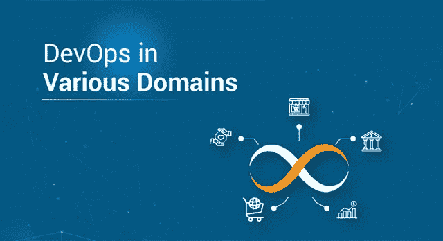
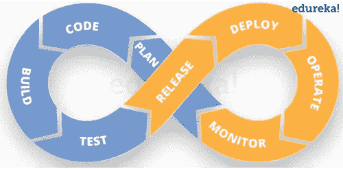

# 不同领域的开发运维——开发运维如何解决问题？

> 原文：<https://medium.com/edureka/devops-in-various-domains-8ffc9b10d05f?source=collection_archive---------3----------------------->

DevOps in Various Domains — Edureka

到目前为止，DevOps 已经成为科技行业的最新流行语。DevOps 是团队之间的协作文化，以及一套从业务流程中持续消除浪费的 DevOps 工具和方法，从而不断改进向最终用户交付的价值。DevOps 一词在各个领域都意味着它不再局限于科技行业。

然而，DevOps 及其实践现在正被应用于科技领域之外。在这篇博客中，我们将介绍已经开始实现 DevOps 的各个领域。我们将要讨论的主题如下-

1.  DevOps 是什么？
2.  不同领域的开发人员

*   政府
*   银行业务
*   保险
*   零售
*   旅行

让我们从第一个话题开始

# DevOps 是什么？

DevOps 是一种软件开发方法，涉及软件在其整个开发生命周期中的持续开发、持续测试、持续集成、持续部署和持续监控。这些活动只可能在 DevOps 中进行，而不是敏捷或瀑布，这就是为什么脸书和其他顶级公司选择 DevOps 作为他们业务目标的前进方向。DevOps 是在更短的开发周期内开发高质量软件的首选方法，可以提高客户满意度。

# 政府中的债务

## 轮廓

美国国家航空航天局(NASA)是美国政府的一个机构，负责国家的民用太空计划和航空航天研究。

## 挑战

NASA 需要将近 65 个应用程序从传统的基于硬件的数据中心迁移到基于云的环境中，以提高灵活性和节约成本。快速的时间表导致许多应用程序“按原样”迁移到云环境。这造成了一个跨多个虚拟私有云(VPC)和 AWS 帐户的环境，无法轻松管理。即使是简单的事情，如确保每个系统管理员都能访问每台服务器，或简单的修补，也是极其繁重的。

## 解决办法

这个问题通过利用 Ansible Tower 来管理和调度云环境得到了解决。

## 结果

由于实施了 Ansible Tower，NASA 能够更好地管理其 AWS 环境。Tower 使 NASA 能够为其客户提供更好的操作和安全性。这也提高了团队的效率。如果你看一下这些数字，那么:

*   更新 nasa.gov 的时间从 1 个多小时缩短到不到 5 分钟
*   修补过程从几天缩短到 45 分钟
*   实现近乎实时的 RAM 和磁盘监控(无需代理即可实现)
*   在不到 10 分钟的时间内在整个环境中调配操作系统帐户
*   基准标准 AMIs 从 1 小时的手动配置变成了一个不可见的无缝后台流程
*   每个应用程序堆栈的设置时间从 1-2 小时缩短到不到 10 分钟

# 银行业的发展

## 轮廓

**苏格兰皇家银行**通常简称为 **RBS** ，是苏格兰皇家银行集团有限公司的零售银行子公司之一，与 NatWest 和阿尔斯特银行一起。苏格兰皇家银行有大约 700 家分行，主要在苏格兰，尽管在英格兰和威尔士的许多较大的城镇也有分行。

## 挑战

苏格兰皇家银行正在努力整合和重新设计其战略支付交易中心，其中涉及数十个集成接触点。RBS 最近收购了另一家金融机构，因此需要整合该公司的系统。然而，苏格兰皇家银行已经在将自己的系统迁移到一个新的战略交易中心，并通过新平台提供 43 项功能增强。实际上，维护四个独立消息中心的成本和复杂性翻了两番。

## 解决办法

最后，开发了一个解决方案来帮助该银行应对其集成挑战。有必要帮助银行识别软件交付生命周期中的所有点，在这些点上，银行可以使用自动化测试、敏捷开发和服务虚拟化来加速开发，更早地识别缺陷，并加速产品发布。

该解决方案包括一个集成和服务虚拟化工具。这些软件产品有助于创建一个端到端的虚拟测试环境，而不是创建真实的测试环境，后者构建成本高且难以维护。

通过使用该解决方案，RBS 能够对涉及执行其交易事务的 80 多个界面和子系统进行自动化集成测试。这使得连续测试成为可能，并支持团队的敏捷开发过程。

## 结果

在三年的时间里，RBS 从集成和服务虚拟化解决方案中获得了巨大的收益。这些好处如下:

*   将系统集成测试时间从三周减少到半天
*   未检测到的缺陷导致的生产事故数量减少了 99.6%
*   将项目交付能力提高了 100%，每年完成的项目从 40 个增加到 80 个
*   节省了大约 600 万美元的硬件、软件和资源成本
*   将从项目开始到交付的时间缩短了 44%，使银行能够更快地向客户提供产品和服务，并抓住新的市场机会

# 保险中的债务

## 轮廓

NJM 保险集团总部位于美国新泽西州默瑟县尤因镇西特伦顿区，提供个人汽车、商用汽车、工伤赔偿、房屋所有人和伞式保险。该公司于 1913 年由一群寻求工人赔偿的工厂主成立。NJM 已经发展到为居住在新泽西和宾夕法尼亚的 850，000 多名投保人提供保险。

## 挑战

随着新泽西制造商保险集团(NJM)升级核心技术平台，他们希望加快软件交付，以便使交付实践与升级解决方案的业务需求保持一致。随着工作量和工作节奏的日益增加，他们很快就达到了极限，因为他们试图扩展他们完全手动的软件部署过程。

在不引入更痛苦的手动流程的情况下维护和证明法规遵从性也是这家大型保险公司最关心的问题。NJM 需要一种更可靠的方法来简化软件部署，同时确保合规性控制得到维护。他们的最终目标是自动化高质量软件的发布，同时降低复杂性并最小化开销。

## 解决办法

NJM 成功实施了部署自动化，加速并标准化了软件交付流程，同时帮助他们更轻松地证明合规性。该计划显著降低了运营开销并简化了部署流程，因此 NJM 可以扩展。

## 结果

*   大幅缩短部署时间非生产部署—从几天缩短到几分钟生产部署—速度提高 30%-50%
*   每月通过自动化完成 1，000 到 1，500 次以上的部署。几年前，该公司手工处理其发布
*   该公司开始进行连续、有计划的自助式部署。消除了对专业技术人员部署软件的依赖。QA、开发人员和受训人员现在正在处理部署
*   轻松合规性高度可见，是一个完全可追溯和可审计的零接触流程

# 零售业的 DevOps

## **简介**

这家专业零售商是一家家喻户晓的公司，其股票在纽约证券交易所上市。这家零售商在美国拥有约 100 家门店和强大的电子商务业务，以其令人振奋的商品而闻名，并一直被评为最佳工作场所之一。

## **挑战**

随着零售业形势的快速变化，该组织希望其内部开发团队能够保持敏捷，并在竞争中领先一步。该公司的任务是为该组织的电子商务网站和店内系统提供服务，因此决定制定一个 IT 现代化计划，并将其分解为多个独立的项目。第一个这样的项目是发展开发人员和 IT 自动化，提高他们的生产力和快速迭代创新的能力。

## 解决办法

*   码头集装箱微服务
*   基于 DevOps 的云计算
*   完全自动化的 CI/CD 与不可变的基础架构相结合

## 结果

作为一家身兼数职的开发公司，这家零售商的开发团队热衷于在单一平台上实现标准化。其环境变得复杂且难以管理；然而，随着新的基于 Docker 容器的微服务与 Ansible、Docker Swarm 和 Hashicorp Consul 和 Vault 等工具配合使用，该组织实现了更高水平的自动化。这种自动化反过来允许开发人员更快地开始工作，敏捷地迭代，并对组织产生更具战略性的影响。

# 旅行中的开发人员

## 轮廓

***Amadeus*** 是全球最大的旅游运营商之一。他们的系统与所有旅行相关交易的 90%进行交互，为超过 700 家航空公司和大约 600，000 家酒店提供服务，在高峰负载时每秒处理超过 55，000 次操作，而且这个数字还在不断增长。

## 问题

该公司使用私有云，虚拟机由 vagger 和 vSphere 提供服务。然而，花费在维护基础架构的虚拟机管理程序层上的计算资源数量太高，处理速度不是最佳的，而即使几秒钟的延迟也会给旅游运营商带来巨大的损失。

## 解决办法

该公司选择了 Docker 而不是 vagger，并决定迁移到运行 OpenShift、Docker 和 Kubernetes 的本地云。通过使用专有的 DevOps 管理系统，他们能够高效地利用其整个 IT 基础架构，利用以前由虚拟机管理程序使用的资源。这占了他们计算能力的近 **20%** 。

## 结果

该公司通过简单有效地利用其 IT 基础设施，获得了价值数百万的计算资源。此外，Kubernetes 集群中运行的 Docker 容器允许实时处理工作负载，因为没有虚拟机管理程序层，所以没有延迟。

正如这个列表所示，即使不是以技术为中心的行业，也可以从使用 DevOps 中受益。DevOps 的主要目标之一是阻止各部门以条块分割的方式工作。相反，它鼓励他们互相交流。这个目标有助于以更少的摩擦更快地实现目标。

如果你想查看更多关于人工智能、Python、道德黑客等市场最热门技术的文章，你可以参考 Edureka 的官方网站。

请留意本系列中的其他文章，它们将解释 DevOps 的各个方面。

> *1。* [*DevOps 教程*](/edureka/devops-tutorial-89363dac9d3f)
> 
> *2。* [*Git 教程*](/edureka/git-tutorial-da652b566ece)
> 
> *3。* [*詹金斯教程*](/edureka/jenkins-tutorial-68110a2b4bb3)
> 
> *4。* [*码头工人教程*](/edureka/docker-tutorial-9a6a6140d917)
> 
> *5。* [*Ansible 教程*](/edureka/ansible-tutorial-9a6794a49b23)
> 
> *6。* [*木偶教程*](/edureka/puppet-tutorial-848861e45cc2)
> 
> *7。* [*厨师教程*](/edureka/chef-tutorial-8205607f4564)
> 
> *8。* [*Nagios 教程*](/edureka/nagios-tutorial-e63e2a744cc8)
> 
> *9。* [*如何编排 DevOps 工具？*](/edureka/devops-tools-56e7d68994af)
> 
> *10。* [*连续交货*](/edureka/continuous-delivery-5ca2358aedd8)
> 
> *11。* [*持续集成*](/edureka/continuous-integration-615325cfeeac)
> 
> *12。* [*连续部署*](/edureka/continuous-deployment-b03df3e3c44c)
> 
> *13。* [*持续交付 vs 持续部署*](/edureka/continuous-delivery-vs-continuous-deployment-5375642865a)
> 
> *14。* [*CI CD 管道*](/edureka/ci-cd-pipeline-5508227b19ca)
> 
> *15。* [*Docker 作曲*](/edureka/docker-compose-containerizing-mean-stack-application-e4516a3c8c89)
> 
> *16。* [*码头工人群*](/edureka/docker-swarm-cluster-of-docker-engines-for-high-availability-40d9662a8df1)
> 
> *17。* [*Docker 联网*](/edureka/docker-networking-1a7d65e89013)
> 
> *18。* [*易变拱顶*](/edureka/ansible-vault-secure-secrets-f5c322779c77)
> 
> *19。* [*岗位职责*](/edureka/ansible-roles-78d48578aca1)
> 
> 20。 [*可用于 AWS*](/edureka/ansible-for-aws-provision-ec2-instance-9308b49daed9)
> 
> *21。* [*詹金斯管道*](/edureka/jenkins-pipeline-tutorial-continuous-delivery-75a86936bc92)
> 
> *22。* [*顶级 Docker 命令*](/edureka/docker-commands-29f7551498a8)
> 
> *23。*[*Git vs GitHub*](/edureka/git-vs-github-67c511d09d3e)
> 
> *24。* [*顶级 Git 命令*](/edureka/git-commands-with-example-7c5a555d14c)
> 
> *二十五。* [*DevOps 面试问题*](/edureka/devops-interview-questions-e91a4e6ecbf3)
> 
> *二十六。* [*谁是 DevOps 工程师？*](/edureka/devops-engineer-role-481567822e06)
> 
> *27。* [*DevOps 生命周期*](/edureka/devops-lifecycle-8412a213a654)
> 
> *28。*[*Git ref log*](/edureka/git-reflog-dc05158c1217)
> 
> *29。* [*易变条款*](/edureka/ansible-provisioning-setting-up-lamp-stack-d8549b38dc59)
> 
> *30。* [*组织正在寻找的顶尖 DevOps 技能*](/edureka/devops-skills-f6a7614ac1c7)
> 
> *30。* [*瀑布 vs 敏捷*](/edureka/waterfall-vs-agile-991b14509fe8)
> 
> *31。* [*詹金斯小抄*](/edureka/jenkins-cheat-sheet-e0f7e25558a3)
> 
> *32。* [*不可译的备忘单*](/edureka/ansible-cheat-sheet-guide-5fe615ad65c0)
> 
> *33。* [*Ansible 面试问答*](/edureka/ansible-interview-questions-adf8750be54)
> 
> *34。* [*50 码头工人面试问题*](/edureka/docker-interview-questions-da0010bedb75)
> 
> *35。* [*敏捷方法论*](/edureka/what-is-agile-methodology-fe8ad9f0da2f)
> 
> *36。* [*詹金斯面试问题*](/edureka/jenkins-interview-questions-7bb54bc8c679)
> 
> *37。* [*Git 面试问题*](/edureka/git-interview-questions-32fb0f618565)
> 
> 38。 [*码头建筑*](/edureka/docker-architecture-be79628e076e)
> 
> 39。[*devo PS 中使用的 Linux 命令*](/edureka/linux-commands-in-devops-73b5a2bcd007)
> 
> *四十。* [*詹金斯 vs 竹子*](/edureka/jenkins-vs-bamboo-782c6b775cd5)
> 
> *41。* [*Nagios 教程*](/edureka/nagios-tutorial-e63e2a744cc8)
> 
> 42。 [*Nagios 面试问题*](/edureka/nagios-interview-questions-f3719926cc67)
> 
> 43。 [*DevOps 实时场景*](/edureka/jenkins-x-d87c0271af57)
> 
> 44。 [*詹金斯和詹金斯 X 的区别*](/edureka/jenkins-vs-bamboo-782c6b775cd5)
> 
> *45。*[*Windows Docker*](/edureka/docker-for-windows-ed971362c1ec)
> 
> *46。*[*Git vs Github*](http://git%20vs%20github/)

*原载于 2019 年 11 月 14 日*[*https://www.edureka.co*](https://www.edureka.co/blog/devops-in-various-domains/)*。*