# 2021 年你必须准备的面试问题

> 原文：<https://medium.com/edureka/devops-interview-questions-e91a4e6ecbf3?source=collection_archive---------1----------------------->

你是 DevOps 工程师还是考虑进 DevOps？那么，未来是你的。在这篇文章中，我列出了面试官可能会问潜在 DevOps 雇员的几十个问题。

需要理解的重要一点是，DevOps 不仅仅是技术的集合，更是一种思维方式，一种文化。开发运维需要一种文化转变，将运营与开发融合在一起，并需要一个链接的技术工具链来促进协作性变革。由于开发运维理念仍处于非常初级的阶段，开发运维的应用以及适应和协作所需的带宽因组织而异。然而，你可以开发一个 DevOps 技能组合，使你成为任何类型组织的完美候选人。

***成为 DevOps 工程师需要具备哪些条件？***

在寻找 DevOps 职位时，组织会寻找一套清晰的技能。其中最重要的是:

*   有使用 Chef、Puppet、Ansible、SaltStack 或 Windows PowerShell DSC 等基础架构自动化工具的经验。
*   精通 Ruby、Python、PHP 或 Java 等网络语言。
*   帮助您跨团队和角色进行沟通和协作的人际交往技能。

为了组织下面的问题，我设身处地为你着想。本文中的大多数答案都是从您的角度撰写的，例如，某人可能是 DevOps 专家。

# **一般 DevOps 面试问题**

此类别将包括与任何特定开发运维阶段无关的问题。这里的问题旨在测试您对 DevOps 的理解，而不是关注某个特定的工具或阶段。

## Q1。DevOps 和敏捷的根本区别是什么？

下表列出了两者之间的差异。

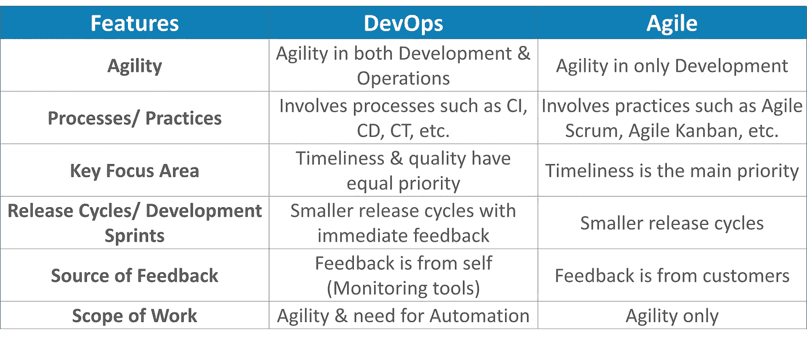

## Q2。DevOps 的需求是什么？

依我看，这个回答应该从解释市场大趋势开始。公司不是发布大的功能集，而是试图看看小的功能是否可以通过一系列的发布系列传递给他们的客户。这有许多优点，如客户的快速反馈，更好的软件质量等。这反过来导致了高客户满意度。为此，公司必须:

1.  增加部署频率
2.  降低新版本的失败率
3.  缩短修复之间的交付时间
4.  在新版本崩溃时，平均恢复时间更短

DevOps 满足所有这些需求，并帮助实现无缝软件交付。你可以举出 Etsy、Google 和 Amazon 等公司的例子，这些公司采用 DevOps 实现了甚至在五年前都无法想象的性能水平。他们每天进行数十、数百甚至数千次代码部署，同时提供世界一流的稳定性、可靠性和安全性。

如果我要测试你对 DevOps 的了解，你应该知道敏捷和 DevOps 的区别。下一个问题就是针对这个问题的。

## Q3。DevOps 和敏捷/ SDLC 有什么不同？

我建议你按照下面的解释去做:

敏捷是一套关于如何生产即开发软件的价值观和原则。例如:如果你有一些想法，你想把这些想法变成工作软件，你可以使用敏捷价值观和原则作为一种方法。但是，该软件可能只能在开发人员的笔记本电脑或测试环境中运行。您需要一种安全、简单的方式，快速、轻松、可重复地将软件迁移到生产基础设施中。为此，您需要 DevOps 工具和技术。

你可以总结说敏捷软件开发方法集中于软件的开发，但是 DevOps 从另一方面来说负责以最安全和最可靠的方式开发和部署软件。

请记住，您在之前的回答中已经包含了 DevOps 工具，所以请准备好回答一些相关的问题。

## Q4。哪些是顶尖的 DevOps 工具？你用过哪些工具？

下面提到了最流行的 DevOps 工具:

*   Git:版本控制系统工具
*   Jenkins:持续集成工具
*   Selenium:连续测试工具
*   Puppet、Chef、Ansible:配置管理和部署工具
*   Nagios:持续监控工具
*   码头工人:集装箱工具

如果你愿意，你也可以提到任何其他工具，但要确保在你的回答中包括上述工具。
答案的第二部分有两种可能:

1.  如果你有使用以上所有工具的经验，那么你可以说我已经使用了所有这些工具来开发高质量的软件，并轻松、频繁、可靠地部署这些软件。
2.  如果你只对上面的一些工具有经验，那么提到这些工具，说我对这些工具有专门的了解，并且对其余的工具有一个总体的了解。

## Q5。所有这些工具是如何协同工作的？

下面给出的是一个通用的逻辑流程，其中所有的东西都自动实现无缝交付。但是，这个流程可能会根据需求因组织而异。

1.  开发人员开发代码，这些源代码由版本控制系统工具如 Git 等管理。
2.  开发人员将这些代码发送到 Git 存储库，代码中的任何更改都会提交到这个存储库中。
3.  Jenkins 使用 Git 插件从存储库中取出这些代码，并使用 Ant 或 Maven 等工具进行构建。
4.  像 puppet 这样的配置管理工具部署和供应测试环境，然后 Jenkins 在测试环境上发布这些代码，在测试环境上使用 selenium 这样的工具进行测试。
5.  一旦代码经过测试，Jenkins 会将其发送到生产服务器上进行部署(甚至生产服务器也是由 puppet 之类的工具提供和维护的)。
6.  部署之后，它会被 Nagios 之类的工具持续监控。
7.  Docker 容器提供了测试环境来测试构建特性。

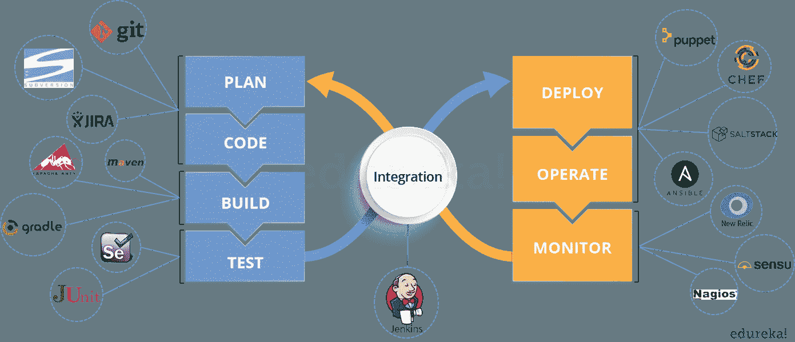

## Q6。DevOps 有什么优势？

对于这个回答，你可以用你过去的经验，解释一下 DevOps 在你之前的工作中是如何帮助你的。如果你没有任何这样的经验，那么你可以提到以下优点。

***技术好处:***

*   连续软件交付
*   要解决的不太复杂的问题
*   更快地解决问题

***商业利益:***

*   更快地交付功能
*   更稳定的操作环境
*   更多时间可用于增值(而不是修复/维护)

## Q7。DevOps 帮助我们实现的最重要的事情是什么？

在我看来，DevOps 帮助我们实现的最重要的事情是尽快将变更投入生产，同时将软件质量保证和合规性的风险降至最低。这是 DevOps 的主要目标。
不过，你可以加上 DevOps 的很多其他正面效果。例如，团队之间更清晰的沟通和更好的工作关系，即运营团队和开发团队共同协作来交付高质量的软件，这反过来导致更高的客户满意度。

## Q8。用一个 DevOps 可以用在行业/现实生活中的用例来解释。

许多行业都在使用 DevOps，因此您可以提及其中的任何使用案例，也可以参考下面的示例:
Etsy 是一个点对点电子商务网站，专注于手工或复古物品和用品，以及独特的工厂制造物品。Etsy 在缓慢而痛苦的网站更新中苦苦挣扎，这经常导致网站宕机。这影响了数百万通过在线市场销售商品的 Etsy 用户的销售，并有可能将他们推向竞争对手。
在新技术管理团队的帮助下，Etsy 从瀑布模型(每周两次，每次四小时)过渡到更敏捷的方法。如今，它拥有完全自动化的部署渠道，据报道，它的连续交付实践每天可以完成 50 多次部署，而且中断更少。

## Q9。解释你在过去工作过的组织的软件开发方面和技术操作方面的理解和专业知识。

对于这个答案，分享你过去的经验，并尝试解释你在以前的工作中有多灵活。你可以参考下面的例子:
DevOps 的工程师几乎总是在一个 24/7 的关键业务在线环境中工作。我能适应随叫随到的工作，并能承担实时、实时的系统责任。我成功地自动化了支持连续软件部署的流程。我有公共/私有云经验，有 Chef 或 Puppet 之类的工具，有 Python 和 PHP 之类工具的脚本和自动化经验，有敏捷方面的背景。

## Q10。DevOps 有哪些反模式？

模式是通常遵循的常见用法。如果其他人普遍采用的模式对您的组织不起作用，而您继续盲目地遵循它，那么您实际上是在采用一种反模式。关于 DevOps 有很多神话。其中一些包括:

*   DevOps 是一个过程
*   敏捷等于 DevOps？
*   我们需要一个独立的开发团队
*   Devops 会解决我们所有的问题
*   DevOps 意味着开发人员管理生产
*   DevOps 是开发驱动的发布管理

1.  DevOps 不是开发驱动的。
2.  DevOps 不是 IT 运营驱动的。

*   我们不能做 DevOps -我们是独一无二的
*   我们不能做 DevOps -我们抓错人了

# 版本控制系统(VCS)面试问题

现在我们来看一些关于 VCS 的面试问题。

## Q1。什么是版本控制？

这可能是你在面试中会面临的最简单的问题。我的建议是先给版本控制一个定义。它是一个系统，记录一段时间内对一个或一组文件的更改，以便您可以在以后调用特定的版本。版本控制系统由一个中央共享存储库组成，团队成员可以在其中提交对一个或一组文件的更改。然后你可以提到版本控制的使用。

版本控制允许您:

*   将文件恢复到以前的状态。
*   将整个项目恢复到以前的状态。
*   比较一段时间内的变化。
*   查看谁最后修改了可能导致问题的内容。
*   谁在何时提出了问题。

## Q2。使用版本控制有什么好处？

我将建议您包括版本控制的以下优点:

1.  有了版本控制系统(VCS)，所有团队成员都可以在任何时候自由地处理任何文件。VCS 稍后将允许您将所有的更改合并到一个通用版本中。
2.  所有过去的版本和变体都整齐地打包在 VCS 内。当你需要它的时候，你可以在任何时候请求任何版本，并且你会得到一个完整项目的快照。
3.  每次存储项目的新版本时，您的 VCS 都会要求您提供一个简短的描述，说明发生了哪些更改。此外，您可以看到文件内容的确切变化。这可以让您知道谁在项目中做了什么变更。
4.  像 Git 这样的分布式 VCS 允许所有团队成员拥有完整的项目历史，因此如果中央服务器出现故障，您可以使用任何队友的本地 Git 存储库。

## Q3。描述你用过的分支策略。

问这个问题是为了测试你的分支经验，所以告诉他们你在以前的工作中是如何使用分支的，它有什么作用，你可以参考以下几点:

*   **特征分支**
    特征分支模型将一个特定特征的所有变更保存在一个分支内。当这个特性被自动化测试充分测试和验证后，这个分支就被合并到主模块中。
*   **任务分支**
    在这个模型中，每个任务都在自己的分支上实现，任务关键字包含在分支名称中。很容易看出哪个代码实现了哪个任务，只需在分支名称中查找任务键。
*   **发布分支**
    一旦开发分支为一个发布获得了足够的特性，你就可以克隆这个分支来形成一个发布分支。创建这个分支将开始下一个发布周期，因此在这之后不能添加新的特性，只有错误修复、文档生成和其他面向发布的任务应该放在这个分支中。一旦准备好发布，这个版本就会被合并到主版本中，并被加上一个版本号。此外，它应该被合并回 develop 分支，这个分支可能从发布开始就已经有进展了。

最后告诉他们分支策略因组织而异，所以我知道基本的分支操作，如删除、合并、检出分支等。

## Q4。哪个 VCS 工具让你觉得舒服？

你可以像这样提到你开发过的 VCS 工具:“我开发过 Git，它相对于其他 VCS 工具如 SVN 的一个主要优势是它是一个分布式版本控制系统。”分布式 VCS 工具不一定依赖中央服务器来存储项目文件的所有版本。相反，每个开发人员都“克隆”一个存储库的副本，并在他们自己的硬盘上拥有该项目的完整历史。

## Q5。Git 是什么？

我建议你先解释一下 git 的架构，如下图所示。可以参考下面给出的解释:

*   Git 是一个分布式版本控制系统(DVCS)。它可以跟踪对文件的更改，并允许您恢复到任何特定的更改。
*   与其他版本控制系统(VCS)如 SVN 相比，它的分布式体系结构提供了许多优势。一个主要优势是它不依赖于中央服务器来存储项目文件的所有版本。相反，每个开发人员都“克隆”了一个我在下图中用“本地存储库”表示的存储库的副本，并且在他的硬盘驱动器上有该项目的完整历史，这样当出现服务器故障时，您所需要的恢复就是您队友的本地 Git 存储库之一。
*   还有一个中央云存储库，开发人员可以在其中提交更改并与其他队友共享，正如您在图中看到的那样，所有合作者都在“远程存储库”中提交更改。

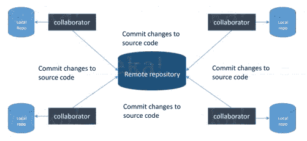

## Q6。解释一些基本的 Git 命令？

下面是一些基本的 Git 命令:

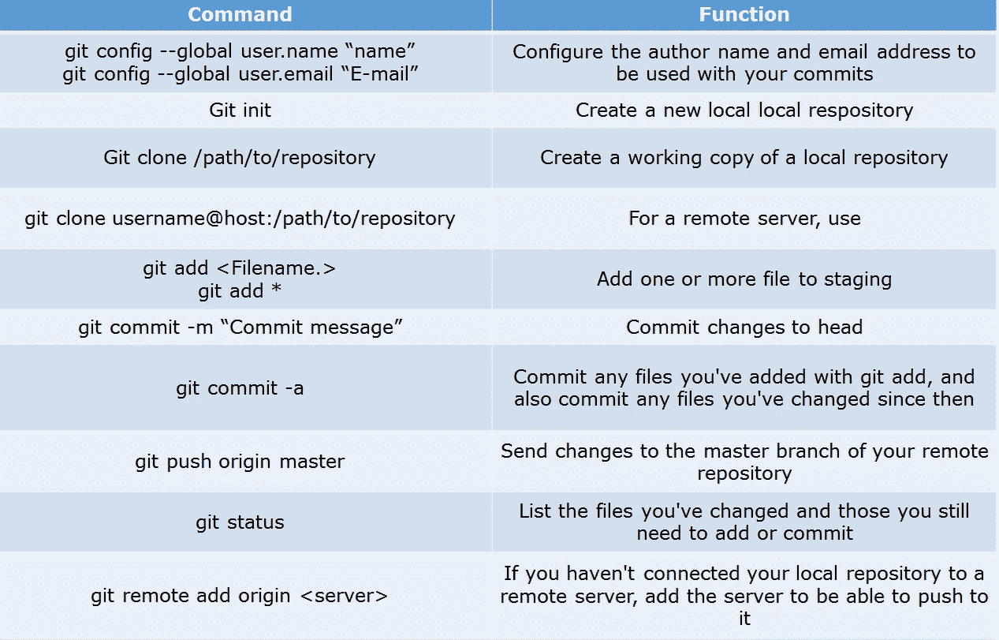

## Q7。在 Git 中，如何恢复一个已经提交并公开的提交？

这个问题可能有两个答案，所以请确保您包括了这两个答案，因为根据具体情况，可以使用以下任何一个选项:

*   在新的提交中删除或修复坏文件，并将其推送到远程存储库。这是修复错误最自然的方式。一旦你对文件做了必要的修改，把它提交到远程存储库，我将使用
    **git commit-m“commit message”**
*   创建一个新的提交，撤销错误提交中所做的所有更改。为此，我将使用命令
    **git revert <错误提交的名称>**

## Q8。如何将最后 N 次提交压缩成一次提交？

有两种方法可以将最后 N 次提交压缩成一次提交。在您的答案中包括以下两个选项:

*   如果您想从头开始编写新的提交消息，请使用以下命令
    **git reset-soft HEAD ~ N&&**
    **git commit**
*   如果您想开始编辑新的 commit 消息，并连接现有的 commit 消息，那么您需要提取这些消息并将它们传递给 Git commit，为此我将使用
    **Git reset-soft HEAD ~ N&&**
    **Git commit-edit-m " $(Git log-format = % B-reverse。头@{N})"**

## Q9。Git 平分是什么？如何使用它来确定(回归)错误的来源？

我建议你先给出一个 Git 等分的小定义，Git 等分是用来查找通过使用二分搜索法引入 bug 的提交。Git 二等分的命令是
**git 二等分<子命令> <选项>** 既然你在上面提到了这个命令，解释一下这个命令会做什么，这个命令使用二分搜索法算法来查找你的项目历史中哪个提交引入了 bug。首先告诉它一个已知包含 bug 的“坏”提交，以及一个已知在引入 bug 之前的“好”提交。然后 Git 二等分在这两个端点之间选择一个提交，并询问您所选择的提交是“好”还是“坏”。它继续缩小范围，直到找到引入更改的确切提交。

## Q10。什么是 Git rebase，在合并之前如何使用它来解决特性分支中的冲突？

根据我的观点，你应该首先说 git rebase 是一个命令，它将把另一个分支合并到你当前工作的分支中，并且将所有在 rebase 分支之前的本地提交移动到该分支的历史顶部。
现在，一旦您为一个示例定义了 Git rebase 时间，以显示如何在合并之前使用它来解决特征分支中的冲突，如果特征分支是从主分支创建的，并且从那时起主分支已经接收到新的提交，Git rebase 可以用于将特征分支移动到主分支的顶端。
该命令将有效地在主控端重放特征分支中所做的更改，允许冲突在该过程中得到解决。当小心地完成时，这将允许特征分支相对容易地合并到主分支中，有时作为简单的快进操作。

## Q11。如何配置 Git 存储库在提交之前运行代码完整性检查工具，并在测试失败时阻止它们？

我建议你先简单介绍一下健全性检查，健全性或冒烟测试决定了继续测试是否可能和合理。
现在解释如何实现这一点，这可以通过一个与存储库的预提交挂钩相关的简单脚本来完成。在提交之前，甚至在要求您输入提交消息之前，就会触发预提交挂钩。在这个脚本中，您可以运行其他工具，比如 linters，并对提交到存储库中的变更执行健全性检查。
最后举个例子，可以参考下面的剧本:
**#！/bin/sh
files = $(git diff-cached-name-only-diff-filter = ACM | grep '。go $ ')
if[-z files]；然后
退出 0
fi
unfmtd = $(go fmt-l $ files)
if[-z unfmtd]；然后
退出 0
fi
回显“有的。go 文件不是 fmt'd"
退出 1** 该脚本检查是否有。将要提交的 go 文件需要通过标准的 Go 源代码格式化工具 gofmt。通过以非零状态退出，脚本有效地防止了提交被应用到存储库。

## Q12。如何找到在特定提交中发生更改的文件列表？

对于这个答案，不仅仅是告诉命令，而是解释这个命令将做什么，所以你可以说，要获得在特定提交中已更改的文件的列表，使用命令
**git diff-tree-r { hash }**
给定提交哈希，这将列出在该提交中更改或添加的所有文件。-r 标志使该命令列出单个文件，而不是仅将它们折叠成根目录名。你也可以包括下面提到的一点，虽然这完全是可选的，但会有助于给面试官留下深刻印象。
输出还将包含一些额外的信息，通过包含两个标志可以很容易地抑制这些信息:

**git diff-tree-no-commit-id-name-only-r { hash }**

Here -no-commit-id 将禁止提交散列出现在输出中，而-name-only 将只打印文件名，而不是它们的路径。

## Q13。如何设置一个脚本在每次存储库通过推送接收到新的提交时运行？

有三种方法可以配置脚本，使其在每次存储库通过 push 接收到新的提交时运行，您需要定义一个接收前、更新或接收后挂钩，具体取决于何时需要触发脚本。

*   将提交推送到目标存储库中时，将调用该存储库中的预接收挂钩。任何绑定到这个钩子的脚本将在任何引用被更新之前被执行。这是一个有用的钩子，可以运行帮助实施开发策略的脚本。
*   Update hook 的工作方式与 pre-receive hook 类似，也是在实际进行任何更新之前触发的。但是，每次提交到目标存储库时，都会调用一次更新挂钩。
*   最后，在目标存储库接受更新后，调用存储库中的接收后挂钩。这是配置简单部署脚本、调用一些持续集成系统、向存储库维护人员发送通知电子邮件等的理想场所。

钩子对于每个 Git 存储库都是本地的，并且没有版本控制。脚本可以创建在“.”内的 hooks 目录中。git”目录，或者可以在其他地方创建它们，并且可以将指向这些脚本的链接放在该目录中。

## Q14。如何在 Git 中知道一个分支是否已经被合并到 master 中？

我建议你包含下面提到的两个命令:
git branch-merged 列出已经合并到当前分支的分支。
git branch–no-merged 列出尚未合并的分支。

# 持续集成问题

现在，让我们看看持续集成面试问题:

## Q1。什么是持续集成？

我建议您从给出持续集成(CI)的一个小定义开始回答这个问题。这是一种开发实践，要求开发人员每天数次将代码集成到共享存储库中。然后，每个签入都由一个自动构建来验证，允许团队尽早发现问题。
我建议你解释一下你在之前的工作中是如何实施的。你可以参考下面给出的例子:

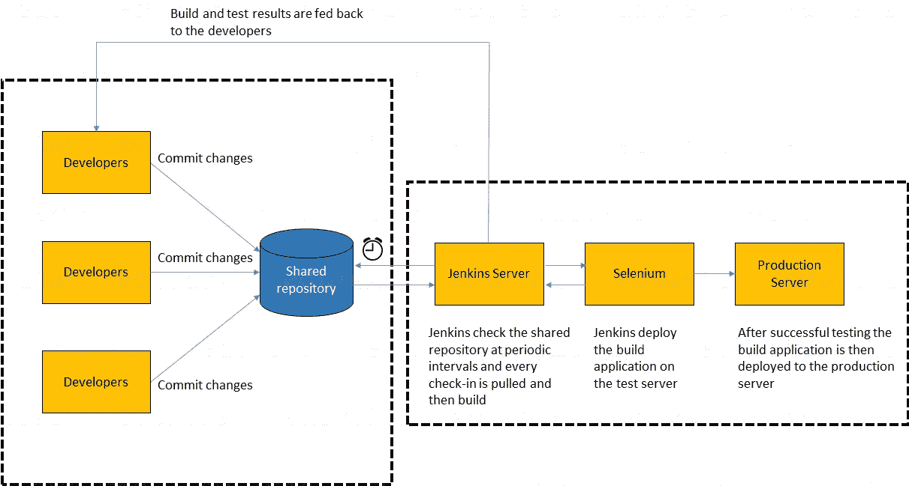

在上图中:

1.  开发人员将代码签入他们的私有工作区。
2.  当他们完成时，他们将变更提交到共享存储库(版本控制存储库)。
3.  CI 服务器监视存储库，并在发生更改时检出这些更改。
4.  CI 服务器然后提取这些变更并构建系统，还运行单元和集成测试。
5.  CI 服务器现在将通知团队构建成功。
6.  如果构建或测试失败，CI 服务器将提醒团队。
7.  该团队将尽可能早地解决问题。
8.  这个过程不断重复。

## Q2。为什么您需要开发和测试的持续集成？

对于这个答案，你应该把重点放在持续集成的需求上。我的建议是在你的回答中提到下面的解释:
开发和测试的持续集成提高了软件的质量，并且通过取代在完成所有开发之后进行测试的传统实践，减少了交付软件所花费的时间。它允许开发团队很容易地在早期检测和定位问题，因为开发人员需要一天几次(更频繁地)将代码集成到共享存储库中。然后会自动测试每个签入。

## Q3。持续集成的成功因素是什么？

这里就不得不提持续集成的要求了。你可以在回答中包括以下几点:

*   维护代码库
*   自动化构建
*   进行构建自检
*   每个人每天都致力于基线
*   应该构建每个提交(基线)
*   保持快速构建
*   在生产环境的克隆中进行测试
*   让获取最新交付物变得容易
*   每个人都可以看到最新构建的结果
*   自动化部署

## Q4。解释如何将 Jenkins 从一台服务器移动或复制到另一台服务器？

我将通过将 jobs 目录从旧服务器复制到新服务器来完成这项任务。有多种方法可以做到这一点；我在下面提到了它们:
你可以:

*   只需复制相应的作业目录，即可将作业从 Jenkins 的一个安装移动到另一个安装。
*   通过用不同的名称制作作业目录的克隆来制作现有作业的副本。
*   通过重命名目录来重命名现有作业。请注意，如果您更改作业名称，您将需要更改尝试调用重命名作业的任何其他作业。

## Q5。解释如何在 Jenkins 中创建备份和复制文件？

这个问题的答案真的很直接。要创建备份，您需要做的就是定期备份您的 JENKINS_HOME 目录。这包含所有的构建作业配置、从属节点配置和构建历史。要创建 Jenkins 设置的备份，只需复制此目录。您还可以复制作业目录来克隆或复制作业，或者重命名目录。

## Q6。解释你如何安排詹金斯的工作？

我对这个问题的回答将首先提到如何创造詹金斯就业机会。转到詹金斯首页，选择“新工作”，然后选择“建立一个自由风格的软件项目”。
然后你可以说出这份自由式工作的要素:

*   可选的 SCM，例如源代码所在的 CVS 或 Subversion。
*   控制 Jenkins 何时执行构建的可选触发器。
*   执行构建的某种构建脚本(ant、maven、shell 脚本、批处理文件等)。)真正的工作发生的地方。
*   从构建中收集信息的可选步骤，例如归档工件和/或记录 javadoc 和测试结果。
*   向其他人/系统通知构建结果的可选步骤，例如发送电子邮件、即时消息、更新问题跟踪器等..Q7。提及 Jenkins 中一些有用的插件。

## Q7。提及 Jenkins 中一些有用的插件。

下面，我提到了一些重要的插件:

*   Maven 2 项目
*   亚马逊 EC2
*   HTML 发布者
*   复制工件
*   加入
*   绿色的球

这些插件，我感觉是最有用的插件。如果你想包含上面没有提到的任何其他插件，你也可以添加它们。但是，请确保您首先提到上述插件，然后添加自己的插件。

## Q8。你如何保护詹金斯？

下面是我保护詹金斯的方法。如果你有其他的方法，请在下面的评论区提出来:

*   确保全局安全性已打开。
*   确保 Jenkins 通过适当的插件与我公司的用户目录相集成。
*   确保启用矩阵/项目矩阵来微调访问。
*   使用自定义版本控制脚本在 Jenkins 中自动设置权限/特权。
*   限制对 Jenkins 数据/文件夹的物理访问。
*   定期对其运行安全审计。

# 连续测试面试问题:

现在让我们继续讨论连续测试问题。

## Q1。什么是持续测试？

我会建议你遵循下面提到的解释:
持续测试是执行自动化测试的过程，作为软件交付管道的一部分，以获得与最新构建相关的业务风险的即时反馈。通过这种方式，每一个构建都被持续地测试，允许开发团队获得快速的反馈，这样他们就可以防止这些问题发展到软件交付生命周期的下一个阶段。这大大加快了开发人员的工作流程，因为不需要手动重建项目，也不需要在做出更改后重新运行所有测试。

## Q2。什么是自动化测试？

自动化测试或测试自动化是一个自动化手动过程的过程，以测试被测试的应用程序/系统。自动化测试包括使用独立的测试工具，这让您可以创建可以重复执行的测试脚本，并且不需要任何手动干预。

## Q3。自动化测试的好处是什么？

我已经列出了自动化测试的一些优点。将这些包括在你的答案中，你可以加上你自己关于持续测试如何帮助你以前的公司的经验:

*   支持重复测试用例的执行
*   帮助测试大型测试矩阵
*   支持并行执行
*   鼓励无人值守执行
*   提高准确性，从而减少人为错误
*   节省时间和金钱

## Q4。DevOps 生命周期如何自动化测试？

我在下面提到了一个通用流程，你可以参考:
在 DevOps 中，开发者需要将源代码中的所有更改提交到一个共享的存储库中。像 Jenkins 这样的持续集成工具会在每次代码发生变化时从这个共享存储库中提取代码，并部署它进行持续测试，这些测试是由 Selenium 这样的工具完成的，如下图所示。
通过这种方式，与传统方法不同，代码中的任何更改都会被持续测试。

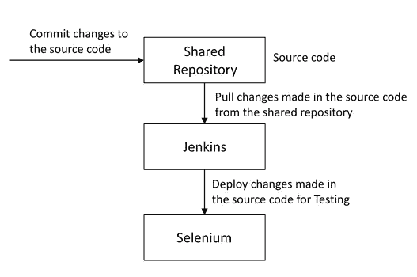

## Q5。为什么持续测试对 DevOps 很重要？

你可以这样回答这个问题:“持续测试允许代码中的任何变化都被立即测试。这避免了将“大爆炸”测试留到周期末尾所产生的问题，例如发布延迟和质量问题。通过这种方式，持续的测试促进了更频繁和高质量的发布。”

## Q6。持续测试工具的关键要素是什么？

持续测试的关键要素是:

*   **风险评估:**它涵盖了风险缓解任务、技术债务、质量评估和测试覆盖优化，以确保构建为下一阶段做好准备。
*   **策略分析:**它确保所有流程与组织不断发展的业务保持一致，并满足合规性需求。
*   需求可追溯性:它确保真正的需求得到满足，并且不需要返工。对象评估用于识别哪些需求处于风险中，按预期工作，或者需要进一步验证。
*   **高级分析:**它在静态代码分析、变更影响分析和范围评估/优先化等领域使用自动化，以从一开始就防止缺陷，并在每次迭代中实现更多。
*   **测试优化:**它确保测试产生准确的结果，并提供可操作的发现。方面包括测试数据管理、测试优化管理和测试维护
*   **服务虚拟化:**它确保访问真实世界的测试环境。服务可视化支持访问所需测试阶段的虚拟形式，减少了测试环境设置和可用性的浪费时间。

## Q7。你喜欢哪种测试工具，该工具有什么好处？

在这里提及你使用过的测试工具，并据此设计你的答案。我在下面提到了一个例子:
我一直致力于 Selenium，以确保高质量和更频繁的发布。

***硒的一些优点有:***

*   它是免费和开源的
*   它拥有庞大的用户群和乐于助人的社区
*   它具有跨浏览器兼容性(火狐、chrome、Internet Explorer、Safari 等。)
*   它有很好的平台兼容性(Windows，Mac OS，Linux 等)。)
*   它支持多种编程语言(Java，C#，Ruby，Python，Pearl 等。)
*   它有新的和定期的知识库开发
*   它支持分布式测试

## Q8。Selenium 支持哪些测试类型？

Selenium 支持两种类型的测试:
**回归测试**:它是在修复了一个 bug 的地方重新测试一个产品的行为。

**功能测试**:指单独测试软件特性(功能点)。

## Q9。什么是硒 IDE？

我的建议是从定义 Selenium IDE 开始这个回答。它是 Selenium 脚本的集成开发环境。它是作为 Firefox 扩展实现的，允许您记录、编辑和调试测试。Selenium IDE 包括整个 Selenium 核心，允许您在实际运行环境中轻松快速地记录和回放测试。
现在在你的回答中加入一些优势。凭借自动完成支持和快速移动命令的能力，Selenium IDE 是创建 Selenium 测试的理想环境，无论您喜欢哪种类型的测试。

## Q10。Selenium 中的 Assert 和 Verify 命令有什么区别？

我在下面提到了 Assert 和 Verify 命令之间的区别:

*   Assert 命令检查给定的条件是真还是假。假设我们断言给定的元素是否出现在网页上。如果条件为真，则程序控制将执行下一个测试步骤。但是，如果条件为假，执行将会停止，并且不会执行进一步的测试。
*   Verify 命令还检查给定的条件是真还是假。无论条件是真还是假，程序执行都不会停止，即验证期间的任何失败都不会停止执行，所有测试步骤都会执行。

## Q11。如何使用 WebDriver 启动浏览器？

可以使用以下语法启动浏览器:
**web driver driver = new Firefox driver()；**
**web driver driver = new chrome driver()；**
**WebDriver 驱动= new InternetExplorerDriver()；**

## Q12。什么时候该用硒格？

对于这个答案，我的建议是给 Selenium Grid 一个小的定义。它可以用来在多个平台和浏览器上同时执行相同或不同的测试脚本，以实现分布式测试执行。这允许在不同的环境下进行测试，并且显著地节省了执行时间。

# 配置管理面试问题

现在让我们来看看你对配置管理了解多少。

## Q1。配置管理过程的目标是什么？

配置管理(CM)的目的是通过使开发或部署过程可控和可重复来确保产品或系统在其整个生命周期中的完整性，从而创建更高质量的产品或系统。CM 流程允许有序管理系统信息和系统变更，目的如下:

*   修订能力，
*   提高性能，
*   可靠性或可维护性，
*   延长寿命，
*   降低成本，
*   降低风险和
*   责任，或纠正缺陷。

## Q2。资产管理和配置管理有什么区别？

下面给出了资产管理和配置管理之间的一些差异:

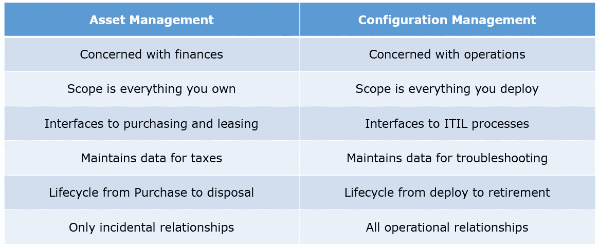

## Q3。资产和配置项有什么区别？

依我看，你应该先解释资产。它有一个财务价值和一个折旧率。it 资产只是 IT 的一个子集。任何有成本的东西，组织用它来计算资产价值和相关的税务计算收益，都属于资产管理，这样的项目称为资产。
另一方面，配置项可能有也可能没有财务值。它不会有任何相关的折旧。因此，其寿命不取决于其财务价值，而是取决于该物品对本组织而言变得过时的时间。

现在，您可以举一个例子来展示两者之间的相似性和差异:
1)相似性:
服务器—它既是资产，也是 CI。
2)区别:
建筑——它是资产，但不是 CI。
文档—它是配置项，但不是资产

## Q4。你所理解的“基础设施即代码”是什么？它如何适应 DevOps 方法？它达到什么目的？

基础设施即代码(IAC)是一种 IT 基础设施，运营团队可以使用它通过代码自动管理和配置，而不是使用手动流程。
寻求更快部署的公司将基础设施视为软件:可使用 DevOps 工具和流程管理的代码。这些工具让您能够更轻松、快速、安全、可靠地进行基础架构变更。

## Q5。Puppet、Chef、SaltStack 和 Ansible 中哪个是最好的配置管理(CM)工具？为什么？

这取决于组织的需求，所以在所有这些工具上提几点:
Puppet 是最古老和最成熟的配置管理工具。Puppet 是一个基于 Ruby 的配置管理工具，但是虽然它有一些免费的特性，但是 Puppet 的大部分优点只有付费版本才有。不需要很多额外服务的组织会发现 Puppet 很有用，但那些需要更多定制的组织可能需要升级到付费版本。
Chef 是用 Ruby 写的，懂语言的人可以定制。它还包括免费的特性，另外，如果有必要，它可以从开源升级到企业级。最重要的是，这是一款非常灵活的产品。
Ansible 是一个非常安全的选择，因为它使用安全外壳。这是一个使用简单的工具，但是除了配置管理之外，它还提供了许多其他服务。它非常容易学习，因此非常适合那些没有专门的 It 人员但仍然需要配置管理工具的人。
SaltStack 是一款基于 python 的开源 CM 工具，专为大型企业打造，但其学习曲线相当低。

## Q6。什么是木偶？

我劝你先给木偶一个小定义。它是一个配置管理工具，用于自动化管理任务。
现在你应该描述一下它的架构以及 Puppet 如何管理它的代理。Puppet 有一个主-从架构，其中从必须首先向主发送一个证书签名请求，主必须签署该证书，以便在 Puppet Master 和 Puppet Slave 之间建立安全连接，如下图所示。傀儡从设备向傀儡主设备发送请求，然后傀儡主设备将配置推送到从设备。
请参考解释上述说明的下图。

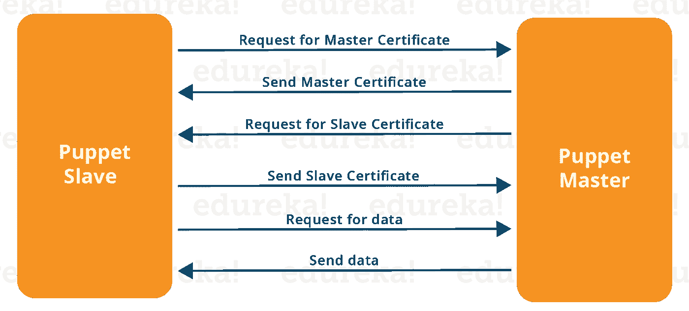

## Q7。在客户机可以向傀儡主人进行身份验证之前，它的证书需要被签名和接受。您将如何自动化这项任务？

最简单的方法是在 puppet.conf 中启用自动签名。如果您仍然想这样做:

*   为傀儡主人设置防火墙—将端口 tcp/8140 限制在您信任的网络上。
*   为每个“信任区域”创建傀儡主机，并且仅在傀儡主机清单中包含受信任的节点。
*   切勿使用完整的通配符，如*。

## Q8。描述你通过 Puppet 自动化一个过程所获得的最大收益。

对于这个答案，我建议你解释一下你过去和木偶的经历。你可以参考下面的例子:
我使用 Puppet 自动化了 Linux 和 Windows 机器的配置和部署。除了将处理时间从一周缩短到 10 分钟，我还使用了 roles and profiles 模式，并在 README 中记录了每个模块的用途，以确保其他人可以使用 Git 更新模块。我写的模块仍然在使用，但是我的队友和社区成员已经对它们进行了改进

## Q9。你用哪些开源或社区工具让 Puppet 更强大？

在这里，你需要提到的工具，以及你如何使用这些工具，使木偶更强大。以下是一个供您参考的示例:
变更和请求通过吉拉出票，我们通过内部流程管理请求。然后，我们使用 Git 和 Puppet 的代码管理器应用程序按照最佳实践来管理 Puppet 代码。此外，我们使用烧杯测试框架，通过我们在 Jenkins 的持续集成管道运行我们所有的 Puppet 变更。

## Q10。什么是木偶清单？

这是一个非常重要的问题，所以要确保你的流程是正确的。在我看来，你应该首先定义清单。每个节点(或 Puppet 代理)在 Puppet Master 中都有自己的配置细节，用本地 Puppet 语言编写。这些细节是用木偶能理解的语言写的，被称为显化。它们由 Puppet 代码组成，它们的文件名使用。pp 扩展。
现在举个例子。您可以在 Puppet Master 中编写一个清单，创建一个文件，并在连接到 Puppet Master 的所有傀儡代理(从属代理)上安装 apache。

## Q11。什么是木偶模块，它和木偶清单有什么不同？

对于这个答案，你可以用下面提到的解释:
Puppet 模块是清单和数据(比如事实、文件和模板)的集合，它们有一个特定的目录结构。模块对于组织 Puppet 代码很有用，因为它们允许您将代码分成多个清单。使用模块来组织几乎所有的木偶清单被认为是最佳实践。
傀儡程序被称为清单，由傀儡代码组成，其文件名使用。pp 扩展。

## Q12。木偶中的因素是什么？

你应该回答 Facter 在 Puppet 中到底做什么，所以根据我的说法，你应该说，“Facter 收集关于 Puppet 代理的基本信息(事实)，例如硬件细节、网络设置、操作系统类型和版本、IP 地址、MAC 地址、SSH 密钥等等。这些事实随后在傀儡师的清单中作为变量出现。”

## Q13。厨师是什么？

从定义厨师开始回答这个问题。它是一个强大的自动化平台，将基础设施转化为代码。Chef 是一个工具，您可以为它编写用于自动化流程的脚本。什么流程？几乎所有与之相关的东西。
现在你可以解释厨师的架构了，它包括:

*   **Chef 服务器:**Chef 服务器是基础设施配置数据的中央存储。Chef 服务器存储配置节点所需的数据，并提供搜索，这是一个强大的工具，允许您基于数据动态驱动节点配置。
*   **Chef 节点:**节点是使用 Chef-client 配置的任何主机。Chef-client 在您的节点上运行，联系 Chef 服务器以获取配置节点所需的信息。因为节点是运行 Chef-client 软件的机器，所以节点有时被称为“客户端”。
*   **厨师工作站:**厨师工作站是您用来修改食谱和其他配置数据的主机。

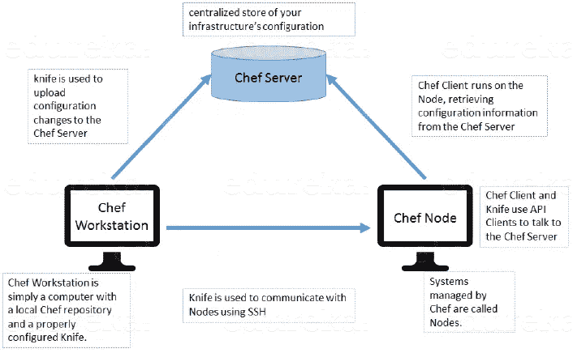

## Q14。什么是 Chef 中的资源？

我的建议是先定义资源。资源表示一个基础结构及其所需的状态，例如应该安装的包、应该运行的服务或应该生成的文件。
你应该解释资源的功能，包括以下几点:

*   描述配置项所需的状态。
*   声明使该项达到所需状态所需的步骤。
*   指定资源类型，如包、模板或服务。
*   根据需要列出其他详细信息(也称为资源属性)。
*   被分组到配方中，配方描述了工作配置。

## Q15。《大厨》里的菜谱是什么意思？

对于这个回答，我会建议你使用上面提到的流程:先定义食谱。配方是描述特定配置或策略的资源的集合。配方描述了配置部分系统所需的一切。
定义后，解释配方的功能，包括以下几点:

*   安装和配置软件组件。
*   管理文件。
*   部署应用程序。
*   执行其他配方。

## Q16。烹饪书和《大厨》中的食谱有什么不同？

这个问题的答案非常直接。你可以简单地说，“配方是资源的集合，主要配置软件包或一些基础设施。烹饪书将食谱和其他信息组合在一起，比只有食谱更容易管理。”

## Q17。如果在 Chef 中没有指定资源的动作，会发生什么？

我的建议是先直接回答:不指定资源的动作时，Chef 应用默认动作。
现在用一个例子来说明这个，下面的资源:
**file ' C:UsersAdministratorchef-reposettings . ini ' do**
**content ' greeting = hello world '**
**end**
同下面的资源:
**file ' C:UsersAdministratorchef-reposettings . ini ' do**
**action:create**
【T24

## Q18。什么是 Ansible 模块？

模块被认为是 Ansible 中的工作单元。每个模块基本上都是独立的，可以用标准脚本语言编写，比如 Python、Perl、Ruby、bash 等..模块的一个指导性属性是幂等性，这意味着即使一个操作重复多次，例如在从中断中恢复时，它也总是将系统置于相同的状态。

## Q19。Ansible 中的行动手册是什么？

剧本是 Ansible 的配置、部署和编排语言。它们可以描述您希望远程系统执行的策略，或者一般 IT 流程中的一组步骤。行动手册旨在便于人们阅读，并使用基本的文本语言开发。在基本层面上，行动手册可用于管理远程机器的配置和部署。

## 问题 20。如何查看所有 ansible_ variables 的列表？

Ansible 默认收集关于被管理机器的“事实”,这些事实可以在行动手册和模板中访问。要查看关于一台机器的所有可用事实的列表，您可以运行“setup”模块作为一个特别的操作:
**ansi ble-m setup hostname** 这将打印出一个关于该特定主机的所有可用事实的字典。

## 问题 21。如何设置应用程序的部署顺序？

WebLogic Server 8.1 允许您选择应用程序的加载顺序。请参见应用程序中的应用程序 MBean 加载顺序属性。WebLogic Server 在部署应用程序之前部署服务器级资源(首先是 JDBC，然后是 JMS)。应用程序按以下顺序部署:连接器，然后是 EJB，然后是 Web 应用程序。如果应用程序是一个 EAR，那么各个组件按照在 application.xml 部署描述符中声明的顺序加载。

## 问题 22。我能否刷新已部署应用程序的静态组件，而无需重新部署整个应用程序？

是的，你可以使用 weblogic。部署者指定一个组件并定位一个服务器，使用下面的语法:
java weblogic。部署者-adminurl[http://admin:7001](http://admin:7001)-name appname-targets server 1，server 2-deploy JSP/*。jsp

## 问题 23。如何关闭自动部署功能？

自动部署功能每三秒检查一次 applications 文件夹，以确定是否有任何新的应用程序或对现有应用程序的任何更改，然后动态部署这些更改。

在开发模式下运行的服务器启用了自动部署功能。要禁用自动部署功能，请使用以下方法之一将服务器置于生产模式:

*   在管理控制台中，单击左窗格中的域名，然后选中右窗格中的生产模式复选框。
*   启动域的管理服务器时，在命令行中包含以下参数:
    -Dweblogic。ProductionModeEnabled=true
*   为给定域中的所有 WebLogic Server 实例设置生产模式。

## 问题 24。什么时候应该使用 external_stage 选项？

使用 weblogic 设置外部阶段。如果您想自己准备应用程序，并且希望通过自己的方式将它复制到目标，那么可以使用 Deployer。

# 持续监控面试问题

让我们测试一下你对持续监控的了解。

## Q1。为什么需要持续监控？

我建议你采用下面提到的流程:
持续的监控可以及时发现问题或弱点，并快速采取纠正措施，帮助降低组织的开支。持续监控提供了解决三个操作规程的解决方案，即:

*   连续审计
*   连续控制监控
*   连续交易检查

## Q2。什么是 Nagios？

要回答这个问题，可以先提到 Nagios 是监控工具之一。它用于持续监控 DevOps 文化中的系统、应用程序、服务和业务流程等。如果出现故障，Nagios 可以向技术人员发出问题警报，允许他们在中断影响业务流程、最终用户或客户之前开始补救过程。使用 Nagios，您不必解释为什么看不见基础设施中断会影响组织的底线。
现在，一旦您定义了什么是 Nagios，您就可以提到使用 Nagios 可以实现的各种事情。
通过使用 Nagios，您可以:

*   在过时的系统导致故障之前规划基础设施升级。
*   在问题出现的第一时间做出反应。
*   检测到问题时自动修复。
*   协调技术团队的响应。
*   确保满足您组织的 SLA。
*   确保 IT 基础设施中断对您组织的底线影响最小。
*   监控您的整个基础架构和业务流程。

这就完成了这个问题的答案。更多细节，如优点等。可以根据讨论的方向添加。

## Q3。Nagios 是如何工作的？

我建议你遵循下面的解释:
Nagios 运行在服务器上，通常作为守护进程或服务。Nagios 定期运行驻留在同一服务器上的插件，它们联系您的网络或互联网上的主机或服务器。用户可以使用 web 界面查看状态信息。如果有事发生，你也可以收到电子邮件或短信通知。
Nagios 守护进程就像一个调度程序，在特定的时刻运行特定的脚本。它存储这些脚本的结果，如果这些结果发生变化，它将运行其他脚本。

现在期待一些关于 Nagios 组件如插件、NRPE 等的问题..

## Q4。Nagios 中有哪些插件？

从定义插件开始回答这个问题。它们是脚本(Perl 脚本、Shell 脚本等。)可以从命令行运行来检查主机或服务的状态。Nagios 使用插件的结果来确定网络上主机和服务的当前状态。一旦你定义了插件，解释为什么我们需要插件。每当需要检查主机或服务的状态时，Nagios 就会执行一个插件。插件将执行检查，然后简单地将结果返回给 Nagios。Nagios 将处理从插件收到的结果，并采取必要的措施。

## Q5。Nagios 中的 NRPE (Nagios 远程插件执行器)是什么？

对于这个回答，简单给个外挂的定义。NRPE 插件被设计成允许你在远程 Linux/Unix 机器上执行 Nagios 插件。这样做的主要原因是允许 Nagios 监控“本地”资源(如 CPU 负载、内存使用等。)在远程机器上。因为这些公共资源通常不会暴露给外部机器，所以像 NRPE 这样的代理必须安装在远程 Linux/Unix 机器上。

我建议你根据下图解释 NRPE 的建筑。NRPE 插件由两部分组成:

*   check_nrpe 插件，驻留在本地监控机器上。
*   NRPE 守护进程，运行在远程 Linux/Unix 机器上。

监控主机和远程主机之间有一个 SSL(安全套接字层)连接，如下图所示。

## Q6。Nagios 中的被动检查是什么意思？

在我看来，答案应该从解释被动检查开始。它们由外部应用程序/进程启动和执行，被动检查的结果提交给 Nagios 进行处理。
然后解释被动检查的必要性。它们对于监视本质上是异步的并且不能通过定期轮询其状态来有效监视的服务是有用的。它们还可用于监控位于防火墙后且无法从监控主机主动检查的服务。

## Q7。Nagios 什么时候检查外部命令？

确保你在解释过程中坚持这个问题，所以我会建议你遵循下面提到的流程。Nagios 在以下条件下检查外部命令:

*   按照主配置文件中的 command_check_interval 选项指定的固定时间间隔，
*   事件处理程序执行后立即执行。这是对外部命令检查常规周期的补充，如果事件处理程序向 Nagios 提交命令，它会立即采取行动。

## Q8。Nagios 中主动检查和被动检查有什么区别？

要回答这个问题，首先要指出主动检查和被动检查的基本区别。主动检查和被动检查的主要区别在于，主动检查是由 Nagios 发起和执行的，而被动检查是由外部应用程序执行的。
如果你的面试官看起来不相信上面的解释，那么你也可以提到主动和被动检查的一些关键特征:
被动检查对于监控以下服务很有用:

*   本质上是异步的，并且不能通过定期轮询它们的状态来进行有效的监控。
*   位于防火墙后面，无法从监控主机主动检查。

主动检查的主要特征如下:

*   Nagios 进程启动主动检查。
*   主动检查会定期运行。

## Q9。Nagios 如何帮助分布式监控？

面试官希望得到与 Nagios 分布式架构相关的答案。因此，我建议您按照下面提到的格式回答:
使用 Nagios，您可以通过使用分布式监控方案来监控整个企业，在该方案中，Nagios 的本地从实例执行监控任务，并将结果报告给单个主实例。您从主服务器管理所有配置、通知和报告，而从服务器完成所有工作。这种设计利用了 Nagios 利用被动检查的能力，即外部应用程序或进程将结果发送回 Nagios。在分布式配置中，这些外部应用程序是 Nagios 的其他实例。

## Q10。解释 Nagios 的主要配置文件及其位置？

首先提及这个主配置文件包含的内容及其功能。主配置文件包含许多影响 Nagios 守护进程操作方式的指令。这个配置文件由 Nagios 守护进程和 CGIs 读取(它指定了主配置文件的位置)。
现在你可以知道它出现在哪里，是如何产生的。当您运行配置脚本时，会在 Nagios 发行版的基本目录中创建一个示例主配置文件。主配置文件的默认名称是 nagios.cfg。它通常位于 nagios 安装目录的 etc/子目录中(即/usr/local/nagios/etc/)。

## Q11。解释一下 Nagios 中的襟翼检测是如何工作的？

我劝你先解释一下拍打。当服务或主机过于频繁地改变状态时，就会发生抖动，这会导致许多问题和恢复通知。
一旦你定义了拍打，解释 Nagios 如何检测拍打。每当 Nagios 检查主机或服务的状态时，它将检查它是否已经开始或停止摆动。Nagios 遵循下面给出的过程来完成这项工作:

*   存储主机或服务的最后 21 次检查的结果，分析历史检查结果，并确定状态变化/转换发生在何处
*   使用状态转换来确定主机或服务的百分比状态变化值(变化的度量)
*   将百分比状态变化值与低和高摆动阈值进行比较

当主机或服务的状态变化百分比首次超过高摆动阈值时，确定主机或服务已经开始摆动。当主机或服务的百分比状态低于低波动阈值时，确定其已停止波动。

## Q12。Nagios 中影响递归和继承的三个主要变量是什么？

根据我的看法，这个答案的正确格式应该是:
首先说出变量的名称，然后对每个变量做一个简短的解释:

*   名字
*   使用
*   注册

然后对这些变量中的每一个做一个简单的解释。名称是由其他对象使用的占位符。使用定义应该使用其属性的“父”对象。寄存器的值可以是 0(表示它只是一个模板)和 1(一个实际的对象)。寄存器值永远不会被继承。

## Q13。说 Nagios 是面向对象的是什么意思？

这个问题的答案很直接。我会这样回答:“Nagios 的一个特性是对象配置格式，因为您可以创建从其他对象定义继承属性的对象定义，因此也就有了这个名称。这简化并澄清了各种组件之间的关系。”

## Q14。什么是 Nagios 州跟踪？

我建议你先简单介绍一下国家跟踪。它用于记录目的。当对特定的主机或服务启用跟踪时，Nagios 会非常仔细地观察该主机或服务，并在检查结果的输出中记录它看到的任何变化。
根据你和面试官之间的讨论，你还可以补充道:“这对于以后分析日志文件非常有帮助。在正常情况下，只有当主机或服务自上次检查后改变了状态，才会记录主机或服务检查的结果。

# 集装箱化和虚拟化面试问题

让我们看看你对容器和虚拟机了解多少。

## Q1。什么是容器？

我的建议是解释容器化的必要性首先，容器用于从开发人员的笔记本电脑到测试环境，从登台环境到生产环境，提供一致的计算环境。
现在给容器下一个定义，一个容器由一个完整的运行时环境组成:一个应用程序，加上它所有的依赖项、库和其他二进制文件，以及运行它所需的配置文件，捆绑成一个包。将应用程序平台及其依赖项容器化消除了操作系统发行版和底层基础设施的差异。

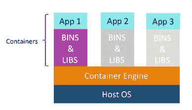

## Q2。与虚拟化相比，容器化有哪些优势？

以下是容器化相对于虚拟化的优势:

*   容器提供实时配置和可扩展性，但虚拟机提供缓慢的配置
*   与虚拟机相比，容器是轻量级的
*   与容器相比，虚拟机的性能有限
*   与虚拟机相比，容器具有更好的资源利用率

## Q3。容器(在我们的例子中是 Docker)与虚拟机管理程序虚拟化(vSphere)到底有什么不同？有什么好处？

下面给出了一些不同之处。请确保在您的回答中包含这些差异:

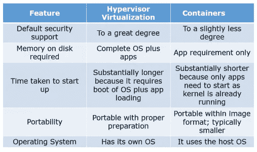

## Q4。什么是 Docker 图像？

我建议你使用下面提到的流程:
Docker 图片是 Docker 容器的来源。换句话说，Docker 图像用于创建容器。图像是用 build 命令创建的，当用 run 启动时，它们将产生一个容器。图像存储在 Docker 注册表中，如 registry.hub.docker.com，因为它们可能会变得非常大，图像被设计为由其他图像的层组成，允许在网络上传输图像时发送最少量的数据。
**提示:为了回答关于预先提供的图片的问题，请注意 Dockerhub。**

## Q5。什么是 Docker 容器？

这是一个非常重要的问题，所以确保你不要偏离主题。我建议你遵循下面提到的格式:
Docker 容器包括应用程序及其所有依赖项，但与其他容器共享内核，在主机操作系统的用户空间中作为独立的进程运行。Docker 容器不依赖于任何特定的基础设施:它们可以在任何计算机、任何基础设施和任何云中运行。
现在解释如何创建 Docker 容器，可以通过创建 Docker 映像并运行它来创建 Docker 容器，也可以使用 Dockerhub 上的 Docker 映像来创建。Docker 容器基本上是 Docker 图像的运行时实例。

## Q6。什么是 Docker hub？

这个问题的答案很直接。Docker hub 是一个基于云的注册服务，它允许您链接到代码库，构建并测试您的映像，存储手动推送的映像，并链接到 Docker cloud，以便您可以将映像部署到您的主机。它为容器映像发现、分发和变更管理、用户和团队协作以及整个开发流程中的工作流自动化提供了一个集中的资源。

## Q7。Docker 与其他容器技术有何不同？

根据我的看法，以下几点应该在你的回答中出现:
Docker 容器很容易部署在云中。与其他技术相比，它可以在相同的硬件上运行更多的应用程序，使开发人员可以轻松快速地创建现成的容器化应用程序，并使管理和部署应用程序变得更加容易。您甚至可以与您的应用程序共享容器。如果你有更多的补充，你可以这样做，但要确保你的答案中有上述解释。

## Q8。什么是 Docker Swarm？

你应该从解释 Docker Swarn 开始这个回答。Docker 的本机集群将一个 Docker 主机池转变为一个虚拟的 Docker 主机。Docker Swarm 提供标准的 Docker API，任何已经与 Docker 守护进程通信的工具都可以使用 Swarm 透明地扩展到多个主机。我还会建议你加入一些支持的工具:

*   多库
*   Docker 撰写
*   码头机器
*   詹金斯

## Q9。Dockerfile 是做什么用的？

这个答案按照我的说法应该从解释 Dockerfile 的用法开始。Docker 可以通过读取 docker 文件中的指令来自动构建映像。
现在建议大家给 Dockerfle 一个小定义。Dockerfile 是一个文本文档，它包含用户可以在命令行上调用的所有命令来组合一个图像。使用 docker build，用户可以创建一个连续执行几个命令行指令的自动化构建。

现在期待几个问题来测试你对 Docker 的体验。

## Q10。我可以在 Docker 中使用 json 而不是 yaml 编写文件吗？

您可以使用 json 而不是 yaml 来编写文件，要将 json 文件与 compose 一起使用，请指定要使用的文件名，例如:
**docker-compose-f docker-compose . JSON up**

## Q11。请告诉我们您在过去的职位上是如何使用 Docker 的？

解释你如何使用 Docker 来帮助快速部署。解释你是如何编写 Docker 脚本，以及如何将 Docker 与其他工具如 Puppet、Chef 或 Jenkins 一起使用的。如果你没有在 Docker 中的实践经验，但有在类似领域使用其他工具的经验，诚实地解释。在这种情况下，如果你能在功能性方面将其他工具与 Docker 进行比较，这是有意义的。

## Q12。如何创建 Docker 容器？

我建议你直接回答这个问题。我们可以使用 Docker 镜像通过使用下面的命令来创建 Docker 容器:
**docker run -t -i <镜像名> <命令名>** 该命令将创建并启动容器。
你还应该添加，如果你想检查一个主机上所有运行容器的状态列表，使用下面的命令:
**docker ps -a**

## Q13。如何停止和重启 Docker 容器？

为了停止 docker 容器你可以使用下面的命令:
**Docker stop<container ID>**
现在要重启 Docker 容器你可以使用:
**Docker restart<container ID>**

## Q14。Docker 容器的规模有多大？

像 Google 和 Twitter 这样的大型 web 部署，以及 Heroku 和 dotCloud 这样的平台提供商，都运行在容器技术上，规模为几十万甚至几百万个并行运行的容器。

## Q15。Docker 运行在哪些平台上？

我将以 Docker 只能在 Linux 和云平台上运行开始这个回答，然后我会提到以下 Linux 供应商:

*   Ubuntu 12.04、13.04 等
*   Fedora 19/20+款
*   RHEL 6.5 以上
*   CentOS 6+
*   巴布亚企鹅
*   ArchLinux
*   openSUSE 12.3 以上
*   症结 3.0 以上

云:

*   亚马逊 EC2
*   谷歌计算引擎
*   微软 Azure
*   Rackspace

**注意 Docker 不能在 Windows 或 Mac 上运行。**

## Q16。当 Docker 容器退出时，我的数据会丢失吗？

您可以这样回答，不，当 Dcoker 容器退出时，我不会丢失我的数据。您的应用程序写入磁盘的任何数据都会保留在其容器中，直到您显式删除该容器。即使在容器暂停后，容器的文件系统仍然存在。

而且，就是这样！

我希望这些问题能帮助你破解 DevOps 面试。

这就把我们带到了文章的结尾。如果你想查看更多关于人工智能、Python、道德黑客等市场最热门技术的文章，你可以参考 [Edureka 的官方网站。](https://www.edureka.co/blog/?utm_source=medium&utm_medium=content-link&utm_campaign=top-devops-interview-questions-2016)

请留意本系列中的其他文章，它们将解释 DevOps 的各个方面。

> *1。* [*DevOps 教程*](/edureka/devops-tutorial-89363dac9d3f)
> 
> *2。* [*Git 教程*](/edureka/git-tutorial-da652b566ece)
> 
> *3。* [*詹金斯教程*](/edureka/jenkins-tutorial-68110a2b4bb3)
> 
> *4。* [*Docker 教程*](/edureka/docker-tutorial-9a6a6140d917)
> 
> *5。* [*Ansible 教程*](/edureka/ansible-tutorial-9a6794a49b23)
> 
> *6。* [*木偶教程*](/edureka/puppet-tutorial-848861e45cc2)
> 
> *7。* [*厨师教程*](/edureka/chef-tutorial-8205607f4564)
> 
> *8。* [*Nagios 教程*](/edureka/nagios-tutorial-e63e2a744cc8)
> 
> *9。* [*如何编排 DevOps 工具？*](/edureka/devops-tools-56e7d68994af)
> 
> *10。* [*连续交货*](/edureka/continuous-delivery-5ca2358aedd8)
> 
> *11。* [*持续集成*](/edureka/continuous-integration-615325cfeeac)
> 
> *12。* [*连续部署*](/edureka/continuous-deployment-b03df3e3c44c)
> 
> 13。 [*持续交付 vs 持续部署*](/edureka/continuous-delivery-vs-continuous-deployment-5375642865a)
> 
> 14。 [*CI CD 管道*](/edureka/ci-cd-pipeline-5508227b19ca)
> 
> *15。* [*Docker 撰写*](/edureka/docker-compose-containerizing-mean-stack-application-e4516a3c8c89)
> 
> *16。* [*码头工人群*](/edureka/docker-swarm-cluster-of-docker-engines-for-high-availability-40d9662a8df1)
> 
> 17。 [*Docker 联网*](/edureka/docker-networking-1a7d65e89013)
> 
> 18。
> 
> *19。 [*可替代角色*](/edureka/ansible-roles-78d48578aca1)*
> 
> **20。* [*适用于 AWS*](/edureka/ansible-for-aws-provision-ec2-instance-9308b49daed9)*
> 
> **21。* [*詹金斯管道*](/edureka/jenkins-pipeline-tutorial-continuous-delivery-75a86936bc92)*
> 
> **22。* [*顶级 Docker 命令*](/edureka/docker-commands-29f7551498a8)*
> 
> **23。*[*Git vs GitHub*](/edureka/git-vs-github-67c511d09d3e)*
> 
> **24。* [*顶级 Git 命令*](/edureka/git-commands-with-example-7c5a555d14c)*
> 
> **25。* [*谁是 DevOps 工程师？*](/edureka/devops-engineer-role-481567822e06)*
> 
> **26。* [*DevOps 生命周期*](/edureka/devops-lifecycle-8412a213a654)*
> 
> **27。*[*Git Reflog*](/edureka/git-reflog-dc05158c1217)*
> 
> **28。**
> 
> ***29。* [*组织寻找的顶尖 DevOps 技能*](/edureka/devops-skills-f6a7614ac1c7)**
> 
> ***三十。* [*瀑布 vs 敏捷*](/edureka/waterfall-vs-agile-991b14509fe8)**
> 
> ***31。* [*Maven 用于构建 Java 应用*](/edureka/maven-tutorial-2e87a4669faf)**
> 
> **32。 [*詹金斯*](/edureka/jenkins-cheat-sheet-e0f7e25558a3)**
> 
> **33。**
> 
> ***34。 [*可答面试问答*](/edureka/ansible-interview-questions-adf8750be54)***
> 
> ***35。* [*50 码头工人面试问题*](/edureka/docker-interview-questions-da0010bedb75)**
> 
> **36。 [*敏捷方法论*](/edureka/what-is-agile-methodology-fe8ad9f0da2f)**
> 
> ***37。* [*詹金斯面试问题*](/edureka/jenkins-interview-questions-7bb54bc8c679)**
> 
> **38。 [*Git 面试问题*](/edureka/git-interview-questions-32fb0f618565)**
> 
> ***39。* [*Docker 架构*](/edureka/docker-architecture-be79628e076e)**
> 
> **40。[*devo PS 中使用的 Linux 命令*](/edureka/linux-commands-in-devops-73b5a2bcd007)**
> 
> **41。 [*詹金斯 vs 竹子*](/edureka/jenkins-vs-bamboo-782c6b775cd5)**
> 
> ***42。* [*Nagios 面试问题*](/edureka/nagios-interview-questions-f3719926cc67)**
> 
> ***43。* [*DevOps 实时场景*](/edureka/jenkins-x-d87c0271af57)**
> 
> ***44。* [*詹金斯和詹金斯 X 的区别*](/edureka/jenkins-vs-bamboo-782c6b775cd5)**
> 
> ***45。*[*Windows Docker*](/edureka/docker-for-windows-ed971362c1ec)**
> 
> ***46。*[*Git vs Github*](http://git%20vs%20github/)**

***原载于 2016 年 10 月 21 日*[*www.edureka.co*](https://www.edureka.co/blog/interview-questions/top-devops-interview-questions-2016/)*。***