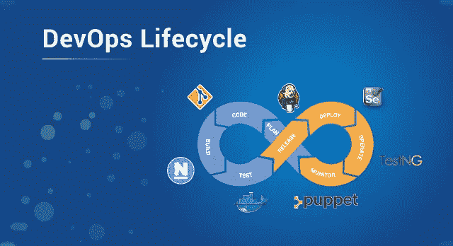
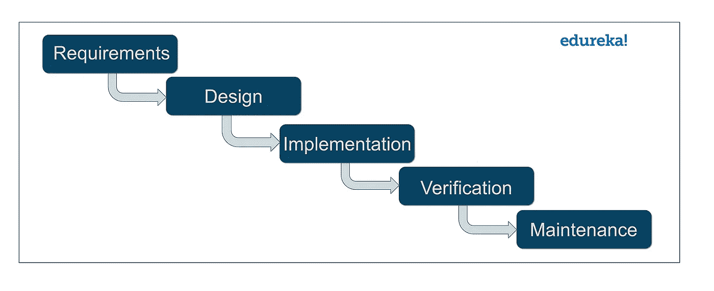
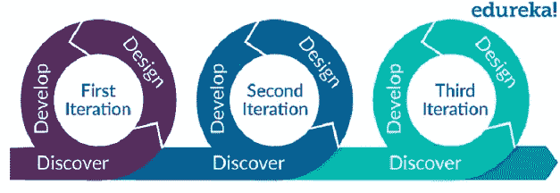
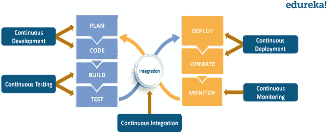
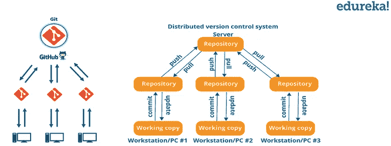
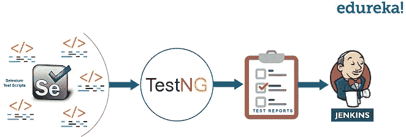
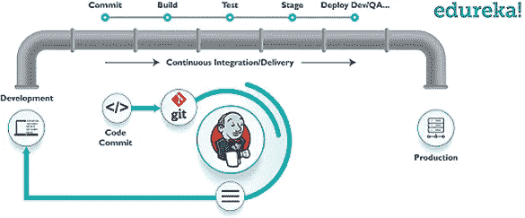
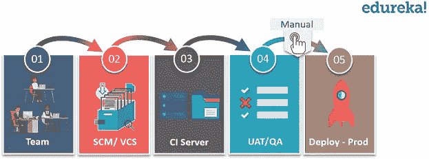

# DevOps 生命周期——探索 DevOps 生命周期的每个阶段

> 原文：<https://medium.com/edureka/devops-lifecycle-8412a213a654?source=collection_archive---------0----------------------->

Feature Image of DevOps Lifecycle — Edureka

许多来自软件行业的人可能对这个词略知一二。但是不了解 DevOps 的生命周期，你对 DevOps 的了解肯定是不完整的。因此，在本文中，我将尝试阐明 DevOps 的生命周期。

在本文中，我们将讨论以下主题:

1.  为什么是 DevOps？
2.  DevOps 是什么？
3.  DevOps 的生命周期是什么？

让我们开始讨论这个令人惊奇的话题。

# 为什么是 DevOps？

在我们知道 DevOps 是什么之前，了解 DevOps 是如何产生的是非常重要的。在 DevOps 之前，我们有用于软件开发的瀑布模型和敏捷模型。让我们来看看瀑布模型。

## 瀑布模型

瀑布模型可以定义为系统或软件开发中遵循自顶向下方法的顺序过程。这个模型是一个直截了当的线性模型。瀑布模型有不同的阶段，如需求定义、软件设计、实现、测试、部署和维护。

使用瀑布模型方法的软件开发公司不得不花费大量时间来使他们的产品正确。这是因为除非你完成了一个特定的阶段，否则你无法进入下一个阶段。此外，工作软件只是在这个模型的最后阶段才交付。

该模型仅适用于具有稳定需求的项目。所谓稳定，我的意思是需求不会随着时间而改变。但是在今天的世界里，这是一件不太可能的事情，因为需求一直在变化。这是瀑布模型的一些缺点。

## 敏捷方法

接下来是软件开发的敏捷方法。敏捷方法是一种实践，它在项目的整个软件开发生命周期中促进开发和测试的不断迭代。与瀑布模型不同，开发和测试活动是并发的。虽然敏捷方法为开发带来了敏捷性，但是在没有跟上敏捷实践的运营中却失去了敏捷性。

开发人员和操作工程师之间缺乏协作，这减缓了开发过程和发布。软件公司已经开始意识到团队之间更好的协作和更快的软件交付的需要。这就产生了 DevOps 方法。DevOps 实现了持续的软件交付，减少了要修复的复杂问题，加快了问题的解决。

# DevOps 是什么？

*   DevOps 一词由两个词组成，即开发和运营。DevOps 是一种实践，允许单个团队管理整个应用程序开发生命周期，即开发、测试、部署和操作。
*   DevOps 的目标是缩短系统的开发生命周期，同时根据业务目标频繁地交付特性、修复和更新。
*   DevOps 是一种软件开发方法，通过这种方法可以快速、可靠地开发出高质量的软件。它由持续开发、持续集成、持续测试、持续部署和持续监控等不同阶段组成。

# 什么是 DevOps 生命周期？

如前所述，持续开发、持续集成、持续测试、持续部署和持续监控等各个阶段构成了 DevOps 生命周期。现在让我们一个接一个地看看 DevOps 生命周期的每个阶段。

## 持续发展-

这是涉及软件“规划”和“编码”的阶段。项目的远景是在计划阶段决定的，开发人员开始为应用程序开发代码。没有计划所需的 DevOps 工具，但是有许多工具用于维护代码。

代码可以用任何语言编写，但是使用版本控制工具来维护。维护代码被称为源代码管理。最常用的工具是 Git、SVN、Mercurial、CVS 和 JIRA。此外，像 Ant、Maven、Gradle 这样的工具也可以在这个阶段使用，用于将代码构建/打包到可执行文件中，该文件可以转发到任何下一个阶段。

现在让我们试着了解更多关于 Git 的知识。

*   Git 是一个分布式版本控制工具，它通过为开发高质量软件提供数据保证来支持分布式非线性工作流。像 Git 这样的工具支持开发和操作团队之间的交流。
*   当您开发一个有大量协作者的大型项目时，在项目中进行更改时，协作者之间的交流非常重要。
*   Git 中的提交消息在团队交流中扮演着非常重要的角色。除了交流之外，使用 Git 最重要的原因是您总是随身携带代码的稳定版本。
*   因此，Git 在 DevOps 的成功中起着至关重要的作用。

## 持续测试-

这是对开发的软件不断进行错误测试的阶段。对于连续测试，使用自动化测试工具，如 **Selenium** 、 **TestNG** 、 **JUnit** 等。这些工具允许 QAs 完全并行地测试多个代码库，以确保在功能上没有缺陷。在这个阶段，Docker 容器可以用于模拟测试环境。

Selenium 进行自动化测试，报告由 TestNG 生成。在一个叫做 Jenkins 的持续集成工具的帮助下，整个测试阶段可以自动化。假设您用 Java 编写了一个 selenium 代码来测试您的应用程序。现在，您可以使用 ant 或 maven 构建这段代码。一旦构建了代码，就要进行用户验收测试(UAT)。使用 Jenkins 可以使整个过程自动化。

自动化测试为执行测试节省了大量的时间、精力和劳动，而不是手动执行。除此之外，报告生成是一大优势。评估测试套件中失败的测试用例的任务变得更加简单。我们还可以在预先定义的时间安排测试用例的执行。测试后，代码会不断地与现有代码集成。

## 持续集成-

这个阶段是整个 DevOps 生命周期的核心。这是一种软件开发实践，在这种实践中，开发人员需要更频繁地提交对源代码的更改。这可以每天或每周进行一次。然后构建每个提交，如果出现问题，这允许早期检测问题。构建代码不仅包括编译，还包括代码审查、单元测试、集成测试和打包。

支持新功能的代码不断与现有代码集成。由于软件的不断开发，更新的代码需要不断地、平稳地与系统集成，以向最终用户反映变化。

Jenkins 是这个阶段非常流行的工具。每当 Git 存储库中有变化时，Jenkins 获取更新的代码，并准备构建该代码，该代码是 war 或 jar 形式的可执行文件。然后，这个构建被转发到测试服务器或生产服务器。

## 持续部署-

这是将代码部署到生产服务器的阶段。确保代码正确部署在所有服务器上也很重要。在继续之前，让我们试着了解一些关于配置管理和容器化工具的事情。这些工具有助于实现连续部署(CD)。

配置管理是在应用程序的功能需求和性能中建立和维护一致性的行为。让我用更简单的话来说，它是将部署发布到服务器的行为，在所有服务器上安排更新，最重要的是保持所有服务器上的配置一致。

由于新代码是在连续的基础上部署的，配置管理工具在快速和频繁地执行任务中起着重要的作用。这里使用的一些流行工具是 Puppet、Chef、SaltStack 和 Ansible。

集装箱工具在部署阶段也发挥着同样重要的作用。Docker 和流浪者是用于此目的的流行工具。这些工具有助于在开发、测试、试运行和生产环境中实现一致性。除此之外，它们还有助于快速放大和缩小实例。

容器化工具有助于在开发、测试和部署应用程序的环境中保持一致性。使用这些工具，生产环境中不会出现错误/故障，因为它们打包并复制了开发/测试/试运行环境中使用的相同依赖项和包。它使您的应用程序易于在不同的计算机上运行。

## 持续监控-

这是 DevOps 生命周期的一个非常关键的阶段，在这个阶段，您需要持续监控应用程序的性能。这里记录了关于软件使用的重要信息。该信息被处理以识别应用的正确功能。诸如内存不足、服务器不可达等系统错误在此阶段得到解决。

任何问题的根本原因都在此阶段确定。它维护服务的安全性和可用性。此外，如果存在网络问题，它们也会在此阶段得到解决。一旦检测到问题，它会帮助我们自动修复问题。

这一实践包括操作团队的参与，他们将监控用户活动以发现系统的错误或任何不适当的行为。用于此的流行工具有 Splunk、ELK Stack、Nagios、NewRelic 和 Sensu。这些工具可以帮助您密切监控应用程序的性能和服务器，还可以让您主动检查系统的健康状况。

它们还可以提高生产率和系统的可靠性，从而降低 IT 支持成本。如果发现任何重大问题，都将报告给开发团队，以便在持续开发阶段进行修复。这导致问题的更快解决。

这些 DevOps 阶段在循环中连续进行，直到您达到所需的产品质量。因此，几乎所有主要的 IT 公司都转向 DevOps 来构建他们的产品。

如果你想查看更多关于人工智能、Python、道德黑客等市场最热门技术的文章，你可以参考 Edureka 的官方网站。

请留意本系列中的其他文章，它们将解释 DevOps 的各个方面。

> *1。* [*DevOps 教程*](/edureka/devops-tutorial-89363dac9d3f)
> 
> *2。* [*Git 教程*](/edureka/git-tutorial-da652b566ece)
> 
> *3。* [*詹金斯教程*](/edureka/jenkins-tutorial-68110a2b4bb3)
> 
> *4。* [*码头工人教程*](/edureka/docker-tutorial-9a6a6140d917)
> 
> *5。* [*Ansible 教程*](/edureka/ansible-tutorial-9a6794a49b23)
> 
> *6。* [*傀儡教程*](/edureka/puppet-tutorial-848861e45cc2)
> 
> *7。* [*厨师教程*](/edureka/chef-tutorial-8205607f4564)
> 
> *8。* [*Nagios 教程*](/edureka/nagios-tutorial-e63e2a744cc8)
> 
> 9。 [*如何编排 DevOps 工具？*](/edureka/devops-tools-56e7d68994af)
> 
> *10。* [*连续交货*](/edureka/continuous-delivery-5ca2358aedd8)
> 
> *11。* [*持续集成*](/edureka/continuous-integration-615325cfeeac)
> 
> *12。* [*连续部署*](/edureka/continuous-deployment-b03df3e3c44c)
> 
> *13。* [*连续交付 vs 连续部署*](/edureka/continuous-delivery-vs-continuous-deployment-5375642865a)
> 
> *14。* [*CI CD 管道*](/edureka/ci-cd-pipeline-5508227b19ca)
> 
> *15。* [*Docker 作曲*](/edureka/docker-compose-containerizing-mean-stack-application-e4516a3c8c89)
> 
> *16。* [*码头工人群*](/edureka/docker-swarm-cluster-of-docker-engines-for-high-availability-40d9662a8df1)
> 
> *17。* [*Docker 联网*](/edureka/docker-networking-1a7d65e89013)
> 
> *18。* [*天穹*](/edureka/ansible-vault-secure-secrets-f5c322779c77)
> 
> *19。* [*可担任的角色*](/edureka/ansible-roles-78d48578aca1)
> 
> *20。* [*适用于 AWS*](/edureka/ansible-for-aws-provision-ec2-instance-9308b49daed9)
> 
> *21。* [*詹金斯管道*](/edureka/jenkins-pipeline-tutorial-continuous-delivery-75a86936bc92)
> 
> *22。* [*顶级 Docker 命令*](/edureka/docker-commands-29f7551498a8)
> 
> *23。*[*Git vs GitHub*](/edureka/git-vs-github-67c511d09d3e)
> 
> *24。* [*顶级 Git 命令*](/edureka/git-commands-with-example-7c5a555d14c)
> 
> 25。 [*DevOps 面试问题*](/edureka/devops-interview-questions-e91a4e6ecbf3)
> 
> *26。* [*谁是 DevOps 工程师？*](/edureka/devops-engineer-role-481567822e06)
> 
> *27。*[*Git ref log*](/edureka/git-reflog-dc05158c1217)
> 
> 28。 [*不可预见的准备*](/edureka/ansible-provisioning-setting-up-lamp-stack-d8549b38dc59)
> 
> *29。* [*组织正在寻找的顶尖 DevOps 技能*](/edureka/devops-skills-f6a7614ac1c7)
> 
> 三十。 [*瀑布 vs 敏捷*](/edureka/waterfall-vs-agile-991b14509fe8)
> 
> *31。* [*Maven 用于构建 Java 应用*](/edureka/maven-tutorial-2e87a4669faf)
> 
> *32。* [*詹金斯小抄*](/edureka/jenkins-cheat-sheet-e0f7e25558a3)
> 
> *33。* [*易答备忘单*](/edureka/ansible-cheat-sheet-guide-5fe615ad65c0)
> 
> *34。* [*Ansible 面试问答*](/edureka/ansible-interview-questions-adf8750be54)
> 
> *35。* [*50 码头工人面试问题*](/edureka/docker-interview-questions-da0010bedb75)
> 
> *36。* [*敏捷方法论*](/edureka/what-is-agile-methodology-fe8ad9f0da2f)
> 
> *37。* [*詹金斯面试问题*](/edureka/jenkins-interview-questions-7bb54bc8c679)
> 
> *38。* [*Git 面试问题*](/edureka/git-interview-questions-32fb0f618565)
> 
> *39。* [*Docker 架构*](/edureka/docker-architecture-be79628e076e)
> 
> *40。*[*devo PS 中使用的 Linux 命令*](/edureka/linux-commands-in-devops-73b5a2bcd007)
> 
> *41。* [*詹金斯 vs 竹子*](/edureka/jenkins-vs-bamboo-782c6b775cd5)
> 
> *42。* [*Nagios 面试问题*](/edureka/nagios-interview-questions-f3719926cc67)
> 
> *43。* [*DevOps 实时场景*](/edureka/jenkins-x-d87c0271af57)
> 
> 44。 [*詹金斯和詹金斯 X 的区别*](/edureka/jenkins-vs-bamboo-782c6b775cd5)
> 
> *45。*[*Windows Docker*](/edureka/docker-for-windows-ed971362c1ec)
> 
> *46。*[*Git vs Github*](http://git%20vs%20github/)

> *原载于 2019 年 6 月 27 日*[*https://www.edureka.co*](https://www.edureka.co/blog/devops-lifecycle/)*。*