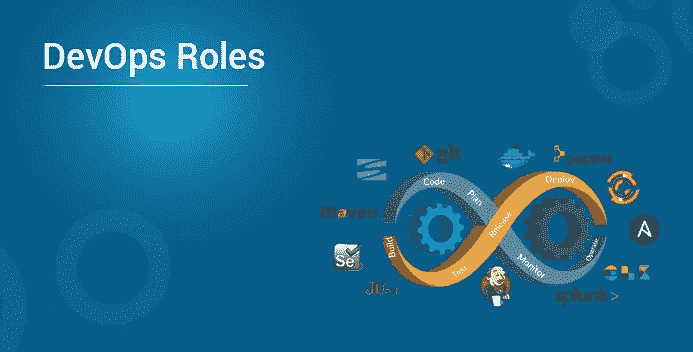
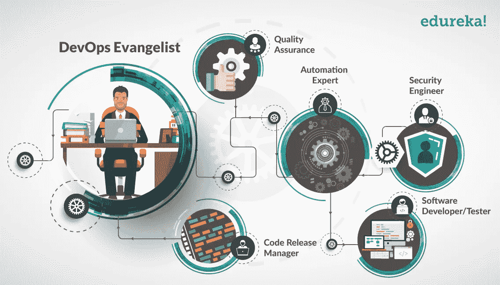

# DevOps 角色:哪一个是你的梦想？

> 原文：<https://medium.com/edureka/devops-roles-which-is-your-dream-e7bfc16ac68a?source=collection_archive---------7----------------------->

在 IT 专业人员迫切希望成为 DevOps 专家的时候，对于 DevOps 的各种角色仍有许多困惑。因此，这个博客致力于使实施 DevOps 的公司的团队结构更加清晰。

你可能经常听说，在 DevOps 中，每个人都扮演着一个共同的角色:DevOps，这是两种实践的高潮:*开发*和*运营*。但这与事实相去甚远。

实际上，DevOps 实践强调“开发”人员应该能够执行“运营”人员执行的任务，而“运营”人员应该能够执行“开发”人员执行的任务。

现在你知道 DevOps 专业人员是一个拥有多种技能的人，你是否也想知道，一个 DevOps 专业人员在他的组织中负责哪些不同的任务？如果是这样，请继续阅读。

要真正理解这个概念，你需要换个角度来看。如果你把自己放在一个实现 DevOps 的公司的位置上，那么就更容易理解它，因为你必须根据需求分配不同的 DevOps 角色。

让我首先列出各种角色及其描述。

1.  **DevOps 布道者**——负责实施 DevOps 的主要官员(领导)
2.  **发布经理** —发布新特性的人&确保发布后产品的稳定性
3.  **自动化专家** —负责实现自动化&工具编排的家伙
4.  **软件开发人员/测试人员**——实际开发代码并测试它的人
5.  **质量保证**——确保产品质量符合要求的人
6.  **安全工程师** —始终监控产品安全&健康的人

这里需要注意的重要一点是，很多这样的角色会涉及到一个专业团队，比如软件开发人员/测试人员、安全工程师、质量保证人员和 T21。所以你应该考虑这些角色的层次关系。

# DevOps 福音传道者

根据公司的要求，即使是自动化专家也可以有不止一个人来扮演这个角色。那么，让我来详细谈谈 DevOps 的每一个角色。

就像我之前提到的，这是 DevOps 中的关键角色。该角色由负责确保在产品的端到端开发中实施 DevOps 策略，同时为环境带来积极变化的领导或人员担任。

DevOps 布道者还找到了改进产品现有架构的方法，牢记各种可用的自动化工具以及“开发”和“运营”人员所具备的技能。管理其他 DevOps 角色并从团队中获得最大效率是他的主要目标。

# 发布经理

这个角色是产品交付中的关键角色，因为他需要将新的/更新的特性与现有的框架集成。这个角色可以是承担发布工程师角色的同一个人，也可以是领导发布工程师团队的发布经理。

这个角色的主要关注领域是从开发到部署协调和管理产品。因为这个角色以一种重要的方式参与进来，所以它应该由一个了解技术如何工作以及各种结构如何就位的技术人员(经理)来担当。

根据需求，将会有多个经理领导他们各自的团队处理多个特性(项目)。

# 自动化专家

这个角色的重要性不需要再强调了，因为 DevOps 完全是关于自动化的。作为自动化专家，这个角色应该能够理解什么可以自动化，以及一个产品堆栈如何与另一个产品堆栈集成。

这个角色也被称为*集成专家*，负责分析、设计和实施持续部署的策略，同时确保生产和预生产系统的高可用性。

# 软件开发人员/测试人员

这个角色负责软件的实际根级开发。传统的编码员和程序员属于这一类。除了开发，专业人员还负责测试代码。

名称可能保持不变，但是软件开发人员/测试人员的新角色极大地增加了职责范围，因为他们不仅负责将新的需求转化为代码，还负责单元测试、部署和持续的监控。

# 质量保证

这是 DevOps 中引入的新角色，实际上保证了产品的质量。通常也被称为经验保证，这个角色是超越传统测试和质量检查的一步。

在这里，产品的功能被测试到极限，以找出每个缺陷，并改善每个独立功能的不良表现，因为客户的体验很重要。这个角色总是在寻找机会来改进任何和每一个功能，以带来客户满意度。

# 安全工程师

安全工程师和其他任何角色一样重要，因为他们是监控产品可交付性的人。他们与开发人员并肩工作，在过程的更早阶段嵌入他们的建议(安全补丁)。

除了外部安全之外，他们还监控系统以检查其性能，报告系统面临的任何停机时间，并深入了解导致停机的原因。防止任何停机或安全风险再次发生是安全工程师的一项重要任务。

我希望到现在为止，您已经很好地理解了组织中可能存在的各种 DevOps 角色。

如果你想查看更多关于人工智能、Python、道德黑客等市场最热门技术的文章，你可以参考 Edureka 的官方网站。

请留意本系列中解释 DevOps 各个方面的其他文章。

> *1。* [*DevOps 教程*](/edureka/devops-tutorial-89363dac9d3f)
> 
> *2。* [*Git 教程*](/edureka/git-tutorial-da652b566ece)
> 
> *3。* [*詹金斯教程*](/edureka/jenkins-tutorial-68110a2b4bb3)
> 
> *4。* [*码头工人教程*](/edureka/docker-tutorial-9a6a6140d917)
> 
> *5。* [*Ansible 教程*](/edureka/ansible-tutorial-9a6794a49b23)
> 
> *6。* [*木偶教程*](/edureka/puppet-tutorial-848861e45cc2)
> 
> *7。* [*厨师教程*](/edureka/chef-tutorial-8205607f4564)
> 
> *8。* [*Nagios 教程*](/edureka/nagios-tutorial-e63e2a744cc8)
> 
> *9。* [*如何编排 DevOps 工具？*](/edureka/devops-tools-56e7d68994af)
> 
> *10。* [*连续交货*](/edureka/continuous-delivery-5ca2358aedd8)
> 
> *11。* [*持续集成*](/edureka/continuous-integration-615325cfeeac)
> 
> *12。* [*连续部署*](/edureka/continuous-deployment-b03df3e3c44c)
> 
> *13。* [*持续交付 vs 持续部署*](/edureka/continuous-delivery-vs-continuous-deployment-5375642865a)
> 
> *14。* [*CI CD 管道*](/edureka/ci-cd-pipeline-5508227b19ca)
> 
> 15。 [*码头工人撰写*](/edureka/docker-compose-containerizing-mean-stack-application-e4516a3c8c89)
> 
> 16。 [*码头工人群*](/edureka/docker-swarm-cluster-of-docker-engines-for-high-availability-40d9662a8df1)
> 
> *17。* [*Docker 联网*](/edureka/docker-networking-1a7d65e89013)
> 
> *18。* [*天穹*](/edureka/ansible-vault-secure-secrets-f5c322779c77)
> 
> 19。 [*可变角色*](/edureka/ansible-roles-78d48578aca1)
> 
> 20。 [*适用于 AWS*](/edureka/ansible-for-aws-provision-ec2-instance-9308b49daed9)
> 
> *21。* [*詹金斯管道*](/edureka/jenkins-pipeline-tutorial-continuous-delivery-75a86936bc92)
> 
> *22。* [*顶级 Docker 命令*](/edureka/docker-commands-29f7551498a8)
> 
> *23。*[*Git vs GitHub*](/edureka/git-vs-github-67c511d09d3e)
> 
> *24。* [*顶级 Git 命令*](/edureka/git-commands-with-example-7c5a555d14c)
> 
> *25。* [*DevOps 面试问题*](/edureka/devops-interview-questions-e91a4e6ecbf3)
> 
> *26。* [*谁是 DevOps 工程师？*](/edureka/devops-engineer-role-481567822e06)
> 
> *27。* [*DevOps 生命周期*](/edureka/devops-lifecycle-8412a213a654)
> 
> *28。*[*Git Reflog*](/edureka/git-reflog-dc05158c1217)
> 
> *29。*
> 
> **三十。* [*组织正在寻找的顶尖 DevOps 技能*](/edureka/devops-skills-f6a7614ac1c7)*
> 
> **30。* [*瀑布 vs 敏捷*](/edureka/waterfall-vs-agile-991b14509fe8)*
> 
> **31。* [*詹金斯小抄*](/edureka/jenkins-cheat-sheet-e0f7e25558a3)*
> 
> **32。**
> 
> **33。 [*Ansible 面试问答*](/edureka/ansible-interview-questions-adf8750be54)**
> 
> **34。 [*50 Docker 面试问题*](/edureka/docker-interview-questions-da0010bedb75)**
> 
> **35。 [*敏捷方法论*](/edureka/what-is-agile-methodology-fe8ad9f0da2f)**
> 
> ***36。* [*詹金斯面试问题*](/edureka/jenkins-interview-questions-7bb54bc8c679)**
> 
> **37。 [*Git 面试问题*](/edureka/git-interview-questions-32fb0f618565)**
> 
> **38。 [*Docker 架构*](/edureka/docker-architecture-be79628e076e)**
> 
> **39。[*devo PS 中使用的 Linux 命令*](/edureka/linux-commands-in-devops-73b5a2bcd007)**
> 
> ***40。* [*詹金斯 vs 竹子*](/edureka/jenkins-vs-bamboo-782c6b775cd5)**
> 
> ***41。* [*Nagios 教程*](/edureka/nagios-tutorial-e63e2a744cc8)**
> 
> ***42。* [*Nagios 面试问题*](/edureka/nagios-interview-questions-f3719926cc67)**
> 
> ***43。* [*DevOps 实时场景*](/edureka/jenkins-x-d87c0271af57)**
> 
> ***44。* [*詹金斯和詹金斯 X 的区别*](/edureka/jenkins-vs-bamboo-782c6b775cd5)**
> 
> ***45。*[*Docker for Windows*](/edureka/docker-for-windows-ed971362c1ec)**
> 
> ***46。*T80*Git vs Github***

***原载于 2018 年 2 月 1 日*[*https://www.edureka.co*](https://www.edureka.co/blog/devops-roles-which-is-your-dream/)*。***