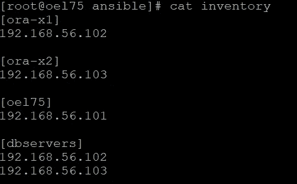

# DevOps 系列:使用 Ansible[GITHUB]为 RAC 自动安装 Oracle 19c RDBMS 软件—第二部分

> 原文：<https://medium.com/oracledevs/devops-series-automate-installation-of-oracle-19c-rdbms-software-for-rac-with-ansible-github-e018ebfe09d5?source=collection_archive---------1----------------------->

## 作者:[纳西姆·巴沙](https://medium.com/u/ba3f0a72ff81?source=post_page-----e018ebfe09d5--------------------------------)(甲骨文王牌总监，OCM)[莫诺瓦·穆库尔](https://medium.com/u/3757393c69bd?source=post_page-----e018ebfe09d5--------------------------------) (OCM)

【https://github.com/asiandevs/GI_19cSoftInstall】GITHUB 链接:

# **简介**

在[文章](/@monowar.mukul/devops-series-automate-oracle-19c-grid-infrastructure-installations-with-ansible-github-bc491bdd34ce)的第一部分，我们已经介绍了 Oracle RAC 19c 的安装，作为本文的一个序列，我们将了解如何使用 Ansible 安装 Oracle 19c RDBMS 软件安装。请注意，我们已经完成了与 Oracle 19c 网格基础设施相关的所有任务。

**主剧本的准备**

主剧本 oracleGInRAC19cR3.yml 是定义我们将要执行的角色。此剧的主动角色是 racdbsoft19c_install。

figure: master playbook entry

让我们得到这个角色的树形结构 racdbsoft19c_install —

Figure: role structure

这篇文章的库存结构是—

Figure: inventory

假设:

> Oracle GI 软件已安装
> 
> Oracle RAC 软件已经下载并转移。可以从甲骨文技术网网站或甲骨文软件交付云门户网站([https://www . Oracle . com/database/technologies/Oracle 19 c-Linux-downloads . html](https://www.oracle.com/database/technologies/oracle19c-linux-downloads.html))下载

> 两个节点(ora-x1 和 ora-x2)之间的 Oracle 用户 ssh 连接已建立并得到验证。

在行动手册的第一部分，我们将创建所需的目录，将 Oracle RAC 软件解压缩到目标数据库服务器，并创建一个静默响应文件来安装所有节点(在本例中为 ora-x1 和 ora-x2)。在本测试中，无声响应文件模板如下—

Figure: silent response file template

剧本的变量如下—

Figure: playbook variables

运行如下行动手册，安装 Oracle 19c RDBMS 软件。

Figure: RAC database pre-install

下一部分，我们将使用 Oracle 主目录中的静默响应文件安装 Oracle RAC 软件。然后，我们需要在集群中的所有节点上执行配置脚本(root.sh ),接受默认路径。

对于安装选项，我们选择“仅安装数据库软件”,使其与同时创建数据库分开。它让我们能够轻松地分析和解决任何问题。我们将在成功完成 Oracle RAC 软件安装后创建数据库。

对于本文，静默响应文件的参数值如下所示

> 安全更新屏幕
> —取消选择“我希望接收安全更新”
> 选择安装选项
> —仅安装数据库软件
> 网格安装选项
> —Oracle Real Application Clusters 数据库安装
> 选择节点列表屏幕
> —节点(ora-x1 和 orax-2)
> 选择产品语言
> —英语
> 选择数据库版本
> —企业版
> 指定安装位置
> —Oracle Base/u02/app/Oracle
> —软件位置/U6

Figure: Oracle RAC software install and execution

我们已经完成了 Oracle 19c RDBMS 安装，下一部分是验证 Oracle RDBMS 软件安装。

Figure: Validate Oracle RAC software install validate

# **总结**

我们已经使用 Ansible 完成了 Oracle RAC 软件 19cR3 的安装。与每次运行几个步骤相比，Ansible 通过一次执行使重复任务变得更加容易。这个剧本的源代码对于我们的测试设置来说是非常具体的。我已经上传并在 [Github](https://github.com/asiandevs/GI_19cSoftInstall) 中可用，现在是你玩的时候了。请确保相应地修改变量，并在应用 QA 或 PROD 系统之前测试开发环境。

享受自动化:)

参考:[安装 Oracle 数据库](https://docs.oracle.com/en/database/oracle/oracle-database/19/ladbi/installing-oracle-database.html#GUID-1B6E6CAF-1621-4DFE-A63A-C0C9C7642CAB)

# 作者简历

Monowar Mukul 目前是首席 Oracle 数据库专家。我是 Oracle 认证大师(Oracle 12c 认证大师管理、Oracle 12c 认证大师 MAA 和 Oracle 11g 认证大师管理)。他在 Oracle MAA 空间担任了 17 年的 Oracle 数据库管理员顾问，负责数据库云服务器和非数据库云服务器系统、Oracle 云空间和 SOA 中间件。他曾在澳大利亚的多个商业领域工作，包括高等教育、能源、政府、采矿和运输。作为一名首席 Oracle 数据库专家，他展示了高度发展的批判性思维和分析技能。你可以在 https://www.linkedin.com/in/monowarmukul/找到更多关于他和他的工作成就的细节

Nassyam Basha 是一名数据库管理员。他有大约十年的 Oracle 数据库管理员工作经验，目前是 eprosed KSA 公司的数据库专家。他拥有马德拉斯大学的计算机应用硕士学位。他是 Oracle 11g 认证大师和 Oracle ACE 总监。他以超级英雄的身份积极参与甲骨文相关论坛，如 OTN，甲骨文支持被授予“大师”称号，并担任 OTN 版主，与 OTN 一起撰写了大量关于 Toad World 的文章。他维护着一个与甲骨文技术相关的博客，www.oracle-ckpt.com[T3，可以通过 https://www.linkedin.com/in/nassyambasha/](http://www.oracle-ckpt.com/)[T5 联系到他](https://www.linkedin.com/in/nassyambasha/)