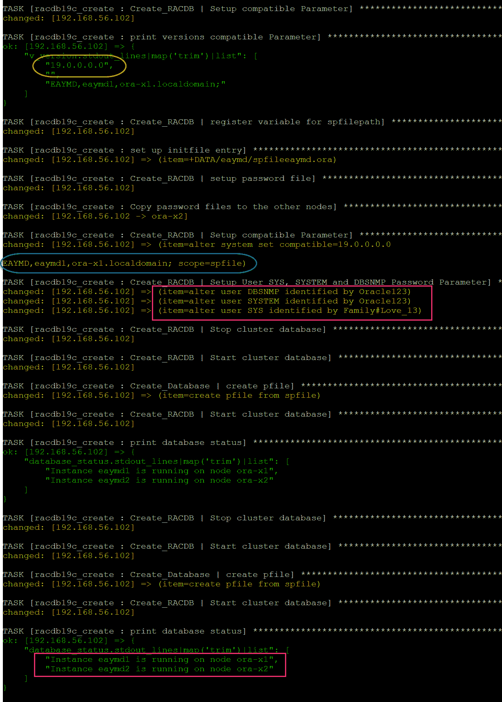

# DevOps 系列:使用 Ansible[GITHUB]自动化 Oracle 19c RAC 容器数据库—第三部分

> 原文：<https://medium.com/oracledevs/devops-series-automate-of-oracle-19c-rac-container-database-using-ansible-github-part-iii-279a7dfd0d13?source=collection_archive---------0----------------------->

## 作者:[纳西姆·巴沙](https://medium.com/u/ba3f0a72ff81?source=post_page-----279a7dfd0d13--------------------------------)(甲骨文王牌总监，OCM)[莫诺瓦·穆库尔](https://medium.com/u/3757393c69bd?source=post_page-----279a7dfd0d13--------------------------------) (OCM)

【https://github.com/asiandevs/GI_19cSoftInstall】GITHUB 链接:

```
Added - Oracle 21c - Github Repository and Video
```

[](https://github.com/asiandevs/oracle21c/tree/main/roles/racdb21c_create) [## Oracle 21 c/roles/racdb 21 c _ create at main Asian devs/Oracle 21 c

### 本行动手册适用于 Oracle 网格基础架构安装、Oracle RAC 安装和创建 RAC 数据库…

github.com](https://github.com/asiandevs/oracle21c/tree/main/roles/racdb21c_create) 

# **简介**

我们已经介绍了 Oracle 19c RAC/GI 软件的安装，然后介绍了用于 RAC 的 Oracle 19c RDBMS 软件。现在，在本文中，我们将看到如何为 RAC 创建带有可插拔数据库的容器数据库。

RAC 数据库是节点之间的主动-主动配置。RAC 数据库的主要优势是数据库的高可用性和极高的性能。借助 Ansible automation，我们可以减少人为错误，并且可以在多个集群上并行执行。

假设我们已经完成了

1.  [在两个节点上安装了 Oracle Grid Infrastructure 19c 软件](/@monowar.mukul/devops-series-automate-oracle-19c-grid-infrastructure-installations-with-ansible-bc491bdd34ce)
2.  [为两个节点的 RAC 安装了 Oracle RDBMS19c 软件。](/@monowar.mukul/devops-series-automate-oracle-19c-rac-database-software-installations-with-ansible-e018ebfe09d5)

控制服务器的清单文件包含我们正在执行部署的目标的主机名。

> [root@oel75 ansible]#卡特彼勒库存
> 【ora-x1】
> 192 . 168 . 56 . 102
> 
> 192.168.56.103
> 
> [oel75]
> 192
> 
> 192.168.56.102

让我们准备好下面的主剧本-

> [root @ oel 75 ansi ble]# cat Oracle ginrac 19 Cr 3 . yml
> -主机:ora-x1，ora-x2
> 用户:root
> 
> 角色:
> #-racgi 19 c _ install
> #-racdbsoft 19 c _ install
> #-racdb 12 c _ create
> -racdb 19 c _ create

此行动手册的活动角色是“racdb19c_create”，如果有任何其他角色，您可以将其注释掉。让我们来看看这个角色的树形结构


Figure: tree structure role

主要剧本任务如下。


Figure: main playbook entry

在预检查部分，我们将确保所有先决条件都通过，然后将通过 ansible 使用 DBCA 静默方法创建 RAC 容器数据库，最后我们将验证数据库创建。

请注意，在此步骤中，我们还将创建一个 RECO 磁盘组，用于恢复区。

在我们的案例中，响应文件根据我们的测试设置修改了参数值。

> [root @ oel 75 racdb 19 c _ create]# cat templates/db RAC 19 c _ RSP . J2
> response file version =/Oracle/assistants/rspfmt _ dbca _ response _ schema _ v 19 . 0 . 0
> gdb name = eaymd
> sid = eaymd
> databaseConfigType = RAC
> policy managed = false
> createServerPool = false
> createscontainerdatabase = TRUE
> number of pdbs = 1
> PD

以下是本练习中使用的变量。

> [root@oel75 ansible]# cat roles/racdb 19 c _ create/vars/main . yml
> Oracle _ user:" Oracle "
> root _ user:" root "
> Oracle _ install _ group:" oinstall "
> stage _ dir:"/u02/stage "
> Oracle _ base:"/u02/app/Oracle "
> Oracle _ inventory:"/u02/app/ora inventory "
> Oracle _ home:" { { Oracle _ base } }/product/19 . 3 . 0/db
> oratab:/etc/oratab
> spfile:spfile
> recodiskgroup:RECO
> recodisks 1:ASM _ disk 07
> recodisks 2:ASM _ disk 08
> vredundancy:EXTERNAL
> vausize:1
> v compatibility:19 . 0 . 0 . 0
> env _ db:
> ORACLE _ HOME:“{ { ORACLE _ HOME

剧本输出是—


Figure: pre check before create databse


Figure: create database output


Figure: Create database output



Figure: output — post db create

## RAC 数据库的验证

**检查 RAC 集群中 PDB 的当前实例状态**

SQL >显示 pdb

CON_ID CON_NAME 打开模式受限
————————
2 PDB＄SEED 只读 NO
3 PINKPDB 挂载

## 在 RAC 集群中启动创建的可插拔数据库

SQL > alter pluggable database pink pdb open instances = all；

可插拔数据库已更改。

SQL> select INST_ID，孔 _ID，DBID，名称，开放 _ 模式，受限于 gv$pdbs 其中 NAME = ' PINKPDB

INST_ID CON_ID DBID 姓名 OPEN _ MODE RES
——————————
1 3 1005581498 PINKPDB 读写号
2 3 1005581498 PINKPDB 读写号

# 摘要

我们已经使用 Ansible 完成了 Oracle 19cR3 RAC 集群容器数据库的创建。与每次运行几个步骤相比，Ansible 通过一次执行使重复任务变得更加容易。这个剧本的源代码对于我们的测试设置来说是非常具体的。我们已经上传并在 [Github](https://github.com/asiandevs/GI_19cSoftInstall) 中可用，现在是你玩它的时候了。请确保相应地修改变量，并在应用 QA 或 PROD 系统之前测试开发环境。

享受自动化:)

# 作者简历

Monowar Mukul 目前担任首席 Oracle 数据库专家。我是 Oracle 认证大师(Oracle 12c 认证大师管理、Oracle 12c 认证大师 MAA 和 Oracle 11g 认证大师管理)。他在 Oracle MAA 空间担任了 17 年的 Oracle 数据库管理员顾问，负责数据库云服务器和非数据库云服务器系统、Oracle 云空间和 SOA 中间件。他曾在澳大利亚的多个商业领域工作，包括高等教育、能源、政府、采矿和运输。作为一名首席 Oracle 数据库专家，他展示了高度发展的批判性思维和分析技能。你可以在[https://www.linkedin.com/in/monowarmukul/](https://www.linkedin.com/in/monowarmukul/)找到更多关于他和他的工作成就的细节

Nassyam Basha 是一名数据库管理员。他有大约十年的 Oracle 数据库管理员工作经验，目前是 eprosed KSA 公司的数据库专家。他拥有马德拉斯大学的计算机应用硕士学位。他是 Oracle 11g 认证大师和 Oracle ACE 总监。他以超级英雄的身份积极参与甲骨文相关论坛，如 OTN，甲骨文支持被授予“大师”称号，并担任 OTN 版主，与 OTN 一起撰写了大量关于 Toad World 的文章。他维护着一个与甲骨文技术相关的博客，[www.oracle-ckpt.com](http://www.oracle-ckpt.com/)，可以通过[https://www.linkedin.com/in/nassyambasha/](https://www.linkedin.com/in/nassyambasha/)找到他