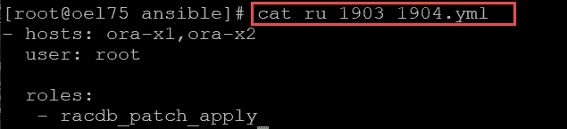
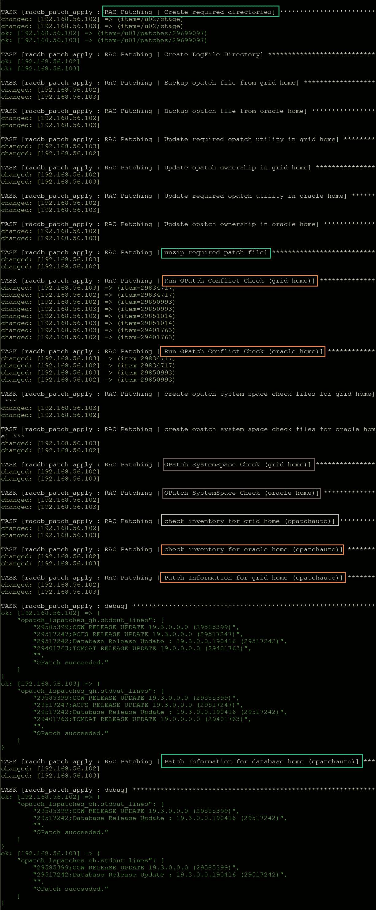
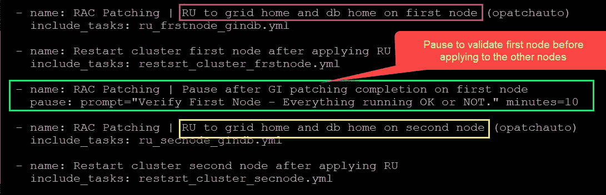
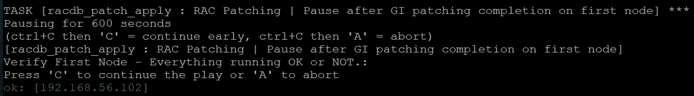
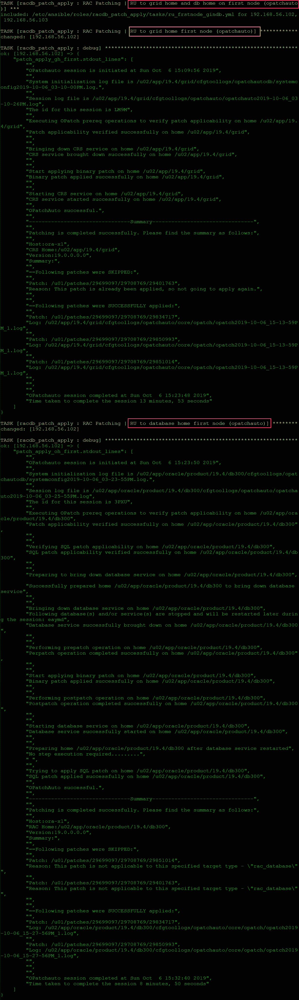
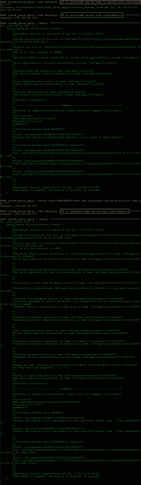
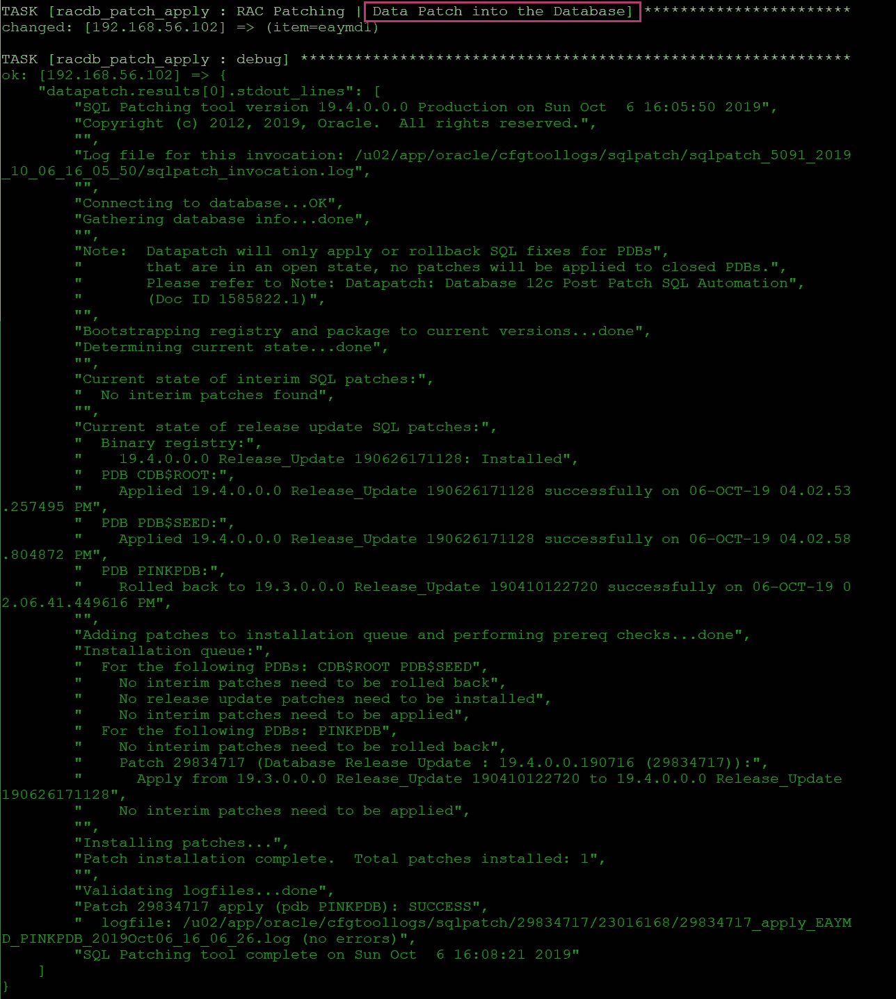
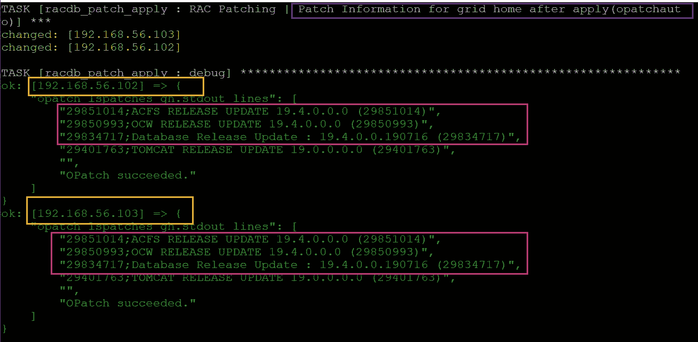
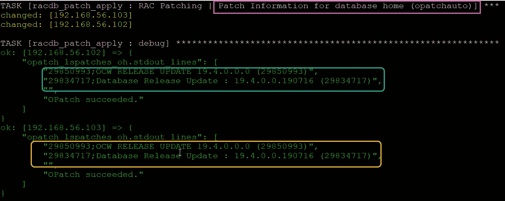

# DevOps 系列:使用 Ansible 自动将 Oracle 19c RAC 版本从 19.3 更新到 19.4—第四部分

> 原文：<https://medium.com/oracledevs/devops-series-automate-of-oracle-19c-rac-release-update-from-19-3-to-19-4-using-ansible-part-iv-475c1da7cf0e?source=collection_archive---------0----------------------->

## 作者:[纳西姆·巴沙](https://medium.com/u/ba3f0a72ff81?source=post_page-----475c1da7cf0e--------------------------------)(甲骨文王牌总监，OCM)[莫诺瓦·穆库尔](https://medium.com/u/3757393c69bd?source=post_page-----475c1da7cf0e--------------------------------) (OCM)

【https://github.com/asiandevs/GI_19cSoftInstall】GITHUB 链接:

# 介绍

作为关于使用 ansible 进行 RAC 的系列文章的一部分，在本文中，我们将了解如何自动将 Oracle 19c RAC 版本从 19.3 更新到 19.4，这是使用 Ansible 进行的最新版本更新。

**什么是安如？**

安如是一个*版本更新*，最初在 2017 年的 Oracle 12.2 中作为软件包补丁的替代或新名称引入，其中主动软件包补丁称为版本更新修订版。

(Oracle 数据库补丁示例 **29708769 — GI 版本更新 19.4.0.0.190716)**

假设我们在发布更新之前已经讨论了以下主题。

1.  [在两个节点上安装了 Oracle Grid Infrastructure 19c 软件](/@monowar.mukul/devops-series-automate-oracle-19c-grid-infrastructure-installations-with-ansible-bc491bdd34ce)
2.  [为两个节点的 RAC 安装了 Oracle RDBMS19c 软件。](/@monowar.mukul/devops-series-automate-oracle-19c-rac-database-software-installations-with-ansible-e018ebfe09d5)
3.  [使用 RAC 的可插拔数据库创建了一个容器数据库。](/@monowar.mukul/devops-series-automate-of-oracle-19c-rac-container-database-using-ansible-github-part-iii-279a7dfd0d13)

主剧本 ru_1903_1904.yml 有三个主要部分

Figure: role racdb_patch_apply

> 该角色的树形结构如下—
> 
> [root@oel75 ansible]# 树角色/racdb_patch_apply
> 角色/racdb_patch_apply
> ├──默认值
> │ └── main.yml
> ├──文件
> │ └── sqlpatchinfo.sql
> ├──任务
> │├──compile _ inv _ obj . yml
> │├──create _ dirs . yml
> │├──data patch _ DBS . yml
> │├──list _ DBS . yml
> │├o
> │├──start _ db _ withcrs . yml
> │├──start _ db _ withsqlplus . yml
> │├──unzip _ patch . yml
> │├──update _ opatch . yml
> │└──verify _ patch _ apply . yml
> ├──templates
> │├──patch _ list _ db home . txt . J2
> │└──patch _ list _ gihome . txt . J2
> ή
> 
> 5 个目录，25 个文件

对于本文，变量使用如下—

> [root @ oel 75 ansi ble]# cat roles/racdb _ patch _ apply/vars/main . yml
> ——
> 
> Oracle _ user:" Oracle "
> Oracle _ install _ group:" oinstall "
> ora inventory:/u02/app/ora inventory
> patch _ unzipdir:"/u01/patches "
> patch _ dir:"/u01/patched/{ { patch id } } "
> patch _ dir:"/u01/patched/{ { gipatch id } } "
> patch id:" 2969097 "
> git

该职位的主要薪酬如下—

> [root @ oel 75 ansi ble]# cat roles/racdb _ Patch _ Apply/tasks/main . yml
> —
> # # # # # # # # # # # # # # # # # # # # # # # # # # # # # # # # # # # # # # # # # # # # # # # # # # #总结步骤:
> #假设:
> # —下载并暂存所需补丁【例:本例补丁暂存目录】
> # —本例我们
> 
> - name:在应用前运行前置任务
> include:prepatch _ apply . yml
> tags:pre _ tasks _ before _ apply
> 
> - name: RAC 打补丁| RU 到第一个节点上的网格主目录和数据库主目录(opatch auto)
> include _ tasks:RU _ frst node _ gindb . yml
> 
> - name:应用 RU
> include _ tasks:rest SRT _ cluster _ frst node . yml 后重新启动集群第一个节点
> 
> - name: RAC 修补|在第一个节点上完成 GI 修补后暂停
> pause: prompt= "验证第一个节点-是否一切运行正常。"分钟=10
> 
> - name: RAC 修补| RU 到第二个节点上的网格主目录和数据库主目录(opatch auto)
> include _ tasks:RU _ sec node _ gindb . yml
> 
> - name:应用 RU
> include _ tasks:rest SRT _ cluster _ sec node . yml 后重新启动集群第二个节点
> 
> -名称:补丁后运行后期任务
> 包含:postpatch_apply.yml
> 标签:post_tasks_after_apply
> 
> - name:删除舞台目录
> remote _ user:" { { root _ user } } "
> 文件:
> 路径:" {{ item }}"
> 状态:缺席
> with _ items:
> —" { { stage _ dir } } "
> 
> -name:display post GI RU message
> debug:
> msg:
> -This completed below task for RAC Database at { { ansi ble _ date _ time . iso 8601 } }:'
> -the Oracle Database Patch-GI Release Update OF Oracle 19.3 to 19.4 task completed '
> -the END OF ALL:git repository OF " GI _ RU _ 1903 _ 1904 "将被共享

我们分为三个主要部分，第一个先决条件任务，第二个部分主要用于应用补丁，第三个部分用于数据修补和补丁后验证。

第一节:

本节包括安装 O **racle 数据库补丁的所有先决条件任务。**

**先决条件** :
i)确保您已经按照自述文件下载了最新的 OPatch 和所需的数据库补丁(对于本文，我们使用了 Oracle 数据库补丁 29708769——GI 发布更新 19.4.0.0.190716)。
ii)确认 Oracle 库存正常。
iii)解压缩下载的补丁 zip 文件。执行冲突检查器来检测和解决任何冲突。

> [root @ oel 75 tasks]# cat prepatch _ apply . yml
> —
> # # # # # # # # # # # # # # # # # # # # # # # # # # # # # # # # # # # # # # # # # # # # # # #总结步骤:
> #假设:
> # —下载并暂存所需补丁【例:本例补丁暂存目录】
> # —本例我们为非滚动和 GI home 和 RAC 打补丁 OPatch 系统空间检查
> ## # # # # # # # # # # # # # # # # # # # # # # # # # # # # # # # # # # # # # # # # # # # # # # # #名称:应用 Oracle GI RU 的准备任务
> 块:
> —导入任务:create_dirs.yml
> —导入任务:update_opatch.yml
> —导入任务:unzip_patch.yml
> —导入 _ 导入

请阅读每个顶级子目录中标识类型(DB 或 OJVM)的 README.html 文件。

Figure: First section output

第二节:

本节包括将补丁程序应用到 oracle GI 和数据库主目录，并在每个节点完成时重新启动集群。在应用到其他节点之前，我已经使用了暂停模块来验证修补的 home。

Figure: second section of playbook

节点一上的 GI 和数据库主目录的补丁程序完成后，暂停模块输出如下——在对其他节点应用补丁程序之前，我们需要按照提示继续或取消。

**文章提示**

对于这个特定的补丁，我已经使用了以下任务作为第二个节点的 oui-patch.xml，在只为第二个节点修补 GI home 之后，它得到如下错误消息——

> OPATCHAUTO-68061:业务流程引擎失败。
> OPATCHAUTO-68061:编排引擎失败，返回代码为 1
> 。
> OPatchAuto 失败。
> —
> opatch auto 失败，错误代码为 42

在主节点上更改文件 oui-patch.xml 的权限后，问题得到了解决。

> 名称:避免问题 OPATCHAUTO-68061 和 OPATCHAUTO 失败，错误代码为 42
> 当:inventory _ hostname in groups[' ora-x2 ']
> remote _ user:" { { root _ user } } "
> become:yes
> shell:" chmod 660 { { ora inventory } }/contents XML/oui-patch . XML "
> register:cluster _ stop

Figure: first node GI and Oracle home output

Figure: Apply patch output Second Node GI and Oracle home

第三部分:

这个部分有运行数据库的数据补丁，包括验证网格基础设施和数据库主目录的应用补丁。

> [root @ oel 75 tasks]# cat post Patch _ Apply . yml
> —-
> # # # # # # # # # # # # # # # # # # # # # # # # # # # # # #总结步骤:
> # 1)应用数据补丁
> # 2)编译无效数据库对象
> # 2)验证应用的补丁或 RU
> # # # # # # # # # # # # # # # # # # # # # # # # # # # # # # # —名称:RAC
> 
> - name: RAC 修补|使用 sqlplus 启动数据库
> include _ tasks:Start _ db _ withsqlplus . yml
> 
> - name: RAC 修补|应用数据补丁 CDB
> include _ tasks:data patch _ DBS . yml
> 
> - name: RAC 修补|编译无效的数据库对象
> include _ tasks:Compile _ inv _ obj . yml
> 
> - name: RAC 修补|使用 srvctl 启动数据库
> include _ tasks:Start _ db _ with CRS . yml
> 
> - name: RAC 修补|验证应用的修补程序
> include _ tasks:verify _ patch _ apply . yml

数据库剧本任务输出如下—

Figure: Datapatch output

Figure: postpatch output of Oracle GI home

Figure: post patch output for database home

# 摘要

我们已经使用 Ansible 成功完成了 RAC 的发布更新(示例 Oracle 数据库补丁 **29708769 — GI 发布更新 19.4.0.0.190716)** 。与每次运行许多步骤相比，Ansible 通过一次执行使重复任务变得更加容易。这个剧本的源代码对于我们的测试设置来说是非常具体的。我们已经上传并在 [Github](https://github.com/asiandevs/GI_19cSoftInstall) 中可用，现在是你玩它的时候了。请确保相应地修改变量，并在应用 QA 或 PROD 系统之前测试开发环境。

享受自动化:)

参考: [**自述为 29708769**](https://updates.oracle.com/Orion/PatchDetails/view_readme?plat_lang=197P&patch_file=&file_id=&password_required=&password_required_readme=&merged_trans=&aru=23012911&patch_num=29708769&patch_num_id=3526371&default_release=600000000101150&default_plat_lang=197P&default_compatible_with=&patch_password=&orderby=&direction=&no_header=0&sortcolpressed=&tab_number=)

# 作者简历

Monowar Mukul 目前是首席 Oracle 数据库专家。我是 Oracle 认证大师(Oracle 12c 认证大师管理、Oracle 12c 认证大师 MAA 和 Oracle 11g 认证大师管理)。他在 Oracle MAA 空间担任了 17 年的 Oracle 数据库管理员顾问，负责数据库云服务器和非数据库云服务器系统、Oracle 云空间和 SOA 中间件。他曾在澳大利亚的多个商业领域工作，包括高等教育、能源、政府、采矿和运输。作为一名首席 Oracle 数据库专家，他展示了高度发展的批判性思维和分析技能。你可以在[https://www.linkedin.com/in/monowarmukul/](https://www.linkedin.com/in/monowarmukul/)找到关于他和他的工作成就的更多细节

Nassyam Basha 是一名数据库管理员。他拥有十多年的 Oracle 数据库管理员经验，目前是 eprosed KSA 公司的数据库专家。他拥有马德拉斯大学的计算机应用硕士学位。他是 Oracle 11g 认证大师和 Oracle ACE 总监。他以超级英雄的身份积极参与甲骨文相关论坛，如 OTN，甲骨文支持被授予“大师”称号，并担任 OTN 版主，与 OTN 一起撰写了大量关于 Toad World 的文章。他维护着一个与甲骨文技术相关的博客，www.oracle-ckpt.com[T3，可以通过 https://www.linkedin.com/in/nassyambasha/](http://www.oracle-ckpt.com/)[T5 联系到他](https://www.linkedin.com/in/nassyambasha/)