# DevOps 系列:使用 Ansible [GITHUB]自动化 Oracle 19c 网格基础设施安装—第一部分

> 原文：<https://medium.com/oracledevs/devops-series-automate-oracle-19c-grid-infrastructure-installations-with-ansible-github-bc491bdd34ce?source=collection_archive---------0----------------------->

## 作者:[纳西姆·巴沙](https://medium.com/u/ba3f0a72ff81?source=post_page-----bc491bdd34ce--------------------------------)(甲骨文王牌总监，OCM)[莫诺瓦·穆库尔](https://medium.com/u/3757393c69bd?source=post_page-----bc491bdd34ce--------------------------------) (OCM)

【https://github.com/asiandevs/GI_19cSoftInstall】GITHUB 链接:

```
[**21c : Github Repository**](https://github.com/asiandevs/oracle21c/tree/main/roles) **+** [**21c Grid Infrastructure Install video**](https://youtu.be/UrbONJm9SEk)
```

[](https://github.com/asiandevs/oracle21c/tree/main/roles/racgi21c_install) [## Oracle 21c/roles/racgi 21c _ install at main Asian devs/Oracle 21c

### 本行动手册适用于 Oracle 网格基础架构安装、Oracle RAC 安装和创建 RAC 数据库…

github.com](https://github.com/asiandevs/oracle21c/tree/main/roles/racgi21c_install) 

# **简介**

网格基础设施(GI)是 Oracle 实时应用集群(RAC)的基础。这是一个包含集群件和 ASM 二进制文件的软件。在安装 Oracle RDBMS 软件之前，必须安装 GI。它由一些额外的进程组成，这些进程允许参与的群集节点进行通信，并向客户端提供统一的映像。Oracle RAC 基于集群技术工作。群集是一组两个或更多相似的连接服务器，对最终用户和应用程序来说，它们就像一个实体，提供高可用性和可伸缩性。在准备网格基础设施安装时，需要满足几个要求。

在本文中，我们将使用 Ansible 在 Oracle Linux 7.5 上为两个节点自动部署 Oracle 19c 网格基础设施。对于本文，在运行 ansible-playbook 之前，已经完成了 [Oracle Grid Infrastructure 安装清单](https://docs.oracle.com/en/database/oracle/oracle-database/19/cwlin/oracle-grid-infrastructure-installation-checklist.html#GUID-71A93E07-7E50-449C-B425-02F04A2EA8E6)中的以下先决任务。

*1。用于 RAC 设置的服务器已准备就绪*

网格基础设施安装过程的第一步是用操作系统和硬件的配置设置至少两台服务器。对于本文，已经设置了两个独立的服务器，节点名分别为 ora-x1 和 ora-x2。

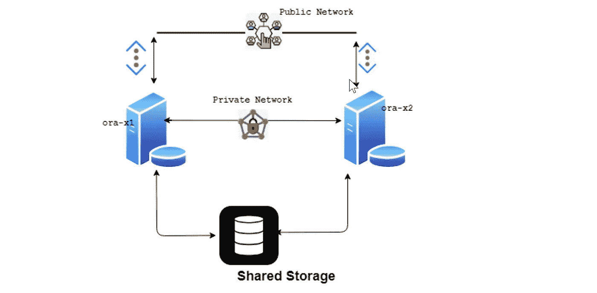

Figure: 2-node Rac CLuster

本文假设您已经为 RAC 安装设置了两台独立的服务器。如果您需要设置 Oracle Linux 以安装 Oracle 软件，请使用以下 Github 存储库:[Asian devs/Oracle Linux setup](https://github.com/asiandevs/oraclelinuxsetup)—此存储库有助于设置 Oracle Linux 服务器以安装 Oracle 数据库软件。

操作系统版本是 Oracle Linux 7.5

> [root @ ora-x1 ~]# cat/etc/OS-release
> NAME = " Oracle Linux Server "
> VERSION = " 7.5 "
> ID = " ol "
> VERSION _ ID = " 7.5 "
> PRETTY _ NAME = " Oracle Linux Server 7.5 "

*2。确保网络设置完成*

每个节点必须至少有两个网卡。*公共网络接口*是标准的网络连接，它将服务器链接到网络中的所有其他计算机，以支持 TCP/IP。*专用网络接口*通常是不可路由的专用网络连接，仅由集群内的服务器共享，以支持 UDP(用户数据报协议)。

需要设置/etc/hosts 文件，其中包含本地主机和 Internet 网络中其他主机(VIP 和 SCAN)的 Internet 协议(IP)主机名和地址。对于本文，两个节点的/etc/hosts 文件条目如下所示。

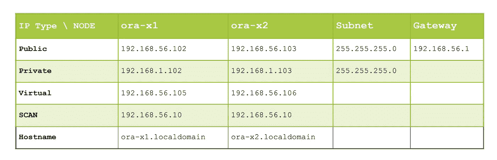

Figure: hosts file entry

虚拟 IP 和扫描 IP 未分配给任何物理设备，也没有子网或网关可以分配给它们。它有助于负载平衡，并在一个节点停机时使应用程序对其他节点可用。

扫描 IP 应该可以从群集的所有节点访问，而不是特定于某个节点。它允许客户端连接到数据库，而不管服务位置在哪里。在我们的测试实验室中，因为没有配置 DNS 服务器，所以对扫描侦听器使用单个 IP 地址。

3.确保磁盘可用于 ASM 磁盘组

磁盘本质上应该是共享的，*它们将用于创建 ASM 磁盘组，这允许多个数据库实例在不同的服务器上运行。它确保如果任何服务器节点出现故障，所有剩余的节点将继续访问所有资源。*

> [root @ ora-x1 app]# Oracle ASM list disks
> ASM _ disk 01
> ASM _ disk 02
> ASM _ disk 03
> ASM _ disk 04
> ASM _ disk 05
> ASM _ disk 06
> ASM _ disk 07
> ASM _ disk 08

*4。Oracle GI 软件安装的系统要求已经就绪*
我们的行动手册有一项任务是设置所需的 Linux 内核参数和必要的软件包，主要是编译器、链接器和兼容性库。

Oracle 建议每个节点使用 8 GB 物理内存
有关更多信息，请查看 Oracle 19c 网格基础设施安装指南

[https://docs . Oracle . com/en/database/Oracle/Oracle-database/19/cwlin/Oracle-grid-infra structure-installation-check list . html # GUID-71 a93 e 07-7e 50-449 c-B425-02 f 04 a2 ea 8 e 6](https://docs.oracle.com/en/database/oracle/oracle-database/19/cwlin/oracle-grid-infrastructure-installation-checklist.html#GUID-71A93E07-7E50-449C-B425-02F04A2EA8E6)

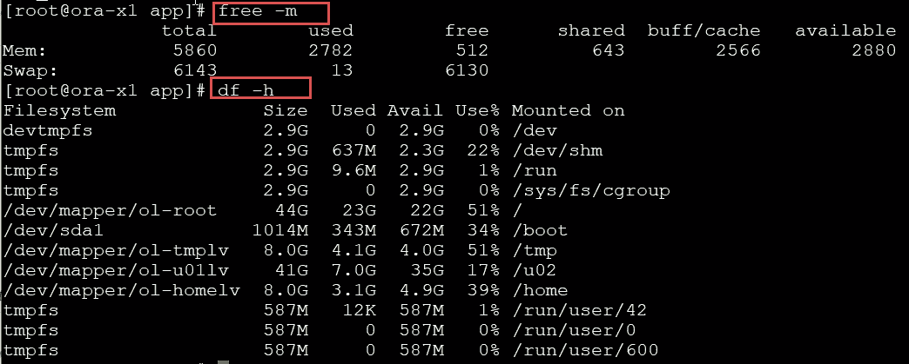

OS Memory and storage capacity

*5。所需的操作系统组和用户已经到位*

*   在每个节点上创建一个 Oracle 软件清单组(oinstall ),以及安装 Oracle GI 所需的其他操作系统组。

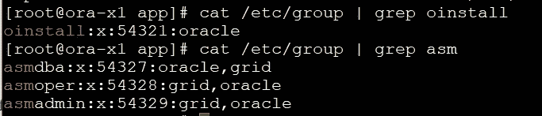

Figure: OS Group

在每个节点上创建 oracle 软件所有者，对于 GI 是网格用户，对于 RAC 是 Oracle 用户。每个节点上的用户 ID 必须一致，并且库存组必须是主要组。

*6。SSH 用户等效性*

SSH 用户认证是在所有集群节点上为网格用户建立的。

*7。下载甲骨文软件*

从下面的链接下载 oracle 软件，并转移到软件目录—
T5 https://www . Oracle . com/database/technologies/Oracle 19 c-Linux-downloads . html

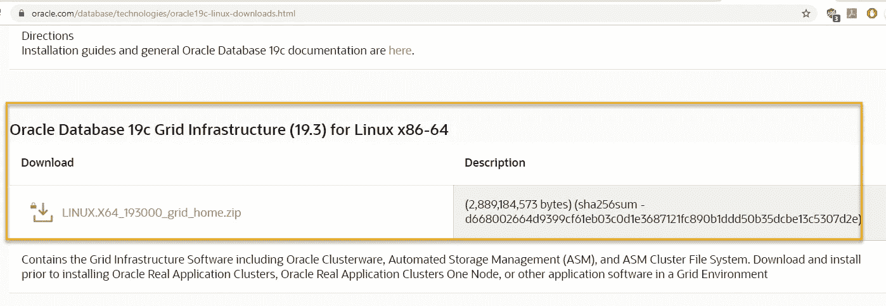

安装 oracle GI 的主要行动手册是“oracleGInRAC19cR3.yml ”,其中我们称之为角色— racgi19c_install

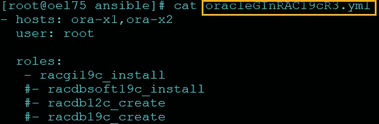

该角色的树形结构如下

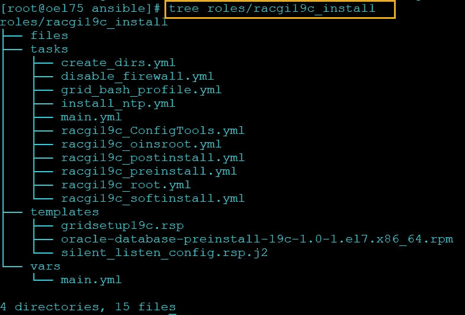

Figure: Tree structure of the role

我们将要执行的剧本的变量如下-

> [root @ oel 75 ansi ble]# cat roles/racgi 19 c _ install/vars/main . yml
> Oracle _ user:" Oracle "
> software _ dir:"/u01/stage "
> Oracle _ install _ group:" oinstall "
> root _ dir:"/u02 "
> stage _ dir:"/u02/stage "
> grid _ home:/u02/app/19 . 3 . 0/grid
> grid _ base:/
> DBA _ grp:DBA
> oper _ grp:DBA
> osasm _ grp:DBA
> # # # # # C 段—SCAN # # # # # # # # #
> SCAN _ name:racdb 01—SCAN
> SCAN _ port:1521
> # # # # D 段—CLUSTER&GNS # # # # # # # # #
> ClusterConfigu _ Type:STANDALONE
> cluster name:racdb 01
> vscan name:" { { vclusterName } }-scan "
> vscan Port:1521
> node 1 _ FQ _ hostname:ora-x1 . local domain
> node 1 _ FQ _ VIP name:ora-x1-VIP . local domain
> node 2 _ FQ _ hostname:ora-x2 . local domain
> node 2 _ FQ _ VIP name:ora-x2 }}1、{{ asmdiskpre }}2、{{ asmdiskpre }}3、{{ asmdiskpre }}4、{{ asmdiskpre }}5、{ { asmdiskpre } } 6 '
> DG _ au:1
> asmdiskDiscoveryString:"/dev/Oracle ASM/disks "
> disk _ discstr:"/dev/Oracle ASM/disks/* "

主剧本定义了以下任务—

> [root @ oel 75 ansi ble]# cat roles/racgi 19 c _ Install/tasks/main . yml
> —-
> # = = = = = = = = = = = = = = = = = = = = = = = = = = = = = = = = = = = = = =
> #仅安装 Oracle Grid infra structure(GI)19 . 3 . 0 软件:
> #假设:
> # —配置两台独立的机器(示例— Ora-X1 和 Ora-x2)
> #—所有必需的操作系统组和用户均已就位
> # —必要的网络设置 (2)解压后的 Oracle GI 软件
> # (3)创建静默安装的响应文件
> # (4)仅在静默模式下安装 Oracle GI 19.3.0 软件
> # (5)运行必要的 root 脚本
> # = = = = = = = = = = = = = = = = = = = = = = = = = = = = = = = = = = = = = = = = = = = = = = = = = = = = = = = = = = = = = = = = = = = = = = = = = = = = = =
> -名称:显示 Oracle GI 软件预安装消息
> 调试:【T17
> 
> -名称:安装 Oracle GI 软件的准备任务
> block:
> —import _ tasks:create _ dirs . yml
> —import _ tasks:install _ NTP . yml
> —import _ tasks:racgi 19 c _ pre install . yml
> become:yes
> become _ user:root
> tags:
> —GI soft _ pre tasks
> 
> -名称:使用 Ansible
> 安装 Oracle GI 软件 block:
> —import _ tasks:racgi 19 c _ soft Install . yml
> —import _ tasks:racgi 19 c _ oins root . yml
> —import _ tasks:racgi 19 c _ root . yml
> 成为:是
> 成为 _ 用户:root
> 
> - name: Post Oracle GI 安装任务
> block:
> —import _ tasks:racgi 19 c _ config tools . yml
> —import _ tasks:racgi 19 c _ Post install . yml
> 成为:是
> 成为 _ 用户:root
> 
> - name:删除 stage 目录
> remote _ user:" { { root _ user } } "
> 文件:
> 路径:" {{ item }}"
> 状态:缺席
> with _ items:
> —" { { stage _ dir } } "
> 
> -name:display post Install message
> debug:
> msg:
> —' This Steps completed below task for Single Instance at { { ansi ble _ date _ time . iso 8601 } }:'
> —'-Install Oracle Grid infra structure 19c on two node RAC cluster ora-x1 and ora-x2 '
> —'-END OF ALL:git repository GI _ 19c soft Install 将共享'

主要有三个部分。

第一节:

本节包括为安装 Oracle GI 做准备的所有安装前任务

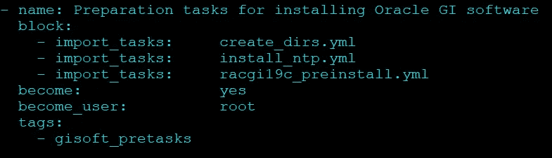

Figure: main tasks — first section

*   为 Oracle 网格基础架构创建所需的目录
*   操作系统配置的网络时间协议(NTP)
*   配置 19c 网格软件响应文件
*   将 Oracle 19c GI 软件从控制服务器解包到受管服务器。
*   安装集群验证实用程序 rpm，并运行 CRS 安装的集群验证检查

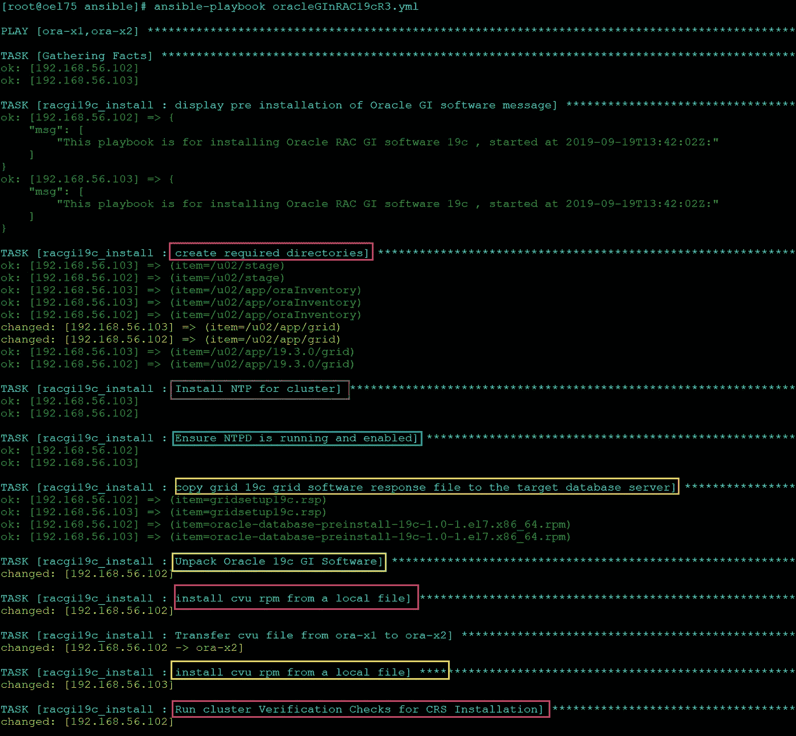

Figure: Playbook output for the first section

第二节:

本节的任务是通过使用静默响应文件从 Grid Control 主目录运行 gridSetup.sh 并执行根脚本来安装网格基础设施。

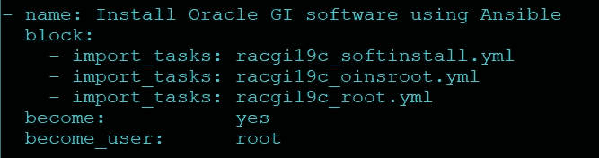

Figure: Tasks block second section

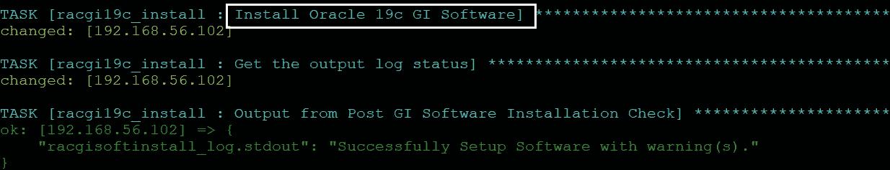

Figure: output of GI software install

然后，我们需要执行第一个脚本 orainstRoot.sh，它首先设置清单设置，然后执行第二个脚本 Root.sh，它设置 Oracle Grid Infrastructure 主目录中文件的权限，配置集群，并启动 Oracle Clusterware 资源。

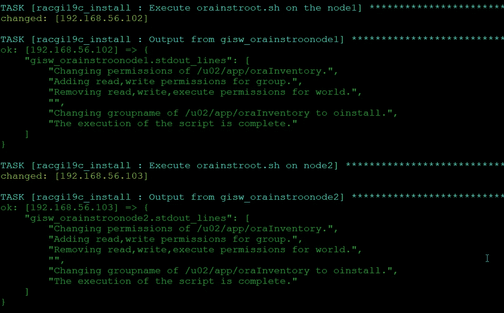

Figure: output of orainstroot.sh for both nodes

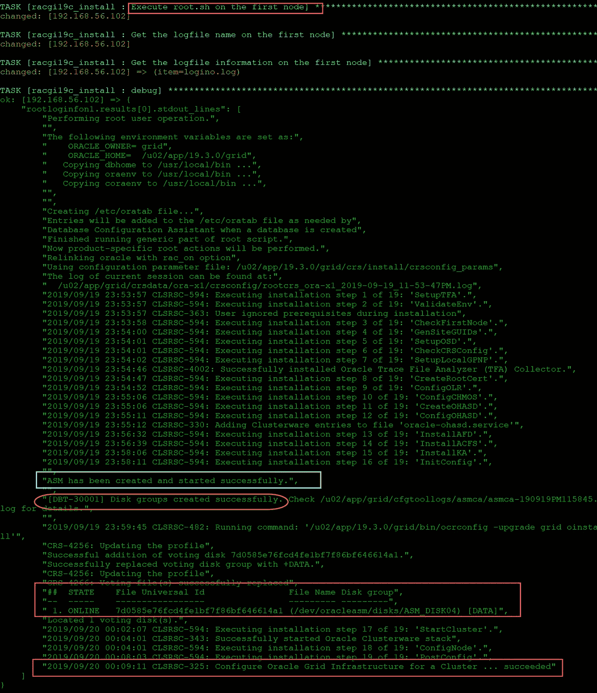

Figure: root.sh output — first node

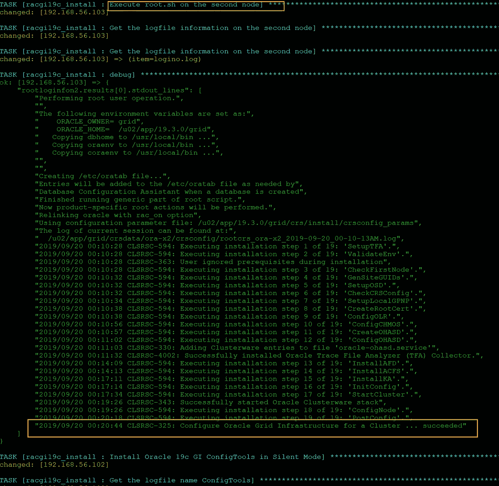

Figure: root.sh second node

第三部分:

本节包含使用静默响应文件的 executeConfigTools 的 gridSetup.sh 任务。

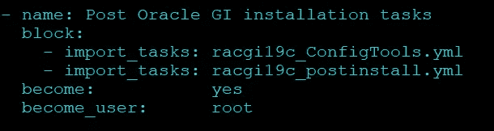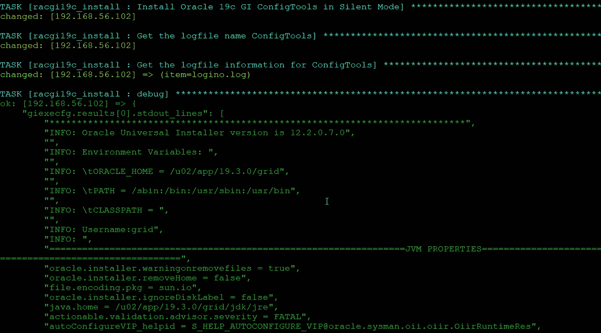

Figure: initial log part of GI config setup

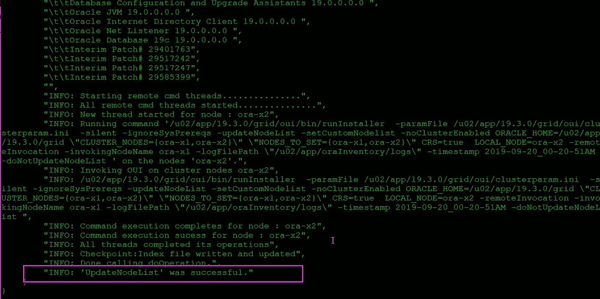

Figure: Last part of GI config section

**岗位任务**

这个阶段还用于验证网格基础设施安装
——检查集群的状态
——确认所有集群和本地资源都已启动并运行。
-检查 ASM 集群模式
-更新网格用户 bash 配置文件

> [root @ oel 75 tasks]# VI racgi 19 c _ post install . yml
> 
> -debug:var = CRS CTL _ RES stat . stdout _ lines
> when:inventory _ hostname in groups[' ora-x1 ']
> 
> - name:检查集群状态
> when:inventory _ hostname in groups[' ora-x1 ']
> remote _ user:" { { root _ user } } "
> become:yes
> become _ user:" { { grid _ user } } "
> shell:" { { grid _ home } }/bin/CRS CTL Check cluster-all "
> register:cluster _ stat
> 
> -debug:var = cluster _ stat . stdout _ lines
> when:inventory _ hostname in groups[' ora-x1 ']
> 
> -name:Check ASM cluster mode
> when:inventory _ hostname in groups[' ora-x1 ']
> remote _ user:" { { root _ user } } "
> become:yes
> become _ user:" { { GRID _ user } } "
> action:shell export GRID _ HOME = { { GRID _ HOME } }；{ { grid _ home } }/bin/ASM cmd showclustermode
> 寄存器:asmcluster_mode
> 
> -debug:var = ASM cluster _ mode . stdout _ lines
> when:inventory _ hostname in groups[' ora-x1 ']
> 
> -name:bash _ profile for user grid
> become:yes
> become _ user:" { { grid _ user } } "
> block infile:
> path:/home/grid/。bash _ profile
> insert after:' # # # # # # for grid # # # # '
> state:present
> block:|
> export PATH = $ PATH:$ HOME/bin
> export PATH =/usr/bin:$ PATH
> export LD _ LIBRARY _ PATH =/usr/lib:/lib
> export LANG = AMERICAN _ AMERICA。UTF8
> 导出 NLS _ 日期 _ 格式='DD-MM-YYYY:HH24:MI:SS'
> 导出 ORACLE _ BASE = " { { grid _ BASE } } "
> 导出 ORACLE _ HOME = " { { grid _ HOME } } "
> 导出路径=$ORACLE_HOME/bin:$PATH

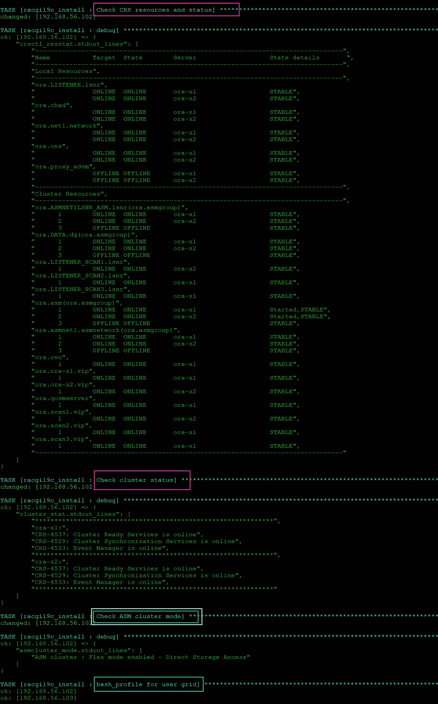

Figure: Post part of GI installation

# **总结**

我们已经使用 Ansible 成功完成了 Oracle Grid Infrastructure 19cR3 的安装。与每次运行许多步骤相比，Ansible 通过一次执行使重复任务变得更加容易。这个剧本的源代码对于我们的测试设置来说是非常具体的。我们已经上传并在 [Github](https://github.com/asiandevs/GI_19cSoftInstall) 中可用，现在是你玩它的时候了。请确保相应地修改变量，并在应用 QA 或 PROD 系统之前测试开发环境。

享受自动化:)

# 作者简历

Monowar Mukul 目前担任首席 Oracle 数据库专家。我是 Oracle 认证大师(Oracle 12c 认证大师管理、Oracle 12c 认证大师 MAA 和 Oracle 11g 认证大师管理)。他在 Oracle MAA 空间担任了 17 年的 Oracle 数据库管理员顾问，负责数据库云服务器和非数据库云服务器系统、Oracle 云空间和 SOA 中间件。他曾在澳大利亚的多个商业领域工作，包括高等教育、能源、政府、采矿和运输。作为一名首席 Oracle 数据库专家，他展示了高度发展的批判性思维和分析技能。你可以在 https://www.linkedin.com/in/monowarmukul/的[找到关于他和他的工作成就的更多细节](https://www.linkedin.com/in/monowarmukul/)

**Nassyam Basha** 是一名数据库管理员。他有大约十年的 Oracle 数据库管理员工作经验，目前是 eprosed KSA 公司的数据库专家。他拥有马德拉斯大学的计算机应用硕士学位。他是 Oracle 11g 认证大师和 Oracle ACE 总监。他以超级英雄的身份积极参与甲骨文相关论坛，如 OTN，甲骨文支持被授予“大师”称号，并担任 OTN 版主，与 OTN 一起撰写了大量关于 Toad World 的文章。他维护着一个与甲骨文技术相关的博客，[www.oracle-ckpt.com](http://www.oracle-ckpt.com/)，可以通过[https://www.linkedin.com/in/nassyambasha/](https://www.linkedin.com/in/nassyambasha/)找到他