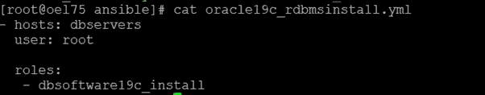
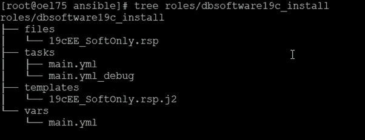
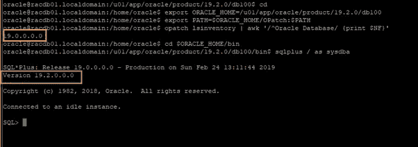
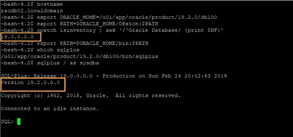

# DevOps 系列:使用 Ansible [GITHUB]自动安装 Oracle 19c RDBMS

> 原文：<https://medium.com/oracledevs/devops-series-automate-oracle-19c-rdbms-installations-with-ansible-github-43cfdf344a4a?source=collection_archive---------0----------------------->

## 作者:[纳西姆·巴沙](https://medium.com/u/ba3f0a72ff81?source=post_page-----43cfdf344a4a--------------------------------)(甲骨文王牌总监，OCM)[莫诺瓦·穆库尔](https://medium.com/u/3757393c69bd?source=post_page-----43cfdf344a4a--------------------------------) (OCM)

## GITHUB 链接:【https://github.com/asiandevs/OracleDBAwithAnsible 

```
21c: Install Oracle SI RDBMS software 
```

[](https://github.com/asiandevs/oracle21c/tree/main/roles/dbsoftware21c_install) [## Oracle 21c/roles/dbsoftware 21c _ install at main Asian devs/Oracle 21c

### Oracle Database 21c ansi ble Automation 本文介绍了如何在 Oracle 平台上安装 64 位 Oracle Database 21c

github.com](https://github.com/asiandevs/oracle21c/tree/main/roles/dbsoftware21c_install) 

## **简介**

对于任何 Oracle 用户来说，Oracle RDBMS 安装都是一项非常熟悉且简单的任务。这有什么区别呢？我们将把开源 DevOps 工具 Ansible 与 Oracle 数据库集成在一起。在本文中，我们将通过从控制管理中触发 Ansible 在两个节点中安装 Oracle RDBMS 19c 来体验 ansible 的简单性。GitHub 中的安装库文件可供下载和使用。

## **为什么可以与 Oracle 兼容？**

Ansible、chef 和 puppet 属于同一个类别，但 Ansible 的简单性是非凡的，就像 Ansible 没有代理一样简单。我们将很快发布 Ansible 简介文章，以及它如何在安装、修补、升级、迁移等方面帮助 Oracle 数据库操作。它如何帮助巨大的基础设施环境，关键是理解易理解的术语—角色、变量、任务、行动手册等。

## **ansi ble 如何帮助甲骨文？**

假设客户请求将 Oracle 19c RDBMS 安装到新基础架构的十台单独的服务器上；那么在传统的方法中，它是耗时的，而且我们一次又一次地付出同样的努力，并且有可能出现人为错误。使用 Ansible，我们可以为控制服务器中的角色准备必要的行动手册，然后我们会将 Oracle 19c 的安装推送到目标服务器或受管服务器，详细信息我们将在下一节中了解。

## **先决条件**

**控制服务器** : oel75，已经安装了 Ansible 和 Python。

**托管服务器** : ora-x1 和 ora-x2(主机的命名看起来像 RAC 服务器，但它们是单独的服务器)。主机文件中更新的相同信息如下。请记住，这不是传统的/etc/hosts，而是位于/etc/ansible/hosts 下的文件。

```
[root@oel75 ansible]# cat hosts
 [ora-x1]
 192.168.56.102
 [ora-x2]
 192.168.56.103
 [dbservers]
 192.168.56.102
 192.168.56.103
```

> 注意:假设已经安装了所有需要的 RPM 并考虑了所有先决条件，因为考虑到这些任务与基础结构团队相关。

## **准备工作**

要安装 Oracle RDBMS 19c，第一步是创建主行动手册，在我们的示例中是“oracle19c_rdbmsinstall.yml”，在该文件中，我们将提到主机、用户和角色。在主机中，我们可能会提到由一个或多个目标服务器主机名/ip 地址组成的组，这取决于我们的要求。在我们的例子中，组名为“[数据库服务器]。”如下图。

```
[root@oel75 ansible]# cat hosts
 [ora-x1]
 192.168.56.102
 [ora-x2]
 192.168.56.103
 **[dbservers]
 192.168.56.102
 192.168.56.103**
```

在主行动手册中，我们可以设置许多角色，但在本文中，我们的目标是安装 19c RDBMS 软件，因此我们可以准备如下主行动手册。



Master Playbook

让我们为角色“dbsoftware19c_install”准备内容这类似于在静默模式下使用 ansible 树结构安装 Oracle RDBMS 软件。



roles/dbsoftware19c_install

如果我们看到角色的结构，我们需要准备“安装 19c”的响应文件。为了准备这个响应文件，DBA 应该能够轻松地创建它们，在本文中，我们的目标不是展示如何安装，而是如何使用 Ansible 安装。

**提示**:我们可以通过从另一个 ORACLE_HOME 复制响应文件来创建一个响应文件(19cEE_SoftOnly.rsp)，并根据需要进行修改，甚至在 docs.oracle.com 也可以使用。下面是安装 19c RDBMS 企业版的响应文件示例。

```
[root@oel75 ansible]# cat **roles/dbsoftware19c_install/files/19cEE_SoftOnly.rsp** oracle.install.responseFileVersion=/oracle/install/rspfmt_dbinstall_response_schema_v19.0.0
oracle.install.option=INSTALL_DB_SWONLY
UNIX_GROUP_NAME=oinstall
INVENTORY_LOCATION={{ oracle_inventory }}
ORACLE_HOME={{ oracle_home }}
ORACLE_BASE={{ oracle_base }}
oracle.install.db.InstallEdition=EE
oracle.install.db.OSDBA_GROUP=dba
oracle.install.db.OSOPER_GROUP=oper
oracle.install.db.OSBACKUPDBA_GROUP=oinstall
oracle.install.db.OSDGDBA_GROUP=oinstall
oracle.install.db.OSKMDBA_GROUP=oinstall
oracle.install.db.OSRACDBA_GROUP=dba
SECURITY_UPDATES_VIA_MYORACLESUPPORT=false
DECLINE_SECURITY_UPDATES=true
oracle.installer.autoupdates.option=SKIP_UPDATES
```

在 RDBMS 传统安装中，我们将输入所有字段，如 ORACLE_BASE、ORACLE_HOME、group、软件位置等，这些输入与我们在 Ansible 中用作变量的输入相同。因此，我们需要准备另一个文件 vars/main.yml，它包含 Oracle 安装所需的所有变量。在安装的执行或部署过程中，我们将在 tasks/main.yml 中使用这些变量。我们将在接下来的步骤中讨论更多的任务/主任务、yml。

```
[root@oel75 ansible]# cat roles/dbsoftware19c_install/vars/main.yml
oracle_install_group: “oinstall”
root_directory: “/u01”
stage_dir: “/u01/stage”
scripts_directory: “{{ root_directory }}/app/scripts”
oracle_base: /u01/app/oracle
oracle_home: /u01/app/oracle/product/19.2.0/db100
oracle_inventory: /u01/app/oraInventory
oracle_user: oracle
root_user: root
oradbsoft_rsp: “19cEE_SoftOnly”
```

## **剧本— tasks/main.yml**

准备 tasks/main.yml 文件脚本知识是必须的，这一步起着关键作用，Ansible 会在行动。开始写小和小操作可以开发 ansible 的编码或者好的起点是[https://docs . ansi ble . com/ansi ble/latest/network/getting _ started/first _ playbook . html .](https://docs.ansible.com/ansible/latest/network/getting_started/first_playbook.html.)

19c RDBMS 的安装分为不同的部分，在 Ansible 术语中，我们将这些部分称为剧本。

*   创建目录
*   打开 19c 软件的包装
*   响应文件的设置
*   安装 19c 软件
*   执行后置脚本

下面是 tasks/main.yml 文件的完整代码以及基于上述概念编写的代码。

```
[root@oel75 ansible]# cat roles/dbsoftware19c_install/tasks/main.yml
- name: display pre database software install message
 remote_user: “{{ root_user }}”
 debug:
 msg:
 — ‘Oracle Database Software 19c Installation started for Single Instance at {{ansible_date_time.iso8601}}:’
- name: create required directories
 when: inventory_hostname in groups[‘dbservers’]
 remote_user: “{{ root_user }}”
 file:
 path=”{{ item }}”
 state=directory
 owner=”{{ oracle_user }}”
 group=”{{ oracle_install_group }}”
 mode=0755
 with_items:
 — “{{ root_directory }}”
 — “{{ scripts_directory }}”
 — “{{ oracle_inventory }}”
 — “{{ oracle_base }}”
 — “{{ stage_dir }}”
 — “{{ oracle_home }}”
 tags:
 — db19c_createinventory
- name: Unpack Oracle 19c Database Software to the target server
 when: inventory_hostname in groups[‘dbservers’]
 remote_user: “{{ root_user }}”
 become: yes
 become_user: “{{ oracle_user }}”
 unarchive:
 src={{ stage_dir }}/V981623–01.zip
 dest=”{{ oracle_home }}”
 remote_src=no
 mode=0755
 group=”{{ oracle_install_group }}”
 owner=”{{ oracle_user }}”
 tags:
 — db19c_unpackdbsoftware
- name: Setup Oracle 19c Database Software silent response file
 when: inventory_hostname in groups[‘dbservers’]
 remote_user: “{{ root_user }}”
 become: yes
 become_user: “{{ oracle_user }}”
 template: src=roles/dbsoftware19c_install/templates/{{ oradbsoft_rsp }}.rsp.j2 dest={{ stage_dir }}/{{ oradbsoft_rsp }}.rsp mode=0755
 tags:
 — db19c_setuprspfile
- name: Install Oracle 19c Database Software
 when: inventory_hostname in groups[‘dbservers’]
 remote_user: “{{ root_user }}”
 become: yes
 become_user: “{{ oracle_user }}”
 shell: “{{ oracle_home }}/runInstaller -silent -responseFile {{ stage_dir }}/{{ oradbsoft_rsp }}.rsp -noconfig -ignorePrereqFailure”
 ignore_errors: True
 tags:
 — db19c_installdbsoftware
- name: Execute orainstroot.sh
 when: inventory_hostname in groups[‘dbservers’]
 remote_user: “{{ root_user }}”
 shell: /bin/sh “{{ oracle_inventory }}/orainstRoot.sh”
 tags:
 — db19c_exeorainstroot
- name: Execute root.sh
 when: inventory_hostname in groups[‘dbservers’]
 remote_user: “{{ root_user }}”
 shell: /bin/sh “{{ oracle_home }}/root.sh”
 tags:
 — db19c_exeroot
- name: Remove stage directory
 when: inventory_hostname in groups[‘dbservers’]
 file: path={{ stage_dir }} state=absent
- name: display post install message
 debug:
 msg:
 — ‘This Steps completed below task for Single Instance at {{ansible_date_time.iso8601}}:’
 — ‘- Install Single Instance Oracle Database Software’
 — ‘Next Steps left to do:’
 — ‘- Create SI empty Container Database on server ora-x1’
 — ‘- Create SI Pluggable Database on server ora-x1’
 — ‘- Deinstall Single Instance Oracle Database Software’
 — ‘- END OF ALL: git clone of db_maintainence repository will be shared.’
```

## **安装 19c RDBMS**

主代码已经写在 tasks/main.yml 中，现在我们将使用如下命令“ansible-playbook”来执行剧本。当使用这个命令时，我们在调试、验证等方面有多种选择。总是建议使用 verbose "--v[v][v]"选项和"--check "对脚本进行调试或故障排除，以确保在语法或执行方面没有错误。举例来说，可能是目标中的目录结构不可用，然后 ansible 能够列出调试模式中的问题。从 ansible 主目录执行剧本，如下所示。

**$ cd /etc/ansible**

**$ ansi ble-playbook Oracle 19 c _ RDBMS install . yml**

在开始安装 19c RDBMS 后，我们可以看到如下输出。

```
[root@oel75 ansible]# ansible-playbook oracle19c_rdbmsinstall.yml
PLAY [dbservers] **********************************************************************************************************************
TASK [Gathering Facts] ****************************************************************************************************************
ok: [192.168.56.103]
ok: [192.168.56.102]
TASK [dbsoftware19c_install : display pre database software install message] **********************************************************
ok: [192.168.56.102] => {
 “msg”: [
 “Oracle Database Software 19c Installation started for Single Instance at 2019–03–19T10:05:22Z:”
 ]
}
ok: [192.168.56.103] => {
 “msg”: [
 “Oracle Database Software 19c Installation started for Single Instance at 2019–03–19T10:05:22Z:”
 ]
}
TASK [dbsoftware19c_install : create required directories] ****************************************************************************
ok: [192.168.56.103] => (item=/u01)
ok: [192.168.56.102] => (item=/u01)
ok: [192.168.56.103] => (item=/u01/app/scripts)
ok: [192.168.56.102] => (item=/u01/app/scripts)
changed: [192.168.56.103] => (item=/u01/app/oraInventory)
changed: [192.168.56.102] => (item=/u01/app/oraInventory)
ok: [192.168.56.103] => (item=/u01/app/oracle)
ok: [192.168.56.102] => (item=/u01/app/oracle)
changed: [192.168.56.103] => (item=/u01/stage)
changed: [192.168.56.102] => (item=/u01/stage)
changed: [192.168.56.103] => (item=/u01/app/oracle/product/19.2.0/db100)
changed: [192.168.56.102] => (item=/u01/app/oracle/product/19.2.0/db100)
TASK [dbsoftware19c_install : Unpack Oracle 19c Database Software to the target server] ***********************************************
changed: [192.168.56.103]
changed: [192.168.56.102]
TASK [dbsoftware19c_install : Setup Oracle 19c Database Software silent response file] ************************************************
changed: [192.168.56.103]
changed: [192.168.56.102]
TASK [dbsoftware19c_install : Install Oracle 19c Database Software] *******************************************************************
changed: [192.168.56.102]
changed: [192.168.56.103]
TASK [dbsoftware19c_install : Execute orainstroot.sh] *********************************************************************************
changed: [192.168.56.102]
changed: [192.168.56.103]
TASK [dbsoftware19c_install : Execute root.sh] ****************************************************************************************
changed: [192.168.56.102]
changed: [192.168.56.103]
TASK [dbsoftware19c_install : Remove stage directory] *********************************************************************************
changed: [192.168.56.102]
changed: [192.168.56.103]
TASK [dbsoftware19c_install : display post install message] ***************************************************************************
ok: [192.168.56.102] => {
 “msg”: [
 “This Steps completed below task for Single Instance at 2019–03–19T10:05:22Z:”,
 “- Install Single Instance Oracle Database Software”,
 “Next Steps left to do:”,
 “- Create SI empty Container Database on server ora-x1”,
 “- Create SI Pluggable Database on server ora-x1”,
 “- Deinstall Single Instance Oracle Database Software”,
 “- END OF ALL: git clone of db_maintainence repository will be shared”
 ]
}
ok: [192.168.56.103] => {
 “msg”: [
 “This Steps completed below task for Single Instance at 2019–03–19T10:05:22Z:”,
 “- Install Single Instance Oracle Database Software”,
 “Next Steps left to do:”,
 “- Create SI empty Container Database on server ora-x1”,
 “- Create SI Pluggable Database on server ora-x1”,
 “- Deinstall Single Instance Oracle Database Software”,
 “- END OF ALL: git clone of db_maintainence repository will be shared”
 ]
}
PLAY RECAP ****************************************************************************************************************************
192.168.56.102 : ok=10 changed=7 unreachable=0 failed=0
192.168.56.103 : ok=10 changed=7 unreachable=0 failed=0
```

**受管节点的验证**

我们已经完成了安装 19c RDBMS 软件的 ansible 行动手册，现在让我们连接到所有目标服务器或托管服务器，以验证安装是否成功。



Node 1 — status



Node 2 — status

## **总结**

我们已经学习了 Ansible 的一些基础知识，以及如何准备剧本和 ansible 涉及的各种文件，包括准备响应文件和一些有用的提示，如何调试 Ansible 的任何代码问题。我们还验证了托管服务器是否可以访问 sqlplus 可执行文件。这个练习源文件已经上传并在 Github 中可用，现在是时候玩玩它了。

## **作者简介**

Nassyam Basha 是一名数据库管理员。他有大约十年的 Oracle 数据库管理员工作经验，目前是 eprosed KSA 公司的数据库专家。他拥有马德拉斯大学的计算机应用硕士学位。他是 Oracle 11g 认证大师和 Oracle ACE 总监。他以超级英雄的身份积极参与甲骨文相关论坛，如 OTN，甲骨文支持被授予“大师”称号，并担任 OTN 版主，与 OTN 一起撰写了大量关于 Toad World 的文章。他维护着一个与甲骨文技术相关的博客，[www.oracle-ckpt.com](http://www.oracle-ckpt.com/)，可以通过[https://www.linkedin.com/in/nassyambasha/](https://www.linkedin.com/in/nassyambasha/)找到他

Monowar Mukul 目前担任首席 Oracle 数据库专家。我是 Oracle 认证大师(Oracle 12c 认证大师管理、Oracle 12c 认证大师 MAA 和 Oracle 11g 认证大师管理)。他在 Oracle MAA 空间担任了 17 年的 Oracle 数据库管理员顾问，负责数据库云服务器和非数据库云服务器系统、Oracle 云空间和 SOA 中间件。他曾在澳大利亚的多个商业领域工作，包括高等教育、能源、政府、采矿和运输。作为一名首席 Oracle 数据库专家，他展示了高度发展的批判性思维和分析技能。你可以在 https://www.linkedin.com/in/monowarmukul/的[找到关于他和他的工作成就的更多细节](https://www.linkedin.com/in/monowarmukul/)