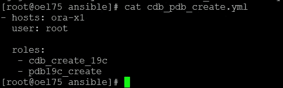
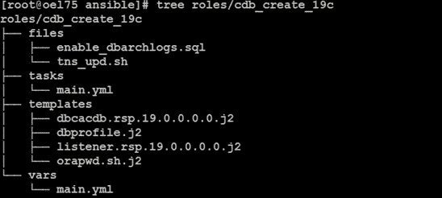
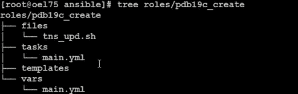

# DevOps 系列:使用 Ansible [GITHUB]部署 Oracle 19c 容器和可插拔数据库

> 原文：<https://medium.com/oracledevs/devops-series-deployment-of-oracle-19c-container-and-pluggable-database-with-ansible-github-ab9c93246e08?source=collection_archive---------0----------------------->

## 作者:[纳西姆·巴沙](https://medium.com/u/ba3f0a72ff81?source=post_page-----ab9c93246e08--------------------------------)(甲骨文王牌总监，OCM)[莫诺瓦·穆库尔](https://medium.com/u/3757393c69bd?source=post_page-----ab9c93246e08--------------------------------) (OCM)

21c: Github 回购:

[](https://github.com/asiandevs/oracle21c/tree/main/roles/cdb_create_21c) [## oracle21c/roles/cdb_create_21c 位于主 asiandevs/oracle21c

### Ansible 的不同数据库操作。在 GitHub 上创建一个帐户，为 asiandevs/oracle21c 开发做出贡献。

github.com](https://github.com/asiandevs/oracle21c/tree/main/roles/cdb_create_21c) [](https://github.com/asiandevs/oracle21c/tree/main/roles/pdb21c_create) [## Oracle 21 c/roles/pdb 21 c _ 在主 asiandevs 上创建/oracle21c

### Ansible 的不同数据库操作。在 GitHub 上创建一个帐户，为 asiandevs/oracle21c 开发做出贡献。

github.com](https://github.com/asiandevs/oracle21c/tree/main/roles/pdb21c_create) 

## GITHUB 链接:【https://github.com/asiandevs/Oracle_CDBnPDB_19c 

## **简介**

欢迎回到 DevOps 系列，在第一篇文章中，我们已经使用 Ansible 完成了 Oracle 19c 企业版的安装，在本文中，我们将准备 ansible 角色来创建容器数据库，然后我们将创建另一个角色来创建可插拔数据库。等等，我们将在主剧本中增加几个步骤，介绍如何创建密码文件、监听器创建和 TNS 更新，以及 CDB 和 PDB 创建的完整设置，以及通过 ansible automation 完成的所有工作。

## **大师剧本**

**计划**:创建容器数据库或可插拔数据库有多种情况。例如，我们可以一起创建容器和可插拔数据库，甚至多个可插拔数据库。但是在这个例子中，我们试图使它简单易懂。让我们首先创建一个空的容器数据库，然后添加一个可插拔的数据库。

> 在本文中，我们将在主机 ora-x1 和控制服务器上创建容器和可插拔数据库，其中 ansible 安装的主机名是 oel75。

Ansible automation 的第一步是创建一个主剧本。在本主行动手册中，我们将提到主机/组，然后是用户[root],他们已经可以通过 SSH 从控制服务器访问受管服务器。要知道部署的目标主机，我们需要检查包含各种组或主机的/etc/ansible/hosts 文件—当 playbook 中的 hosts 值设置为“ALL”时，在这种情况下，部署适用于所有组。

> 如果各个组中有冗余主机，ansible 如何处理？—实际上，它会跳过重复的主机名(如果有的话),并继续对唯一的主机进行可行的部署。

```
[root@oel75 ansible]# cat ansible.cfg | grep inventory
inventory = ./inventory
[root@oel75 ansible]# cat inventory
[ora-x1]
192.168.56.102
[ora-x2]
192.168.56.103
[dbservers]
192.168.56.102
192.168.56.103
```

在顶级主剧本中，我们可以设置许多角色，但是在本文中，我们的目标是创建一个空的容器数据库(CDB)，然后创建一个具有本地撤销的可插拔数据库(PDB)。相应地，我们可以为下面的每个角色准备两个角色。



Master Playbook

让我们为角色“cdb_pdb_create.yml”准备内容。它有两个角色，一个是“cdb_create_19c ”,用于创建空容器数据库，另一个是“pcdb_create_19c ”,用于创建可插拔数据库。在本文中，我们不仅仅涉及数据库的创建，而且像 DBCA 一样，我们还涉及数据库创建的所有前期和后期活动。当使用 Ansible 时我们正在使用数据库，监听器的所有活动都将在静默模式下执行。我们将看到每个角色是如何定义的。



Container Database Role

几十年来，数据库创建是一个众所周知的话题，因此在本文中，我们的目标是展示如何使用 ansible 行动手册创建数据库，以及它如何使业务操作变得平稳和并行。

## **创建容器数据库**

文件:Oracle _ CDBnPDB _ 19c/roles/CDB _ create _ 19c/files/enable _ dbarchlogs . SQL

该文件包含创建数据库后启用归档日志模式的命令。

```
shutdown immediate;
startup mount;
alter database archivelog;
alter database open;
shutdown immediate;
startup 
/
exit;
```

文件:Oracle _ CDBnPDB _ 19c/roles/CDB _ create _ 19c/files/tns _ upd . sh

这个文件将为我们正在创建的数据库创建 TNS 服务。

```
#!/bin/bash
export ORACLE_HOME=/u01/app/oracle/product/19.2.0/db100
export TNSNAMES_FILE=tnsnames.ora
export ENTRY_NAME=$1
export HOST_ADDR=$2
export PORT_NUM=$3
export SRV_NAME=$4
export TNS_ADMIN_DIR=$5
if [ -z $1 ] || [ -z $2 ] || [ -z $3 ] || [ -z $4 ] || [ -z $5 ]; then
 echo “Missing one or more required parameters: [ENTRY_NAME] [HOST_ADDR] [PORT_NUM] [SERVICE_NAME] [TNS_ADMIN_DIR]”
 exit;
fi
chk_entry=`cat $TNS_ADMIN_DIR/$TNSNAMES_FILE | grep “$ENTRY_NAME =” | wc -l`
if [ -n “$chk_entry” ] && [ “$chk_entry” = 0 ]; then
 echo “Creating the required entry…”
 echo “”
echo “
$ENTRY_NAME =
 (DESCRIPTION =
 (ADDRESS = (PROTOCOL = TCP)(HOST = $HOST_ADDR)(PORT = $PORT_NUM))
 (CONNECT_DATA =
 (SERVER = DEDICATED)
 (SERVICE_NAME = $SRV_NAME)
 )
 )
“ >> $TNS_ADMIN_DIR/$TNSNAMES_FILE
 elif [ “$chk_entry” != 0 ]; then
 echo “”
 echo “This entry already exists: [$ENTRY_NAME].”
 echo “Nothing to do!”
 echo “”
 exit;
fi
```

**剧本**:Oracle CDBnPDB _ 19c/roles/CDB _ create _ 19c/tasks/main . yml

main.yml 文件包含下面的各种子任务，并调用 CDB 剧本下的相关文件。这个 main.yml 包含并提取所有文件、模板和变量中的数据。

*   导出环境变量
*   调用 enable_dbarchivelog.sql
*   tns_upd.sh
*   交叉检查数据库名称是否已经存在
*   创造一个沉默的听众
*   配置监听程序
*   创建静默数据库安装文件
*   创建容器数据库
*   TNS 对容器数据库的更新
*   检查正在运行的数据库
*   修改 oratab
*   验证 CDB
*   CDB 违规事件

为了创建 CDB 和 PDB，我们将传递所有必要的变量(如 ORACLE_BASE、

ORACLE_HOME、PDB 名称、cdb 名称、文件位置等。)放入 Ansible 中的变量文件。因此，我们需要准备另一个文件 vars/main.yml，它包含 Oracle 安装所需的所有变量。在执行或部署 CDB 和 PDB 的过程中，我们将在 tasks/main.yml 中使用这些变量。我们将在接下来的步骤中讨论更多的任务/主任务、yml。

**文件**:Oracle _ CDBnPDB _ 19c/roles/CDB _ create _ 19c/templates/dbcadb . RSP . 19 . 0 . 0 . 0 . 0 . J2

该文件准备使用 dbca 静默方法创建容器数据库。我们可以通过将响应文件复制到($ ORACLE _ HOME/assistants/dbca/dbca . RSP)下来创建一个响应文件(dbca19cSI.rsp ),然后根据需要进行修改，甚至这个脚本在 docs.oracle.com 也可以使用。下面是创建 CDB 的响应文件示例。在本文中，我们为 CDB 和 PDB 使用了两个不同的角色。通常情况下，PDB 请求是作为一个单独的请求来的，因此，在修改 PDB 变量后，我们可以只运行 PDB 角色来创建唯一的可插拔数据库。

```
[root@oel75 ansible]# cat roles/cdb_create_19c/templates/dbcacdb.rsp.19.0.0.0.0.j2
##############################################################################
## ##
## DBCA response file ##
## — — — — — — — — — ##
## Copyright(c) Oracle Corporation 1998,2019\. All rights reserved. ##
## ##
##############################################################################
responseFileVersion=/oracle/assistants/rspfmt_dbca_response_schema_v19.0.0
# — — — — — — — — — — — — — — — — — — — — — — — — — — — — — — — — — — — — — — -
gdbName={{ item.0.cdb_name }}
# — — — — — — — — — — — — — — — — — — — — — — — — — — — — — — — — — — — — — — -
sid={{ item.0.cdb_name }}
# — — — — — — — — — — — — — — — — — — — — — — — — — — — — — — — — — — — — — — -
databaseConfigType={{ item.0.dbconfig_type }}
# — — — — — — — — — — — — — — — — — — — — — — — — — — — — — — — — — — — — — — -
createAsContainerDatabase={{ item.0.container_db}}
# — — — — — — — — — — — — — — — — — — — — — — — — — — — — — — — — — — — — — — -
numberOfPDBs=
# — — — — — — — — — — — — — — — — — — — — — — — — — — — — — — — — — — — — — — -
# Name : pdbName
# Datatype : String
# Description : Specify the pdbname/pdbanme prefix if one or more pdb need to be created
# Valid values : Check Oracle12c Administrator’s Guide
# Default value : None
# Mandatory : No
# — — — — — — — — — — — — — — — — — — — — — — — — — — — — — — — — — — — — — — -
pdbName=
# — — — — — — — — — — — — — — — — — — — — — — — — — — — — — — — — — — — — — — -
# Name : useLocalUndoForPDBs
# Datatype : boolean
# Description : Flag to create local undo tablespace for all PDB’s.
# Valid values : TRUE\FALSE
# Default value : TRUE
# Mandatory : No
# — — — — — — — — — — — — — — — — — — — — — — — — — — — — — — — — — — — — — — -
useLocalUndoForPDBs=
# — — — — — — — — — — — — — — — — — — — — — — — — — — — — — — — — — — — — — — -
pdbAdminPassword=
# — — — — — — — — — — — — — — — — — — — — — — — — — — — — — — — — — — — — — — -
templateName={{ template_name }}
# — — — — — — — — — — — — — — — — — — — — — — — — — — — — — — — — — — — — — — -
sysPassword={{dbpasswords[item.0.cdb_name][‘sys’]}}
# — — — — — — — — — — — — — — — — — — — — — — — — — — — — — — — — — — — — — — -
systemPassword={{dbpasswords[item.0.cdb_name][‘system’]}}
# — — — — — — — — — — — — — — — — — — — — — — — — — — — — — — — — — — — — — — -
emExpressPort=5500
# — — — — — — — — — — — — — — — — — — — — — — — — — — — — — — — — — — — — — — -
datafileDestination={{ item.0.dbfile_path }}
# — — — — — — — — — — — — — — — — — — — — — — — — — — — — — — — — — — — — — — -
recoveryAreaDestination={{ item.0.fra_path }}
# — — — — — — — — — — — — — — — — — — — — — — — — — — — — — — — — — — — — — — -
storageType={{ item.0.db_storage_type }}
# — — — — — — — — — — — — — — — — — — — — — — — — — — — — — — — — — — — — — — -

characterSet={{ item.0.characterset }}

characterSet=AL32UTF8

# — — — — — — — — — — — — — — — — — — — — — — — — — — — — — — — — — — — — — — -

nationalCharacterSet={{ item.0.ncharacterset }}

nationalCharacterSet=AL16UTF16

# — — — — — — — — — — — — — — — — — — — — — — — — — — — — — — — — — — — — — — -
listeners={{ item.0.lsnr_name }}
# — — — — — — — — — — — — — — — — — — — — — — — — — — — — — — — — — — — — — — -
sampleSchema=
# — — — — — — — — — — — — — — — — — — — — — — — — — — — — — — — — — — — — — — -
memoryPercentage=
# — — — — — — — — — — — — — — — — — — — — — — — — — — — — — — — — — — — — — — -
databaseType={{ item.0.oracle_database_type }}
# — — — — — — — — — — — — — — — — — — — — — — — — — — — — — — — — — — — — — — -
automaticMemoryManagement=false
# — — — — — — — — — — — — — — — — — — — — — — — — — — — — — — — — — — — — — — -
totalMemory={{ item.0.totalMemory }}
```

**文件**:Oracle _ CDBnPDB _ 19c/roles/CDB _ create _ 19c/templates/db profile . J2

dbprofile 脚本包含数据库的所有环境配置文件，或者我们可以说它是一个数据库配置文件。

```
get_sid=$(ps -ef | grep “ora_pmon_$ORACLE_DBNAME” |grep -v grep | sed ‘s/^.*pmon_//g’)
# Set up the Oracle environment variables
 umask 022
 ORACLE_BASE={{ oracle_base }}
 export ORACLE_BASE
 ORACLE_HOME={{ oracle_home }}
 export ORACLE_HOME
 SHLIB_PATH=$ORACLE_HOME/lib
 LD_LIBRARY_PATH=$ORACLE_HOME/lib
 export LD_LIBRARY_PATH
 SQLPATH=/home/oracle/.sql
 export SQLPATH
 export ORACLE_SID=${get_sid:-$ORACLE_DBNAME}
 export NLS_DATE_FORMAT=’DD-MM-YYYY HH24:MI:SS’
export PATH=$ORACLE_HOME/bin:$ORACLE_HOME/OPatch:$PATH:$SQLPATH
```

**文件**:Oracle _ CDBnPDB _ 19c/roles/CDB _ create _ 19c/templates/ora pwd . sh . J2

该文件有助于在创建容器数据库的过程中创建密码文件。

```
source ~/.bash_profile
export ORACLE_SID={{ cdb_name }}
export ORACLE_HOME={{ oracle_home }}
export PATH=$PATH:$ORACLE_HOME/bin
orapwd file=orapw{{ cdb_fname }} password={{ syspass }} force=y ignorecase=n
```

**文件**:Oracle _ CDBnPDB _ 19c/roles/CDB _ create _ 19c/templates/listener . RSP . 19 . 0 . 0 . 0 . 0 . J2

```
[GENERAL]
RESPONSEFILE_VERSION=”19.0"
CREATE_TYPE=”CUSTOM”
[oracle.net.ca] 
INSTALLED_COMPONENTS={“server”,”net8",”javavm”} 
INSTALL_TYPE=””typical”” 
LISTENER_NUMBER=1 
LISTENER_NAMES={“LISTENER”} 
LISTENER_PROTOCOLS={“TCP;1523”} 
LISTENER_START=””LISTENER”” 
NAMING_METHODS={“TNSNAMES”,”ONAMES”,”HOSTNAME”} 
NSN_NUMBER=1 
NSN_NAMES={“EXTPROC_CONNECTION_DATA”} 
NSN_SERVICE={“PLSExtProc”} 
NSN_PROTOCOLS={“TCP;HOSTNAME;1523”}
```

**剧本**:Oracle _ CDBnPDB _ 19c/roles/CDB _ create _ 19c/vars/main . yml

```
oracle_user: “oracle”
root_user: “root”
oracle_install_group: “oinstall”
stage_dir: “/u01/stage”
root_directory: “/u01”
oracle_base: “{{ root_directory }}/app/oracle”
oracle_home: “{{ oracle_base }}/product/19.2.0/db100”
silent_database19c_config_file: “{{ stage_dir }}/silent_19cdb_config.rsp”
silent_database19c_config_file1: “{{ stage_dir }}/silent_19cdb_config1.rsp”
silent_database19c_config_file2: “{{ stage_dir }}/silent_19cdb_config2.rsp”
silent_listener_config_file: “{{ stage_dir }}/silent-lsnr19c-config.rsp”
dbfile_path: “/u01/app/oracle/oradata”
fra_path: “/u01/app/oracle/fra”
template_name: General_Purpose.dbc
cdb_name: “eaymp”
oracle_sid: “eaymp”
cdb_fname: “bingo”
cdb_sname: “mdpkb”
oracleuser_home: “/home/{{ oracle_user }}”
oracle_rsp_stage: “{{ stage_dir }}”
syspass: “Oracle123”
dbunq_name: eaymp
prihost: ora-x1
portnum: 1521
tns_path: “{{ oracle_home }}/network/admin”
tns_file: “{{ tns_path }}/tnsnames.ora”
db_properties: 
 — home: “OraDB19Home1” 
 oracle_dbversion: 19.0.0.0.0 
 oracle_edition: EE 
 cdb_name: eaymp 
 dbconfig_type: SI 
 container_db: true 
 db_storage_type: FS 
 totalMemory: 1200 
 oracle_database_type: MULTIPURPOSE 
 redolog_size_in_mb: 150
 lsnr_name: LISTENER
 state: present 
 dbfile_path: “/u01/app/oracle/oradata”
 fra_path: “/u01/app/oracle/fra”
dbpasswords:
 eaymp:
 sys: Oracle123
 system: Oracle123
```

我们已经完成了容器数据库所需的所有行动手册和脚本。准备好可插拔数据库行动手册后，我们将连续运行这些行动手册。

## 创建可插拔数据库

我们已经为容器数据库准备了 ansible 代码和所需的脚本，现在我们将为可插拔数据库做准备。我们不需要额外的步骤来创建一个密码文件或者为 PDB 创建一个监听器。因此，我们直接更新 PDB 的 TNS 条目，并为剧本 pdb19c_create 创建可插拔数据库。



Pluggable Database Role

**文件**:Oracle _ CDBnPDB _ 19c/roles/pdb 19 c _ create/files/tns _ upd . sh

```
[root@oel75 ansible]# cat roles/pdb19c_create/vars/main.yml
oracle_user: “oracle”
root_user: “root”
oracle_install_group: “oinstall”
stage_dir: “/u01/stage”
root_directory: “/u01”
scripts_directory: “{{ root_directory }}/app/scripts”
base_directory: “{{ root_directory }}/app/oracle”
oracle_home: “{{ base_directory }}/product/19.2.0/db100”
cdb_name: “eaymp”
pdb_name: “kachu”
pdbadmpassword: “Oracle123”
prihost: ora-x1
portnum: 1521
tns_path: “{{ oracle_home }}/network/admin”
tns_file: “{{ tns_path }}/tnsnames.ora”
```

**剧本**:Oracle _ CDBnPDB _ 19c/roles/pdb 19 c _ create/tasks/main . yml

在本行动手册中，我们将执行与在容器数据库之上创建可插拔数据库相关的主要任务，然后我们将执行一些其他 post 任务。

*   创建目录
*   具有本地撤销和不同字符集的可插拔数据库
*   修改 oratab
*   在正常模式下打开可插拔数据库

下面是 PDB 的 tasks/main.yml 文件的完整代码，并基于上述概念编写了代码。

```
[root@oel75 ansible]# cat roles/pdb19c_create/tasks/main.yml
- name: pdb19c_create | display pre pdb create message
 debug:
 msg:
 — ‘This Steps is relate to Create a Pluggable Database on server ora-x1 at {{ansible_date_time.iso8601}}:’
- name: pdb19c_create | Create Datafile Directories
 remote_user: “{{ root_user }}”
 when: inventory_hostname in groups[‘ora-x1’]
 file:
 path=/u01/app/oracle/oradata/{{ pdb_name }}
 state=directory
 owner=”{{ oracle_user }}”
 group=”{{ oracle_install_group }}”
 mode=0755
 tags:
 -pdbcreate_crdirs
- name: pdb19c_create | Copy required script to Primary database server
 when: inventory_hostname in groups[‘ora-x1’]
 copy:
 src=roles/pdb19c_create/files/{{ item }}
 dest={{ stage_dir }}
 owner=”{{ oracle_user }}”
 group=”{{ oracle_install_group }}”
 mode=0775
 remote_src=no
 with_items:
 — tns_upd.sh
- name: pdb19c_create | Create a Pluggable Database with local undo and different characterset
 when: inventory_hostname in groups[‘ora-x1’]
 remote_user: “{{ root_user }}”
 become: yes
 become_user: “{{ oracle_user }}”
 action: shell export ORACLE_HOME={{ oracle_home }}; {{ oracle_home }}/bin/dbca -silent -createPluggableDatabase -sourceDB {{ cdb_name }} -pdbName {{ pdb_name }} -pdbAdminPassword {{ pdbadmpassword }} -useLocalUndoForPDBs TRUE -characterset WE8ISO8859P1
 tags:
 -pdbcreate_exepdb
- name: pdb19c_create | change oratab
 when: inventory_hostname in groups[‘ora-x1’]
 remote_user: “{{ root_user }}”
 lineinfile: dest=’/etc/oratab’ regexp=’^{{ pdb_name }}:{{ oracle_home }}:N’ line=’{{ pdb_name }}:{{ oracle_home }}:Y’
 tags:
 -pdbcreate_updoratab
- name: pdb19c_create | Open pluggable database in normal mode
 when: inventory_hostname in groups[‘ora-x1’]
 remote_user: “{{ root_user }}”
 become: yes
 become_user: “{{ oracle_user }}”
 shell: export ORACLE_HOME={{ oracle_home }}; export ORACLE_SID={{ cdb_name }}; echo “{{ item }};” | {{ oracle_home }}/bin/sqlplus / as sysdba
 register: sqlplus_result
 failed_when: “‘ERROR’ in sqlplus_result.stdout or sqlplus_result.rc != 0”
 with_items:
 — alter pluggable database all open
 tags:
 -pdbcreate_openpdb
- name: pdb19c_create | execute tns update for CDB database
 when: inventory_hostname in groups[‘ora-x1’]
 remote_user: “{{ root_user }}”
 become: yes
 become_user: “{{ oracle_user }}”
 shell: ‘{{ stage_dir }}/tns_upd.sh {{ pdb_name }} {{ prihost }} {{ portnum }} {{ pdb_name }} {{ tns_path }}’
 args:
 executable: /bin/bash
- name: pdb19c_create | Remove stage directory
 when: inventory_hostname in groups[‘ora-x1’]
 file: path={{ stage_dir }} state=absent
 tags:
 — dbdelete_removestgdir
- name: pdb19c_create | validate PDB
 remote_user: “{{ oracle_user }}”
 when: inventory_hostname in groups[‘ora-x1’]
 shell: export ORACLE_HOME={{ oracle_home }}; export ORACLE_SID={{ cdb_name }}; export PATH=$PATH:$ORACLE_HOME/bin; echo “{{ item }};” | {{ oracle_home }}/bin/sqlplus / as sysdba
 register: sqlplus_pdbvalidate
 with_items:
 — select open_mode, cdb from v\$database
 — show pdbs
 — alter session set container={{ pdb_name }}
 — select name, open_mode from v\$pdbs
- name: display PDB validation output message
 when: inventory_hostname in groups[‘ora-x1’]
 debug:
 var: sqlplus_pdbvalidate.results
- name: pdb19c_create | display post PDB create message
 when: inventory_hostname in groups[‘ora-x1’]
 debug:
 msg:
 — ‘This Steps completed below task for Single Instance at {{ansible_date_time.iso8601}}:’
 — ‘- Create a Pluggable Database on server ora-x1’
 — ‘- END OF ALL: git repository “OracleDBAwithAnsible” will be updated’
```

## **运行剧本——通过一次执行创建 CDB 和 PDB**

主要的剧本/代码已经写在 tasks/main.yml 中，现在我们将使用下面的命令“ansible-playbook”来执行剧本。当使用这个命令时，我们在调试、验证等方面有多种选择。总是建议使用 verbose“-v[v][v]”选项和“check”来调试或排除脚本故障，以确保在语法或执行方面没有错误。举例来说，可能是目标中的目录结构不可用，然后 ansible 能够列出调试模式中的问题。从 ansible 主目录执行剧本，如下所示。

```
[root@oel75 ansible]# ansible-playbook cdb_pdb_create.ymlPLAY [ora-x1] ***************************************************************************************************************TASK [Gathering Facts] ******************************************************************************************************
ok: [192.168.56.102]TASK [cdb_create_19c : validate oracle database is installed] ***************************************************************
ok: [192.168.56.102]TASK [cdb_create_19c : debug] ***********************************************************************************************
ok: [192.168.56.102] => {
    "msg": "oracle database software is already installed in this /u01/app/oracle/product/19.2.0/db100"
}TASK [cdb_create_19c : create required directories] *************************************************************************
changed: [192.168.56.102] => (item=/u01/stage)
ok: [192.168.56.102] => (item=/u01/app/oracle/oradata/)
ok: [192.168.56.102] => (item=/u01/app/oracle/fra/)TASK [cdb_create_19c : Check if database is already created] ****************************************************************
changed: [192.168.56.102]. . . 
. .
.ok: [192.168.56.102] => (item=
SQL*Plus: Release 19.0.0.0.0 - Production on Tue Apr 16 17:52:12 2019
Version 19.2.0.0.0Copyright (c) 1982, 2018, Oracle.  All rights reserved.Connected to:
Oracle Database 19c Enterprise Edition Release 19.0.0.0.0 - Production
Version 19.2.0.0.0SQL>
**NAME      OPEN_MODE            CDB
--------- -------------------- ---
EAYMP     READ WRITE           YES**SQL> Disconnected from Oracle Database 19c Enterprise Edition Release 19.0.0.0.0 - Production
Version 19.2.0.0.0) => {
    "msg": "\nSQL*Plus: Release 19.0.0.0.0 - Production on Tue Apr 16 17:52:12 2019\nVersion 19.2.0.0.0\n\nCopyright (c) 1982   , 2018, Oracle.  All rights reserved.\n\n\nConnected to:\nOracle Database 19c Enterprise Edition Release 19.0.0.0.0 - Product   ion\nVersion 19.2.0.0.0\n\nSQL> \nNAME\t  OPEN_MODE\t       CDB\n--------- -------------------- ---\nEAYMP\t  READ WRITE\t          YES\n\nSQL> Disconnected from Oracle Database 19c Enterprise Edition Release 19.0.0.0.0 - Production\nVersion 19.2.0.0.0"
}
ok: [192.168.56.102] => (item=
SQL*Plus: Release 19.0.0.0.0 - Production on Tue Apr 16 17:52:12 2019
Version 19.2.0.0.0Copyright (c) 1982, 2018, Oracle.  All rights reserved.Connected to:
Oracle Database 19c Enterprise Edition Release 19.0.0.0.0 - Production
Version 19.2.0.0.0SQL>
 **CON_ID CON_NAME                       OPEN MODE  RESTRICTED
---------- ------------------------------ ---------- ----------
         2 PDB$SEED                       READ ONLY  NO**
. . .
. . 
.
**SQL>
    CON_ID CON_NAME                       OPEN MODE  RESTRICTED
---------- ------------------------------ ---------- ----------
         2 PDB$SEED                       READ ONLY  NO
         3 KACHU                          READ WRITE NO**
SQL> Disconnected from Oracle Database 19c Enterprise Edition Release 19.0.0.0.0 - Production
Version 19.2.0.0.0) => {
    "msg": "\nSQL*Plus: Release 19.0.0.0.0 - Production on Tue Apr 16 17:52:40 2019\nVersion 19.2.0.0.0\n\nCopyright (c) 1982   , 2018, Oracle.  All rights reserved.\n\n\nConnected to:\nOracle Database 19c Enterprise Edition Release 19.0.0.0.0 - Product   ion\nVersion 19.2.0.0.0\n\nSQL> \n    CON_ID CON_NAME\t\t\t  OPEN MODE  RESTRICTED\n---------- ------------------------------    ---------- ----------\n\t 2 PDB$SEED\t\t\t  READ ONLY  NO\n\t 3 KACHU\t\t\t  READ WRITE NO\nSQL> Disconnected from Oracle Da   tabase 19c Enterprise Edition Release 19.0.0.0.0 - Production\nVersion 19.2.0.0.0"
}
ok: [192.168.56.102] => (item=
SQL*Plus: Release 19.0.0.0.0 - Production on Tue Apr 16 17:52:40 2019
Version 19.2.0.0.0Copyright (c) 1982, 2018, Oracle.  All rights reserved.Connected to:
Oracle Database 19c Enterprise Edition Release 19.0.0.0.0 - Production
Version 19.2.0.0.0SQL>
Session altered.SQL> Disconnected from Oracle Database 19c Enterprise Edition Release 19.0.0.0.0 - Production
Version 19.2.0.0.0) => {
    "msg": "\nSQL*Plus: Release 19.0.0.0.0 - Production on Tue Apr 16 17:52:40 2019\nVersion 19.2.0.0.0\n\nCopyright (c) 1982   , 2018, Oracle.  All rights reserved.\n\n\nConnected to:\nOracle Database 19c Enterprise Edition Release 19.0.0.0.0 - Product   ion\nVersion 19.2.0.0.0\n\nSQL> \nSession altered.\n\nSQL> Disconnected from Oracle Database 19c Enterprise Edition Release 1   9.0.0.0.0 - Production\nVersion 19.2.0.0.0"
}
ok: [192.168.56.102] => (item=
SQL*Plus: Release 19.0.0.0.0 - Production on Tue Apr 16 17:52:40 2019
Version 19.2.0.0.0Copyright (c) 1982, 2018, Oracle.  All rights reserved.Connected to:
Oracle Database 19c Enterprise Edition Release 19.0.0.0.0 - Production
Version 19.2.0.0.0**SQL>
NAME
--------------------------------------------------------------------------------
OPEN_MODE
----------
PDB$SEED
READ ONLY****KACHU
READ WRITE**SQL> Disconnected from Oracle Database 19c Enterprise Edition Release 19.0.0.0.0 - Production
Version 19.2.0.0.0) => {
    "msg": "\nSQL*Plus: Release 19.0.0.0.0 - Production on Tue Apr 16 17:52:40 2019\nVersion 19.2.0.0.0\n\nCopyright (c) 1982   , 2018, Oracle.  All rights reserved.\n\n\nConnected to:\nOracle Database 19c Enterprise Edition Release 19.0.0.0.0 - Product   ion\nVersion 19.2.0.0.0\n\nSQL> \nNAME\n--------------------------------------------------------------------------------\nOPE   N_MODE\n----------\nPDB$SEED\nREAD ONLY\n\nKACHU\nREAD WRITE\n\n\nSQL> Disconnected from Oracle Database 19c Enterprise Editi   on Release 19.0.0.0.0 - Production\nVersion 19.2.0.0.0"
}TASK [pdb19c_create : pdb19c_create | display post PDB create message] ******************************************************
ok: [192.168.56.102] => {
    "msg": [
        "This Steps completed below task for Single Instance at 2019-04-16T07:08:03Z:",
        "- Create a Pluggable Database on server ora-x1",
        "- END OF ALL:  git repository Oracle_CDBnPDB_19c will be updated"
    ]
}PLAY RECAP ******************************************************************************************************************
**192.168.56.102             : ok=26   changed=17   unreachable=0    failed=0**
```

## **总结**

我们已经了解了如何准备 Ansible 行动手册来创建初始容器数据库，但这并不是数据库，我们在完整设置中包括了侦听器、TNS 和密码文件的配置。可插拔数据库也是如此。最后，我们可以看到容器和可插拔数据库的验证。

## **作者简介**

**Nassyam Basha** 是一名数据库管理员。他有大约十年的 Oracle 数据库管理员工作经验，目前是 eprosed KSA 公司的数据库专家。他拥有马德拉斯大学的计算机应用硕士学位。他是 Oracle 11g 认证大师和 Oracle ACE 总监。他以超级英雄的身份积极参与甲骨文相关论坛，如 OTN，甲骨文支持被授予“大师”称号，并担任 OTN 版主，与 OTN 一起撰写了大量关于 Toad World 的文章。他维护着一个与甲骨文技术相关的博客，[www.oracle-ckpt.com](http://www.oracle-ckpt.com/)，可以通过[https://www.linkedin.com/in/nassyambasha/](https://www.linkedin.com/in/nassyambasha/)找到他

**Monowar Mukul** 目前担任首席 Oracle 数据库专家。我是 Oracle 认证大师(Oracle 12c 认证大师管理、Oracle 12c 认证大师 MAA 和 Oracle 11g 认证大师管理)。他在 Oracle MAA 空间担任了 17 年的 Oracle 数据库管理员顾问，负责数据库云服务器和非数据库云服务器系统、Oracle 云空间和 SOA 中间件。他曾在澳大利亚的多个商业领域工作，包括高等教育、能源、政府、采矿和运输。作为一名首席 Oracle 数据库专家，他展示了高度发展的批判性思维和分析技能。你可以在[https://www.linkedin.com/in/monowarmukul/](https://www.linkedin.com/in/monowarmukul/)找到关于他和他的工作成就的更多细节