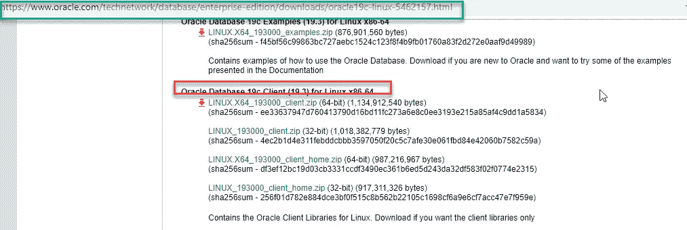
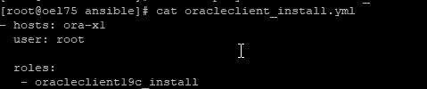
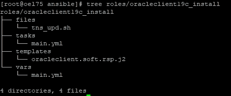
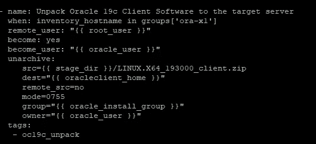
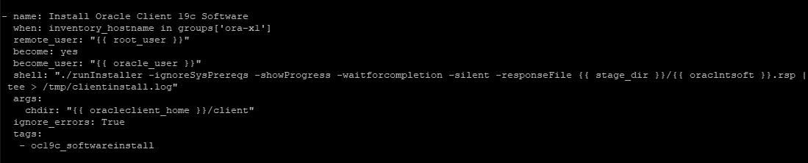
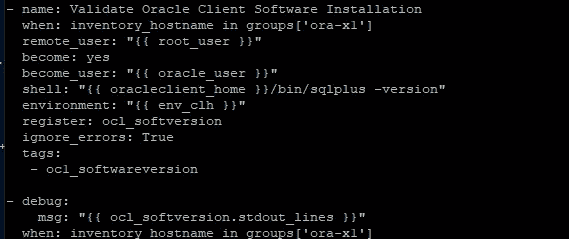
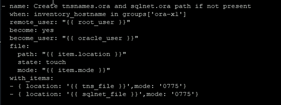
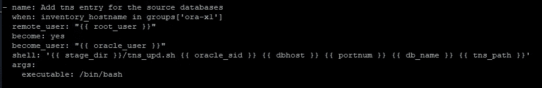
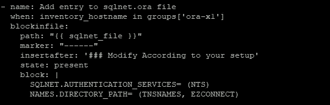
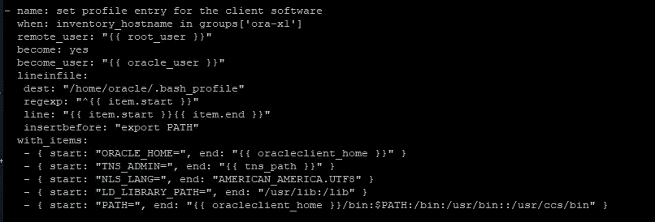

# DevOps 系列:使用 Ansible [GITHUB]为 Linux x86–64 部署 Oracle 数据库 19c 客户端(19.3)

> 原文：<https://medium.com/oracledevs/devops-series-deployment-of-oracle-database-19c-client-19-3-b8e176a626c7?source=collection_archive---------3----------------------->

# 作者:[莫诺瓦·穆库尔](https://medium.com/u/3757393c69bd?source=post_page---------------------------) (OCM)

# 简介:

需要 Oracle 客户端从不同的客户端工具(SQL Developer、TOAD)访问多个数据源。在本文中，我们使用 Ansible 工具一次将 oracle 客户端部署到多个服务器上。本文与安装 Oracle 完整客户端有关，而不是 Linux x86–64 的即时客户端。

**GITHUB 链接:**[https://GITHUB . com/Asian devs/Oracle _ Database _ Client _ Installation/edit/master/readme . MD](https://github.com/asiandevs/Oracle_Database_Client_Installation/edit/master/README.md)

注意:请根据您的设置对变量、主机配置和模板文件进行必要的更改。

# **假设:**

一、下载 Oracle 客户端软件并暂存到 Ansible 控制服务器
从 OTN 下载安装存档文件

[https://www . Oracle . com/tech network/database/enterprise-edition/downloads/Oracle 19 c-Linux-5462157 . htm](https://www.oracle.com/technetwork/database/enterprise-edition/downloads/oracle19c-linux-5462157.html)l

或者从甲骨文软件交付云门户:
[https://edelivery.oracle.com/](https://edelivery.oracle.com/)

二。Ansible 控制服务器和目标服务器之间的 ssh 密钥设置。

三。列出主机文件条目的目标服务器条目。这本剧本的一个例子是

[root @ oel 75 ansi ble]# cat/etc/ansi ble/hosts
【ora-x1】
192 . 168 . 56 . 102

**剧本设置:**

在顶层主行动手册中，我们可以设置许多角色，但是在本文中，我们的目标是将 Oracle 数据库客户端软件安装到目标服务器上。我们为此任务创建了一个名为 oracleclient19c_install 的角色。

Figure: Master playbook

本行动手册的结构如下—

Figure: Top level tree structure

本行动手册包括以下步骤—

> 1:将 Oracle 客户端软件解包到目标服务器

Figure: Unpack Software

> 2:将 Oracle 客户端软件安装到目标服务器上

Figure: Install Oracle Client Software

任务完成后，验证日志文件

**cat/tmp/client install . log**
*启动 Oracle Universal Installer…*

*检查临时空间:必须大于 415 MB。实际 7756 MB 通过了
检查交换空间:必须大于 150 MB。实际 6037 MB 通过
准备从/tmp/ora install 2019–07–29 _ 07–23–15PM 启动 Oracle Universal Installer。请稍候…[警告] [INS-320 16]所选的 Oracle 主目录包含目录或文件。
操作:从一个空的 Oracle 主目录开始，要么删除其内容，要么选择另一个位置。
本次会话的响应文件可以在:
/u01/app/Oracle/product/19 . 3 . 0/install/response/client _ 2019–07–29 _ 07–23–15pm . RSP*找到

*…………您可以在以下位置找到此安装会话的日志:
/u01/app/ora inventory/logs/install actions 2019–07–29 _ 07–23–15pm . log*

*准备进行中。
..7%完成。*

*准备成功。*

*正在复制文件。
..13%完成。
..18%完成。
..23%完成。
..28%完成。
..33%完成。
..38%完成。
..43%完成。
..48%完成。
..53%完成。
..58%完成。*

*复制文件成功。*

正在链接二进制文件。

*链接二进制文件成功。*

*正在安装文件。
………………………………
设置文件成功。*

*正在设置库存。*

*设置库存成功。
…………
完成正在进行的设置。
…………
成功完成设置。
Oracle 客户端 19c 安装成功。
详情请查看“/u01/app/ora inventory/logs/silen install 2019–07–29 _ 07–23–15pm . log”。*

*正在设置 Oracle Base。*

*安装 Oracle Base 成功。
..69%完成。*

*准备正在进行的配置步骤。*

*准备配置步骤成功。
..85%完成。*

*Oracle 客户端配置正在进行中。
成功设置软件。
..百分百搞定。*

***Oracle 客户端配置成功。***

> *3:验证—连接到* SQLPLUS 二进制文件。

Figure: Verify software installation

> 4.安装 tnsnames.ora 和 sqlnet.ora 文件

Figure: setup files

> 5.将源数据库的虚拟 tns 条目添加到 tnsnames.ora

Figure: dummy tns entry

> 6.向 sqlnet.ora 文件添加条目

Figure: modify sqlnet.ora entry

> 7.为 Oracle 客户机设置环境变量
> 
> 为了完成 Oracle 客户机的配置，我们设置了一个任务来设置环境变量。
> ORACLE _ HOME
> TNS _ ADMIN
> LD _ LIBRARY _ PATH
> LANG
> PATH

Figure: Profile setup

# 执行行动手册—安装 Oracle 数据库客户端

[root @ oel 75 ansi ble]# ansi ble-playbook Oracle client _ install . yml

**剧本输出:**

*任务【收集事实】* * * * * * * * * * * * * * * * * * * * * * * * * * * * * * * * * * * * * * * * * * * * * * * * * * * * * * * * * * * * * * *
ok:【192 . 168 . 56 . 102】*

*TASK[Oracle client 19 c _ install:display pre Oracle client Software install message]* * * * * * * * * * * * * * * * *
ok:[192 . 168 . 56 . 102]=>{
" msg ":[
" Oracle client 19 c Software Installation in progress at 2019–07–29t 09:22:07Z:"
]
}*

*TASK[Oracle client 19 c _ install:create required directory]* * * * * * * * * * * * * * * * * * * * * * * * * * * * * * *
ok:[192 . 168 . 56 . 102]=>(item =/u01)
ok:[192 . 168 . 56 . 102]=>(item =/u01/app/ora inventory)
ok:[192 . 168 . 56 . 102]*

*任务[oracleclient19c_install:将所需脚本复制到目标服务器]* * * * * * * * * * * * * * * * * * * * * * *
已更改:[192 . 168 . 56 . 102]=>(item = tns _ upd . sh)*

*任务【oracleclient19c_install:将 Oracle 19c 客户端软件解包到目标服务器】* * * * * * * * * * * * * * * *
变更:[192.168.56.102]*

*任务[oracleclient19c_install:设置 oracleclient19c 软件静默响应文件] ***************
已更改:[192.168.56.102]*

*任务【oracleclient19c_install:安装 oracleclient19c 软件】* * * * * * * * * * * * * * * * * * * * * * * * * * *
变更:【192 . 168 . 56 . 102】*

*任务[oracleclient19c_install:验证 Oracle 客户端软件安装]* * * * * * * * * * * * * * * * * * * * *
已更改:[192.168.56.102]*

*TASK[Oracle client 19 c _ install:debug]* * * * * * * * * * * * * * * * * * * * * * * * * * * * * * * * * * * * *
ok:[192 . 168 . 56 . 102]=>{
" msg ":[
" "，* ***" SQL * Plus:Release 19 . 0 . 0 . 0 . 0-Production "，
"版本 19.3.0***

*TASK[Oracle client 19 c _ install:Create tnsnames . ora and sqlnet . ora path if not present]* * * * * * * * * * * * * *
已更改:[192 . 168 . 56 . 102]=>(item = { u ' location ':u '/u01/app/Oracle/product/19 . 3 . 0/network/admin/tnsnam es . ora '，u'mode': u'0775'})
已更改:[192.ora '，u'mode': u'0775'})*

*任务[oracleclient19c_install:为源数据库添加 tns 条目]* * * * * * * * * * * * * * * * * * * * * * * * * * *
已更改:[192.168.56.102]*

*任务[oracleclient19c_install:将条目添加到 sqlnet.ora 文件]* * * * * * * * * * * * * * * * * * * * * * * * * * * * * * *
已更改:[192.168.56.102]*

*TASK[Oracle client 19 c _ install:set profile entry for the client software]* * * * * * * * * * * * * * * * * * * * *
ok:[192 . 168 . 56 . 102]=>(item = { u ' start ':u ' Oracle _ HOME = '，u ' end ':u '/u01/app/Oracle/product/19 . 3 . 0 ' })
ok:[192 . 168 . 56 . 102]=>(item = { 0 }UTF8 ' })
ok:[192 . 168 . 56 . 102]=>(item = { u ' start ':u ' LD _ LIBRARY _ PATH = '，u ' end ':u '/usr/lib:/lib ' })
ok:[192 . 168 . 56 . 102]=>(item = { u ' start ':u ' PATH = '，u ' end ':u '/u01/app/Oracle/product/19.3*

*任务[oracleclient19c_install:删除登台目录]* * * * * * * * * * * * * * * * * * * * * * * * * * * * * * * * * * * * * * *
已更改:[192.168.56.102]*

*TASK[oracle client 19 c _ Install:display post Install message]* * * * * * * * * * * * * * * * * * * * * * * * * * * * * * * * * * * * *
ok:[192 . 168 . 56 . 102]=>{
" msg ":[
"本行动手册已于 2019–07–29t 09:22:07Z 完成以下单实例任务:"，
-将 Oracle 客户端安装到 ora-x1 组的列出的服务器上"，* 

*播放回顾* * * * * * * * * * * * * * * * * * * * * * * * * * * * * * * * * * * * * * * * * * * * * * * * * * * * * * * * * * * * * * * * * * * *
192 . 168 . 56 . 102:ok = 15 changed = 10 unreachable = 0 failed = 0’*

# 资源:

[https://docs . Oracle . com/en/database/Oracle/Oracle-database/19/lacli/installing-Oracle-database-client . html # GUID-07890 cf0-35FE-42 F8-A27B-53 e2e C3 ed 039](https://docs.oracle.com/en/database/oracle/oracle-database/19/lacli/installing-oracle-database-client.html#GUID-07890CF0-35FE-42F8-A27B-53E2EC3ED039)

# 结论:

自动化在云市场中扮演着重要角色。在这一系列文章中，我们的重点是使用 Ansible 设置最常见的 DBA 活动。尽可能简单的编码方式是我的座右铭。

# 作者简历

Monowar Mukul 目前担任首席 Oracle 数据库专家。我是 Oracle 认证大师(Oracle 12c 认证大师管理、Oracle 12c 认证大师 MAA 和 Oracle 11g 认证大师管理)。他在 Oracle MAA 空间担任了 17 年的 Oracle 数据库管理员顾问，负责数据库云服务器和非数据库云服务器系统、Oracle 云空间和 SOA 中间件。他曾在澳大利亚的多个商业领域工作，包括高等教育、能源、政府、采矿和运输。作为一名首席 Oracle 数据库专家，他展示了高度发展的批判性思维和分析技能。你可以在 https://www.linkedin.com/in/monowarmukul/的[找到关于他和他的工作成就的更多细节](https://www.linkedin.com/in/monowarmukul/?source=post_page---------------------------)