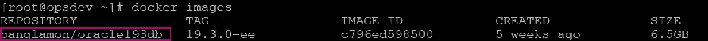
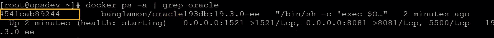
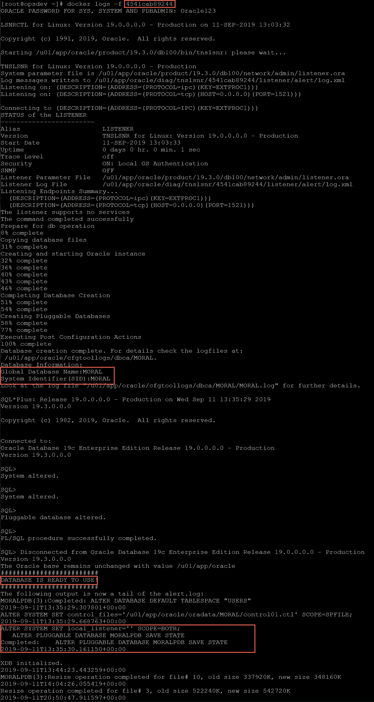
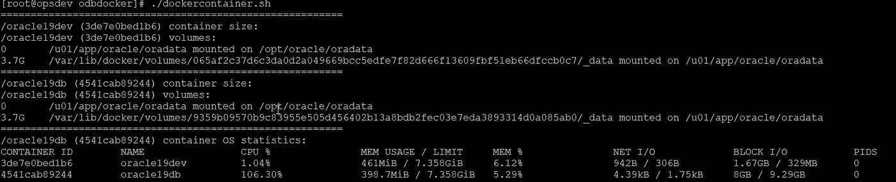
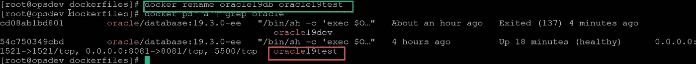
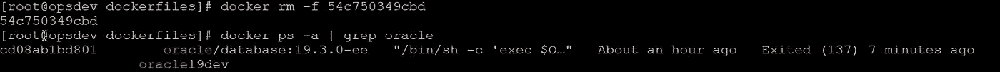
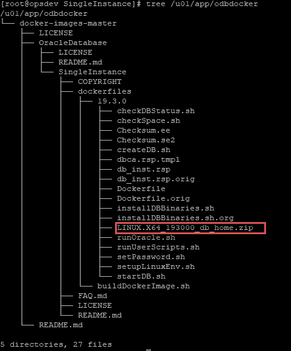

# DevOps 系列:在 Docker 容器中运行 Oracle 数据库 19C

> 原文：<https://medium.com/oracledevs/devops-series-running-oracle-database-19c-in-a-docker-container-b41f142c19f6?source=collection_archive---------0----------------------->

## 作者:[纳西姆·巴沙](https://medium.com/u/ba3f0a72ff81?source=post_page-----b41f142c19f6--------------------------------)(甲骨文王牌总监，OCM)[莫诺瓦·穆库尔](https://medium.com/u/3757393c69bd?source=post_page-----b41f142c19f6--------------------------------) (OCM)

# 介绍

在本文中，我们将学习安装 Docker 的先决条件，然后使用 Docker 容器，我们将了解如何在其上运行数据库和监听器。

在我们的环境中，我们使用了 Linux 7.5 和 Docker 版本 1.23.1。我们只需要一个非常轻量级的 Linux 机器来使用 Docker。

**首先，我们要安装 Docker 引擎和 Docker compose。**

**i)安装 Docker 引擎:**
*sudo yum 安装 docker-engine -y*

在安装 docker 引擎之前，请确保对 public-yum-ol7.repo 文件进行更改，如 Oracle Linux 7.5 上 Docker 安装的简单指南所述，[Puneeth Prakash](https://blogs.oracle.com/author/puneeth-prakash)([https://blogs . Oracle . com/blogbypuneeth/A-Simple-Guide-to-Docker-installation-on-Oracle-Linux-75](https://blogs.oracle.com/blogbypuneeth/a-simple-guide-to-docker-installation-on-oracle-linux-75))

**ii)开始对接:**
sudo 服务对接开始

*#* ***docker —版本***
Docker 版本 18.09.1-ol，build c3ab8a8

iii)安装 Docker-compose:

Docker Compose 是一个允许你定义和运行多容器 Docker 应用程序的工具。首先使用将 Docker Compose 二进制文件下载到/usr/local/bin 目录

> #*sudo curl-L "*[*https://github . com/docker/compose/releases/download/1 . 23 . 1/docker-compose-$(uname*](https://github.com/docker/compose/releases/download/1.23.1/docker-compose-$(uname)*-s)-$(uname-m)"-o/usr/local/bin/docker-compose*
> 
> % Total % Received % Xferd 平均速度时间时间时间当前时间
> Dload 上传总花费左速度
> 100 617 0 617 0 791 0--::-:-:-::-792
> 100 11.1m 100 11.1m 0 0 842k 0:00:13 0:00:13--::-930k
> 
> 下载完成后，通过键入以下命令生成二进制可执行文件:
> #*sudo chmod+x/usr/local/bin/docker-compose
> 您在/var/spool/mail/root 中有新邮件*

要验证安装，请键入以下命令来打印合成版本:
*#***docker-Compose—version*
docker-Compose version 1 . 23 . 1，build b02f1306*

> **#服务 docker 状态*
> 重定向到/bin/systemctl 状态 Docker . service
> ●Docker . service—Docker 应用容器引擎
> Loaded:Loaded(/usr/lib/systemd/system/Docker . service；已启用；厂商预置:已禁用)
> 插件:/etc/systemd/system/docker . service . d
> └─docker-sysconfig.conf
> 活跃:活跃(正在运行)自周二 2019–09–10 18:49:30 aest；11 分钟前
> 文档:[https://docs.docker.com](https://docs.docker.com)t21】主 PID: 3706 (dockerd)
> 内存:101.5m
> cgroup:/system . slice/docker . service
> └─3706/usr/bin/dockerd—selinux—enabled—不安全—注册表 172.30.0.0/16 —存储—驱动程序设备映射器—…*
> 
> *9 月 10 日 18:49:01 ops dev . local domain Docker[3706]:time = " 2019–09——
> 9 月 10 日 18:49:30 ops dev . local domain systemd[1]:已启动 Docker 应用程序容器引擎。
> 提示:一些行被省略，使用-l 来完整显示。*

*在安装过程中创建了一个新的 Unix 组 **docker** 。将 oracle 用户添加到 Docker 组。*

> *#**usermod-a-G docker Oracle*
> #*id Oracle*
> uid = 600(Oracle)GID = 54321(oinstall)groups = 54321(oinstall)、54322(dba)、54323(oper)、54324(backupdba)、54325(dgdba)、54326(kmdba)**

**在本文中，我将使用 Oracle 19.3.0 版提取 docker 映像，我已经基于 Oracle 19 . 3 . 0 企业版构建了该映像。我用它来做测试。请按照您的许可要求使用。**

****V)连接到 docker hub****

**#**docker 登录-u banglamon*
密码:xxxxx
登录成功***

***如果你没有任何账户，那么你可以在[https://hub.docker.com/.](https://hub.docker.com/.)上注册一个**账户*****

*****Vi)从 docker hub 中提取图像*****

> ***#*docker Pull banglamon/Oracle 193 db:19 . 3 . 0-ee*
> 尝试拉资源库 docker.io/banglamon/oracle193db…
> 19 . 3 . 0-ee:从 docker.io/banglamon/oracle193db 拉
> ad18637d63f5:拉完成
> 4aebb26cf7d5:拉完成
> 30325de6313a:拉完成
> 17163f94892b:拉完成***

*****VII)验证 Oracle 数据库的 docker 映像*****

****# docker image ls | grep Oracle****

******

***Figure: docker image***

*****VIII)将 Oracle 数据库设置为容器*****

***在这个阶段，我们已经准备好了一个 docker 映像，但是还没有设置任何容器。让我们设置第一个名为" **oracle19db** "的 Oracle 19c 数据库容器***

***#*docker run-d—name 19 . 3 . 0-ee-p 1521:1521-p 8081:8081-e ORACLE _ SID = MORAL-e ORACLE _ PDB = MORAL pdb-e ORACLE _ PWD = ORACLE 123-v/u01/app/ORACLE/oradata:/opt/ORACLE/oradata banglamon/ORACLE 193 db:19 . 3 . 0-ee****

***在哪里，***

*****-d** 要在分离模式下启动容器，您可以使用-d=true 或 just -d 选项
**-p** 将我的笔记本电脑上的端口 1521 和 8081 映射到容器内的相应端口
**-e** env list Set 环境变量
**-v** 将我的本地目录(/u01/app/oracle/oradata)映射到数据文件将存储的默认位置(:/opt***

> ***#*docker PS-a | grep Oracle*
> 4541 cab 89244 banglamon/Oracle 193 db:19 . 3 . 0-ee "/bin/sh-c ' exec $ O…" 2 分钟前涨 2 分钟(健康:首发)0.0.0.0:1521- > 1521/tcp，0.0.0.0:8081- > 8081/tcp，5500***

******

***Figure: Container process id***

***虽然它显示容器正常运行，但它还没有准备好。***

*****IV)检查日志信息*****

***当我在后台运行容器时——使用下面的命令检查进度日志。***

******

***Figure: container creation log***

*****X)数据库连接:*****

***连接到数据库容器" **oracle19db** "—***

> ***#*docker exec-it Oracle 19 db bash-c " source/home/Oracle/。bashrcsqlplus /nolog"****
> 
> ***SQL*Plus:版本 19 . 0 . 0 . 0 . 0—2019 年 9 月 10 日星期二 11:05:42 生产
> 版本 19.3.0.0.0***
> 
> ***版权所有 1982，2019，甲骨文。保留所有权利。***

*****对数据库级的一些测试*****

> ***SQL> conn / as sysdba
> 已连接。
> SQL >从 v $数据库中选择名称；
> 名字
> ——
> 寓意
> SQL >显示 CON _ NAME
> CON _ NAME
> ———————
> CDB $ ROOT
> SQL>显示 pdbs
> CON_ID CON_NAME 打开方式受限
> ———————————
> 2 PDB $ 2
> 会话已更改。
> SQL >创建表 DockerTst (id int，name varchar 2(20))；
> 表格已创建。
> SQL >从 dba_tablespaces 中选择 tablespace _ name
> TABLESPACE _ NAME
> —————
> SYSTEM
> SYSAUX
> UNDOTBS1
> TEMP
> USERS
> SQL>从 v＄datafile 中选择名称；
> 名称
> ———————
> /u01/app/Oracle/oradata/MORAL/system 01 . DBF
> /u01/app/Oracle/oradata/MORAL/sysaux 01 . DBF
> /u01/app/Oracle/oradata/MORAL/undotbs01 . DBF
> /u01/app/Oracle/oradata/MORAL
> SQL >创建表空间 test docker datafile '/u01/app/Oracle/oradata/MORAL/test docker 01 . DBF '大小 100M
> 表空间已创建。***

> ***注意:使用同一个映像，我们可以通过快速供应部署多个容器。***

*****XI)** 要停止集装箱我们可以执行下面的命令—***

***#*docker PS-a | grep Oracle*
54c 750349 CBD Oracle/database:19 . 3 . 0-ee "/bin/sh-c ' exec $ O…"大约一小时前向上大约一小时(健康)0.0.0.0:1521- > 1521/tcp，0.0.0:8081- > 8081/tcp，5500/tcp oracle***

***默认情况下，Docker 进程等待 10 秒钟来停止一个容器，然后杀死它。我们可以执行 Docker wait，以秒为单位传递时间值，如下所示***

***#*docker stop****-t****50 Oracle 19 db*
Oracle 19 db***

***#*docker PS-a | grep Oracle*
54c 750349 CBD Oracle/database:19 . 3 . 0-ee "/bin/sh-c ' exec $ O…"大约一小时前**退出** (143) 6 秒前 oracle19db***

*****XII)** 玩 Docker 命令***

*****再次启动容器—*****

***# *docker 启动 Oracle 19 db*
*Oracle 19 db****

*****获取容器大小和消耗的操作系统资源—*****

******

*****重命名容器—*****

***# *docker 重命名 oracle19db oracle19test****

******

*****要移除一个容器，我们需要使用下面的命令** —***

***# *码头编号 rm -f 54c750349cbd****

******

***Figure: docker remove***

# ***摘要***

***在本文中，我们已经了解了如何安装 docker 以及如何使用它，然后我们使用 docker 容器来创建 Oracle 19c 数据库，并探索了使用 Docker 的各种命令。***

# *****附录*****

> ***目前有一个正式的码头工人图像(Oracle 数据库服务器**12.2.0.1**码头工人图像)可以链接到 [Oracle 码头工人集装箱](https://container-registry.oracle.com/pls/apex/f?p=113:4:107749378000793::NO:4:P4_REPOSITORY,AI_REPOSITORY,AI_REPOSITORY_NAME,P4_REPOSITORY_NAME,P4_EULA_ID,P4_BUSINESS_AREA_ID:9,9,Oracle%20Database%20Enterprise%20Edition,Oracle%20Database%20Enterprise%20Edition,1,0&cs=3fDYBq-TJxRFvidmqqYzu5E6HaYcHtUSnLUnu1gEHK8OpVnJA9Xn28g0EqP7MJxuscKhWGN4GKlxXaWcwRe8z5w)***

***要下载该软件，您需要创建一个帐户并接受许可证[ORACLE]
= = = = = = = = = = = = = = = = = = = = = = = = = = = = = = = = = = = = = =
docker log in-u asiandevs@gmail.com-p XXXXXX container-registry.oracle.com
[ORACLE @ oel 75 ~]$ docker log in-u monowar.mukul@gmail.com-p XXXX container-registry.oracle.com***

> ***对于本文，构建图像之前的 docker 文件的树结构如下-***

******

***我按照下面的路径下载并安装了 Oracle 数据库软件，不需要解压——***

***[root @ ops dev 19 . 3 . 0]#
CD/u01/app/odbd ocker/docker-images-master/OracleDatabase/single instance/dockerfiles/19 . 3 . 0
[root @ ops dev 19 . 3 . 0]#*CP/media/SF _ Software/Software/LINUX。X64_193000_db_home.zip。****

***【root @ opsdev dockerfiles】#***。/builddockrimage . sh-v 19 . 3 . 0-e******

> *****docker container . sh**
> *for d in ` docker PS | awk“{ print $ 1 }”| tail-n+2 `；do
> d _ name = ` docker inspect-f { }。name } } $ d`
> echo " = = = = = = = = = = = = = = = = = = = = = = = = = = = = = = = = = = = = = = = = = = = = = = = = = = = = = = = = = = = = = = = = = = = = "
> echo " $ d _ name $( d)容器大小:“
> # sudo du-d 2-h/var/lib/docker/device mapper | grep ` docker inspect-f " { }。Id}}" $d`
> echo "$d_name ($d)卷:"
> 用于安装在` docker inspect -f "{{range。挂载}} {{。源}}:{{。目的地} }
> { { end } }“$ d ”;do
> size = ' echo $ mount | cut-d ':'-f1 | sudo xargs du-d 0-h`
> mnt = ' echo $ mount | cut-d ':'-F2`
> echo " $ size 挂载在$ mnt "
> # echo " = = = = = = = = = = = = = = = = = = = = = = = = = = = = = = = = = = = = = = = = = = = = = = = "
> # echo " $ d _ name $( d)容器 OS 统计:"
> #docker 名称}}) —无流
> 完成
> 完成****
> 
> ****echo " = = = = = = = = = = = = = = = = = = = = = = = = = = = = = = = = = = = = = = = = = = = = = = = " T38 " echo " $ d _ name($ d)container OS stats $(docker PS-format = {)。名称}}) —无流****