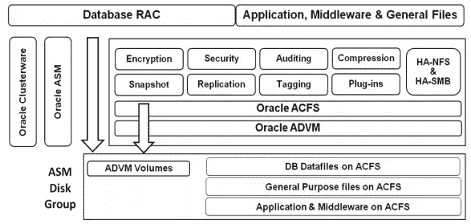

# DevOps 系列:使用 Ansible 在 Oracle 19c RAC 数据库上安装 Oracle ACFS(ASM 集群文件系统)

> 原文：<https://medium.com/oracledevs/devops-series-setup-oracle-acfs-asm-cluster-file-system-on-oracle-19c-rac-database-with-ansible-8031a7e8f10a?source=collection_archive---------0----------------------->

## 作者:[纳西姆·巴沙](https://medium.com/u/ba3f0a72ff81?source=post_page-----8031a7e8f10a--------------------------------)(甲骨文王牌总监，OCM)[莫诺瓦·穆库尔](https://medium.com/u/3757393c69bd?source=post_page-----8031a7e8f10a--------------------------------) (OCM)

【GITHUB 链接:[**https://github.com/asiandevs/racdb_createacfs**](https://github.com/asiandevs/racdb_createacfs)

# 介绍

在本文中，我们将使用 Ansible playbook 在 Oracle Database 19.3 集群环境中设置 Oracle ACFS(自动**存储管理** **集群文件系统**)。

ACFS (ASM 集群文件系统)是一种基于 ASM(自动存储管理)的存储管理技术，用于管理通用文件。从 12C 第 1 版开始，称为 Oracle 云文件系统。总之，这涉及到在 ASM 存储下创建一个对操作系统可见的称为卷的文件，然后将它作为 acfs 文件系统放入对 OS(操作系统)可见的挂载点。则它允许访问 ASM 存储。

Oracle ACFS 快照是文件系统的时间点拷贝，可以是只读的、可读写的、节省空间的，用户可以立即使用它进行测试。从 12c 云 FS 支持创建数据库(数据库版本 11.2.0.4 及更高版本)，*快照的快照*从现有快照创建新快照，这将允许我们非常快速地复制或创建另一个数据库。云文件系统还允许其他功能，如安全性、复制、加密、标记、压缩、审计等。Oracle ACFS 快照可以作为数据库的时间点备份，用于在线恢复，同时将其文件存储在 Oracle 云文件系统上。

Figure: ACFS architecture

**本条设置:**

在本文中，我们使用一台 Ansible 的控制服务器来执行行动手册，以设置 ACFS 和两台具有 2 节点 Oracle RAC 集群的受管服务器。

**控制服务器** : oel75

**托管服务器**:RAC 设置中的两台主机 ora-x1(主节点)和 ora-x2(第二节点)。

在设置之前，让我们验证集群件版本以及 ACFS 驱动程序配置。

[root @ ora-x1 ~]#***crs CTL 查询 CRS 活动版本***
集群上的 Oracle 集群件活动版本为[19.0.0.0.0]

> [root @ ora-x1 ~]# acfsdriverstate-ora home/u02/app/19 . 3 . 0/grid 版本
> ACFS-9325:驱动 OS 内核版本= 4 . 1 . 12–112 . 16 . 4 . El 7 uek . x86 _ 64。ACFS-9326:驱动程序内部版本号= 190222。
> ACFS-9212:驱动程序内部版本= 19.0.0.0.0 (19.3.0.0.0)。
> ACFS-9547:驱动程序可用内部版本号= 190222。
> ACFS-9548:驱动程序可用内部版本= 19.0.0.0.0 (19.3.0.0.0)。
> 
> [root @ ora-x1 ~]#***ols nodes-n***
> ora-x1 1
> ora-x2 2
> 
> [root@ora-x1 ~]# sudo su — grid
> 上次登录:Sun Aug 25 15:40:26 2019
> $。oraenv
> ORACLE_SID = [grid]？+ASM 1
> Oracle base 已设置为/u02/app/grid
> $***srvctl 状态 asm***
> ASM 正在 ora-x2、ora-x1 上运行

更新到主机文件中的相同信息如下。请记住，这不是传统的/etc/hosts，而是位于/etc/ansible/hosts 下的文件。在主机中，我们可能会提到一个由一个或多个目标服务器主机名/ip 地址组成的组，这取决于我们的要求。

Figure: host file

要安装 Oracle ACFS，第一步是创建主行动手册，在我们的示例中是“rac_acfs.yml”，在该文件中，我们将提到主机、用户和角色。

Figure: Main playbook

在角色文件中，我们将为每项任务准备子行动手册。下面是设置 ACFS 的可行树结构，在这种情况下，如下所示:

Figure: Tree structure for ACFS

在下面的整个设置中，Ansible 将从 vars/main.yml 中考虑和配置变量

Figure: variables

为了在 Oracle RAC 数据库上设置 ACFS，我们将执行以下高级步骤。

> I .为 ACFS 创建单独的磁盘组
> 
> 二。创建云文件系统
> 
> a)使用 ASMCMD volcreate 命令在已装入的磁盘组中创建 Oracle ADVM 卷。
> 
> b)使用 Oracle ACFS mkfs 命令创建文件系统
> 
> c)注册文件系统
> 
> d)安装或启动文件系统
> 
> 三。创建快照并进行测试

Figure: racdb_createacfs role

主剧本代码在 tasks/main.yml 中，现在我们将使用下面的命令“ansible-playbook”来执行剧本。当使用这个命令时，我们在调试、验证等方面有多种选择。总是建议使用 verbose "-v[v][v]"选项和"check "对脚本进行调试或故障排除，以确保在语法或执行方面没有错误。举例来说，可能是目标中的目录结构不可用，然后 ansible 能够列出调试模式中的问题。从 ansible 主目录执行剧本，如下所示。

> **$ cd /etc/ansible**
> 
> [root @ oel 75 ansi ble]#**ansi ble-playbook RAC _ acfs . yml**
> 
> 玩[ora-x1，ora-x2]* * * * * * * * * * * * * * * * * * * * * * * * * * * * * * * * * * * * * * * * * * * * * * * * * * * * * * * * * * * * *。
> 
> 任务[收集事实]* * * * * * * * * * * * * * * * * * * * * * * * * * * * * * * * * * * * * * * * * * * * * * * * * * * * * * * * * * * * * * * * * * * * * * * * * * * * * * *
> ok:[192 . 168 . 56 . 103]
> ok:[192 . 168 . 56 . 102]
> 
> TASK [racdb_createacfs:设置 acfs |在设置 ACFS 文件系统之前显示预设置消息]* * * * * * * * * * * * * * * * * * * * * * * * * * * * * * * * *
> ok:[192 . 168 . 56 . 102]=>{
> " msg ":[
> "本行动手册用于在 2019-08-24t 21:01:13Z:"
> ]
> }
> 
> — — — — — — — —
> 
> 任务[racdb_createacfs:删除阶段目录]* * * * * * * * * * * * * * * * * * * * * * * * * * * * * * * * * * * * * * * * * * * * * * * * * * * * * * * * * * * * * * * * *
> 已更改:[192.168.56.102]
> 已更改:[192.168.56.103]
> 
> 任务[racdb_createacfs:显示 acfs 文件系统设置安装后消息]* * * * * * * * * * * * * * * * * * * * * * * * * * * * * * * * * * * * * * *
> 确定:[192.168.56.102] = > {
> "消息":[
> "ACFS 文件系统设置成功完成 2019–08–24t 21:01:13Z:"，
> -全部结束:git 储存库\"ACFS 文件系统成功创建\ "将被共享"【关键词
> 
> 播放回顾* * * * * * * * * * * * * * * * * * * * * * * * * * * * * * * * * * * * * * * * * * * * * * * * * * * * * * * * * * * * * * * * * * * * * * * * * * * * * * * * * * * * * * * * * * * * * *
> 192.168 . 56 . 102:ok = 27 changed = 17 unreachable = 0 failed = 0
> 192.168 . 56 . 103:ok = 10 changed = 10 = 6 unreachable = 0 failed = 0

你可以从下面的视频中获得这篇文章的完整日志

**预检查**

在此步骤中，我们将验证 ACFS/ADVM 模块的安装和加载状态。如果没有，那么我们需要安装和加载它。这还包括建议的 ACFS 磁盘组，如果不存在，则创建该磁盘组。

***验证 ACFS 状态***

我们已经完成了安装 ACFS 文件系统的脚本。让我们连接到所有目标服务器或托管服务器，以验证 ACFS 安装是否成功。

Figure: ACFS output -1

Figure: ACFS output -2

# 结论

我们已经使用 Ansible 完成了 Oracle 云文件系统的设置。与每次运行许多步骤相比，Ansible 通过一次执行使重复任务变得更加容易。我们还验证了 ACFS 快照，它不仅具有内部部署设置的许多功能，还具有 Oracle 云和数据库云服务器的许多功能。这个练习源文件在 Github 中上传并可用，现在是时候玩玩了。这样，我们只需要根据环境设置修改变量。请确保相应地修改变量，并在实施到 QA 或 PROD 系统之前，总是在开发环境中测试几次。

享受自动化:)

参考:

> *Oracle ASM 集群文件系统*https://www . Oracle . com/pt/database/technologies/RAC/acfs . html
> 
> *Oracle ACFS 19c ASM 集群文件系统*是什么以及如何使用[https://www . Oracle . com/tech network/database/database-technologies/cloud-storage/acfs/overview/acfs-WP-18c-4395032 . pdf](https://www.oracle.com/technetwork/database/database-technologies/cloud-storage/acfs/overview/acfs-wp-18c-4395032.pdf)
> 
> [https://docs . Oracle . com/en/database/Oracle/Oracle-database/19/ostmg/steps-manage-acfs . html # GUID-4c 98 cf 06-8 CCC-45 f1-9316-c 40 FB 3 eff 268](https://docs.oracle.com/en/database/oracle/oracle-database/19/ostmg/steps-manage-acfs.html#GUID-4C98CF06-8CCC-45F1-9316-C40FB3EFF268)
> 
> **devo PS 系列的其他文章:自动化 Oracle DBA 活动**

 [## DevOps 系列:使用 Ansible [GITHUB]自动安装 Oracle 19c RDBMS

### 作者:Nassyam Basha(甲骨文 ACE 总监，OCM)，Monowar Mukul (OCM)

medium.com](/oracledevs/devops-series-automate-oracle-19c-rdbms-installations-with-ansible-github-43cfdf344a4a)  [## DevOps 系列:使用 Ansible [GITHUB]部署 Oracle 19c 容器和可插拔数据库

### 作者:Nassyam Basha(甲骨文 ACE 总监，OCM)，Monowar Mukul (OCM)

medium.com](/oracledevs/devops-series-deployment-of-oracle-19c-container-and-pluggable-database-with-ansible-github-ab9c93246e08)  [## DevOps 系列:Oracle 数据库 19c 客户端的部署(19.3)

### 作者:莫诺瓦·穆库尔(OCM)

medium.com](/oracledevs/devops-series-deployment-of-oracle-database-19c-client-19-3-b8e176a626c7) 

# 作者简历

Monowar Mukul 目前是首席 Oracle 数据库专家。我是 Oracle 认证大师(Oracle 12c 认证大师管理、Oracle 12c 认证大师 MAA 和 Oracle 11g 认证大师管理)。他在 Oracle MAA 空间担任了 17 年的 Oracle 数据库管理员顾问，负责数据库云服务器和非数据库云服务器系统、Oracle 云空间和 SOA 中间件。他曾在澳大利亚的多个商业领域工作，包括高等教育、能源、政府、采矿和运输。作为一名首席 Oracle 数据库专家，他展示了高度发展的批判性思维和分析技能。你可以在[https://www.linkedin.com/in/monowarmukul/](https://www.linkedin.com/in/monowarmukul/)找到关于他和他的工作成就的更多细节

Nassyam Basha 是一名数据库管理员。他有大约十年的 Oracle 数据库管理员工作经验，目前是 eprosed KSA 公司的数据库专家。他拥有马德拉斯大学的计算机应用硕士学位。他是 Oracle 11g 认证大师和 Oracle ACE 总监。他以超级英雄的身份积极参与甲骨文相关论坛，如 OTN，甲骨文支持被授予“大师”称号，并担任 OTN 版主，与 OTN 一起撰写了大量关于 Toad World 的文章。他维护着一个与甲骨文技术相关的博客，www.oracle-ckpt.com[T3，可以通过 https://www.linkedin.com/in/nassyambasha/](http://www.oracle-ckpt.com/)[T5 联系到他](https://www.linkedin.com/in/nassyambasha/)