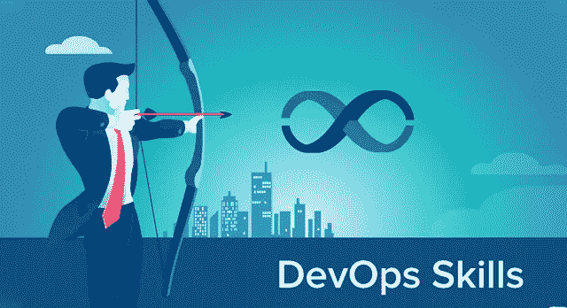
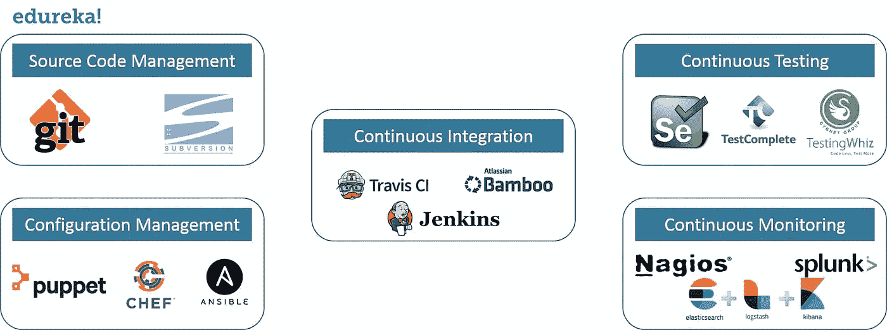
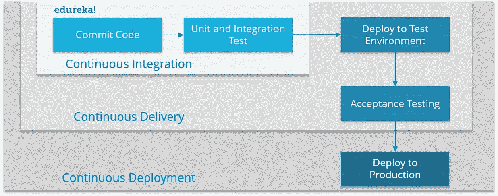
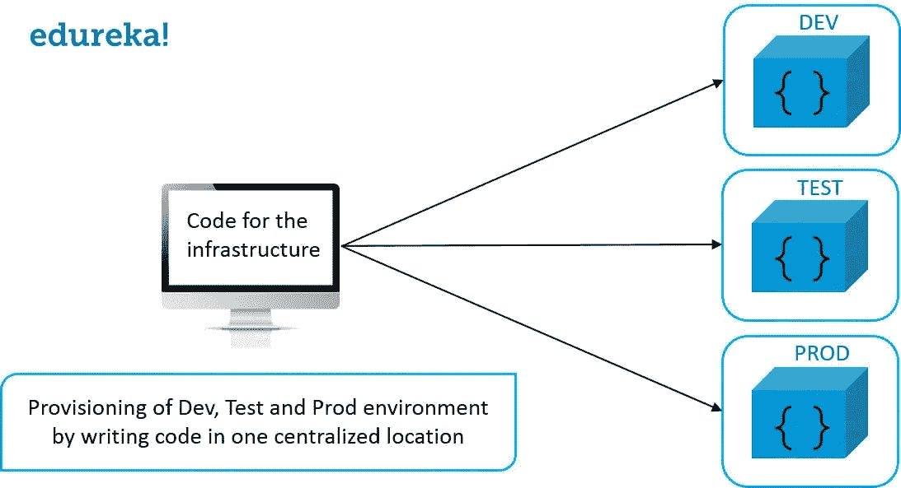

# 开发运维路线图—组织寻求的 6 大开发运维技能

> 原文：<https://medium.com/edureka/devops-skills-f6a7614ac1c7?source=collection_archive---------1----------------------->

DevOps Skills — Edureka

DevOps 现在是业内的流行语。每个组织都在使用 DevOps 实践，但是这些公司在 DevOps 工程师身上寻找什么呢？这个关于 DevOps 技能的博客将解释成为一名成功的 DevOps 专业人员所需的技能。这些技巧都是向各个公司的招聘人员咨询后收集的。

*以下是组织寻找的 6 项最重要的开发运维技能:*

1.  Linux 基础和脚本
2.  了解各种 DevOps 工具和技术
3.  持续集成和持续交付
4.  基础设施即代码(IAC)
5.  DevOps 关键概念
6.  软技能

# Linux 基础和脚本:

作为一名 DevOps 专业人员，您可能必须调配您的基础架构，因此为了实现自动化，您应该至少知道一种脚本语言。

大多数公司都在 Linux 上运行他们的环境，许多配置管理工具，如 Puppet、Chef 和 Ansible 都在 Linux 上运行它们的主节点。

要成为一名 DevOps 工程师，你必须了解 Linux 的基础知识和一门脚本语言的知识。脚本语言可以是任何语言，例如 Python、Ruby、Pearl 等。

# 了解各种 DevOps 工具和技术:

开发运维涉及多个阶段，这些阶段有多种工具可用。你应该对这些**开发**、**测试**和**部署**技术了如指掌。

# 持续集成和持续交付:

了解各种工具是不够的，你应该知道在哪里使用这些工具。

应该使用这些工具来促进持续集成和持续交付。在少数情况下甚至是连续部署，但是连续部署并不被认为是一个好的实践。考虑下面的图表来理解其中的区别。

# 基础设施即代码:

*代码为* (IAC)的基础设施是一种 IT *基础设施*，运营团队可以通过*代码*自动管理和供应，而不是使用手动流程。*代码为*的基础设施有时被称为可编程*基础设施*。

随着 IAC 的出现，开发人员和系统操作员之间的界限越来越模糊。

有多种可用的工具，如木偶，厨师，Ansible，盐栈等。

如果你想成为 DevOps 专业人士，这个技能是必须的。

# DevOps 关键概念:

到目前为止，我只讨论了技术技巧。但是请记住，DevOps 不是一种技术，而是一种方法论。

这种方法旨在将组织的**开发**和**运营**部分结合在一起，及时发布高质量的软件。如果您理解这种方法的关键概念，您将能够为各种业务问题提供更好的解决方案。

# 软技能:

每当开发人员和操作人员彼此清楚地交流时，他们不仅及时开发和发布高质量的软件，而且可以帮助以更低的成本和更好的质量销售应用程序。

DevOps 专业人员有时也有助于培养与企业和客户的积极关系。

对该领域感兴趣的人需要能够专心倾听、谈判、解决问题和建立团队。

我希望你喜欢阅读这篇关于 DevOps 技能的文章。如果你想查看更多关于人工智能、Python、道德黑客等市场最热门技术的文章，你可以参考 Edureka 的官方网站。

请留意本系列中的其他文章，它们将解释 DevOps 的各个方面。

> *1。* [*DevOps 教程*](/edureka/devops-tutorial-89363dac9d3f)
> 
> *2。* [*Git 教程*](/edureka/git-tutorial-da652b566ece)
> 
> *3。* [*詹金斯教程*](/edureka/jenkins-tutorial-68110a2b4bb3)
> 
> *4。* [*码头工人教程*](/edureka/docker-tutorial-9a6a6140d917)
> 
> *5。* [*Ansible 教程*](/edureka/ansible-tutorial-9a6794a49b23)
> 
> *6。* [*木偶教程*](/edureka/puppet-tutorial-848861e45cc2)
> 
> *7。* [*厨师教程*](/edureka/chef-tutorial-8205607f4564)
> 
> *8。* [*Nagios 教程*](/edureka/nagios-tutorial-e63e2a744cc8)
> 
> *9。* [*如何编排 DevOps 工具？*](/edureka/devops-tools-56e7d68994af)
> 
> *10。* [*连续交货*](/edureka/continuous-delivery-5ca2358aedd8)
> 
> *11。* [*持续集成*](/edureka/continuous-integration-615325cfeeac)
> 
> *12。* [*连续部署*](/edureka/continuous-deployment-b03df3e3c44c)
> 
> *13。* [*持续交付 vs 持续部署*](/edureka/continuous-delivery-vs-continuous-deployment-5375642865a)
> 
> *14。* [*CI CD 管道*](/edureka/ci-cd-pipeline-5508227b19ca)
> 
> 15。 [*Docker 撰写*](/edureka/docker-compose-containerizing-mean-stack-application-e4516a3c8c89)
> 
> *16。* [*码头工人群*](/edureka/docker-swarm-cluster-of-docker-engines-for-high-availability-40d9662a8df1)
> 
> *17。* [*码头工人联网*](/edureka/docker-networking-1a7d65e89013)
> 
> 18。 [*天穹*](/edureka/ansible-vault-secure-secrets-f5c322779c77)
> 
> 19。 [*可替代角色*](/edureka/ansible-roles-78d48578aca1)
> 
> 20。 [*适用于 AWS*](/edureka/ansible-for-aws-provision-ec2-instance-9308b49daed9)
> 
> *21。* [*詹金斯管道*](/edureka/jenkins-pipeline-tutorial-continuous-delivery-75a86936bc92)
> 
> *22。* [*顶级 Docker 命令*](/edureka/docker-commands-29f7551498a8)
> 
> *23。*[*Git vs GitHub*](/edureka/git-vs-github-67c511d09d3e)
> 
> *24。* [*顶级 Git 命令*](/edureka/git-commands-with-example-7c5a555d14c)
> 
> *25。* [*DevOps 面试问题*](/edureka/devops-interview-questions-e91a4e6ecbf3)
> 
> *26。* [*谁是 DevOps 工程师？*](/edureka/devops-engineer-role-481567822e06)
> 
> *27。* [*DevOps 生命周期*](/edureka/devops-lifecycle-8412a213a654)
> 
> *28。*[*Git Reflog*](/edureka/git-reflog-dc05158c1217)
> 
> *29。*
> 
> **30。* [*瀑布 vs 敏捷*](/edureka/waterfall-vs-agile-991b14509fe8)*
> 
> **31。* [*Maven 用于构建 Java 应用*](/edureka/maven-tutorial-2e87a4669faf)*
> 
> **32。* [*詹金斯备忘单*](/edureka/jenkins-cheat-sheet-e0f7e25558a3)*
> 
> *33。*
> 
> **34。 [*Ansible 面试问答*](/edureka/ansible-interview-questions-adf8750be54)**
> 
> **35。 [*50 Docker 面试问题*](/edureka/docker-interview-questions-da0010bedb75)**
> 
> ***36。* [*敏捷方法论*](/edureka/what-is-agile-methodology-fe8ad9f0da2f)**
> 
> **37。 [*詹金斯面试问题*](/edureka/jenkins-interview-questions-7bb54bc8c679)**
> 
> **38。 [*Git 面试问题*](/edureka/git-interview-questions-32fb0f618565)**
> 
> **39。 [*Docker 架构*](/edureka/docker-architecture-be79628e076e)**
> 
> ***40。*[*devo PS 中使用的 Linux 命令*](/edureka/linux-commands-in-devops-73b5a2bcd007)**
> 
> ***41。* [*詹金斯 vs 竹子*](/edureka/jenkins-vs-bamboo-782c6b775cd5)**
> 
> ***42。* [*Nagios 面试问题*](/edureka/nagios-interview-questions-f3719926cc67)**
> 
> ***43。* [*DevOps 实时场景*](/edureka/jenkins-x-d87c0271af57)**
> 
> ***44。* [*詹金斯和詹金斯 X 的区别*](/edureka/jenkins-vs-bamboo-782c6b775cd5)**
> 
> ***45。*[*Docker for Windows*](/edureka/docker-for-windows-ed971362c1ec)**
> 
> ***46。*[*Git vs Github*](http://git%20vs%20github/)**

***原载于 2018 年 3 月 16 日*[*https://www.edureka.co*](https://www.edureka.co/blog/devops-skills)*。***