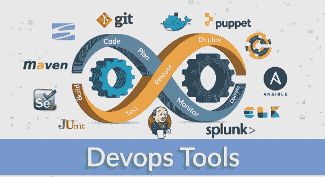
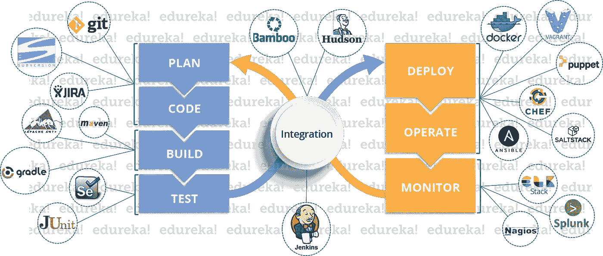
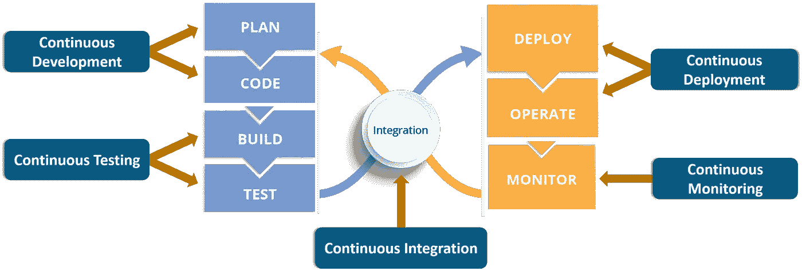
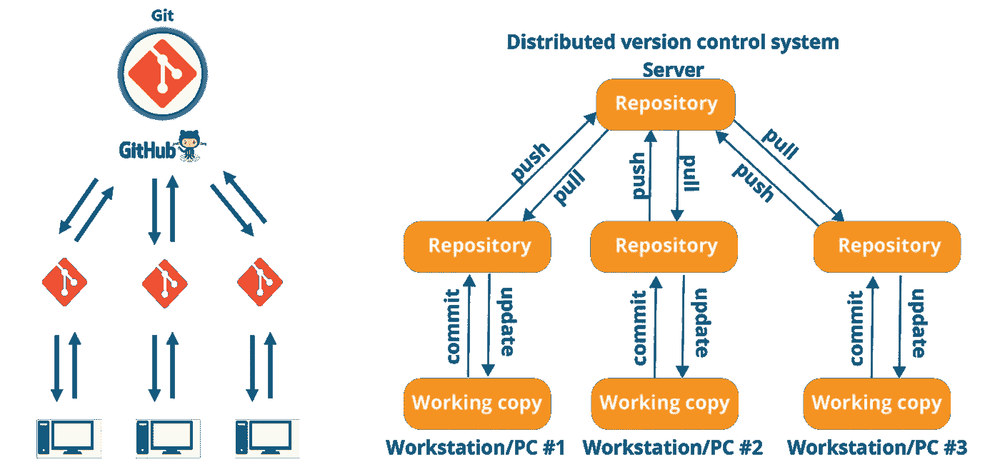
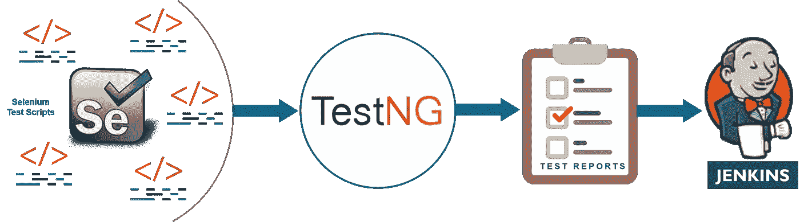
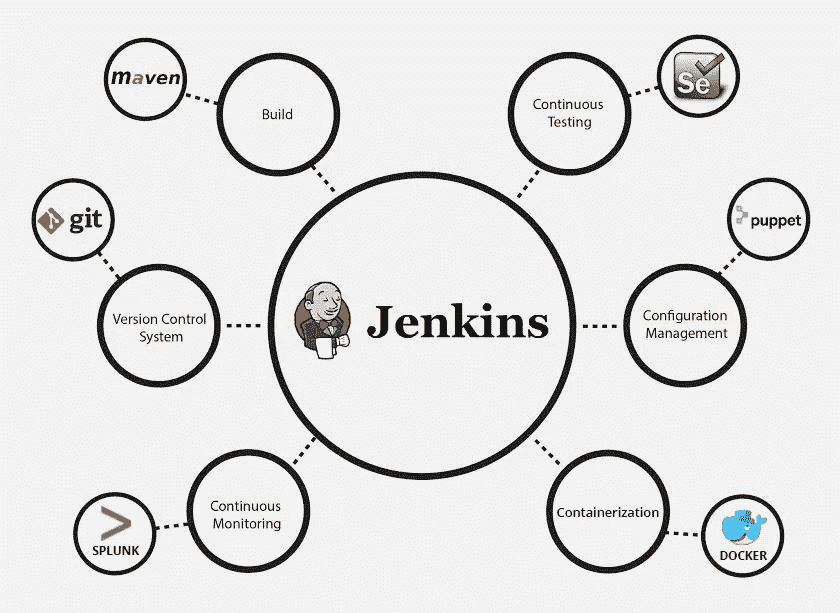
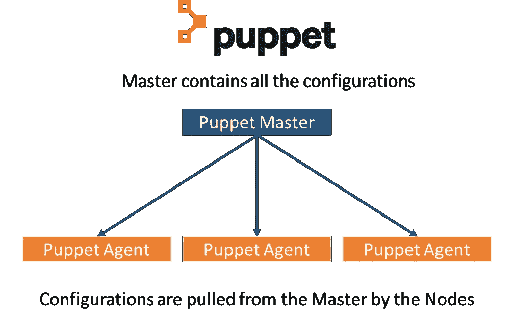
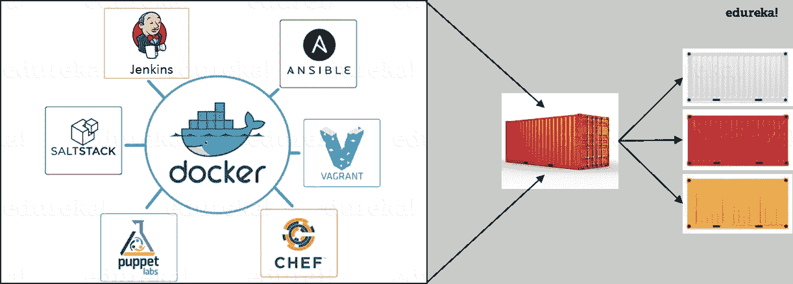

# 如何协调 DevOps 工具来解决我们的问题？

> 原文：<https://medium.com/edureka/devops-tools-56e7d68994af?source=collection_archive---------0----------------------->

DevOps Tools - Edureka

DevOps 是一种软件开发方法，包括持续开发、持续测试、持续集成、持续部署以及在整个开发生命周期中对软件的持续监控。为了通过这些阶段，我们需要 DevOps 工具。在本文中，我们将讨论在生命周期中可以使用的各种 DevOps 工具。

那我们开始吧。

# DevOps 工具

在继续之前，让我们回顾一下不同的工具以及它们在 DevOps 生命周期中的位置。

# 开发运维生命周期阶段(开发运维工具)

嗯，我很确定你对上面的图片印象深刻。但是，您可能仍然会遇到将工具与不同阶段相关联的问题。不是吗？

在这种情况下，让我们后退一步，首先了解 DevOps 生命周期中的各个阶段。以下是任何软件/应用程序在开发 DevOps 生命周期时必须经历的 5 个不同阶段

1.  持续发展
2.  连续测试
3.  连续累计
4.  持续部署
5.  连续监视

## 1.持续发展

这是涉及软件应用程序功能的“T0”计划“T1”和“T2”编码“T3”的阶段。没有用于规划的工具，但是有许多用于维护代码的工具。

项目的远景是在“规划”阶段决定的，然后当他们开始编写代码时，这个行为被称为“编码”阶段。

代码可以用任何语言编写，但是通过使用**版本控制**工具来维护。这些是持续开发 DevOps 工具。最常用的工具有 **Git** 、 **SVN** 、 **Mercurial** 、 **CVS、**和 **JIRA** 。

那么为什么代码的主要版本很重要呢？它解决了开发与运营的哪个问题？让我们先了解一下。

*   版本被维护(在一个中央存储库中)，以保存真实的单一来源。以便所有的开发人员可以在“最新提交”的代码上进行协作，甚至运营部门在计划发布时也可以访问相同的代码。
*   无论何时在发布过程中发生不幸，或者即使代码中有很多 bug(错误的特性)，也没有什么可担心的。Ops 可以快速回滚已部署的代码，从而恢复到之前的稳定状态。

那么，哪个是我最喜欢的工具呢？那一定是 Git & GitHub。为什么？因为 **Git** 允许开发者在分布式 VCS(版本控制系统)上相互协作。

因为不依赖于中央服务器，所以可以从远程位置对存储库进行“拉”和“推”。这个维护代码的中央存储库叫做 **GitHub** 。

Git 事实上是世界领先的版本控制系统。如果你不想相信我的话，你可以谷歌一下。所以让我们进入 DevOps 工具博客的下一个话题。

## 2.连续测试

当代码开发完成后，直接发布到部署是令人抓狂的。应该首先测试代码的缺陷和性能。我们能同意那个声明吗？

如果是，那么进行测试的程序是什么？会是手工测试吗？嗯，可以，但是效率很低。那么，什么更好呢？自动化测试？没错。听起来很棒，对吧？

自动化测试是对手工测试人员的大量呼声的回答。像 **Selenium** 、 **TestNG** 、 **JUnit** / **NUnit** 这样的工具被用来自动化测试用例的执行。那么，它有什么好处呢？

*   自动化测试为手动执行测试节省了大量的时间、精力和劳动。
*   除此之外，报告生成是一大优势。评估测试套件中哪些测试用例失败的任务变得更加简单。
*   这些测试也可以被安排在预先定义的时间执行。太棒了，对吧？

开发应用程序时对这些工具的持续使用构成了 DevOps 生命周期中的'**持续测试**'阶段。哪一个是我最喜欢的工具？实际上是这些工具的组合！

硒是我的最爱，但是**没有 **TestNG** 的硒**就相当于没有毒刺的蛇，至少从 DevOps 生命周期的角度来看是这样的。

Selenium 进行自动化测试，报告由 TestNG 生成。但是为了自动化整个测试阶段，我们需要一个**触发器，**对吗？那么，导火索是什么？这就是持续集成工具**的作用，比如 **Jenkins** 的作用。**

现在，让我们进入 DevOps 工具博客的下一个主题。

## 3.连续累计

这是最辉煌的 DevOps 阶段。在发布的第一个周期，这可能没有意义，但是你会理解这个阶段的重要性。

等等，这不完全正确。持续集成 (CI)甚至在第一次发布时就发挥了重要作用。它有助于将 CI 工具与配置管理工具集成起来进行部署。

毫无疑问，市场上最受欢迎的 **CI** 工具是 **Jenkins** 。就我个人而言，Jenkins 是我最喜欢的 DevOps 工具。其他流行的 CI 工具是**竹**和**逊**。

为什么我对持续集成工具如此推崇？因为它们将整个' **DevOps 结构**'结合在一起。

是 CI 工具编排了属于其他 DevOps 生命周期阶段的工具的自动化。无论是持续开发工具，还是持续测试工具，还是持续部署工具，甚至是持续监控工具，**持续集成**工具都可以与它们集成。

*   当与 Git/ SVN 集成时，Jenkins 可以**自动调度作业**(从共享的存储库中提取代码)，并为**构建**和**测试**(持续开发)做好准备。Jenkins 可以在一天中的预定时间或每当有提交推送到中央存储库时构建作业。
*   当与 Selenium 这样的测试工具集成时，我们可以实现连续测试。怎么会？可以使用 Maven/ Ant/ Gradle 等工具构建开发的代码。
    当代码构建完成后，Selenium 可以 ***自动执行代码*** 。它是如何实现自动化的？通过创建一套测试用例并一个接一个地执行测试用例。
    Jenkins/Hudson/Bamboo 在这里的角色是调度/自动化“Selenium 来自动化测试用例执行”。
*   当与持续部署工具集成时，Jenkins/ Hudson/ Bamboo 可以**触发**由配置管理/容器化工具规划的**部署**。
*   最后，Jenkins/ Hudson 可以与 Splunk/ ELK/ Nagios/ NewRelic 等监控工具集成，以持续**监控已经进行部署的服务器的**状态&性能**。**

因为 CI 工具能够做到这一点以及更多，所以它们是我的最爱。因此我声明: *Jenkins 是一个基本的 DevOps 工具*。

## 4.持续部署

这(持续部署)是行动实际发生的阶段。我们已经看到了帮助我们从头开始构建代码的工具，也看到了帮助测试的工具。现在是时候理解为什么没有**配置管理**工具或者**容器化**工具 DevOps 会不完整了。这两套工具都有助于实现连续部署(CD)。

## 配置管理工具

*   配置管理是在应用程序的功能需求和性能中建立和维护一致性的行为。简而言之，它是**向服务器发布部署**的行为，**在所有服务器上调度更新**，最重要的是保持所有服务器上的**配置一致**。
*   为此，我们有像**木偶**、**厨师**、 **Ansible** 、 **SaltStack** 等工具。但这里最好的工具是木偶。Puppet &其他 CM 工具基于主从架构工作。当对主服务器进行部署时，主服务器负责将这些更改复制到所有从服务器上，无论数量多少！很神奇吧？

现在让我们转向集装箱化。

## 集装箱工具

*   容器化工具是帮助在开发、测试和部署应用程序的环境中保持一致性的其他工具集。它通过**打包**和**复制**在开发/测试/试运行环境中使用的相同依赖项和包，消除了生产环境中任何出错/失败的可能性。
*   这里明显的赢家是 Docker，它是有史以来第一个集装箱工具。以前，维护环境一致性是一项挑战，因为要使用虚拟机和服务器，并且必须手动管理它们的环境才能实现一致性。***Docker containers***把这个挑战抛到上面，炸得落花流水。(双关意！)

*   另一个集装箱化的工具是**流浪者**。但是最近，许多云解决方案已经开始为容器服务提供支持。**亚马逊 ECS** 、 **Azure 容器服务、**和**谷歌容器引擎**是已经开始激进支持 Docker 容器的云服务中的几个。这就是为什么 Docker 是明显的赢家。

现在，让我们进入 DevOps 工具博客的最后一个话题。

## 5.连续监视

那么，如果我们不监控应用程序的性能，那么开发和部署它又有什么意义呢？监控和开发应用程序一样重要，因为在测试阶段总有可能会出现未被发现的漏洞。

哪些工具属于这一阶段？ **Splunk** 、 **ELK Stack** 、 **Nagios** 、 **Sensu** 、 **NewRelic** 都是一些比较流行的监控工具。当与 Jenkins 结合使用时，我们可以实现连续监控。那么，监控有什么帮助呢？

*   为了最小化错误特性的后果，监控是一个很大的附加功能。有缺陷的功能通常会导致经济损失。所以，更有理由进行持续监控。
*   监控工具还会在您的客户/顾客体验到故障特征之前报告故障/不利条件。我们不都更喜欢这样吗？

这里我最喜欢的工具是什么？我更喜欢 Splunk 或 ELK stack。这两个工具是主要的竞争对手。它们提供了几乎相同的功能。但是它们提供功能的方式是不同的。

Splunk 是一个专有工具(付费工具)。但是，这也实际上意味着在 Splunk 上工作非常容易。然而，ELK stack 是 3 个开源工具的组合:ElasticSearch、LogStash & Kibana。它可能是免费的，但设置起来不像 Splunk 这样的商业工具那么容易。您可以尝试这两种方法，找出对您的组织更好的方法。

这些是 DevOps 生命周期的各个阶段，以及在这些情况下无缝配合的工具。我希望您了解这些 DevOps 工具在行业中的应用。

我希望你喜欢阅读这篇文章。如果你想查看更多关于人工智能、Python、道德黑客等市场最热门技术的文章，你可以参考 Edureka 的官方网站。

请留意本系列中的其他文章，它们将解释 DevOps 的各个方面。

> *1。* [*DevOps 教程*](/edureka/devops-tutorial-89363dac9d3f)
> 
> *2。* [*Git 教程*](/edureka/git-tutorial-da652b566ece)
> 
> *3。* [*詹金斯教程*](/edureka/jenkins-tutorial-68110a2b4bb3)
> 
> *4。* [*码头工人教程*](/edureka/docker-tutorial-9a6a6140d917)
> 
> *5。* [*Ansible 教程*](/edureka/ansible-tutorial-9a6794a49b23)
> 
> *6。* [*木偶教程*](/edureka/puppet-tutorial-848861e45cc2)
> 
> *7。* [*厨师教程*](/edureka/chef-tutorial-8205607f4564)
> 
> *8。* [*Nagios 教程*](/edureka/nagios-tutorial-e63e2a744cc8)
> 
> *9。* [*连续交货*](/edureka/continuous-delivery-5ca2358aedd8)
> 
> *10。* [*持续集成*](/edureka/continuous-integration-615325cfeeac)
> 
> *11。* [*连续部署*](/edureka/continuous-deployment-b03df3e3c44c)
> 
> *12。* [*持续交付 vs 持续部署*](/edureka/continuous-delivery-vs-continuous-deployment-5375642865a)
> 
> 13。 [*CI CD 管道*](/edureka/ci-cd-pipeline-5508227b19ca)
> 
> *14。* [*Docker 撰写*](/edureka/docker-compose-containerizing-mean-stack-application-e4516a3c8c89)
> 
> *15。* [*码头工人群*](/edureka/docker-swarm-cluster-of-docker-engines-for-high-availability-40d9662a8df1)
> 
> 16。 [*Docker 联网*](/edureka/docker-networking-1a7d65e89013)
> 
> 17。 [*可替代角色*](/edureka/ansible-roles-78d48578aca1)
> 
> 18。
> 
> **19。* [*适用于 AWS*](/edureka/ansible-for-aws-provision-ec2-instance-9308b49daed9)*
> 
> **20。* [*詹金斯管道*](/edureka/jenkins-pipeline-tutorial-continuous-delivery-75a86936bc92)*
> 
> **21。* [*顶级 Git 命令*](/edureka/git-commands-with-example-7c5a555d14c)*
> 
> **22。* [*顶级 Docker 命令*](/edureka/docker-commands-29f7551498a8)*
> 
> **23。*[*Git vs GitHub*](/edureka/git-vs-github-67c511d09d3e)*
> 
> **24。* [*DevOps 面试问题*](/edureka/devops-interview-questions-e91a4e6ecbf3)*
> 
> **25。* [*谁是 DevOps 工程师？*](/edureka/devops-engineer-role-481567822e06)*
> 
> **26。* [*DevOps 生命周期*](/edureka/devops-lifecycle-8412a213a654)*
> 
> **27。*[*Git ref log*](/edureka/git-reflog-dc05158c1217)*
> 
> **28。**
> 
> ***29。* [*组织寻找的顶尖 DevOps 技能*](/edureka/devops-skills-f6a7614ac1c7)**
> 
> ***三十。* [*瀑布 vs 敏捷*](/edureka/waterfall-vs-agile-991b14509fe8)**
> 
> **31。 [*Maven 用于构建 Java 应用*](/edureka/maven-tutorial-2e87a4669faf)**
> 
> **32。 [*詹金斯小抄*](/edureka/jenkins-cheat-sheet-e0f7e25558a3)**
> 
> ***33。***
> 
> ****34。* [*Ansible 面试问答*](/edureka/ansible-interview-questions-adf8750be54)***
> 
> **35。 [*50 码头工人面试问题*](/edureka/docker-interview-questions-da0010bedb75)**
> 
> ***三十六。* [*敏捷方法论*](/edureka/what-is-agile-methodology-fe8ad9f0da2f)**
> 
> **37。 [*詹金斯面试问题*](/edureka/jenkins-interview-questions-7bb54bc8c679)**
> 
> ***38。* [*Git 面试问题*](/edureka/git-interview-questions-32fb0f618565)**
> 
> ***39。* [*Docker 架构*](/edureka/docker-architecture-be79628e076e)**
> 
> **40。 [*Linux 中使用的命令 DevOps*](/edureka/linux-commands-in-devops-73b5a2bcd007)**
> 
> ***41。* [*詹金斯 vs 竹子*](/edureka/jenkins-vs-bamboo-782c6b775cd5)**
> 
> ***42。* [*Nagios 面试问题*](/edureka/nagios-interview-questions-f3719926cc67)**
> 
> ***43。* [*DevOps 实时场景*](/edureka/jenkins-x-d87c0271af57)**
> 
> ***44。* [*詹金斯和詹金斯 X 的区别*](/edureka/jenkins-vs-bamboo-782c6b775cd5)**
> 
> ***45。*[*Windows Docker*](/edureka/docker-for-windows-ed971362c1ec)**
> 
> ***46。*[*Git vs Github*](http://git%20vs%20github/)**

***原载于 2017 年 10 月 18 日*[*www.edureka.co*](https://www.edureka.co/blog/devops-tools)*。***