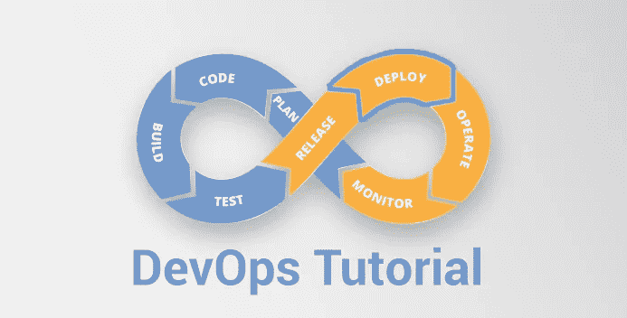
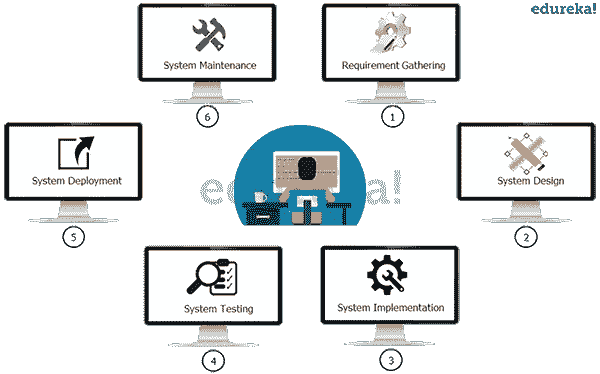
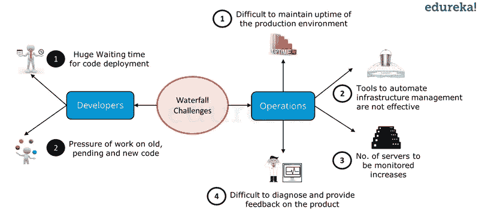
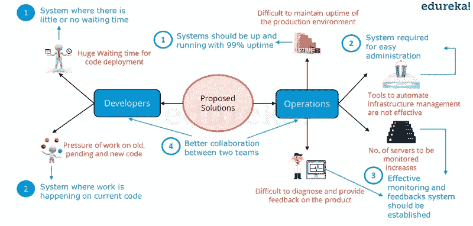
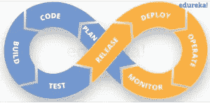
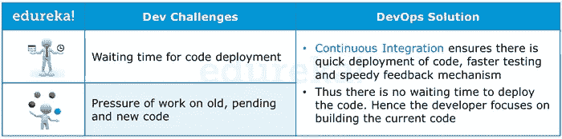
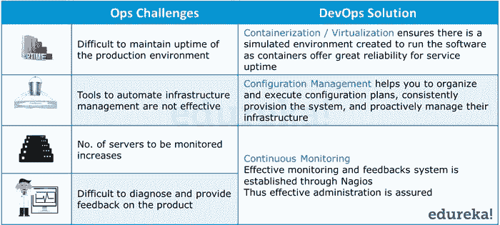

# DevOps 教程—为什么&什么是 DevOps？

> 原文：<https://medium.com/edureka/devops-tutorial-89363dac9d3f?source=collection_archive---------0----------------------->

出于对 DevOps 的浓厚兴趣，我想到了一系列博客，这些博客将向您介绍软件开发中正在采用的新文化，并帮助您理解它的全部内容。这是系列博客 as-**devo PS 教程**中的第一篇。

# DevOps 教程

这个 DevOps 教程博客系列将让您熟悉 DevOps 方法&行业范围内使用的工具。在这篇博客中，我将带你经历以下事情，这将是接下来的博客的基础:

*   是什么导致了 DevOps 的存在
*   DevOps 简介

# 瀑布模型

让我们考虑使用瀑布模型以传统方式开发软件。

Waterfall Model - DevOps Tutorial

在上图中，您将看到它将涉及的阶段:

*   在阶段 1-收集完整的需求并开发 SRS
*   在第二阶段-使用 SRS 计划和设计该系统
*   在第 3 阶段——实施系统
*   第 4 阶段-系统经过测试，质量得到保证
*   第 5 阶段-系统部署到最终用户
*   在阶段 6 -系统的定期维护已经完成

# 瀑布模型挑战

瀑布模型运行良好，服务多年，但它有一些挑战。在下图中，突出显示了瀑布模型的挑战。

Waterfall Model Challenges - DevOps Tutorial

在上图中，您可以看到开发和运营在瀑布模型中都面临着挑战。从开发者的角度来看，主要有两个挑战:

1.  开发之后，代码部署时间非常长。

2.由于开发和部署时间长，旧代码、待定代码和新代码的工作压力很大。

另一方面，运营部门也不完全满意。如上图所示，他们面临四大挑战:

1.  很难保持生产环境 100%的正常运行时间。

2.基础设施自动化工具不是很有效。

3.随着时间的推移，要监控的服务器数量不断增加，复杂性也随之增加。

4.很难提供反馈和诊断产品中的问题。

在下图中，突出显示了针对瀑布模型挑战的建议解决方案。

Solutions To Waterfall Model - DevOps Tutorial

在上图中，开发人员和运营人员所面临问题的可能解决方案以蓝色突出显示。这为理想的软件开发策略设定了指导方针。

从开发者的角度来看:

1.  一种能够实现代码部署而没有任何延迟或等待时间的系统。

2.一个在当前代码本身上工作的系统，即开发冲刺是短的和计划好的。

从运营的角度来看:

1.  系统应该至少有 99%的正常运行时间。

2.工具和系统已准备就绪，便于管理。

3.应该有有效的监测和反馈系统。

4.开发和运营之间更好的协作，这是开发人员和运营团队的共同要求。

DevOps 整合了开发人员和运营团队，以提高协作和生产力。

根据 DevOps 文化，一组工程师(开发人员、系统管理员、QA)。测试人员等转变为 DevOps 工程师)对应用程序(软件)负有端到端的责任，从收集需求到开发、测试、基础设施部署、应用程序部署，最后监控并收集来自最终用户的反馈，然后再次实施变更。

这是一个永无止境的循环，DevOps 的标志对我来说意义非凡。看看上面的图表就知道了

还有什么比无穷大更好的符号来象征 DevOps 呢？

现在让我们看看 DevOps 如何应对开发和运营面临的挑战。下表描述了 DevOps 如何应对开发挑战。

How DevOps solves Dev Challenges - DevOps Tutorial

下表进一步描述了 DevOps 如何应对运营挑战。

How DevOps solves Ops Challenges - DevOps Tutorial

然而，您可能仍然想知道如何实现 DevOps。为了加速和实现 DevOps 过程，除了在文化上接受它之外，还需要各种 DevOps 工具，如 *Puppet、Jenkins、g it、Chef、Docker、* *Selenium、AWS* 等，以在各个阶段实现自动化，这有助于实现持续开发、持续集成、持续测试、持续部署、持续监控，从而以非常快的速度向客户交付高质量的软件。

现在用各种 DevOps 工具仔细看看下面的 DevOps 图，并尝试解码它。

DevOps Tools - DevOps Tutorial

这些工具被分为开发运维的不同阶段。因此，重要的是，我首先告诉你关于 DevOps 阶段，然后谈论更多关于 DevOps 工具。

开发运维生命周期可以大致分为以下开发运维阶段:

*   持续发展
*   连续累计
*   连续测试
*   连续监视
*   虚拟化和集装箱化

这些阶段是整体实现 DevOps 的基础。

这就结束了 DevOps 教程的博客。如果你想查看更多关于人工智能、Python、道德黑客等市场最热门技术的文章，你可以参考 Edureka 的官方网站。

请留意本系列中的其他文章，它们将解释 DevOps 的各个方面。

> *1。* [*Git 教程*](/edureka/git-tutorial-da652b566ece)
> 
> *2。* [*詹金斯教程*](/edureka/jenkins-tutorial-68110a2b4bb3)
> 
> *3。* [*码头工人教程*](/edureka/docker-tutorial-9a6a6140d917)
> 
> *4。* [*Ansible 教程*](/edureka/ansible-tutorial-9a6794a49b23)
> 
> *5。* [*傀儡教程*](/edureka/puppet-tutorial-848861e45cc2)
> 
> *6。* [*厨师教程*](/edureka/chef-tutorial-8205607f4564)
> 
> *7。* [*Nagios 教程*](/edureka/nagios-tutorial-e63e2a744cc8)
> 
> *8。* [*如何编排 DevOps 工具？*](/edureka/devops-tools-56e7d68994af)
> 
> 9。 [*连续交货*](/edureka/continuous-delivery-5ca2358aedd8)
> 
> *10。* [*持续集成*](/edureka/continuous-integration-615325cfeeac)
> 
> *11。* [*连续部署*](/edureka/continuous-deployment-b03df3e3c44c)
> 
> *12。* [*连续交付 vs*](/edureka/continuous-delivery-vs-continuous-deployment-5375642865a)
> 
> *13。* [*CI CD 管道*](/edureka/ci-cd-pipeline-5508227b19ca)
> 
> *14。* [*Docker 作曲*](/edureka/docker-compose-containerizing-mean-stack-application-e4516a3c8c89)
> 
> *15。* [*码头工人群*](/edureka/docker-swarm-cluster-of-docker-engines-for-high-availability-40d9662a8df1)
> 
> *16。* [*Docker 联网*](/edureka/docker-networking-1a7d65e89013)
> 
> *17。* [*可能的角色*](/edureka/ansible-roles-78d48578aca1)
> 
> *18。* [*天穹*](/edureka/ansible-vault-secure-secrets-f5c322779c77)
> 
> *19。* [*适用于 AWS*](/edureka/ansible-for-aws-provision-ec2-instance-9308b49daed9)
> 
> *20。* [*詹金斯*](/edureka/jenkins-pipeline-tutorial-continuous-delivery-75a86936bc92)
> 
> *21。* [*顶级 Git 命令*](/edureka/git-commands-with-example-7c5a555d14c)
> 
> *22。* [*顶级 Docker 命令*](/edureka/docker-commands-29f7551498a8)
> 
> *23。*[*Git vs GitHub*](/edureka/git-vs-github-67c511d09d3e)
> 
> *24。* [*DevOps 面试题*](/edureka/devops-interview-questions-e91a4e6ecbf3)
> 
> 25。 [*谁是 DevOps 工程师？*](/edureka/devops-engineer-role-481567822e06)
> 
> *26。* [*DevOps 生命周期*](/edureka/devops-lifecycle-8412a213a654)
> 
> *27。*[*Git ref log*](/edureka/git-reflog-dc05158c1217)
> 
> 28。 [*不可预见的准备*](/edureka/ansible-provisioning-setting-up-lamp-stack-d8549b38dc59)
> 
> *29。* [*组织正在寻找的顶尖 DevOps 技能*](/edureka/devops-skills-f6a7614ac1c7)
> 
> 三十。 [*瀑布 vs 敏捷*](/edureka/waterfall-vs-agile-991b14509fe8)
> 
> *31。* [*Maven 用于构建 Java 应用*](/edureka/maven-tutorial-2e87a4669faf)
> 
> *32。* [*詹金斯小抄*](/edureka/jenkins-cheat-sheet-e0f7e25558a3)
> 
> *33。* [*易答备忘单*](/edureka/ansible-cheat-sheet-guide-5fe615ad65c0)
> 
> *34。* [*Ansible 面试问答*](/edureka/ansible-interview-questions-adf8750be54)
> 
> *35。* [*50 码头工人面试问题*](/edureka/docker-interview-questions-da0010bedb75)
> 
> *36。* [*敏捷方法论*](/edureka/what-is-agile-methodology-fe8ad9f0da2f)
> 
> *37。* [*詹金斯面试问题*](/edureka/jenkins-interview-questions-7bb54bc8c679)
> 
> *38。* [*Git 面试问题*](/edureka/git-interview-questions-32fb0f618565)
> 
> *39。* [*Docker 架构*](/edureka/docker-architecture-be79628e076e)
> 
> *40。*[*devo PS 中使用的 Linux 命令*](/edureka/linux-commands-in-devops-73b5a2bcd007)
> 
> *41。* [*詹金斯 vs 竹子*](/edureka/jenkins-vs-bamboo-782c6b775cd5)
> 
> *42。* [*Nagios 面试问题*](/edureka/nagios-interview-questions-f3719926cc67)
> 
> *43。* [*DevOps 实时场景*](/edureka/jenkins-x-d87c0271af57)
> 
> 44。 [*詹金斯和詹金斯 X 的区别*](/edureka/jenkins-vs-bamboo-782c6b775cd5)
> 
> *45。*[*Windows Docker*](/edureka/docker-for-windows-ed971362c1ec)
> 
> *46。*[*Git vs Github*](http://git%20vs%20github/)

*原载于 2016 年 10 月 18 日*[*www.edureka.co*](https://www.edureka.co/blog/devops-tutorial)*。*