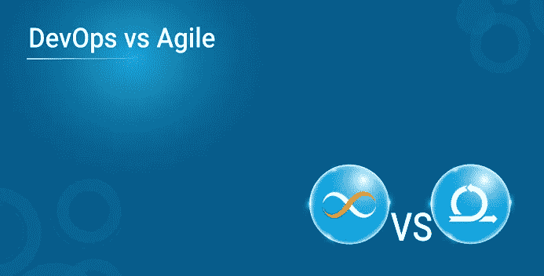
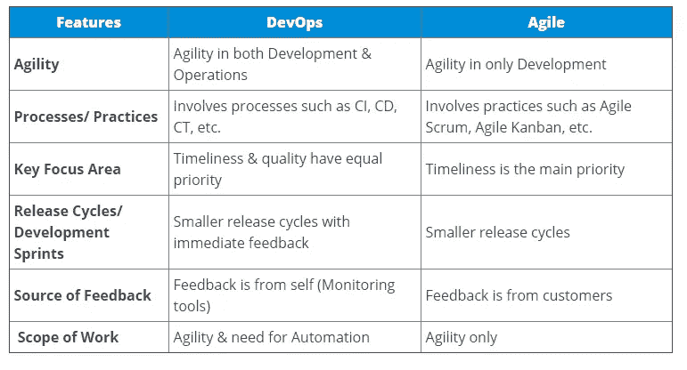
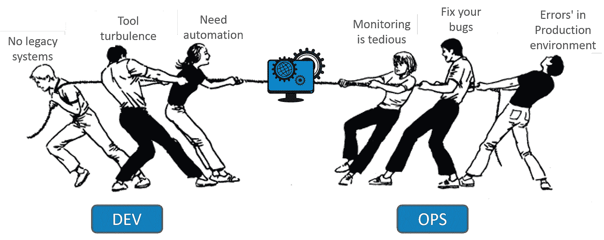

# DevOps vs 敏捷！你需要知道的一切

> 原文：<https://medium.com/edureka/devops-vs-agile-5bf708eb48ac?source=collection_archive---------5----------------------->

DevOps 是一个流行词，已经在业界流行了很长一段时间。尽管它很受欢迎，但是关于它和敏捷的区别，还是有很多困惑。什么更糟？ ***DevOps vs 敏捷*** 是 IT 行业永无止境的争论。

如果你想了解它们有多大的不同，以及哪一个比另一个更好，那么坚持到这篇“DevOps vs Agile”博客的结尾，在那里我将揭示一些行业秘密。但是，下表简要介绍了它们之间的差异。

你是一个有抱负的 DevOps 工程师，期待学习所有的 DevOps 工具吗？好吧，如果你是，那么你应该考虑学习所有的顶级工具。你的清单上必须有一个这样的工具是 Ansible。

# **DevOps vs 敏捷**

敏捷的基本原则是将敏捷引入开发。但是，DevOps 的创始原则是将敏捷性引入开发和运营。在我谈论 DevOps 和敏捷之间的技术差异之前，我想先理清一下背景。因此，我将讨论一些您应该了解的非技术差异。

需要注意的重要一点是，DevOps 并不是敏捷的替代品！听起来不对？不，敏捷不会死。但是，DevOps 更好吗？是的，这是一个进步。

虽然敏捷是瀑布模型和其他 Scrum 实践的自然替代品，但是 DevOps 不是替代品。但是，它是敏捷的直接继承者。

类似于如何随着时间的推移，实践变得更好；随着时间的推移，敏捷也面临着越来越多的挑战，DevOps 被证明是更优化的实践。

# 为什么 DevOps 比敏捷好？

让我们首先了解敏捷软件开发的挑战是什么。

敏捷软件开发是关于遵循一套及时创建高质量软件的最佳实践。但问题是，遵循的最佳实践涉及到在**筒仓**中工作的人。

我说的“筒仓”是指有些人将作为开发人员、测试人员或中间人工作，他们之间很少交流。由于他们之间的交流很少，他们不知道其他人在做什么，尽管他们也是同一个过程的一部分。

团队的这种筒仓式工作是臭名昭著的“指责游戏”的原因，当软件失败或有重大缺陷时，这种游戏就会发生。

# 责备游戏

当一个客户抱怨软件时，内部会互相指责。“开发”团队会指责“质量保证”团队。然后，QA 团队将矛头指向 ITOps 团队，ITOps 团队会将责任转移到 Dev 团队。

不管问题存在于开发的代码中，还是存在于部署代码的系统中，问题都是孤立的，因为没有人愿意承担失败的责任。

# 这个永恒问题的解决方案？

**DevOps** ！你应该已经猜到了。但是，您能猜到 DevOps 是如何克服孤岛的吗？

简单- DevOps 从中间打破了竖井。在 DevOps 中,“开发”团队,“ITOps”团队和“QA”团队并不是整个领域中独立工作的部分。但是，他们是‘一体’的。

DevOps 实践使用一个 *DevOps 工程师*——他做所有的事情:-开发代码，测试代码，并将完全相同的代码部署到生产中。那么，统一解决问题了吗？

是的，它解决了问题的一个主要方面。由于同一个 DevOps 工程师是多技能的，他将被给予整个过程的所有权:开发代码，单元测试/功能测试代码，以及将代码部署到登台/测试/生产服务器。

由于他是唯一的所有者，很少会出现问题。即使出现问题，最了解产品的人也会在工作岗位上。

说到最佳人选，DevOps 解决的另一个问题是依赖问题。所以，即使‘ITOps’的家伙不在，也不会有任何延迟。因为作为 DevOps 工程师,“ITOps”的角色很容易被其他任何人扮演。

# DevOps 是否只由 DevOps 工程师执行？

这就是问题所在。似乎 DevOps 工程师是唯一参与的人。但是，在现实世界中，DevOps 工程师被限制只能执行指定的角色，即使他们能够参与整个生命周期。

# 开发运维与敏捷之间的技术差异

敏捷开发涉及一系列实践，如*敏捷 Scrum* & *敏捷看板*。

DevOps 涉及一系列技术流程，如持续开发、持续集成(CI)、持续测试(CI)、持续部署(CD)和持续监控。

## 重点关注领域？

敏捷开发主要关注及时发布高质量的软件。

DevOps 更进一步。它专注于及时保证软件的质量。质量是通过*在软件部署后持续监控*软件应用来保证的。

## 发布周期/开发冲刺

敏捷关注于增量软件交付的更小的发布周期。

DevOps 通过增量交付和即时反馈关注更小的发布周期。

## 谁提供反馈？

在敏捷中，反馈大多是由客户给出的。

在 DevOps 中，反馈主要由内部团队来衡量(通过使用持续的监控工具)。

## 工作范围

敏捷主要关注速度或敏捷性。

DevOps 主要致力于通过编排各种 DevOp 工具来实现自动化。

现在，这篇 DevOps vs Agile 博客到此结束。请继续关注 Edureka，了解更多关于 DevOps 的有趣博客。为了更好地理解 DevOps 和敏捷之间的区别，你可以参考下面的视频。

这是我关于 Nagios 面试问题的文章的结尾。如果你想查看更多关于人工智能、Python、道德黑客等市场最热门技术的文章，你可以参考 Edureka 的官方网站。

请留意本系列中的其他文章，它们将解释 DevOps 的各个方面。

> *1。* [*DevOps 教程*](/edureka/devops-tutorial-89363dac9d3f)
> 
> *2。* [*Git 教程*](/edureka/git-tutorial-da652b566ece)
> 
> *3。* [*詹金斯教程*](/edureka/jenkins-tutorial-68110a2b4bb3)
> 
> *4。* [*码头工人教程*](/edureka/docker-tutorial-9a6a6140d917)
> 
> *5。* [*Ansible 教程*](/edureka/ansible-tutorial-9a6794a49b23)
> 
> *6。* [*木偶教程*](/edureka/puppet-tutorial-848861e45cc2)
> 
> *7。* [*厨师教程*](/edureka/chef-tutorial-8205607f4564)
> 
> *8。* [*Nagios 教程*](/edureka/nagios-tutorial-e63e2a744cc8)
> 
> *9。* [*如何编排 DevOps 工具？*](/edureka/devops-tools-56e7d68994af)
> 
> *10。* [*连续交货*](/edureka/continuous-delivery-5ca2358aedd8)
> 
> *11。* [*持续集成*](/edureka/continuous-integration-615325cfeeac)
> 
> *12。* [*连续部署*](/edureka/continuous-deployment-b03df3e3c44c)
> 
> *13。* [*持续交付 vs 持续部署*](/edureka/continuous-delivery-vs-continuous-deployment-5375642865a)
> 
> *14。* [*CI CD 管道*](/edureka/ci-cd-pipeline-5508227b19ca)
> 
> *15。* [*Docker 作曲*](/edureka/docker-compose-containerizing-mean-stack-application-e4516a3c8c89)
> 
> 16。 [*码头工人群*](/edureka/docker-swarm-cluster-of-docker-engines-for-high-availability-40d9662a8df1)
> 
> 17。 [*Docker 联网*](/edureka/docker-networking-1a7d65e89013)
> 
> 18。
> 
> **19。**
> 
> **20。[*Ansible for AWS*](/edureka/ansible-for-aws-provision-ec2-instance-9308b49daed9)**
> 
> ***21。* [*詹金斯管道*](/edureka/jenkins-pipeline-tutorial-continuous-delivery-75a86936bc92)**
> 
> ***二十二。* [*顶级 Docker 命令*](/edureka/docker-commands-29f7551498a8)**
> 
> ***23。*[*Git vs GitHub*](/edureka/git-vs-github-67c511d09d3e)**
> 
> ***24。* [*顶级 Git 命令*](/edureka/git-commands-with-example-7c5a555d14c)**
> 
> ***25。* [*DevOps 面试问题*](/edureka/devops-interview-questions-e91a4e6ecbf3)**
> 
> ***26。* [*谁是 DevOps 工程师？*](/edureka/devops-engineer-role-481567822e06)**
> 
> ***27。* [*DevOps 生命周期*](/edureka/devops-lifecycle-8412a213a654)**
> 
> ***28。*[*Git Reflog*](/edureka/git-reflog-dc05158c1217)**
> 
> ***29。* [*不可预见的准备*](/edureka/ansible-provisioning-setting-up-lamp-stack-d8549b38dc59)**
> 
> **三十。 [*组织正在寻找的顶尖 DevOps 技能*](/edureka/devops-skills-f6a7614ac1c7)**
> 
> ***三十。* [*瀑布 vs 敏捷*](/edureka/waterfall-vs-agile-991b14509fe8)**
> 
> ***31。* [*詹金斯小抄*](/edureka/jenkins-cheat-sheet-e0f7e25558a3)**
> 
> ***32。* [*Ansible 备忘单*](/edureka/ansible-cheat-sheet-guide-5fe615ad65c0)**
> 
> ***33。* [*Ansible 面试问答*](/edureka/ansible-interview-questions-adf8750be54)**
> 
> **34。 [*50 码头工人面试问题*](/edureka/docker-interview-questions-da0010bedb75)**
> 
> **35。 [*敏捷方法论*](/edureka/what-is-agile-methodology-fe8ad9f0da2f)**
> 
> **36。 [*詹金斯面试问题*](/edureka/jenkins-interview-questions-7bb54bc8c679)**
> 
> ***37。* [*Git 面试问题*](/edureka/git-interview-questions-32fb0f618565)**
> 
> **38。 [*Docker 架构*](/edureka/docker-architecture-be79628e076e)**
> 
> **39。[*devo PS 中使用的 Linux 命令*](/edureka/linux-commands-in-devops-73b5a2bcd007)**
> 
> **40。 [*詹金斯 vs 竹子*](/edureka/jenkins-vs-bamboo-782c6b775cd5)**
> 
> ***41。* [*Nagios 教程*](/edureka/nagios-tutorial-e63e2a744cc8)**
> 
> ***42。* [*Nagios 面试问题*](/edureka/nagios-interview-questions-f3719926cc67)**
> 
> ***43。* [*DevOps 实时场景*](/edureka/jenkins-x-d87c0271af57)**
> 
> ***44。* [*詹金斯和詹金斯 X 的区别*](/edureka/jenkins-vs-bamboo-782c6b775cd5)**
> 
> ***45。*[*Docker for Windows*](/edureka/docker-for-windows-ed971362c1ec)**
> 
> ***46。*[*Git vs Github*](http://git%20vs%20github/)**

***原载于 2018 年 2 月 20 日*[*https://www.edureka.co*](https://www.edureka.co/blog/devops-vs-agile-everything-you-need-to-know/)*。***