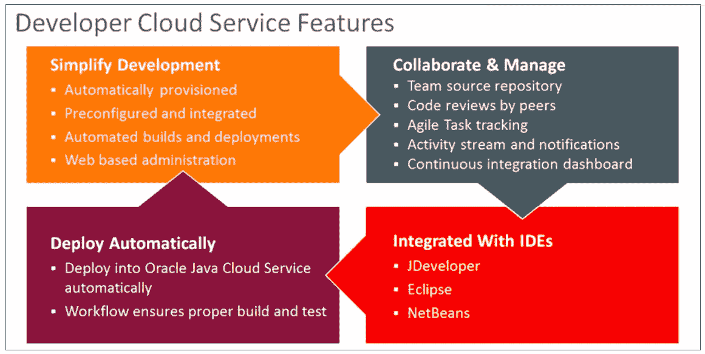
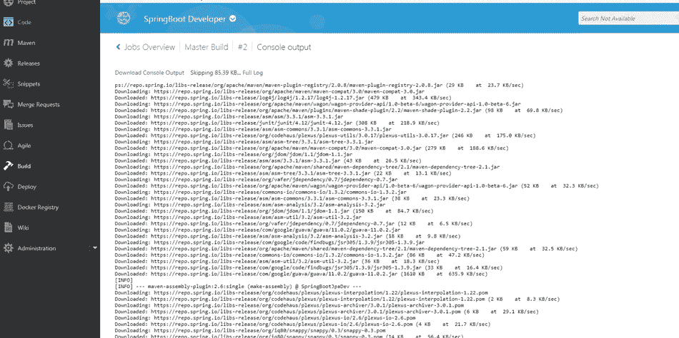
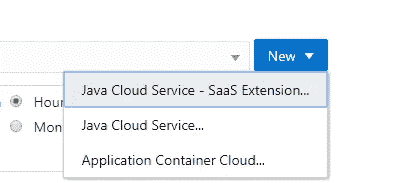

# 使用 Oracle 开发人员服务开发运维—将 SpringBoot 应用程序部署到 Oracle ACCS

> 原文：<https://medium.com/oracledevs/devops-with-oracle-developer-service-deploy-springboot-application-to-oracle-accs-7d3c30354cb2?source=collection_archive---------0----------------------->

开发人员需要遵循开发应用程序的敏捷方式。DevOps 是软件开发的新方式。开发人员需要在开始一个新项目之前建立一些支持服务。此服务的设置如下-

*   用于文档创作和与团队成员协作的 Wiki
*   版本控制
*   自动化构建。
*   代码审查
*   问题跟踪。

许多组织遵循这些标准来改进开发实践。但是在 Oracle 开发堆栈中，这些 DevOps 实践是全新的。而进一步阅读这篇文章，对他们来说会更有趣。

**开发者云服务**是您需要的所有支持服务的答案。它附带了其他云开发服务，即

*   Java 云服务。
*   数据库云服务
*   Java 云服务-SaaS 扩展
*   消息云服务
*   移动云服务
*   SOA 云服务和
*   应用容器云

DevCS 是一个完整的开发平台，以服务的形式提供，支持敏捷的开发流程，并自动化开发和交付。它涵盖了 DevOps 周期的大部分，包括持续集成、持续交付和协作。

Oracle 开发者云服务是托管在 Oracle 云上的类似软件和服务的集合。Oracle Developer Cloud Service 通过与 Hudson、Git、Maven、issues 和 wikis 的集成，帮助您高效管理应用开发生命周期。使用 Oracle Developer Cloud Service，您可以将应用程序源代码提交到 Oracle Cloud 上的 Git 存储库中，在线跟踪分配的问题和缺陷，使用 wiki 页面共享信息，对源代码进行同行评审，以及监控项目构建。测试成功后，您可以将项目部署到 Oracle Java Cloud Service — SaaS 扩展、公开提供的 Oracle Java Cloud Service 实例、Oracle Application Container Cloud Service 实例，或者部署到本地生产环境。

以下是 DevCs 中的组件

*   Ant，Maven，Gradle，npm，Grunt，Bower，Gulp，命令行
*   持续集成— Hudson
*   问题跟踪
*   代码审查
*   部署自动化
*   敏捷流程管理
*   维基网
*   版本管理— Git
*   构建自动化
*   活动流

您可以非常容易地将 DevCs 与 NetBeans 和 JDeveloper 链接起来，并高效地使用它。如果您的代码在外部 GitHub 帐户中，它也可以映射并让它为您工作。看看 Oracle 开发方法，DevOps 是一个相当新的术语，许多组织还没有做好准备。DevOps 可以成为他们的巨大支持。特别是使用 Oracle Forms、Pl/SQL、Apex、ADF 堆栈的客户，这非常有用，您可以在几个小时内设置好整个环境。所以毫无疑问，这是值得一试。。

**用例**—一家组织希望通过 Oracle 公共云为开发&测试建立 DevOps 实践。然而，生产仍在进行。在这种情况下，Oracle 开发者云服务可以将工件(如 JAR 文件)部署到 JCS (Java 云服务)或 ACCS(应用容器云服务)。为了在生产中进行部署，我们将为生产部署准备好工件，并放置在单独的 Git Hub 位置。

我在 Netbeans 中有 spring boot 应用程序。创建从 NetBeans 到开发者云服务的连接。点击团队-团队服务器-添加新服务器。

提供 DevCs 的凭据和 url。

连接到 DevCs 后，如果 DevCs 中存在项目，则在 Developer Cloud service 或 open project 中创建新项目。

导航到 DevCs 服务器，查看是否在控制台中创建了项目。打开 DevCs 控制台，新项目将成功创建。

您也可以在 DevCs 控制台中创建项目。选择安全性为私有或共享。

为新项目选择模板。有多种模板可用

如果你有现有的本地 github 帐户，那么你也可以从那里导入。单击完成。

之后，您会看到类似于

好了，现在项目是在 DevCs 中创建的，DevCs 是我们从 Netbeans 创建的。现在，我们将开始在代码部分上传代码。

现在转到构建部分来创建一个构建作业。在这里我创建了一个名为[的主构建](https://developer.us2.oraclecloud.com/developer20108-gse00011386/)的任务。转到主构建的配置部分。并单击源代码管理选项卡。在这里，您需要配置代码签入的存储库信息。

现在点击构建步骤。添加构建步骤“调用 Maven 3”。并定义在 maven.xml 中配置的适当目标

然后添加 maven goals 并选择 pom.xml 并提供 profile。

转到 post build 部分，并选择归档工件的选项。如果您想要运行 JUnit 测试用例，那么选择发布 JUnit 测试用例的选项。它将在开发者 CS 控制台上显示测试结果。您可以进行像发布 Javadoc 这样配置，配置为构建其他作业。点击保存。

您可以使用 schedule 设置这些构建触发点。

现在点击立即构建。它将运行构建存储库的作业，并显示该作业的状态。您还可以看到 Git 日志、审计、Junit 测试结果。这将需要一段时间，并显示您的建设进度。

您还可以为成功和失败的构建配置通知。

请参见“目标”下“上次成功构建的工件”选项卡中的“生成的归档文件”。展开来看

单击控制台查看构建控制台

现在，我们已经成功地生成了工件。现在，我们可以配置到 Oracle ACCS 的部署了。点击“部署”菜单选项，在您的 ACCS 帐户中配置和部署应用程序。

现在点击新配置。提供配置名称、应用程序名称。选择部署目标作为应用程序容器云

您可以选择以下不同的部署目标

如下选择 ACCS 属性，然后单击保存和部署。

现在，您可以看到部署状态，并且工件已成功部署到 Oracle ACCS。类似地，您可以将应用程序部署到 Java 云服务和 Java 云服务- SaaS 扩展。

您可以轻松地停止、重新部署和更改配置。

现在，如果将工件放置到单独的 GitHub 位置，我们也可以为此编写另一个构建作业。它将工件从 DevCs 转移到 GIT Hub。导航至“构建”,然后单击“新建作业”。

在构建步骤中，将构建步骤配置为执行 shell

你可以通过一些命令将存档复制到远程 GitHub 位置并推送。它的正常命令。就是这样。如果您看到，您可以轻松地在 Oracle Cloud 中跟踪整个 DevOps，它将提供大量开箱即用的功能。您还可以使用 hook up 通过开发人员云服务在内部配置 Jenkins。阅读这篇[文章。](https://community.oracle.com/community/oracle-cloud/oracle-cloud-developer-solutions/blog/2017/06/07/integrate-your-existing-hudsonjenkins-infrastructure-with-oracle-developer-cloud)

继续在这个空间寻找更多关于开发者云服务的深入文章。快乐学习甲骨文云。

*最初发表于*[T5【www.techartifact.com】](http://www.techartifact.com/blogs/2017/08/deploy-application-to-oracle-cloud-with-oracle-developer-service-devops.html)*。*