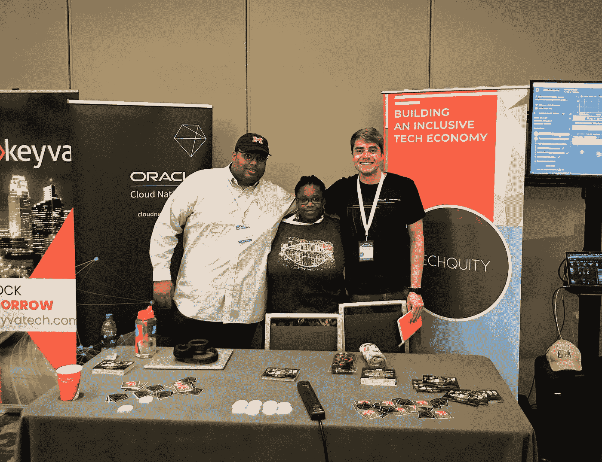

# 2019 年明尼阿波利斯 Devopsdays

> 原文：<https://medium.com/oracledevs/devopsdays-minneapolis-2019-948a6f702a35?source=collection_archive---------0----------------------->

对我来说，明尼阿波利斯的会议提前了一天开始，因为巧合的是，在从旧金山起飞的航班上，我的邻座也要去参加会议。另一个巧合是，他为中间层工作，碰巧那天早上他们正式宣布他们将成为 D2iQ。第二天早上，我和 850 名与会者一起聆听了布里奇特·克罗姆胡特对明尼阿波利斯会议第六年的介绍。我特别感谢 Bridget 帮我联系上了 [Techquity](https://www.techquity.mn/about) ，这是一家位于明尼阿波利斯的非营利组织，专注于技术社区的多样性。我安排 Techquity 分享我们的空间，并与他们团队的成员一起度过了一段美好的时光。

像往常一样，会议包括一个充满主题演讲的上午，接着是一个下午的[开放空间](https://devopsdays.org/open-space-format/)，分组会议供人们讨论各种感兴趣的话题。这次会议还包括参加动手实验室的选择，作为开放空间的替代方案。

# 主题演讲

## 卓越运营

主题演讲以 Liz Fong-Jones 对如何在使用分布式系统时实现卓越运营的精彩概述开始。Liz 回顾了向微服务的转变如何带来与复杂性和环境蔓延相关的新挑战，这反过来又会使开发和运营团队不堪重负。有这么多的火要扑灭，没有时间进行创新和新项目。Liz 分享了卓越生产(设计可靠、有弹性且友好的系统)对于系统故障排除和执行故障排除任务的人员的心智健全是多么重要。

该演讲触及了对涉及多个业务线(运营、开发、业务、销售、支持等)的运营采取整体方法的重要性。)，因为一旦发生事故，整个业务都会受到影响。Liz 重申了可观察系统的重要性:这些系统可以在不部署额外代码的情况下向我们解释自己，并且可以解释好事件和坏事件之间的差异。莉兹还谈到了不可能创造一个完美的系统，通过承认这一点，并建立一个错误预算，允许失败，你可以为创新和进步留下空间。例如，软化与延迟相关的服务级别目标可能对用户满意度的影响可以忽略不计，但是为开发人员打开了从事另一个项目的大量时间。从这样一个知识渊博的从业者那里听到最佳实践真是太好了。

## 安全性

Target 的信息安全分析师 Yolonda Smith 介绍了如何在不束缚业务的情况下建立安全实践。与 Liz 描述的错误预算类似，Yolanda 承认传统的安全实践，例如，安全团队孤立地构建自己的工具集并强制使用它们，会阻碍创新。然而，她建议，这可以通过避免被动的方法和向左转移安全性来克服:在 DevOps 管道中更早地纳入安全性，并在产品生命周期中更早地考虑安全性。Yolanda 简洁地将其归结为将正确的控件放在正确的位置，以便在不降低敏捷性的情况下增加安全性。演讲还将安全性描述为一个光谱，而不是二进制。“安全”的概念取决于上下文。它还提醒观众，安全性是一生的义务，它是一种衰减率:部署在第 10 天不如第 1 天安全。

## 失败事件

约翰·恩格尔曼对塔吉特百货公司的大规模失败事件进行了精彩的回顾。这一事件涉及复杂分布式系统中的级联故障，为可观测性的重要性提供了一个案例研究。当时，他们的环境缺乏对与客户请求率相关的历史数据的洞察，因此他们无法看到趋势。John 回顾了该问题持续数月以来的事件响应时间表。他们的活动从立即解决问题开始，以解决严重的症状并避免对客户的影响。接下来的一周，重点是深入了解问题的根本原因，由于无法访问显示正常行为基线的数据(可与当前系统数据进行比较),这使得问题变得更加困难。接下来的几周乃至几个月，我们的重点是保持系统稳定的降级状态。在此期间，他们还致力于确定系统的复杂点，并利用杠杆使他们能够对系统进行微小的精确更改，并观察其随时间的影响。最后，John 分享了他们能够随机发现问题的答案。

## 容器

在会议的[最激动人心的主题演讲中，Alice Goldfuss 通过解释容器实际上是如何工作的以及它们何时适合使用，剖析了其他容器 101 概述的大部分内容。我强烈建议看一下这个演讲的录音，以获得完整的效果。Alice 将容器定义为进程，从 tarballs 中诞生，锚定到名称空间，并由 cgroups 控制。我想象不出更简洁的方式来描述一个容器。她通过分享 Dockerfiles 用于构建容器映像 tarball(像进程一样运行)来扩展描述。名称空间决定了进程可以看到什么——主机上正在发生的事情的一部分——而 cgroups 决定了资源(CPU、内存、存储等)。)一个流程可以用。Alice 建议不要把容器想象成一条](https://devopsdays.org/events/2019-minneapolis/program/alice-goldfuss/)[鲸鱼](https://blog.docker.com/2013/10/call-me-moby-dock/)，我们应该考虑用机器通过用于监控运行进程的`top`命令来观察它们的方式来观察它们。

Alice 强调，尽管容器有其优点，但它们并不适合所有的用例。容器非常适合短暂的、一次性的进程，例如无状态的应用程序:接收数据，修改数据，然后发送出去。它们是可移植的，如果某些东西在本地运行，它将在生产中运行。它们易于升级、迭代和回滚。它们很容易排除故障，因为容器使得同时运行多个应用程序版本变得容易。尽管如此，容器也有弱点。您的环境的某些方面不能或者不应该是无状态的。数据库等元素需要持久性才能正常运行。虽然有变通方法可以使它们与容器一起工作，但是将数据库作为服务使用要容易得多，这种服务提供了自动故障转移、可伸缩性、读取副本、多区域支持等。而不是雇佣一个定制团队去做一些不是你主要业务的事情。

# 动手实验

在开放空间的同时，还进行了一些动手实验。我很高兴有机会直接从专家那里获得与许多主题相关的工具和指导的实践经验。大部分主题补充了此次活动的主旨。

*   在“打包行李:构建云原生应用捆绑包”中，来自微软的 Carolyn Van Slyck 和 Jeremy Rickard 分享了如何使用[云原生应用捆绑包](https://cnab.io/)规范来促进容器原生应用及其耦合服务的捆绑、安装和管理。具体来说，他们使用 Docker、Terraform 和 Kubernetes 构建了一个包，并使用 [Porter](https://porter.sh/) 进行了部署。
*   在“容器安全性”中，Sysdig 的 Michael Ducy 介绍了如何使用开源项目 [Falco](https://falco.org/) 为容器化环境实现运行时安全性。
*   在“混沌工程 101”中，来自 Gremlin 的 Ana Margarita Medina 和 Rich Burroughs 讲述了在工程组织中使用混沌工程的过程。
*   在“无可指责的尸检:如何实际做”中，来自 PagerDuty 的 Lilia Gutnik 和 Matty Stratton 分享了在事故发生后进行无可指责的尸检的技术，并分享了这些技术在实践中的真实例子。

# 空地

## 安全性

在多次主题演讲中，DevOps 中的安全性成为讨论的热门话题。我参加了一个关于从哪里开始为新平台用户保护 Kubernetes 的会议，另一个关于管道安全的会议，第三个关于如何在你的业务场所鼓励安全最佳实践的会议。它们在内容上有很多重叠。与会者来自塔吉特百货、Optum(联合健康集团)和其他各种明尼苏达州的科技公司。大多数公司似乎都处于云安全之旅的早期，需要从哪里开始的最佳实践。我们一致认为，在确保底层集群资源得到保护后(许多云提供商默认情况下做得相当好)，通过 RBAC 进行 API 授权是集群安全性的一个很好的起点。PodSecurityPolices 将是很好的第二步。

关于管道和容器安全性，至少有一家公司提到他们对部署的映像执行运行时扫描。没有人提到在他们的环境中使用准入控制器。在保护环境方面取得最大进展的几个小组强调了图像来源的重要性:了解图像是什么，它来自哪里，它是否容易受到攻击。这包括从一开始就防止依赖已知漏洞的能力。它还包括为每个映像中包含的依赖项提供一个集中的可查询目录，以生成合规性审核报告，并查明在安全事件中受影响的映像。人们一致认为，对于管道安全性，最好的起点是依赖关系管理和图像签名。其他管道安全主题包括在集群中使用 PodSecurity 和 ContainerSecurity 策略，利用执行静态代码分析的 IDE 插件，以及使用可信构建器。证书轮换和分发也出现了很多次。

## 单一环境

我参加的一个有趣的开放空间是为了讨论使用单一环境而不是生产环境和较小的开发和测试环境的利弊。争论的焦点是渐进式交付技术的兴起，包括金丝雀和蓝/绿版本、A/B 测试、特性标志等等。消除了向多个环境发布新的软件迭代的需要。这些技术降低了部署新特性的风险，因为它们允许您在更广泛地发布新特性之前，将发布限制到一部分用户。没有人站出来强烈支持现状，但是当有人问是否有人会将这个想法带回他们的领导层，并主张对他们的软件交付过程进行重大改变时，这个团队中的大多数人都保持沉默。

## 随时待命

进错了房间，不好意思离开后，我发现自己陷入了一场关于如何最好地平衡个人生活和随叫随到责任的讨论。人们谈论了随叫随到的生活，以及在正常工作时间之外的响应对你工作之外的生活的影响。人们提到在待命期间做出任何承诺是多么困难，因为你永远不知道什么时候你可能不得不放下一切去回应。讨论的另一个挑战是警报疲劳:对警报音变得不敏感和高度敏感。每当人们听到用来表示某个问题的独特声音时，他们就会提到类似 PTSD 的症状。

虽然有些人建议倡导系统性变革以使工作变得更容易，但其他人更喜欢关注他们控制下的行动。不需要系统性改变的一个例子是选择支持团队中的其他工程师，通过轮班来适应不能错过的重大事件。许多人提到了爱丽丝·戈德福斯对待命领域的贡献，包括她的演讲“电影上的殉道者:学会讨厌#oncallselfie ”和她的[手册](https://github.com/alicegoldfuss/oncall-handbook)。根据该集团的说法，保留随叫随到的日记，记录随叫随到事件和轶事的时间和持续时间，提供了一个证据来源，可以用来证明雇佣额外的工程师和证明你对公司的价值。提醒管理人员，在活跃的轮班后工作很少的睡眠不会产生好的结果，并提供其他关于界限和生活质量的重要性的提醒。

顺便说一句，第二周我在一次聚会上发表演讲，我的一个同事碰巧也在会上发言。在我演讲的时候，他收到了一个来自 PagerDuty 的提醒，开始了一个多日的问题。聚会结束后，我们一起乘车返回旧金山，在长达一小时的车程中，我们只花了大约 30 秒的时间交谈。在工作了一整天之后，再加上会议，他坐在那里打开笔记本电脑进行故障排除，电话每隔几分钟就响一次。第二天，办公室里的铃声仍在继续。

# 包裹

明尼阿波利斯 Devopsdays 为我提供了一个很好的空间，让我可以从领先的专家那里了解 DevOps 的最佳实践，了解最新的云原生创新，并与行业内的其他人联系。期待下次有机会参加。