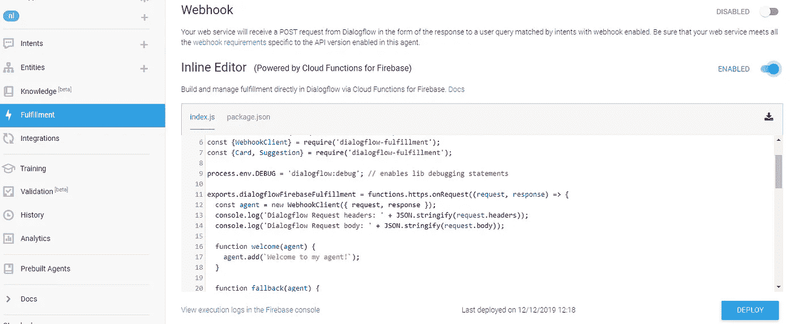
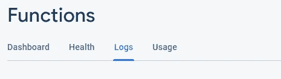
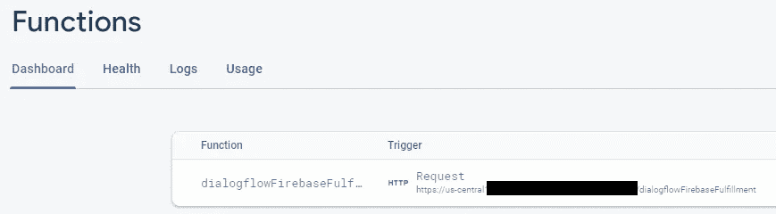
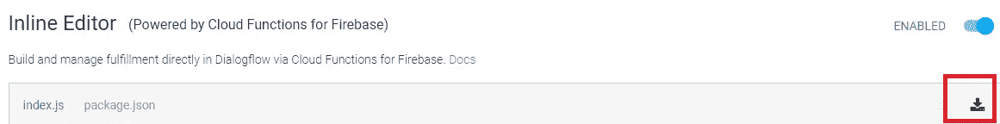
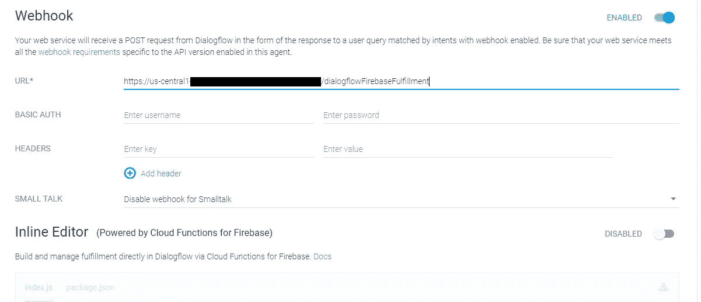
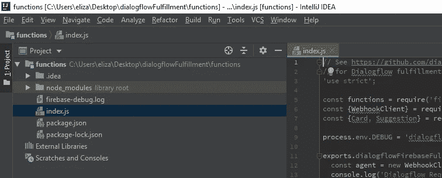
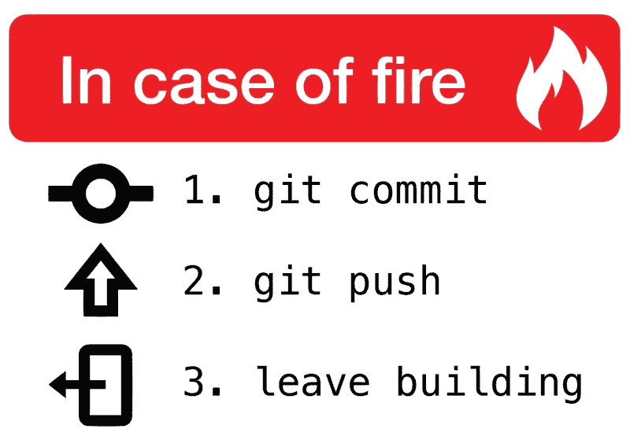

# DialogFlow:远离行内编辑器

> 原文：<https://medium.com/google-developer-experts/dialogflow-moving-away-from-the-inline-editor-76f2ee5c5b4e?source=collection_archive---------0----------------------->


Image credits: [dialogflow.com](https://dialogflow.com/)

作为一名开发者，Dialogflow 的 webhook 在我看来是平台如此强大的原因。从操纵上下文到个性化您的代理，您可以变魔术！

*如果您有兴趣了解更多关于个性化您的代理的信息，请查看:*

[](/google-developer-experts/personalize-for-each-user-device-the-magic-conversation-object-def0785582f9) [## 针对每个用户和设备的个性化:神奇的对话对象

### 一个好的代理的与众不同之处在于为每个用户提供个性化的体验，适应他们的需求并提供最好的…

medium.com](/google-developer-experts/personalize-for-each-user-device-the-magic-conversation-object-def0785582f9) 

虽然内联编辑器对于只有几行代码的小型项目或原型来说是理想的，但对于大型项目来说，这是一个可怕的故事，因为有许多功能和许多人在工作。有三个主要原因。

当你打开控制台时，第一个也是最明显的是内联编辑器块很小，你不能调整它的大小。放入 50 个函数，你将花费一半的工作时间来滚动而不是编码。

第二个原因是，部署需要时间，如果你在测试一个函数的响应或逻辑，而这个函数一直在等待运行，这是很痛苦的。

第三个也是最重要的一个是内联编辑器没有版本控制；如果你弄坏了什么东西(或者更糟的是别人弄坏了什么东西)，你不能恢复更改，除非你使用你的内存而不是服务器的内存来手动恢复。最重要的是，如果有很多人试图在这个项目上工作，那是永远不会成功的。

# 使用 webhook

上面提到的所有问题都可以通过使用外部 webhook 轻松解决。许多人认为通过使用外部 webhook，就不能再使用 Firebase 函数了，但事实并非如此。其他一些人告诉我，他们试图启用它，并看到一个“未知”的预填充 url，他们不知道它来自哪里，所以他们逻辑上切换回行内编辑器。摆脱内联编辑器，尤其是如果你不熟悉 Firebase 的话，可能会令人生畏。一旦你熟悉了它，它就非常简单了。以下是方法:

我们将从启用行内编辑器开始。



启用后，为了更容易地访问该项目的 Firebase 控制台，我总是单击编辑器右侧左侧的按钮，上面写着“在 Firebase 控制台中查看执行日志”。一旦点击它将打开 firebase 控制台在一个新的标签在您的浏览器。

有 4 个菜单选项卡。我们对第一个感兴趣。



在那里我们可以看到 DialogFlow 为我们创建的函数的细节。复制此处找到的触发 url，并返回到您的 DialogFlow 控制台的 fulfillment 菜单下。



在我们禁用内联编辑器并启用 webhook 之前，单击内联编辑器右侧的下载按钮。



现在您可以启用 webhook 了。这将自动禁用行内编辑器。对于大多数项目来说，webhook url 已经预先填充好了，但如果没有，请将您从 Firebase 控制台复制的函数触发 url 粘贴到这里。



# 太好了！半路上:)

接下来我们要做的是从我们下载的 zip 文件夹中提取文件。如果保存时没有更改下载文件的名称，应该是“dialogflowFulfillment.zip”。如你所见，这里还有一个 README.md 文件可以帮助你，但是为了方便起见，我将列出所有剩余的步骤(否则你可以点击[这个链接](https://firebase.google.com/docs/functions/get-started#set-up-node.js-and-the-firebase-cli))。

1.  如果你还没有安装 node，你需要从[这里](https://nodejs.org/en/)开始。
2.  使用以下命令安装 Firebase CLI(命令行界面):`npm install -g firebase-tools`
3.  如果您过去已经安装了 Firebase CLI，请确保您使用的是最新的库，方法是运行:*NPM install Firebase-functions @ latest Firebase-admin @ latest—save
    NPM install-g Firebase-tools*
4.  运行`firebase login`通过浏览器登录并验证 firebase 工具。
5.  跑`npm install`。这将安装所有必需的 npm 软件包。
6.  您现在所要做的就是在您最喜欢的 IDE 中打开该项目。我主要使用 IntelliJ IDEA，但是你可以使用任何其他的编辑器。对于一个自由编辑，我强烈推荐崇高的文字。



# 怎么跑

有两种方法可以运行 firebase 函数。第一个(也是最快的一个)在您的本地机器上。要在本地运行，您可以从项目目录中使用以下命令:

```
firebase serve --only functions
```

当您想要在 DialogFlow 项目之外检查函数的逻辑时，可以在本地运行。例如，如果您想检查是否为特定意图设置了正确的上下文，您可以在控制台上打印响应对象，并在将它传递给代理对象并在 DialogFlow 平台上测试它之前确保它是正确的。

> 模拟器将日志从您的函数流式传输到运行它们的终端窗口。它显示函数中`console.log()`、`console.info()`、`console.error()`和`console.warn()`语句的所有输出。

一旦获得正确的功能，您就可以通过运行以下命令来部署您的更改:

```
firebase deploy --only functions
```

这需要几秒钟的时间。部署完成后，您可以导航到 Google 平台上的 DialogFlow 或 Actions 并测试您的代理。你完了！



不要忘记把你的项目放在一个仓库中；-)

# 结论

webhook 是 DialogFlow 平台最强大的工具之一，如果不是最强大的话。虽然内联编辑器对于 webhook 中没有太多逻辑的小型项目来说可能已经足够了，但是在外部使用它会更快、更安全——正如您可以 VC 它一样——更容易维护、更容易编码，并且只需要几分钟就可以从内联编辑器切换到外部 Firebase 项目。为什么要等？

你喜欢这篇文章吗？想了解更多类似本文的技巧、诀窍和文章，请在 Twitter 上关注我并为此鼓掌！