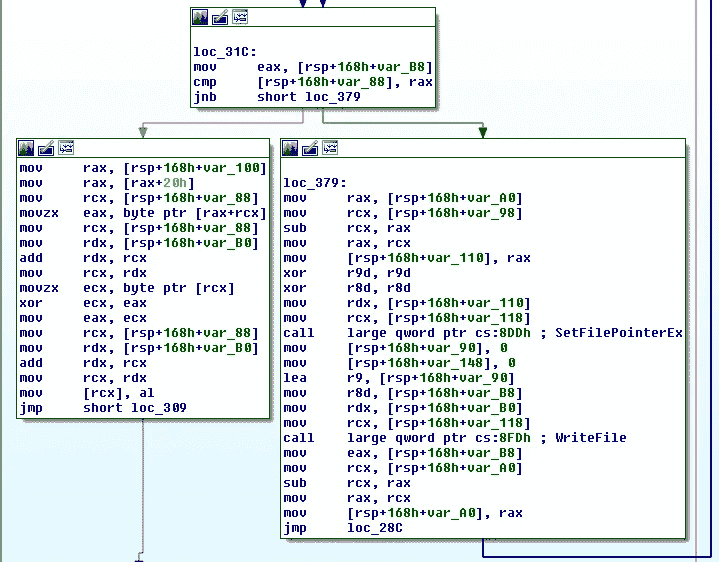

# Diavol 重新露面

> 原文：<https://medium.com/walmartglobaltech/diavol-resurfaces-91dd93c7d922?source=collection_archive---------6----------------------->

作者:杰森·里维斯和乔纳森·麦凯


我们之前浏览了 Diavol 勒索软件变种文件加密[1]，它与 TrickBot group[2]有关联。最近分手后，Diavol 几乎消失了。奇怪的是，我们开始注意到提交给 VirusTotal 的样本数量有所上升。在调查最近的样本时，我们能够确定它对文件混合使用 RSA 加密和 XOR 编码。在某些情况下，文件恢复仍然是可能的。

在 VirusTotal 上发现了以下样本:

```
SHA256: aac969e36686f8f8517c111d30f8fb3b527988ebd31b3b762aec8d46e860eb9d
Creation Time 2022-09-05 20:01:56 UTC
First Submission 2022-09-09 21:06:06 UTC 
Last Submission 2022-09-13 15:50:00 UTC 
Last Analysis 2022-09-13 15:50:00 UTC

SHA256: fb5ee29b98446d34520bf04a82996eefec3b5692710c5631458da63ef7e44fe4
Creation Time 2022-09-05 20:04:30 UTC
First Submission 2022-09-11 20:30:20 UTC 
Last Submission 2022-09-11 20:30:20 UTC 
Last Analysis 2022-09-11 20:30:20 UTC 

SHA256: 708806f5e2e8bfa3d1e911e391ff2ccf1edcac05cc1df80439b8b867253423df
Creation Time 2022-08-25 16:12:58 UTC
First Submission 2022-08-29 19:49:08 UTC 
Last Submission 2022-09-03 15:40:44 UTC 
Last Analysis 2022-09-03 15:40:44 UTC
```

样本现在是 64 位，但功能相似。出于本报告的目的，我们将仔细检查上面的 7088 样本。出于本报告的目的，我们将仔细检查上面的 7088 样本。

```
group=test
file_ext=.bully
note_filename=WARNING.txt
```

文件加密仍然需要使用一个 2048 字节的 XOR 密钥，它是在主 bot 的 GENBOTID 片段中随机生成的。然后，密钥被存储在主 bot 中，并在文件加密代码中重用。那么除非要编码的数据量小于 2048 字节，否则循环将读取 2048 字节的块:

文件加密的第一部分是前面提到的 2048 字节 XOR 密钥的使用。对于大多数文件，将要进行 XOR 编码的字节数基于总文件大小除以 10。那么除非要编码的数据量小于 2048 字节，否则循环将读取 2048 字节的块:


已经实现了一个类似的 XOR 循环，这可以在 Diavol[1]的以前版本中看到。该循环将对读取的数据块进行 XOR 编码，然后将其写回文件:



对文件进行 XOR 编码后，RSA 加密的 XOR 密钥被写入文件末尾，后跟编码的字节数:


接下来，bot single XOR 对编码的字节数进行编码，并将其写入文件的末尾:


在进行 XOR 编码并将适当的数据写入文件末尾后，bot 返回到文件的开头，并开始读取 0x75 字节的数据块。它将对它们进行 RSA 加密，然后将加密的字节写回到文件中，但没有填充字节。这样，文件开头的 0x75 * 10 或 1170 字节将在进行 XOR 编码后进行 RSA 加密。


使用一个空文件和一个大的 MSI 文件，可以执行一个快速测试来验证我们的发现。首先，我们验证添加到文件中的最终数据，它应该是距离末尾 110+0x900+16 个字节:

```
>>> data = open('test_data.txt.bully', 'rb').read()
>>> 110+0x900+16 
2430
>>> end = data[-2430:]
```

跳过 RSA 加密的 XOR 密钥应该显示两个 8 字节的值，第二个用 0xFF 进行 XOR 编码

```
>>> end[0x900:]
'\x88\x13\x00\x00\x00\x00\x00\x00w\xec\xff\xff\xff\xff\xff\xffk\xa8\x0f/6o\x12\x08\xd6\xbe\xaaw\xf1\x1b0\x1f\x10\x12\x9b\x12\xcc?\xf4\xbd\x03\xf9H\x01\x99\xa6\xd7\x9ae\xee\xf3\xa7\xe9\xc6\xb1\xf8\x81\xe0\xb6\xc4\xbaD\xa2\xb9jM\xd0\x05zj\xb7s#\xe6q\xb3\xf3\x8d\xe7\x00\x05\xa6OT\xba\x7f\xdd))\xb4\xfbu\x9anK0J\xa9\x03\xbb\xd5\xcfZ=\xe2\x15\xba\xd6>\x18V\x12\x0fP\xb8\x80O\xb4\xd4\xf6\xd2C\nHcT'
>>> 0x1388
5000
>>> end[0x900+8:]
'w\xec\xff\xff\xff\xff\xff\xffk\xa8\x0f/6o\x12\x08\xd6\xbe\xaaw\xf1\x1b0\x1f\x10\x12\x9b\x12\xcc?\xf4\xbd\x03\xf9H\x01\x99\xa6\xd7\x9ae\xee\xf3\xa7\xe9\xc6\xb1\xf8\x81\xe0\xb6\xc4\xbaD\xa2\xb9jM\xd0\x05zj\xb7s#\xe6q\xb3\xf3\x8d\xe7\x00\x05\xa6OT\xba\x7f\xdd))\xb4\xfbu\x9anK0J\xa9\x03\xbb\xd5\xcfZ=\xe2\x15\xba\xd6>\x18V\x12\x0fP\xb8\x80O\xb4\xd4\xf6\xd2C\nHcT'
>>> l = bytearray('w\xec')
>>> l[0] ^= 0xff
>>> l[1] ^= 0xff
>>> l
bytearray(b'\x88\x13')
```

由于文件为空，所以在我们跳过开头的 1170 个 RSA 加密字节后，明文 XOR 密钥应该是前 2048 个字节:

```
>>> key = bytearray(data[1170:1170+2048])
```

我们可以对另一个文件进行测试，在本例中是 MSI:

```
>>> data2 = open('powerpointmui.msi.bully', 'rb').read()
>>> test_block = bytearray(data2[1170:])
>>> 
>>> for i in range(len(test_block)):
...   test_block[i] ^= key[i%2048]
...
>>> test_block[:10000]
bytearray(b'\xa4A(H\x00\x00\x00\x00\x00\x00\x00\x00\x00\x00\x00\x00\x00\x00\x00\x00\x00\x00\x00\x00\x00\x00\x00\x00\x00\x00\x00\x00\x00\x00\x00\x00\x00\x00\x00\x00\x00\x00\x00\x00\x00\x00\x18\x00\x02\x01\x1c\x00\x00\x00#\x00\x00\x00\xff\xff\xff\xff\x00\x00\x00\x00\x00\x00\x00\x00\x00\x00\x00\x00\x00\x00\x00\x00\x00\x00\x00\x00\x00\x00\x00....
snip
....
02\x00\x00\x12\x00\x00\x000\x02\x00\x00\x02\x00\x00\x00\xe4\x04\x00\x00\x1e\x00\x00\x00\x16\x00\x00\x00Installation Database\x00\x00\x00\x1e\x00\x00\x00;\x00\x00\x00Microsoft Office PowerPoint MUI (Portuguese (Brazil)) 2007\x00\x00\x1e\x00\x00\x00\x16\x00\x00\x00Microsoft Corporation\x00\x00\x00\x1e\x00\x00\x00"\x00\x00\x00Installer, MSI, Database, Release\x00\x00\x00\x1e\x00\x00\x00\x84\x00\x00\x00This Installer database contains the logic and data required to install Microsoft Office PowerPoint MUI (Portuguese (Brazil)) 2007.
...snip...
```

因此，在您恢复 XOR 密钥后，可以轻松地恢复每个文件的大部分内容。下一步只是重建前 1170 个字节。

# IOCs

端点:

```
WARNING.txt
warning.txt
.bully4eb5bea255c0308b296f5aa259f68626
88b41ba2d6b7cca40118de9007cf64a0e5cc9710
aac969e36686f8f8517c111d30f8fb3b527988ebd31b3b762aec8d46e860eb9dcba851aab28c4b52fb9f0c655d2c0c0e
9697acfa83a31c2925b72f627c9be51346cf5dd0
fb5ee29b98446d34520bf04a82996eefec3b5692710c5631458da63ef7e44fe4332c1a9146276bc9abc1161e13efabde
6c366cd3b4a54f8e9f7ed6016aac9e7509b06102
708806f5e2e8bfa3d1e911e391ff2ccf1edcac05cc1df80439b8b867253423df
```

勒索信:

```
You've been hacked. All your corporate network servers and workstations are encrypted.Your company is a victim of double extortion ransomware attack.\rhat is it? Basically it means that not only your data is encrypted, but it's also have been exfiltrated from your network.Double Extortion attack explained in details :https://www.zscaler.com/resources/security-terms-glossary/what-is-double-extortion-ransomware\r==== What now? =====If you want your network to be fully operational again and if you want us not to publish all files we've taken :1\. Download Tor Browser from original site : https://torproject.org\r. Open this url in Tor Browser and visit this website : https://7ypnbv3snejqmgce4kbewwvym4cm5j6lkzf2hra2hyhtsvwjaxwipkyd.onion/\r. Enter this key : 57C0E-4C543-DCABB-EBF0C-2EDCA-A9FC4If you've done everything correctly - now you are able to contact us and take a chance to leave this all behind for a reasonable fee.\rOTE : If TOR network is unavailable by any reason - you can use any VPN service to solve it.
```

网络:

```
hxxps://7ypnbv3snejqmgce4kbewwvym4cm5j6lkzf2hra2hyhtsvwjaxwipkyd[.]onion
173.232[.]146[.]118
```

# 参考

1:[https://medium . com/walmartglobaltech/diavol-the-enigma-of-ransomware-1fd 78 ffda 648](/walmartglobaltech/diavol-the-enigma-of-ransomware-1fd78ffda648)

2:[https://www . bleeping computer . com/news/security/FBI-links-diavol-ransomware-to-the-trick bot-cyber crime-group/](https://www.bleepingcomputer.com/news/security/fbi-links-diavol-ransomware-to-the-trickbot-cybercrime-group/)

3:[https://www . adv Intel . io/post/the-trick bot-saga-s-finale-has-air-but-a-spindle-is-always-in-work](https://www.advintel.io/post/the-trickbot-saga-s-finale-has-aired-but-a-spinoff-is-already-in-the-works)

4:[https://www . bleeping computer . com/news/security/conti-ransomware-shuts-down-operation-rebrands-into-small-units/](https://www.bleepingcomputer.com/news/security/conti-ransomware-shuts-down-operation-rebrands-into-smaller-units/)