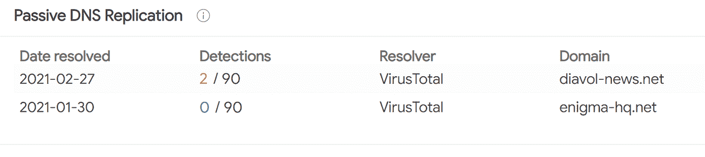
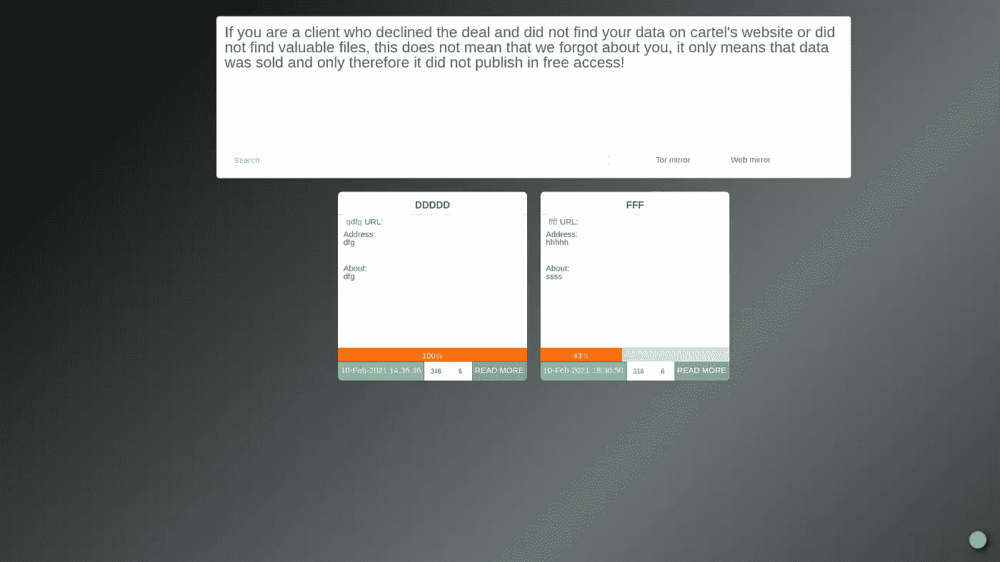
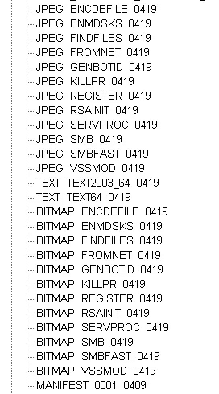
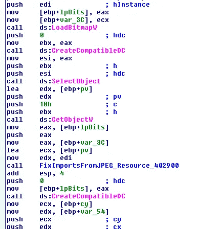
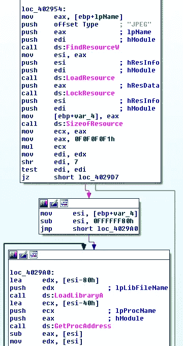
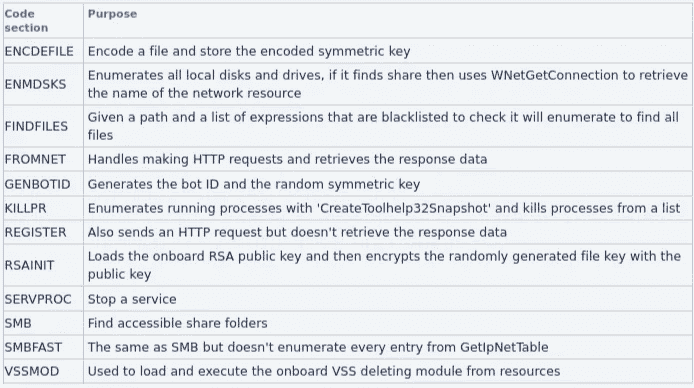
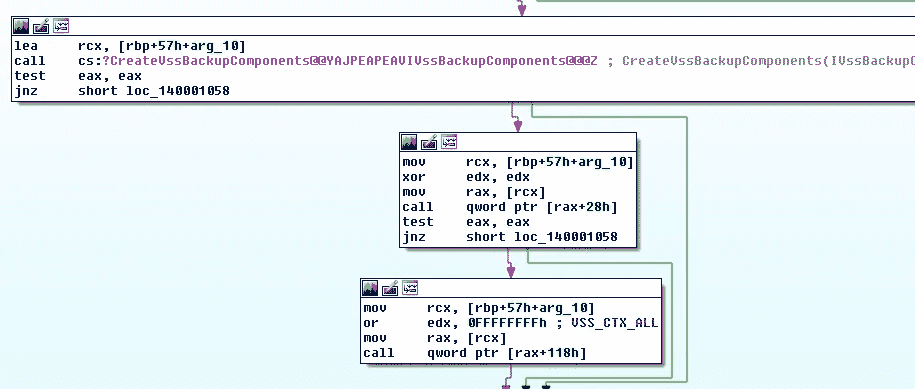
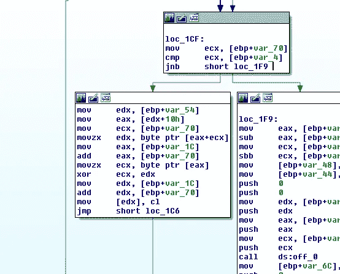

# 勒索软件之谜

> 原文：<https://medium.com/walmartglobaltech/diavol-the-enigma-of-ransomware-1fd78ffda648?source=collection_archive---------5----------------------->

作者:杰森·里维斯和约书亚·普拉特


Diavol 勒索病毒于 2021 年 7 月由 Fortinet 首次公开报道[1]。该帖子包括对据称在 2021 年 6 月的前一次接触中放弃的文件的技术分析。根据该博客，Diavol 变体与 Conti (v3)样本一起被发现，后者也在同一次攻击中被传播。在 IBM-Xforce 的后续文章中，研究人员得出结论，Diavol 的开发和 Trickbot 恶意软件背后的运营商之间存在更强的联系。

虽然在野外发现了多个样本，但它们似乎包含了发育中的人工制品。很明显，储物柜被使用了，但没有提到泄漏点，也没有公开指出任何东西。在分析了二进制文件之后，我们发现了一些有趣的基础设施，并开始调查。域名英格玛-hq。]net 脱颖而出，与' 195.123.221[。]248'.根据被动 DNS 记录，更新已经发生。]net 改为 diavol-news[。]net:



Credit: [VirusTotal](https://www.virustotal.com/gui/ip-address/195.123.221.248/relations)

HTML 展示了一个 TOR 镜像和指向“diavol-news”的 web 镜像。]net ':

```
<input type="text" id="blogpostsearch-search" class="search" name="BlogPostSearch[search]" placeholder="Search"><p class="help-block help-block-error"></p><button type="submit"><i class="fa fa-search"></i></button>
    </form>
</div>
                            </div><div class="col-md-4 search_fix">
                                <div class="row">
                                    <div class="col-md-4">
                                        <a class="pull-left" href="https://xhtnringfhbflc6d.onion" ref="noopener noreferrer">Tor mirror</a>                                    </div>
                                    <div class="col-md-4">
                                        <a class="pull-center" href="https://diavol-news.net" ref="noopener noreferrer">Web mirror</a>                                    </div>
                                                                    </div>
                            </div>
                        </div>
            </div>
```



Diavol Test Leak Site

## **技术概述**

Diavol 自带一系列有趣的代码块来完成各种任务:



位图对象包含代码，而 JPEG 对象包含需要解析的导入。



Loading BITMAP



Fixing imports from JPEG

这些物品之前在 Fortinet 博客中有详细介绍，但以下是我们自己对最近一个样本的分析概述:



我们从分析中发现了两个有趣的部分，一个是由于 VSSMOD 的工作方式，您可以即插即用各种方法来擦除卷影副本，另一个是文件加密的工作方式。

## **影子副本**

对于我们分析的其中一个样本，卷影副本是使用 WinAPI 擦除的，勒索软件似乎不经常使用这种方法:



在调用 CreateVssBackupComponents 之后，您可以使用 IVssBackupComponents 类[5]，然后可以利用它来删除快照。

## **加密**

Diavol 中的文件加密很有趣，它有一个例程来解码板载 RSA 公钥，并在加密将用于加密文件的密钥之前导入它。文件加密密钥长度为 2048 字节，是随机生成的，但是加密只是对 2048 字节块中的文件进行异或运算:



由于文件加密密钥跨多个文件使用，并且只是一个 XOR 运算，因此我们可以滥用已知的明文漏洞来恢复文件。

> A =明文
> B =加密文件 1
> C =加密文件 2
> 
> ^，^，中国

我们可以使用沙盒运行[6]中的文件以及一个随机 MSI 文件来测试这一点，该文件具有半静态的第一个字节块，无论如何都不会是干净的解密，但会证明我们的假设:

> >>> clear= open('a4ce1d7dfc5ab1fdee8cd0eb97d19c88a04deb8fe6b7b58413a9e2c93eb4a79d.msi', 'rb')。read()
> > > > b = bytearray(open('powerpointmui.msi.lock64', 'rb')。read())
> > > > c = open('sharepointDesignermui.msi.lock64', 'rb')。)(我)(们)(都)(不)(知)(道)(,)(我)(们)(还)(不)(知)(道)(,)(我)(们)(还)(不)(能)(不)(知)(道)(,)(我)(们)(还)(不)(知)(道)(,)(我)(们)(还)(是)(不)(知)(道)(,)(我)(们)(还)(不)(能)(不)(知)(道)(,)(我)(们)(还)(不)(知)(道)(,)(我)(们)(还)(不)(能)(不)(知)(道)(,)(我)(们)(还)(不)(知)(道)(,)(我)(们)(还)(不)(能)(不)(知)(道)(道)(,)(我)(们)(还)(不)(能)(不)(知)(道)(,)(我)(们)(还)(不)(能)(不)(知)(道)(,)(我)(\r\n \r\n \r\n \r\n \r\n \r\n \r\n \r\n \r\n \r\n \r\n \r\n \r\n \r\n \r\n \r\n \r\n \r\n \r\n \r\n \r\n \r\n \r\n \r\n \r\n \r\n \r\n \r\n \r\n \r\n \r\n \r\n \r\n \r\n \r\n \r\n \r\n \r\n \r\n \r\n \r\n \r\n \r\n \r\n \r\n \r\n \r\n \r\n \r\n \r\n\r\n \r\n \r\n \r\n \r\n \r\n \r\n \r\n \r\n \r\n \r\n \r\n \r\n \r\n \r\n \r\n \r\n \r\n \r\n \r\n \r\n \r\n \r\n \r\n \r\n \r\n \r\n \r\n \r\n \r\n \r\n \r\n \r\n \r\n \r\n \r\n \r\n \r\n \r\n \r\n \r\n \r\n \r\n \r\n \r\n \r\n \r\n \r\n \r\n \r\n\x00\x00
> <～Snip～\x00 \x00 \x00 \x00 \x00 \x00 \x00 \x00 \x00 \x00 \x00 \x00 \x00 \x00 \x00 \x80 \x00 \x00 \x00 \x00 \x00 \x00 \x00 \x00 \x80 \x00 \x00 \x00 \x00 \x00 \x00 \x00 \x80 \x00 \x00 \x00 \x00 \x00 \x00 \x00 \x00 \x00 \x00 \x80 \x00 \x00 \x00 \x00 \x00 \x00 \x00 \x00 \x00 \x00 \x00 \x00 \x00 \x00 \x00 \x00 \x00 \x00 \x00 \x00 \x00 \x00 \x\r\n \r\n \r\n \r\n \r\n \r\n \r\n \r\n \r\n \r\n \r\n \r\n \r\n \r\n \r\n \r\n \r\n \r\n \r\n \r\n \r\n \r\n \r\n \r\n \r\n \r\n \r\n \r\n \r\n \r\n \r\n \r\n \r\n \r\n \r\n \r\n \r\n \r\n \r\n \r\n \r\n \r\n \r\n \r\n \r\n \r\n \r\n \r\n \r\n \r\n？\r\n \r\n \r\n \r\n \r\n \r\n \r\n \r\n \r\n \r\n \r\n \r\n \r\n \r\n \r\n \r\n \r\n \r\n \r\n \r\n \r\n \r\n \r\n \r\n \r\n \r\n \r\n \r\n \r\n \r\n \r\n \r\n \r\n \r\n \r\n \r\n \r\n \r\n \r\n \r\n \r\n \r\n \r\n \r\n \r\n \r\n \r\n \r\n \r\n \r\nxc8 ?？\x15 \xc5ld \t;\r\n \r\n \r\n \r\n \r\n \r\n \r\n \r\n \r\n \r\n \r\n \r\n \r\n \r\n \r\n \r\n \r\n \r\n \r\n \r\n \r\n \r\n \r\n \r\n \r\n \r\n \r\n \r\n \r\n \r\n \r\n \r\n \r\n \r\n \r\n \r\n \r\n \r\n \r\n \r\n \r\n \r\n \r\n \r\n \r\n \r\n \r\n \r\n \r\n \r\n
> 
> <..snip../>
> 
> \ xff 7 \ xff \ xff \ xb4 \ xff \ xff \ xff \ xb7 \ xff \ x8b \ xff \ xb6 \ xff \ xff \ xb1 \ xff \ xff \ xb3 \ xff \ x8b \ xff \ xc6 \ xff \ x8b \ xff \ xff \ xff \ xad \ xff \ xff \ xff \ xff \ xff \ xff

2:[https://heimdalsecurity . com/blog/is-diavol-ransomware-connected-to-wizard-spider/](https://heimdalsecurity.com/blog/is-diavol-ransomware-connected-to-wizard-spider/)

# 3:[https://security intelligence . com/posts/analysis-of-diavol-ransomware-link-trick bot-gang/](https://securityintelligence.com/posts/analysis-of-diavol-ransomware-link-trickbot-gang/)

4:[https://labs . vipre . com/conti-ransomware-part-2-utilizing-server-message-block-SMB-to-share-infection/](https://labs.vipre.com/conti-ransomware-part-2-utilizing-server-message-block-smb-to-share-infection/)

5:[https://docs . Microsoft . com/en-us/windows/win32/API/vs backup/nl-vs backup-ivssbackupcomponents](https://docs.microsoft.com/en-us/windows/win32/api/vsbackup/nl-vsbackup-ivssbackupcomponents)

6:[https://app . any . run/tasks/27db 4430-59e 5-48 C5-8191-f 3491 f13 B3 C4 #](https://app.any.run/tasks/27db4430-59e5-48c5-8191-f3491f13b3c4#)

7:[https://www . bleeping computer . com/news/security/FBI-links-diavol-ransomware-to-the-trick bot-cyber crime-group/](https://www.bleepingcomputer.com/news/security/fbi-links-diavol-ransomware-to-the-trickbot-cybercrime-group/)

5: [https://docs.microsoft.com/en-us/windows/win32/api/vsbackup/nl-vsbackup-ivssbackupcomponents](https://docs.microsoft.com/en-us/windows/win32/api/vsbackup/nl-vsbackup-ivssbackupcomponents)

6: [https://app.any.run/tasks/27db4430-59e5-48c5-8191-f3491f13b3c4#](https://app.any.run/tasks/27db4430-59e5-48c5-8191-f3491f13b3c4#)

7: [https://www.bleepingcomputer.com/news/security/fbi-links-diavol-ransomware-to-the-trickbot-cybercrime-group/](https://www.bleepingcomputer.com/news/security/fbi-links-diavol-ransomware-to-the-trickbot-cybercrime-group/)