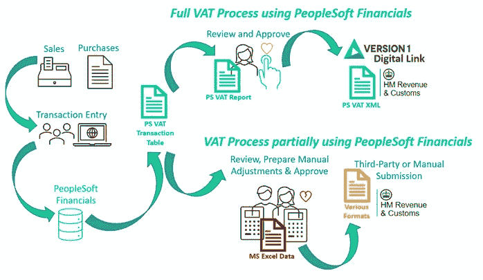

# 您知道吗:PeopleSoft Financials 可以完全符合税务数字化的要求

> 原文：<https://medium.com/version-1/did-you-know-peoplesoft-financials-can-be-made-fully-compliant-with-making-tax-digital-2aedec44a3e9?source=collection_archive---------5----------------------->

# **会计师的噩梦:在 2021 年 4 月前准备好 HMRC 税务数字化的第二阶段**

如果你走进一个财务部门，问团队中的第一个人“什么是增值税？”他们会回答“这是对销售和购买的商品和服务征收的税。”

Photo by [Sarah Shaffer](https://unsplash.com/@sarah_elizabeth?utm_source=medium&utm_medium=referral) on [Unsplash](https://unsplash.com?utm_source=medium&utm_medium=referral)

然后你问他们“你准备增值税申报表吗？”他们可能会带着恐惧的表情说:“天哪——不！”会给你指出一个会计团队的方向。

你走向会计团队，问第一个会计“你准备增值税申报表了吗？”他们也会一脸恐惧，说“没门！这是太多的责任，最好留给税务专家。”会给你指出税务组的方向，在一个黑暗的小角落里。

你走向税务团队，问“你准备增值税申报表了吗？”他们可能会闷闷不乐地回答“是”。然后你问，“你对按月或按季度准备和提交增值税申报表感到兴奋吗？”我大概会猜想他们会绝望地看着你，泪流满面地想‘我为什么要选择这个职业！’。现在**那个**可能会让你觉得不舒服。

作为一名会计，我害怕繁琐的增值税申报表的准备工作，有时会对整理交易报告、分析数据、在准备增值税报告之前核对数据、三次检查准确性的过程感到沮丧，我非常清楚，如果有错误，可能会导致组织受到处罚，甚至可能会结束我的职业生涯。

现在，随着即将到来的 HMRC 第二阶段(2021 年 4 月实现税务数字化，并于 2022 年 4 月成为税收指令)，我确信这种挫折感将会加剧，特别是新冠肺炎支持服务带来的额外税收复杂性。

你想在 2021 年完成一项任务吗:成功实施完全自动化的增值税申报流程，让会计人员可以将绝望转化为喜悦和乐观？

# **HMRC 要求税务数字化背后的目的是什么？**

HMRC 表示，他们的目标是成为世界上数字化程度最高的税务管理机构之一他们说“*让税收数字化是对税收系统工作方式的根本性改变——转变税收管理，使其更有效、更高效，并使纳税人更容易获得他们的税收权利*”

基本上，HMRC 正在转向无纸化增值税申报，并对企业实施更严格的要求，强制他们保留数字会计记录，使用完全合规的会计软件处理增值税并无缝链接到 HMRC，而无需人为操纵报告结果。

HMRC 有一些关于数字记录和会计软件规则的基本准则，包括:

**HMRC 对数字记录的要求**
组织负责以数字形式保存交易。每笔金融交易的最低要求是:
销售:销售时间(纳税点)
购买:购买时间(纳税点)
销售:不含增值税的价值
购买:增值税净值
销售:收取的增值税税率
购买:要收回的增值税金额

此外，HMRC 要求以数字方式保存组织的以下信息，以便他们知道增值税申报的来源:
、企业名称、
、企业地址、
、增值税登记号和
使用的任何增值税会计方案。

**会计软件规则**
会计软件必须符合以下要求:
必须记录组织的详细信息和所有与增值税相关的交易，记录时间最长为六年。
必须包括日期以及与每笔交易的已付或预扣增值税相关的任何信息。
必须能够根据组织的销售和采购计算出所欠的增值税。
必须通过 API(应用编程接口)直接向 HMRC 提交增值税申报表。

# **那么，这对 PeopleSoft Financials 客户意味着什么呢？**

到目前为止，PeopleSoft Financials 符合所有规定的要求，除了直接向 HMRC 提交增值税申报表。好消息是，HMRC 现在已经认证了 PeopleSoft Financials 的第 1 版开发的数字链接，使其完全符合 HMRC 的要求。

组织通常使用其审计事务所作为代理，或者使用第三方桥接软件向 HMRC 提交增值税申报表。但是，这些选项允许组织将数据从 ERP 系统提取到中间格式，如 Excel，这意味着可以在提交增值税报告之前处理数据。

如前一节所述，HMRC 正在向无需人工操作、直接从数字会计记录中提取增值税报告的方向发展。

使用 PeopleSoft Financials 的组织可以控制其增值税报告流程的自动化，并使用第 1 版的数字链接直接将报告提交给 HRMC，从而满足 HMRC 制定税收数字规则的要求。

# 考虑到这一点，你想让今年的增值税会计师高兴吗？

老实说，PeopleSoft Financials 是一个成熟的软件解决方案，如果组织还没有实现增值税报告的自动化，它可以帮助组织实现这一点。如果您在英国进行交易并使用 PeopleSoft Financials 记录金融交易，那么没有理由不遵守最新的 Making Tax Digital 指令。

PeopleSoft Financials 作为单一记录来源符合 HMRC 的所有要求，并且通过添加版本 1 的 MTD 数字链接扩展，将通过一个系统和一个流程使您的组织完全符合要求。这将减轻会计人员的负担，消除他们所有不必要的手动干预。

## **关于作者**

*Sonal Patel 是一名合格的 AAT 会计师(FMAAT ),在审计、法务和商业会计方面拥有 30 多年的经验，在过去的 20 年里，她一直在使用 PeopleSoft Financials 在国际上实施业务流程。*

【Sonal.Patel@version1.com**如果您对版本 1 的 PeopleSoft Financials MTD 扩展有任何疑问或想了解更多信息，请致电* [*与她联系。*](mailto:Sonal.Patel@version1.com)*

在不久的将来，期待更多 Sonal 的“你知道吗”系列博客。