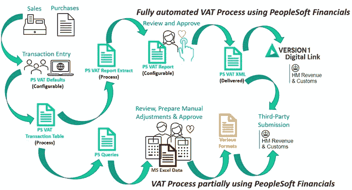

# 您知道吗:PeopleSoft Financials 可以自动进行增值税申报

> 原文：<https://medium.com/version-1/did-you-know-vat-reporting-can-be-automated-in-peoplesoft-financials-28affef09dd5?source=collection_archive---------4----------------------->

Photo by [Kelly Sikkema](https://unsplash.com/@kellysikkema?utm_source=medium&utm_medium=referral) on [Unsplash](https://unsplash.com?utm_source=medium&utm_medium=referral)

# **为什么会计师要继续受苦？**

继我的上一篇博客，我继续增值税的主题。就个人而言，这不是我最喜欢的主题，因为它很复杂，有时非常混乱，但作为一名会计师，增值税申报表需要每月或每季度完成并提交给 HMRC。这项任务不是可有可无的，它是一项法律要求，当税法发生变化或我们与其他国家做生意的方式发生重大变化时，总是需要重新评估，因为英国现在正面临英国退出欧盟的影响。

许多组织在增值税申报流程中举步维艰，因为他们似乎对从 ERP 系统中提取的数据缺乏信任。这通常可以追溯到错误输入的交易，这最终会扭曲增值税申报表的提交。即将到来的 HMRC 第二阶段，使税收数字化并在 2022 年 4 月成为税收指令，将加剧这种挫折感，特别是新冠肺炎支持产品带来的额外税收并发症。

# **它会影响 PeopleSoft Financials 的客户吗？**

许多英国组织使用 PeopleSoft Financials，但尚未完全实施增值税申报流程，原因各不相同，包括:

不了解 PeopleSoft Financials 中提供的增值税申报功能。

意识到该功能，但认为它不是升级或实施的优先事项，并将其从优先列表中删除。

知道该功能，但决定在上线后实施，但从未抽出时间来实施。

在业务专家很少参与的情况下实施了增值税报告流程，因此会计人员无法完全信任报告中的数据。

实施了增值税申报流程，但未对所有运营方案进行彻底测试，因此也对报告中的数据产生了怀疑。

与业务专家一起实施了增值税申报流程，但无法提供支持来修复或维护系统中的任何错误，从而实现申报流程的自动化。因此，会计师回到他们的手工步骤。

无论什么原因，T4 都没有理由不实施增值税申报。尤其是，PeopleSoft Financials 是一款成熟的产品，不仅在英国，而且在整个欧洲都具备自动化整个增值税申报流程的成熟能力。

会计不应不得不使用交易加载器数据和几个不充分的查询来散列增值税报告，因为这使得任务极其繁琐、费力，并且高度依赖电子表格。

这背离了 HMRC 试图从 2021 年 4 月开始实现税收数字化的原则。理解这一点很重要，会计师需要不惜任何代价确保增值税申报的准确性，因为不遵守税法可能会给组织带来代价高昂的罚款。那么，有什么比流程自动化更好的方法来避免这种情况呢？

# **PeopleSoft Financials v 9.2 中的增值税报告**

大多数使用 PeopleSoft Financials 的组织已经升级到 v9.2，该版本具有增值税报告的所有功能以及 HMRC 提交所需的 XML 文件。通过充分利用可用的功能，您可以消除对结果的人工干预或进行任何手动调整的需要。

在下图中，流程的*顶部*展示了 Peoplesoft Financials 的全部潜力。通过使用版本 1 的数字链接，这可以在 PeopleSoft Financials 中进一步自动化，因此它可以直接将报告提交给 HRMC，以完全满足 HMRC 更新的税务数字规则。

流程底部的*部分*代表了大多数组织的可能现实，即从 PeopleSoft Financials 中提取交易数据，然后花费大量精力手动计算和调节增值税申报表。

# 考虑到这一点，让我们通过…来减少增值税会计师的工作量。？

…自动化流程！所有这些都需要了解会计人员在增值税申报过程中遇到的问题，并将其分解为以下几个部分:

**交易问题** —如果数据输入不正确，则需要纠正增值税默认设置。

**处理问题** —如果流程被认为是繁琐的，那么将它们添加到隔夜批处理流程中。

**报告问题** —如果报告数据缺少交易，则需要更正增值税报告定义。

即使您的 PeopleSoft Financials 环境中存在定制，所有增值税问题**都可以通过应用标准增值税配置**来解决。

所需要的只是一点关心和耐心。通过与税务/财务团队密切合作，我们可以发现问题，并将其归类到上述类别中。研究每个细分市场中每个问题的逻辑，并应用正确的配置。测试应涵盖每个辖区的所有可能情况，并确保在将配置应用于生产之前解决所有问题。

在某些情况下，交易场景中会有税务复杂性，需要修改流程和培训。总体而言，所有这些修改将减少(如果不是消除的话)人为错误的风险，实现透明度，并促进增值税报告与一个企业资源规划系统中的交易数据的全面核对。

因此，老实说，没有什么可以阻止您使用 PeopleSoft Financials 的全部功能进行增值税申报，因为它不仅更容易，而且更准确。

**关于作者**

*Sonal Patel 是一名合格的 AAT 会计师(FMAAT ),在审计、法务和商业会计方面拥有 30 多年的经验，在过去的 20 年里，她一直在使用 PeopleSoft Financials 在国际上实施业务流程。*

如果你有任何问题或者想要更多关于版本 1 的 PeopleSoft Financials MTD 扩展的信息，或者甚至有你想要她的意见的主题，请通过 [*联系 Sonal Sonal.Patel@version1.com*](mailto:Sonal.Patel@version1.com)*。在不久的将来，期待更多 Sonal 的“你知道吗”系列博客。*