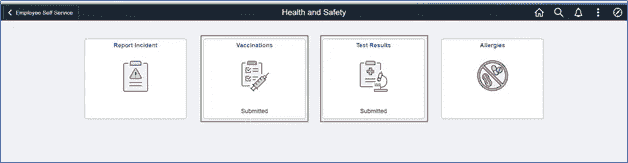
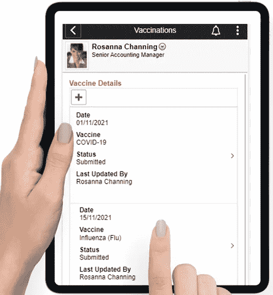
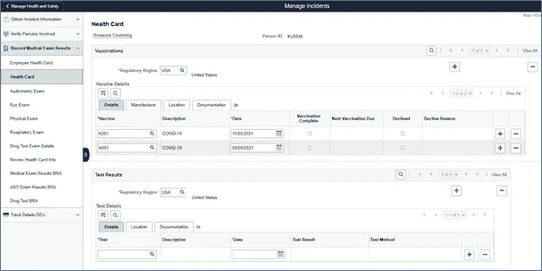

# 您知道吗:您可以在仁科 HCM 公司跟踪疫苗接种和测试结果

> 原文：<https://medium.com/version-1/did-you-know-you-can-track-vaccinations-test-results-in-peoplesoft-hcm-dd60f696a18f?source=collection_archive---------3----------------------->

围绕强制接种新冠肺炎疫苗的问题没有明确的答案。会不会是政府强制的？它会成为合规/报告要求吗？仍然有许多未知，我们应该期待更多的澄清。

在英国的一些地区，现在在某些情况下检查人们的 COVID 状态是一项法律要求，一些从事卫生和社会护理工作的人必须接种新冠肺炎疫苗。

如果这不是法律要求，组织可以自行决定是否跟踪这些信息。毕竟**‘安全第一’**

在这篇博客中，我概述了 PeopleSoft 的**健康与安全**模块(包含在您的 HCM 人力资源许可证中的*)的新功能，它可以帮助您的组织简化疫苗接种信息和测试结果的获取。*

该功能已作为 PeopleSoft HCM Image 40 的一部分发布。

## **跟踪疫苗接种和检测结果的主要方面**

👉员工可以**通过**员工自助**输入接种详情**或**拒绝**接种并说明理由

H&S Employee Dashboard

👉您可以**上传支持文档**。配置选项可使文档成为强制性的

👉启用**确认**的能力

👉您可以**按照国家、各个制造商以及**剂量要求**定义免疫详情**。您还可以按制造商指定疫苗的授权状态

👉如果需要，也可以启用人力资源管理员的审批

👉此外，这是**移动就绪，**您的员工可以通过手机快速轻松地完成。

👉同样，您也可以配置您的 PeopleSoft 应用程序来跟踪**测试结果**，例如聚合酶链式反应测试、横向流动测试。这将允许员工输入他们的测试结果，当&连同支持文件和确认。

作为**管理员，**您可以使用健康&安全仪表板**查看、编辑或添加员工疫苗接种&测试结果**。

H&S Admin Dashboard

使用所提供的 PeopleSoft 报告功能，您可以在 excel 电子表格中轻松提取这些详细信息，或者创建简单的分析来报告疫苗接种目标或已接种员工的百分比。一个新的 Kibana 仪表板已经投入使用，用于帮助监控和跟踪员工疫苗接种和测试跟踪。所以，请关注这个空间，了解更多更新！

观看以下视频，了解您的员工如何通过笔记本电脑或手机轻松完成这些细节。

## **商业考虑**

如果您正在考虑推出此功能，那么这里有一些业务考虑事项

在考虑实施 COVID 身份检查时，➤数据保护是需要考虑的众多因素之一，如就业法律和合同、健康和安全要求、平等和人权(包括隐私权)

➤:你还应该考虑你所在行业的具体规定、当前的公共卫生建议和最新的政府指导

你想追踪➤ ️What 疫苗接种吗(COVID，流感，肺结核)？

➤ ️What 信息应该由员工填写吗？

➤:你需要批准/文件来验证吗？

➤:谁将担任健康与安全管理员？

➤是在本地还是全球推广，因为疫苗接种设置可能因监管地区/国家而异？

当前疫情的未来是不确定的。越来越明显的是，组织现在正在寻找一种灵活的、前瞻性的解决方案，以便在需要之前主动应对这种情况。

PeopleSoft HCM 分公司的疫苗接种和检测结果跟踪功能是帮助您更好地管理和报告这一新信息的一小步，在您的组织安全恢复业务的同时保护您的员工和工作场所。

## 关于作者

巨然·加万德是 PeopleSoft portfolio @Version 1 的首席顾问，在 Oracle PeopleSoft 的人力资本管理套件领域拥有超过 18 年的业务流程驱动经验。

如果您有任何问题或想了解更多关于第 1 版如何帮助您更好地利用 PeopleSoft HCM 实施的信息，请通过 ranju.gawande@version1.com[与她联系](mailto:ranju.gawande@version1.com)

*请继续关注第一版，了解更多* ***仁科 HCM*** *来自巨然的故事*