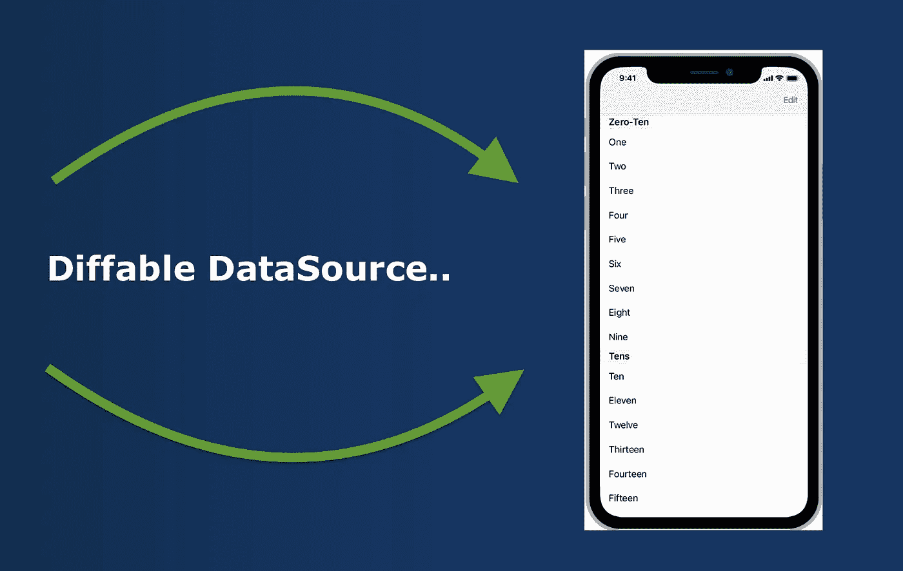
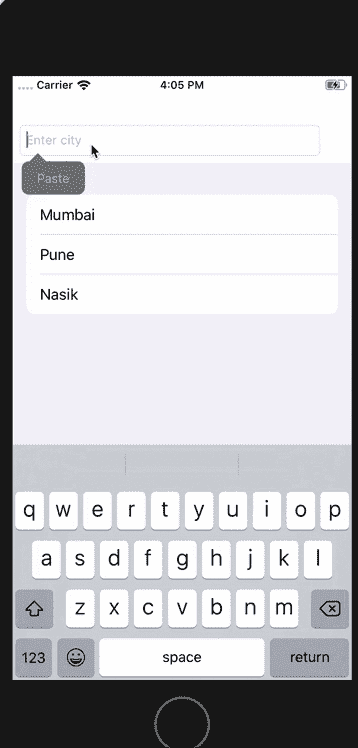

# iOS 13 中的不同数据源

> 原文：<https://medium.com/globant/diffable-data-source-in-ios-13-34e2dbbe5983?source=collection_archive---------2----------------------->



从 iOS SDK 开始，表视图只管理其数据的显示，而不管理数据本身。要管理数据，您需要为表提供一个数据源对象。这是一个实现`UITableViewDataSource`协议的对象。数据源对象响应表中与数据相关的请求。此外，还提供了 TableView 中的单元格。我们需要实现协议方法，并确保我们的支持模型与数据源正确同步，以避免任何崩溃。

```
optional func number of sections(in tableView: UITableView) -> Int
func tableView(_ tableView: UITableView, numberOfRowsInSection section: Int) -> Int
func tableView(_ tableView: UITableView, cellForRowAt indexPath: IndexPath) -> UITableViewCell
```

此外，如果我们需要对 TableView 中的部分和行执行更新。

```
tableView.beginUpdates()// Delete section 1 and 2
tableView.reloadSections([1,2], with: .automatic)// Insert at section 1 and row 1
tableView.insertRows(at: [IndexPath(row: 1, section: 1)], with: .automatic)// delete at section 1 and row 3
tableView.deleteRows(at: [IndexPath(row: 3, section: 1)], with: .automatic)tableView.endUpdates()
```

根据新旧数据之间的值，很难确保每次插入、重新加载和删除时所有的部分和行都得到正确的更新。

这是当我们错误地更新 TableView 时 UIKit 抛出的错误。

```
*** Terminating app due to uncaught exception ‘NSInternalInconsistencyException’, reason: ‘Invalid update: invalid number of sections. The number of sections contained in the table view after the update (10) must be equal to the number of sections contained in the table view before the update (10), plus or minus the number of sections inserted or deleted (0 inserted, 1 deleted).’
*****
```

在 WWDC 2019 年，苹果宣布了一个非常酷的表格视图和集合视图功能。UITableViewDiffableDataSource 和 uicollectionviewdiffabledata source。

这些新的不同数据源类允许我们根据快照为集合和表视图定义数据源。快照充当我们的视图和数据源之间的真实来源。然后，差异数据源会将新快照与旧快照进行比较，并自动应用其内容的任何插入、删除和重新排序。所有的差异，视图更新与动画将自动为我们执行。

> [你可以从苹果 WWDC 2019 会议](https://developer.apple.com/videos/play/wwdc2019/220/)上了解更多信息

在这里，我们将看到 TableView 的不同数据源。因为除了一些类名之外，表视图数据源与集合视图版本非常相似。

**可区分数据源区分策略。**

我们需要提供能够提供独特价值的部分和项目类型表示。它们都需要按照下面的 UITableViewDiffableDataSource 类的声明实现一个可散列的协议。

```
@available(iOS 13.0, tvOS 13.0, *)
open class UITableViewDiffableDataSource<SectionIdentifierType, ItemIdentifierType> : NSObject, UITableViewDataSource where SectionIdentifierType : Hashable, ItemIdentifierType : Hashable
```

SectionIdentifierType 和 ItemIdentifierType 是我们在声明和初始化类时必须提供的泛型。不同的数据源使用所有标识符的哈希值来确定发生了什么变化。

现在让我们看看使用不同数据源的另一个关键因素。

**快照**:

每当表视图需要更新时，必须使用最新数据创建数据源快照，并将其应用于数据源对象。它与应用它的不同数据源具有相同的通用参数。

```
struct NSDiffableDataSourceSnapshot<SectionIdentifierType, ItemIdentifierType> 
 where SectionIdentifierType : Hashable, ItemIdentifierType : Hashable
```

# 示例:

我们必须首先为 UITableViewDiffableDataSource 创建 SectionIdentifier 和 ItemIdentifier。我们将使用 enum 来提供一个部分，因为它们已经被确认为 Hashable 协议。

```
enum Section {
 case City
}
```

对于 ItemIdentifier，我们将创建一个单独的模型。

```
struct MyCity: Hashable {
 var cityName:String
}Class ViewController: UIViewController {@IBOutlet weak var cityTextfield: UITextField!
@IBOutlet weak var tableview: UITableView!
private var cityList = [City(name: “Mumbai”), City(name: “Pune”), City(name: “Nasik”)]
fileprivate var dataSource: UITableViewDiffableDataSource!override func viewDidLoad() {super.viewDidLoad()configureDataSource()createSnapshot()}
```

我们不必编写 **cellForRowAt indexPath** 和其他方法，而是只需编写几行代码来加载 UITableview。

```
func configureDataSource() {dataSource = UITableViewDiffableDataSource<Section, MyCity>(tableView: tableview) { (tableview, indexPath, city) -> UITableViewCell? in
let cell = tableview.dequeueReusableCell(withIdentifier: “cell”, for: indexPath) cell.textLabel?.text = city.cityName
    return cell
}
```

现在，我们可以编辑我们的表格视图

```
func tableViewEditOperations() {let cityObject = City(cityName: cityTextfield.text ?? "")//Adding row to tableview
cityList.append(cityObject)//Deleting row from Tableview
cityList.remove(at: 1)//Inserting row to Tableview
cityList.insert(cityObject, at: 1)createSnapshot()}
```

我们为快照创建了一个单独的函数。我们只需要在每次操作后调用这个函数，它就会为你改变不同的变化。

```
func createSnapshot() {
var snapshot = NSDiffableDataSourceSnapshot<Section, MyCity>()snapshot.appendSections([.Main])
snapshot.appendItems(cityList,toSection:.Main)dataSource.apply(snapshot, animatingDifferences:true)
}
```

如果需要的话，apply()方法可以动态显示这些更改。我们可以用下面的动画看到所有的编辑操作。



# 结论:-

UITableViewDiffableDataSource 只是管理数据并为表格视图提供单元格。这是一个通用类，它删除了许多样板代码，使我们能够以一种非常声明性的方式创建一个 datasource 对象。