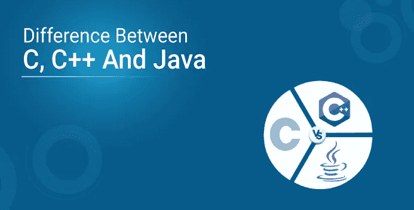

# C vs c++ vs Java——最佳之战

> 原文：<https://medium.com/edureka/difference-between-c-cpp-and-java-625c4e91fb95?source=collection_archive---------0----------------------->



软件开发已经像其他领域一样经历了转变。这也导致了编程语言的发展。C、C++和是三种随着时间的推移已经定义了编程范例的语言，并且在市场上具有很大的价值。在本文中，我将比较 C、C++和 Java 之间的区别，这样你就可以选择一种或多种语言来从事可能的职业或获得认证。

# C、C++和 Java 之间的区别


这就是 C，C++和 Java 的区别。我希望你清楚这些精彩的编程语言的基本概念，并帮助你增加知识的价值。

接下来，让我们看一些示例程序来展示 C、C++和 Java 之间的区别。

# C、C++和 Java 中的示例程序

## C 语言的 Hello World 程序

```
#include<stdio.h> //header file for standard input outputmain() //main method
{
clrscr(); //clears screen
printf(“hello world”); //print statement
getch(); //get the character
}
```

**解释**:在上面的代码中，你使用标准输入输出的头文件< stdio.h >来实现 printf、getch 这样的命令。

## C++中的 Hello World 程序

```
#include<iostream.h> // header file for input output #include<conio.h> 
main() // header file for console input output
{
clrscr(); // clears screen
cout<<"hello world"; //print statement
getch(); // get the character
}
```

**解释**:在 C++中，你使用头文件< iostream.h >，< conio.h >作为输入输出和控制台输入输出，这样你就可以实现像 cout 和 cin 这样的命令。它类似于 C 编程语言中的 printf 和 scanf。

## Java 的 Hello World 程序

```
class edureka // create class
{
public static void main(String args[]) //main method
{
System.out.print("welcome"); //print statement
}
}
```

**解释**:在 Java 中，你使用类和对象，因为它是一种纯粹面向对象的编程语言。您调用 main 函数，因为它是代码的入口点。

如果你想查看更多关于人工智能、Python、道德黑客等市场最热门技术的文章，你可以参考 Edureka 的官方网站。

> 1.[面向对象编程](/edureka/object-oriented-programming-b29cfd50eca0)
> 
> 2.[Java 中的继承](/edureka/inheritance-in-java-f638d3ed559e)
> 
> 3.[Java 中的多态性](/edureka/polymorphism-in-java-9559e3641b9b)
> 
> 4.[Java 中的抽象](/edureka/java-abstraction-d2d790c09037)
> 
> 5. [Java 字符串](/edureka/java-string-68e5d0ca331f)
> 
> 6. [Java 数组](/edureka/java-array-tutorial-50299ef85e5)
> 
> 7. [Java 合集](/edureka/java-collections-6d50b013aef8)
> 
> 8. [Java 线程](/edureka/java-thread-bfb08e4eb691)
> 
> 9.[Java servlet 简介](/edureka/java-servlets-62f583d69c7e)
> 
> 10. [Servlet 和 JSP 教程](/edureka/servlet-and-jsp-tutorial-ef2e2ab9ee2a)
> 
> 11.[Java 中的异常处理](/edureka/java-exception-handling-7bd07435508c)
> 
> 12.[高级 Java 教程](/edureka/advanced-java-tutorial-f6ebac5175ec)
> 
> 13. [Java 面试问题](/edureka/java-interview-questions-1d59b9c53973)
> 
> 14. [Java 程序](/edureka/java-programs-1e3220df2e76)
> 
> 15. [Kotlin vs Java](/edureka/kotlin-vs-java-4f8653f38c04)
> 
> 16.[依赖注入使用 Spring Boot](/edureka/what-is-dependency-injection-5006b53af782)
> 
> 17.[Java 中的可比性](/edureka/comparable-in-java-e9cfa7be7ff7)
> 
> 18.[十大 Java 框架](/edureka/java-frameworks-5d52f3211f39)
> 
> 19. [Java 反射 API](/edureka/java-reflection-api-d38f3f5513fc)
> 
> 20.[Java 中的 30 大模式](/edureka/pattern-programs-in-java-f33186c711c8)
> 
> 21.[核心 Java 备忘单](/edureka/java-cheat-sheet-3ad4d174012c)
> 
> 22.[Java 中的套接字编程](/edureka/socket-programming-in-java-f09b82facd0)
> 
> 23. [Java OOP 备忘单](/edureka/java-oop-cheat-sheet-9c6ebb5e1175)
> 
> 24.[Java 中的注释](/edureka/annotations-in-java-9847d531d2bb)
> 
> 25.[Java 中的图书管理系统项目](/edureka/library-management-system-project-in-java-b003acba7f17)
> 
> 26.[Java 中的树](/edureka/java-binary-tree-caede8dfada5)
> 
> 27. [Java 教程](/edureka/java-tutorial-bbdd28a2acd7)
> 
> 28.[Java 中的顶级数据结构&算法](/edureka/data-structures-algorithms-in-java-d27e915db1c5)
> 
> 29. [Java 开发者技能](/edureka/java-developer-skills-83983e3d3b92)
> 
> 30.[前 55 个 Servlet 面试问题](/edureka/servlet-interview-questions-266b8fbb4b2d)
> 
> 31. [](/edureka/java-exception-handling-7bd07435508c) [顶级 Java 项目](/edureka/java-projects-db51097281e3)
> 
> 32. [Java 字符串备忘单](/edureka/java-string-cheat-sheet-9a91a6b46540)
> 
> 33.[Java 中的嵌套类](/edureka/nested-classes-java-f1987805e7e3)
> 
> 34. [Java 集合面试问答](/edureka/java-collections-interview-questions-162c5d7ef078)
> 
> 35。[*Java 中如何处理死锁？*](/edureka/deadlock-in-java-5d1e4f0338d5)
> 
> 36。 [*你需要知道的 50 个 Java 合集面试问题*](/edureka/java-collections-interview-questions-6d20f552773e)
> 
> *37。* [*Java 教程*](/edureka/java-tutorial-bbdd28a2acd7)
> 
> *38。*[*C、C++和 Java 有什么区别？*](/edureka/difference-between-c-cpp-and-java-625c4e91fb95)
> 
> 39。[*Java 中的回文——如何检查一个数字或字符串？*](/edureka/palindrome-in-java-5d116eb8755a)
> 
> 40。 [*你需要知道的顶级 MVC 面试问答*](/edureka/mvc-interview-questions-cd568f6d7c2e)
> 
> 41.[Java 编程语言的十大应用](/edureka/applications-of-java-11e64f9588b0)
> 
> 42.[Java 中的死锁](/edureka/deadlock-in-java-5d1e4f0338d5)
> 
> 43.[Java 中的平方和平方根](/edureka/java-sqrt-method-59354a700571)
> 
> 44.[Java 中的类型转换](/edureka/type-casting-in-java-ac4cd7e0bbe1)
> 
> 45.[Java 中的运算符及其类型](/edureka/operators-in-java-fd05a7445c0a)
> 
> 46.[Java 中的析构函数](/edureka/destructor-in-java-21cc46ed48fc)
> 
> 47.[Java 中的二分搜索法](/edureka/binary-search-in-java-cf40e927a8d3)
> 
> 48.[Java 中的 MVC 架构](/edureka/mvc-architecture-in-java-a85952ae2684)
> 
> 49. [Hibernate 面试问答](/edureka/hibernate-interview-questions-78b45ec5cce8)

*原载于 2019 年 6 月 24 日*[*https://www.edureka.co*](https://www.edureka.co/blog/difference-between-c-c-and-java)*。*