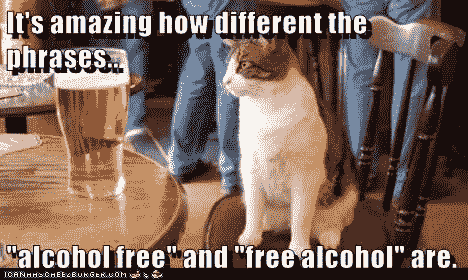
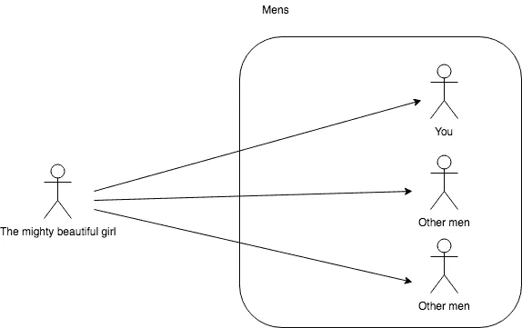
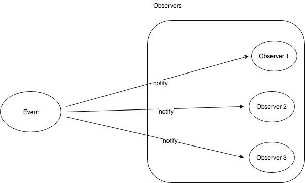
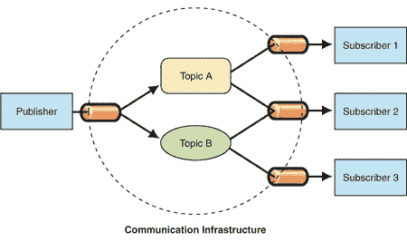

# 发布-订阅模式和可观察模式的区别

> 原文：<https://medium.easyread.co/difference-between-pub-sub-pattern-and-observable-pattern-d5ae3d81e6ce?source=collection_archive---------1----------------------->

我想这次会很快。

# 观察者设计模式

**观察者模式**是一种软件设计模式，其中一个名为**主题**的对象维护一个名为**观察者**的依赖者列表，并自动通知它们任何状态变化，通常是通过调用它们的方法之一。我会给你一个真实的例子。我们假设你是一个用交友 app 找女孩的帅哥。然后你把你的号码给你在约会应用上找到的女孩。还有其他几个男人把他们的号码给了那个女孩。女孩会联系所有给她号码的男人，也许她会请你做她的男朋友。

Illustration of observer design pattern

让我们假设所有的 mens 都是观察者对象的集合。所以上图也是如此:

Observer design pattern

# 发布订阅设计模式

**发布订阅**是一种消息传递模式，消息的发送者(称为发布者)并不将消息直接发送给特定的接收者(称为订阅者)，而是将发布的消息分类，而不知道可能有哪些订阅者(如果有的话)。类似地，订阅者表达对一个或多个类别的兴趣，并且仅接收感兴趣的消息，而不知道存在哪些发布者(如果有的话)。换言之，发布者和订阅者永远不会知道彼此的存在。那么他们是如何交流的呢？发布者和订阅者都知道的另一个组件叫做消息代理。发布者将消息发送给消息代理，消息代理将消息过滤并广播给正确的订阅者。

Pubsub pattern source [msd blog](https://docs.microsoft.com/en-us/previous-versions/msp-n-p/ff649664(v=pandp.10))

你可以阅读我的文章[如何创建你自己的 pubsub 库](https://medium.com/easyread/create-your-own-java-pubsub-library-fbee21d0bb44)，以防你有兴趣深入了解 pubsub 模式。

# 谢谢你

我要再次感谢我所有的读者，我希望我会带着更多有趣的话题回来。