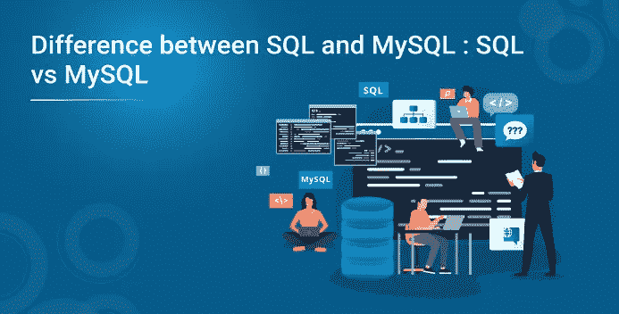
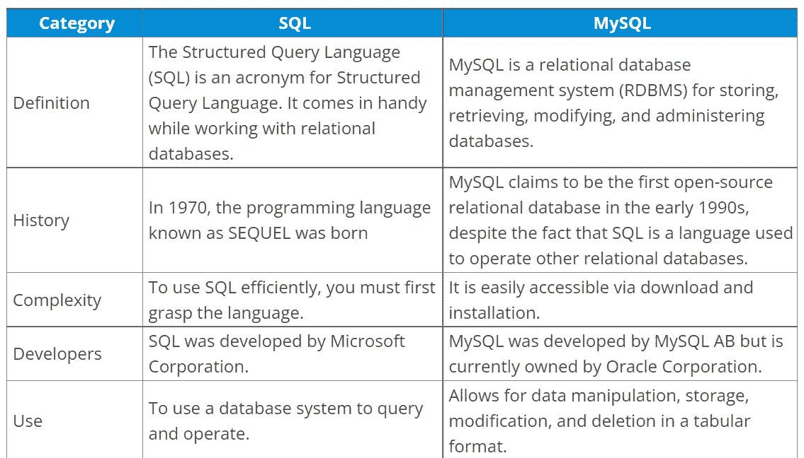
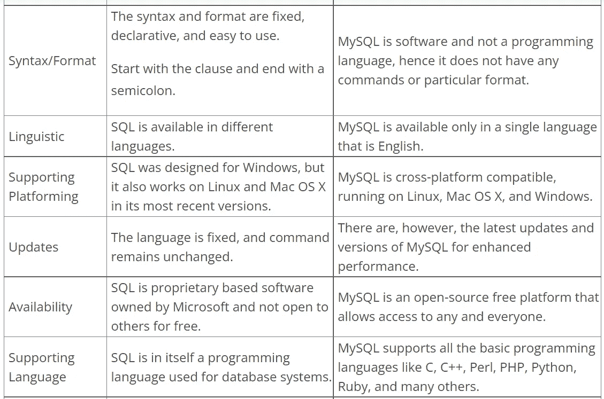
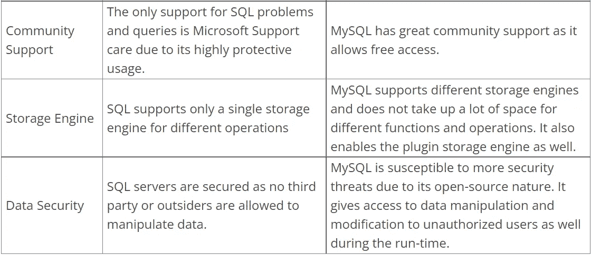

# SQL 和 MySQL 的区别:SQL vs MySQL

> 原文：<https://medium.com/edureka/difference-between-sql-and-mysql-sql-vs-mysql-949a590f6629?source=collection_archive---------2----------------------->

世界上排名前 4 的数据库使用结构化查询语言(SQL)语言。有许多数据库是基于 SQL 语言的。在这篇博客中，我们将讨论 SQL 和 MySQL 的区别。欢迎阅读 Edureka 关于 SQL 和 MySQL 区别的文章，在这里我们将讨论 SQL 和 MySQL 的区别。

# 什么是数据库？

数据库是软件系统中所有数据的集合，这些数据以电子方式保存和构建。它是一种技术，使我们能够存储大量的任何形式的数据，以便简单的访问和应用。

有许多不同种类的数据库，如在一个地点管理机构所有信息的集中式数据库，或在服务器上存储信息并可以在线访问的云数据库。

# 什么是 RDBMS？

RDBMS(关系数据库管理系统)是一个更复杂的数据库管理系统，它允许你组织、维护、检索和管理表格数据库。对于管理海量数据，它是数据分析师或数据库经理最常用的工具之一。

在业务数据管理中，SQL 和 MySQL 是两个经常使用的术语。虽然它们听起来很相似，但本质上是不同的。如果您想处理关系数据库、大数据、商业智能或商业分析，您必须了解 SQL 和 MySQL 之间的差异。

# 什么是 SQL？

SQL(结构化查询语言)是操作、管理和访问数据库的标准语言。通过对语法进行简单的修改，可以添加、检索、删除或访问其他数据库中的数据。根据美国国家标准协会(ANSI)的说法，SQL 是操作关系数据库管理系统(如 MySQL)的标准语言。微软拥有、托管和维护它。

SQL 可以用来创建对数据库进行修改的程序。SQL 也可以用于构建和改变数据库模式。SQL 最吸引人的特性之一是能够用一个命令访问数据库中的大量条目。

# 什么是 MySQL？

MySQL 是由 MySQL AB 在 1995 年创建的。另一方面，甲骨文公司目前拥有并出售它。MySQL 是一个开源的关系数据库管理系统，它使用 SQL 命令在数据库中执行某些功能和过程。

C 和 C++是用来创建 MySQL 的编程语言。它可以在几乎所有主要的操作系统上运行，包括 Windows、Mac OS X、Linux 和基于 Unix 的计算机。它也是 LAMP (Linux、Apache、MySQL 和 PHP)开源技术栈(Linux、Apache、MySQL 和 PHP)的关键组件。MySQL 中的数据库可能被多个用户访问。

# 为什么应该使用 SQL？

SQL 是一个强大而有效的工具，可以从庞大的数据集中提取相关的有价值的信息。虽然 SQL 在历史上一直是高技能数据分析师和程序员的领域，但它正越来越多地被非技术员工所采用。SQL 比你想象的要容易学，而且回报大大超过了时间投入。如果你进行这项投资，你将提升你的团队的价值，同时也提高了你在公司和更广阔市场的销售能力。

# 为什么应该使用 MySQL？

MySQL 是世界上最受欢迎的开源数据库的原因之一是它为所有类型的应用程序开发提供了广泛的支持。存储过程、触发器、函数、视图、游标、ANSI 标准 SQL 和其他数据库特性都受支持。插件库可用于将 MySQL 数据库功能嵌入到几乎任何嵌入式应用程序中。MySQL 还包括连接器和驱动程序(ODBC、JDBC 和其他),这使得 MySQL 成为各种应用程序青睐的数据管理服务器。MySQL 为应用程序开发人员提供了构建数据库驱动的信息系统所需的一切，无论他们使用的是 PHP、Perl、Java、Visual Basic 还是 or.NET。

## SQL vs . MySQL:SQL 和 MySQL 的根本区别是什么？

# SQL vs MySQL:结论

总之，SQL 与 MySQL 的争论是一个开放式的争论，不会产生二选一的结果。尽管 SQL 和 MySQL 有许多不同之处，但它们可以一起工作来满足您的关系数据库需求。在 SQL 和 MySQL 之间做出选择取决于安全性、速度、可伸缩性和效率等具体要求。

如果您有兴趣了解有关 SQL 的更多信息，请查看我们专为在职专业人士设计的 SQL Essentials 培训和认证课程，其中包括案例研究和项目、实践操作研讨会、行业专家指导、行业导师一对一指导、400 多个小时的学习以及顶级公司的工作协助。

# SQL 与 MySQL:常见问题

## MySQL 和 SQL Server 一样吗？

MySQL 和 SQL Server 都是关系数据库管理系统。MySQL 是开源的，可以免费使用，但是 SQL Server 是微软授权软件。

## 学习 SQL 有多难？

SQL 是一种容易掌握的语言。如果你懂编程，并且已经会几门其他语言，你可以在几周内学会 SQL。如果你完全是编程新手，可能需要更长时间。

参与多个项目是快速提升您的 SQL 知识的最有效策略之一。马上开始开发一个数据库驱动的网站。获取经验和快速学习，编写代码和解决挑战。

## 有哪些程序使用 SQL 和 MySQL？

SQL 被许多平台使用，如 MySQL、Oracle 和 Microsoft SQL Server。许多数据库驱动的在线程序，如 Drupal、Joomla、phpBB 和 WordPress，都使用 MySQL。许多主要网站，如脸书、Flickr、MediaWiki、Twitter 和 YouTube，都使用 MySQL。

## 我该学 SQL 还是 MySQL？

要操作任何数据库管理系统，你必须首先掌握 SQL 或标准查询语言。因此，最好先掌握这门语言，然后再掌握 RDBMS 基础。

## MySQL 可以免费使用吗？

是的，MySQL 是一个开源的关系数据库管理系统，可以免费使用。

如果你想查看更多关于人工智能、DevOps、道德黑客等市场最热门技术的文章，那么你可以参考 [Edureka 的官方网站。](https://www.edureka.co/blog/?utm_source=medium&utm_medium=content-link&utm_campaign=difference-between-sql-and-mysql)

请留意本系列中解释 SQL 其他各方面的其他文章。

> *1。*[*SQL For Data Science*](/edureka/sql-for-data-science-a8fe10fe2ef9)
> 
> *2。* [*甲骨文面试前 50 题*](/edureka/oracle-interview-and-answers-d1a99534e2d0)
> 
> [*3。前 65 个 SQL 面试问题*](/edureka/sql-interview-questions-162f97f37ac2)

*原载于 2022 年 2 月 22 日 https://www.edureka.co**的* [。](https://www.edureka.co/blog/sql-vs-nosql-db/)