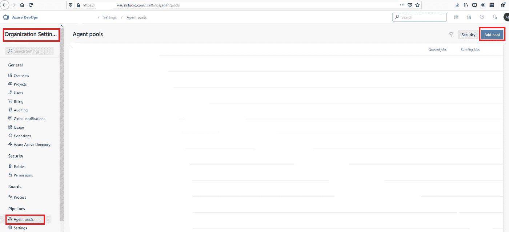
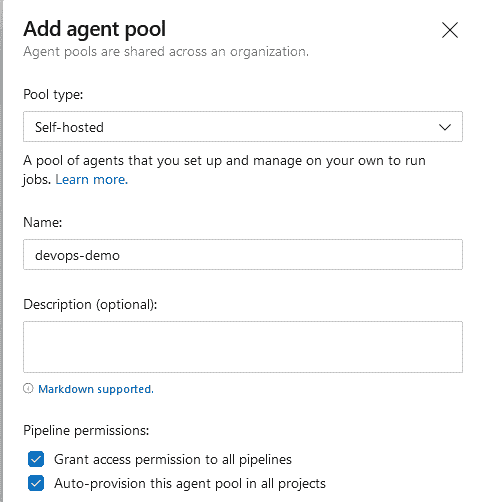
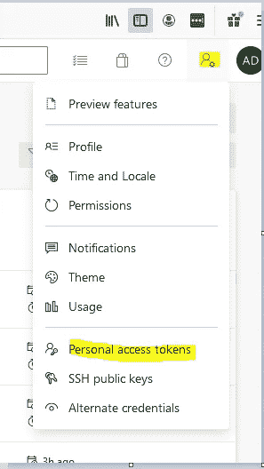
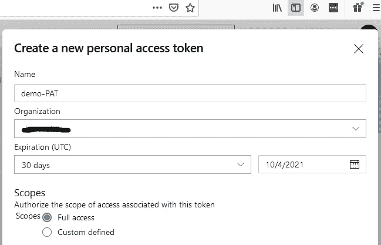
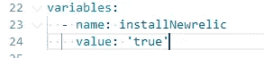
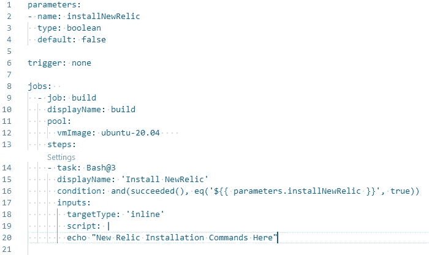
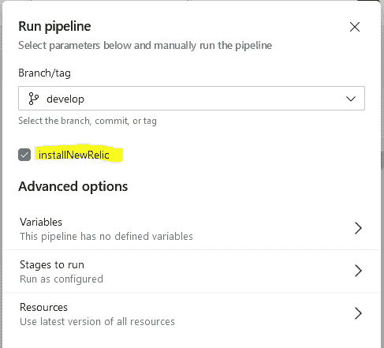

# 基于 YAML 的 Azure DevOps 管道的不同方面

> 原文：<https://medium.com/globant/different-facets-of-yaml-based-azure-devops-pipeline-79b28c8eaf?source=collection_archive---------0----------------------->

本文提供了一些我们可以在 Azure pipeline 中使用的重要特性的信息。Azure pipelines 有大量的任务插件和足够的特性来处理大多数常见的 CICD 流。Azure pipeline 的 Azure YAML 语法是专有的，不能用于其他 CICD 平台。

# 简介:

Azure DevOps 是微软提供的 DevOps 服务器，可帮助您简化 DevOps 流程。Azure DevOps 提供版本控制(Azure Repo)、项目管理(Azure Boards)、测试(测试计划)和 CI/CD 服务(Azure Pipelines)。

Azure DevOps 允许您创建两种不同格式的管道:经典编辑器，这是一种基于 GUI 的格式，不需要任何先验知识；另一种是基于 YAML 的格式，需要对 YAML 有基本的了解。

Azure YAML 允许您将 CI/CD 策略定义为代码，然后将管道文件提交给 repo。因此，您可以像其他应用程序代码一样利用拉请求、历史和代码审查。YAML 管道文件启用了版本控制，因此您可以回滚到任何以前的工作版本。

在经典编辑器中，你可以用图形用户界面在 Azure DevOps 中定义管道。经典编辑器管道不能是版本控制的一部分，因此不会跟踪更改。使用 classic editor，您可以在 DevOps portal 中创建构建和发布管道，因为您的构建管道将创建工件，这些工件可用于诸如登台和生产等环境中的代码部署。

关于 YAML 管道的文章包括以下几点:

1.  先决条件
2.  预定义变量
3.  代理节点池
4.  运行时间参数
5.  从一个管道触发另一个管道
6.  在管道中发布和使用工件。
7.  Azure DevOps 安全库
8.  结论
9.  参考

# **1。先决条件:**

*   Azure DevOps 帐户
*   关于 YAML 的基本知识
*   点击了解更多详情

# 2.预定义变量:

在 Azure DevOps 中，默认情况下许多变量已经存在。这种变量称为预定义变量或系统变量。预定义变量由系统自动设置，并且是只读的，它们可以表示简单的字符串和数字。下面是一些常用的预定义变量。

2.1 $ {代理。BuildDirectory} / ${Pipeline。Workspace}:此变量存储代理上运行构建的本地路径，两个变量具有相同的值。

示例:/ *家庭/管道代理/_ 工作/1*

2.2 $ {代理。TempDirectory}:在每个管道作业后清理的临时文件夹。您可以使用这个变量在管道期间存储秘密文件，并在管道之后清理它。

2.3 ${Build。BuildId} / ${Build。BuildNumber} **:** 已完成构建的 ID

2.4 $ {系统。DefaultWorkingDirectory }**:**代理上下载源代码文件的本地路径。

# 3.代理节点池:

要为您的应用程序运行、构建和部署管道，您至少需要一个代理。配置管道时，有两个代理选项。一个是 Azure 托管代理，另一个是自托管代理。代理可以是虚拟机或充当计算引擎的容器。代理操作系统可以是 Windows，Ubuntu，Mac OS。

这里要考虑的重点是成本。有了自托管代理，你可以免费使用 Azure 管道。在这里，您可以提供计算资源，并将 Azure devops 管道用作协调器。自托管代理赋予您安装构建和部署管道所需的软件或库的权限。

然而，如果你没有超过 Azure pipeline 的配额，你可以免费使用微软托管的代理。

*   Azure pipeline 的配额包括:1 个每月 1800 分钟的 CI/CD 微软托管代理和 1 个每月无限分钟的自托管作业。

**3.1 如何使用微软托管代理？** 要在您的 Azure pipeline 中使用微软托管的代理，请以如下所示的 YAML 格式提及操作系统名称:

```
pool:
  vmImage: ubuntu-20.04
```

**3.2 如何使用自托管代理？**

1.  转到组织设置。
2.  单击代理池。
3.  点击添加池。



4.如下图所示填写详细信息&在下一个屏幕上单击新代理。



5.打开新选项卡，要配置新代理，我们需要 PAT(个人访问令牌)，请参考下面的屏幕截图来创建 PAT:



Azure DevOps PAT



Azure DevOps Create PAT

注意:不要忘记在生成后立即复制令牌，因为您将无法再次看到它。

6.返回“代理池”页面，下载代理并按照 Microsoft 提供的说明进行安装。运行它时，您必须提供 PAT 和其他详细信息，以便可以对其进行配置。

一旦配置了您的代理，您就可以在 Azure DevOps 门户中看到您的代理。

# 4.运行时间参数:

以前，使用管道中定义的变量部分传递参数。早期方法的主要问题是所有变量都是字符串，所以没有验证来检查是否传递了正确的值。

例如:



现在我们有一个选项来定义运行时参数，包括接受布尔参数值的**参数**键。参数应该在 YAML 开始时设置。在下面的例子中，触发器被设置为 none，这样您就可以选择 **installNewrelic，**的值，默认情况下，它被配置为 false。



Azure DevOps YAML Pipeline

当您手动运行管道时，您将看到一个用户界面(如下所示),允许用户在运行管道之前选择此运行时参数。如果您没有做出选择，将使用默认选项 **false** 并跳过“安装 NewRelic”任务。



# 5.从一个管道触发另一个管道:

在某些情况下，我们有相互依赖的管道，在这种情况下，从另一个管道触发一个管道会很有帮助。你需要做的就是在你的 YAML 管道部分添加下面的代码。

```
# this is being defined in org.devops.demo – QA pipeline
trigger: noneresources:
  pipelines:
  - pipeline: DevBuild
    source: org.devops.demo - DEV
    branch: develop
    trigger:
      branches:
      - develop
```

通过添加**触发器:none** QA 管道将不会在提交时触发&仅在开发管道完成其工作时触发。

# 6.在管道中发布和使用工件:

Azure DevOps 管道构件允许您在管道中的不同阶段之间或不同管道之间共享文件。工件是构建过程的输出，需要被另一个作业部署或使用。

6.1 在管道中发布或上传工件:

```
steps:
- publish: $(System.DefaultWorkingDirectory)/app
  artifact: myapp
```

解释:

-发布文件或文件夹的工件路径是必需的。

-工件名称是一个选项，但是最好有一个名称，这样您就可以在管道中的任何地方使用它们。

6.2 在同一管道中下载工件。

```
steps:
- download: current
  artifact: myapp
```

说明:
- **当前**表示管道当前运行。

6.3 在另一个管道中下载工件:

使用 YAML 管道中的以下任务来使用另一个管道中的工件。

```
# this is being defined in org.devops.demo – QA pipeline
steps:
- task: DownloadPipelineArtifact@2
  inputs:
    source: 'specific'
    project: 'DevOps Demo'
    pipeline: 786 # ID of the pipeline from which you are downloading artifacts
    runVersion: ‘latestFromBranch’
    preferTriggeringPipeline: true
    runBranch: develop   # Branch of the artifacts pipeline
    artifact: 'myapp'    # Artifact Name
    path: '$(Pipeline.Workspace)/myapp
```

# 7.Azure DevOps 安全库:

有时我们有凭证，您不能在回购中提交，但我们希望使用该文件并以安全的方式部署在应用服务器上。在这种情况下，我们可以使用安全库，它允许我们存储凭证文件，通过管道在服务器上下载和上传。

要在安全库中上传文件:

转到 Azure DevOps →点击管道→库→点击安全文件→点击“+安全文件”

例子:这里我上传了 secret.php

要通过管道从安全库中下载文件:

```
- task: DownloadSecureFile@1
  name: mySecretFile # Any name which you can refer further in the pipeline.
  displayName: 'Download Secret File'
  inputs:
    secureFile: 'secret.php'
- script: |
    cp $(mySecretFile.secureFilePath) $(Pipeline.Workspace)/config
```

这里，
-上面的代码将下载 secret.php 在$(管道。工作区)/配置目录。

# **8。结论:**

总之，本文讨论了 Azure DevOps pipelines 中的各种功能，这些功能提供了对 CI/CD 的控制，最好的事情是所有事情都是使用代码完成的。由于其易于使用的语法，声明式 YAML 管道在顶部添加了 cherry，并且它有许多令人惊叹的功能可供探索(例如，缓存功能以减少管道执行时间、自定义条件等。).我希望这将有助于读者采用和使用 YAML 的 Azure DevOps 管道没有任何麻烦。

# **9。参考文献:**

*   关于 Azure Pipelines 的更多细节，请访问[官方文档。](https://docs.microsoft.com/en-us/azure/devops/pipelines/get-started/key-pipelines-concepts?view=azure-devops)
*   环境也是 Azure DevOps Pipeline 的特色之一，点击[此处](/globant/tracing-resources-using-environment-of-azure-devops-c8802c0668de)阅读更多。
*   阅读更多博客[http://www.anup.co.in](http://www.anup.co.in)

希望这篇文章对你有用！