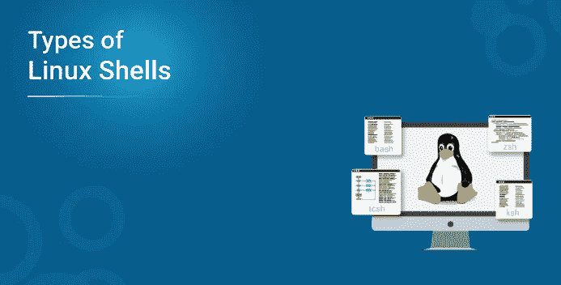
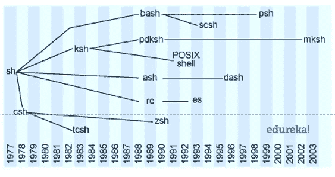

# 为什么需要不同的 Linux Shells？

> 原文：<https://medium.com/edureka/different-linux-shells-25da41cf166e?source=collection_archive---------1----------------------->



贝壳就像品牌。每个人都有自己的最爱，并虔诚地捍卫自己的选择，而且经常会告诉你为什么应该换工作。Linux 中不同类型的 ***外壳可以提供不同的功能，但在它们的核心，它们基本上实现了几十年前开发的思想。***

因此，我们将从现代 shell 的简史开始，然后探索一些目前适用于 Linux 的有用的开源 shell，您可以自己决定它对您有多大好处。

以下是本博客的讨论过程；

*   贝壳的进化
*   壳的定义
*   外壳的基本架构
*   Linux 中 5 种不同类型的 Shells，为什么要选择它们
*   Bourne-Again Shell
*   TENEX C 外壳
*   科恩壳牌公司
*   z 外壳
*   方案外壳

# **进化贝壳**

除了汤普森贝壳，我们开始看看现代贝壳。

**1977 年**

伯恩外壳推出。Stephen Bourne 在贝尔实验室为 V7 UNIX 开发的***Bourne shell(sh)***至今仍是一个有用的 shell(在某些情况下，作为默认的根 shell)。Bourne shell 是在一个 ***ALGOL68 编译器*** 上工作后开发的，所以它的语法比其他 shell 更符合算法语言(ALGOL)的路线。源代码是用 c 开发的。

伯恩壳有两个主要目的:

*   为操作系统执行，即 ***命令行解释器***
*   编写可以通过 shell 调用的可重用脚本，即 ***脚本***

除了取代 Thompson shell 之外，Bourne shell 还提供了许多其他优于其前身的优势，如控制流、循环和脚本变量，提供了一种更具功能性的语言来与操作系统进行交互。

shell 还允许您使用 shell 脚本作为过滤器，为处理信号提供集成支持，但缺乏定义函数的能力。

它向世界介绍了我们今天使用的许多功能，如命令替换和在脚本中嵌入保留的字符串文字的 HERE 文档。

Bourne shell 导致了我们今天使用的许多 shell 的开发。

**1978 年**

C shell(csh) 由 Bill Joy 开发，目标是实现一种类似于 C 编程语言的脚本语言。这是有用的，因为 C 是当时使用的主要语言，这也使得它更容易和更快地使用。

**1983**

由大卫·科恩开发的 ***科恩 Shell(ksh)*** 结合了伯恩 Shell 和 C Shell 的特点。它与 Bourne Shell 向后兼容。它包括来自 C Shell 的特性，如作业控制、命令别名&命令历史。

也是在同一年，推出了***TENEX C Shell(tcsh)***。它最初是 C Shell 的衍生物，但是添加了可编程的命令行完成和编辑功能。

**1989 年**

今天使用最广泛的 Shell 之一，***Bourne-Again Shell(bash)***是 Brian Fox 为 ***GNU 项目*** 编写的，作为 Bourne Shell 的前软件替代。它展示了 Bourne shell 的所有特性，但是更加高效和易于使用。

它支持用于条件测试和迭代的文件名全球绑定、管道、命令替换和控制结构。



**当前日期**

许多 Shell 后来都得到了发展，如 ***公共域 Korn Shell******Almquist Shell、*** 和 ***可扩展 Shell*** 引入了适合不同需求的新特性和方言。

# **外壳的定义**

Shell 是一个交互式环境，它为操作系统提供了一个接口。它按顺序收集您的输入，以实现特定的使用模型。

# **外壳的基本架构**


假设的 Shell 所基于的基础架构并不复杂。基本架构非常类似于管道，在那里输入被分析和解析，符号被扩展。它使用了多种方法，如大括号、波浪号、变量和参数扩展和替换以及文件名生成。然后，使用 shell 内置命令或外部命令来执行命令。

# **Linux 中不同类型的 Shells，为什么要选择它们**

每一种贝壳都有自己的风格，适合寻求不同问题解决方案的人们。您可以通过这些流行的 shells 各自执行相同任务的脚本(即 ***查找所有可执行文件*** )来了解它们之间的相似性或不相似性。

**Linux 中不同类型的 Shells，你为什么要选择它们**

每一种贝壳都有自己的风格，适合寻求不同问题解决方案的人们。您可以通过这些流行的 shells 各自执行相同任务的脚本(即 ***查找所有可执行文件*** )来了解它们之间的相似性或不相似性。

**1。谍影重重外壳**

Bash 代表 **Bourne Again Shell** ，它是当今许多 Linux 发行版的默认 Shell。它也是一个 sh 兼容的 shell，并在编程和交互使用方面提供了比 sh 更好的实用改进，包括:

*   命令行编辑
*   作业控制
*   无限制大小的命令历史记录
*   外壳函数和别名
*   无限大小的索引数组
*   从 2 到 64 的任何基数的整数运算

**代码示例**

```
*#!/bin/bash
#find all executables**count=0**#Test arguments*
*if [ $#‑ne 1 ] ; then*
*echo "Usage is $0 <dir>"*
*exit 1*
*fi**#Ensure argument is a directory*
*if [ ! ‑d "$1" ] ; then*
*echo "$1 is not a directory."*
*exit 1*
*fi**#Iterate the directory, emit executable files*
*for filename in "$1"/∗*
*do*
*if [ ‑x "$filename" ] ; then*
*echo $filename*
*count=$((count+1))*
*fi*
*done*

*echo*
*echo "$count executable files found."**exit 0*
```

如果您是 shell 脚本的新手，bash 首先是一种很好的语言。它是互动的和全面的。顾名思义，Bash 是 Bourne shell 的超集，无需修改就可以运行大多数 Bourne 脚本。它是大学和学校教授给学习计算机科学的学生的语言。

**2。TENEX C 壳**

**Tcsh** 是一个增强的 **C** shell，它可以用作交互式登录 shell 和 shell 脚本命令处理器。

Tcsh 具有以下特点:

*   C like 语法
*   命令行编辑器
*   可编程的字和文件名完成
*   拼写纠正
*   作业控制

**代码示例**

```
*#!/bin/tcsh
#finding all executable files**set count=0**#Testing arguments*
*if ($#argv != 1) then*
*echo "Usage is $0 <dir>"*
*exit 1*
*endif**#Ensuring each argument is a directory*
*if (! ‑d $1) then*
*echo "$1 is not a directory."*
*exit 1*
*endif**#Iterating the directory, printing executable files*
*foreach filename ($1/∗)*
*if (‑x $filename) then*
*echo $filename*
*@ count = $count + 1*
*endif*
*end*

*echo*
*echo "$count executable files found."**exit 0*
```

如果您是 Unix 环境中的网络或系统管理员，您几乎肯定会遇到 C shell，因此至少对它有一些熟悉是有好处的。

**3。Korn Shell**

**Ksh** 代表 **Korn shell** 由 **David G. Korn** 设计开发。它是一种完整、强大的高级编程语言，也是一种交互式命令语言，就像许多其他 Unix/GNU Linux shell 一样。

Korn shell 包含了其他 shell 的特性，并提供了一些现代脚本语言中的高级特性，例如；

*   关联数组
*   浮点运算
*   作业控制
*   命令别名
*   命令历史
*   支持 POSIX 标准
*   与 bash 的向后兼容性

**代码示例**

```
*#!/usr/bin/ksh
#finding all executable files**count=0**#Testing arguments*
*if [ $#‑ne 1 ] ; then*
*echo "Usage is $0 <dir>"*
*exit 1*
*fi**#Ensuring each argument is a directory*
*if [ ! ‑d "$1" ] ; then*
*echo "$1 is not a directory."*
*exit 1*
*fi*

*#Iterating the directory, printing executable files*
*for filename in "$1"/∗*
*do*
*if [ ‑x "$filename" ] ; then*
*echo $filename*
*count=$((count+1))*
*fi*
*done**echo*
*echo "$count executable files found."**exit 0*
```

这个 Shell 是一种 Unix shell 编程语言，您可以交互地使用它来从命令行执行命令，或者以编程方式创建脚本来自动执行许多计算机维护和系统管理任务。

**4。z 外壳**

Zsh 被设计成交互式的，它结合了其他 Unix/GNU Linux shell 的许多特性，例如 **bash** 、 **tcsh、**和 **ksh** 。

它也是一种强大的脚本语言，就像其他可用的 shells 一样。尽管它有一些独特的功能，包括:

*   文件名生成
*   启动文件
*   登录/注销监视
*   结束语
*   概念索引
*   可变指数
*   功能索引
*   关键索引以及更多您可以在手册页中找到的内容

**代码示例**

```
*#!/bin/zsh
#finding all executable files**set count=0**#Testing arguments*
*if ($#argv != 1) then*
*echo "Usage is $0 <dir>"*
*exit 1*
*endif**#Ensuring each argument is a directory*
*if (! ‑d $1) then*
*echo "$1 is not a directory."*
*exit 1*
*endif*

*#Iterating the directory, printing executable files*
*foreach filename ($1/∗)*
*if (‑x $filename) then*
*echo $filename*
*@ count = $count + 1*
*endif*
*end**echo*
*echo "$count executable files found."**exit 0*
```

**5。方案外壳**

***Scheme shell(scsh)***是一个奇特的 shell，提供了一个使用 ***Scheme*** 的脚本环境，它是 ***Lisp 语言*** 的衍生物。 ***Pyshell*** 试图创建一个类似的脚本，使用。

**代码示例**

```
*#!/usr/bin/scsh ‑s
!#**(define argc*
*(length command‑line‑arguments))**(define (write‑ln x)*
*(display x)*
*)**(define (showfiles dir)*
*(for‑each write‑ln*
*(with‑cwd dir*
*(filter file‑executable? (directory‑files "." #t)))))**(if (not (= argc 1))*
*(write‑ln "Usage is fae.scsh dir")*
*(showfiles (argv 1)))*
```

该脚本可能看起来是外来的，但是它实现了与目前为止提供的脚本相似的功能。这个脚本包含了三个函数，并在最后包含了可直接执行的代码来测试参数计数。我想提醒您注意 ***showfiles 函数*** ，它迭代一个列表，在列表的每个元素后调用 ***write-ln*** 。这个列表是通过迭代指定的目录并过滤可执行文件而生成的。

根据您的要求/口味，可以使用其他外壳。

如果你想查看更多关于人工智能、DevOps、道德黑客等市场最热门技术的文章，你可以参考 Edureka 的官方网站。

请留意本系列中解释操作系统其他方面的其他文章。

> *1。* [*Linux 命令*](/edureka/linux-commands-895d69fa4f07)
> 
> *2。* [*Top 75+ Unix 面试问答*](/edureka/unix-interview-questions-dba26b8a13bc)
> 
> *3。*[*Linux Mint*](/edureka/linux-mint-904d4de15c58)

*原载于 2019 年 5 月 30 日*[*https://www.edureka.co*](https://www.edureka.co/blog/types-of-shells-in-linux/)*。*