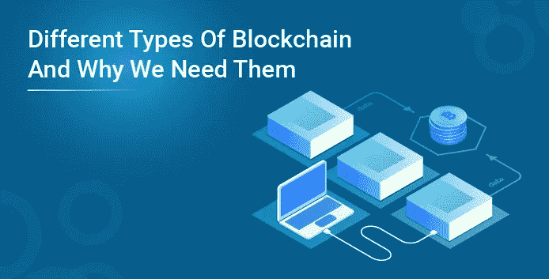
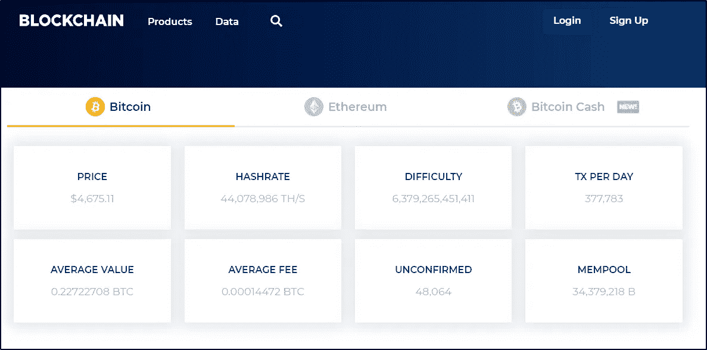
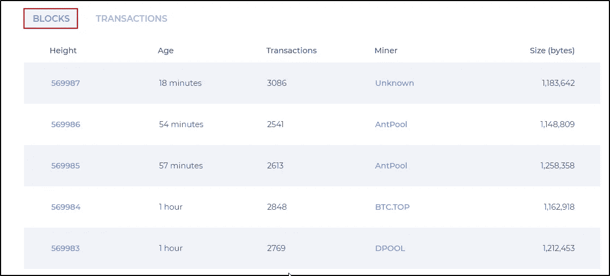
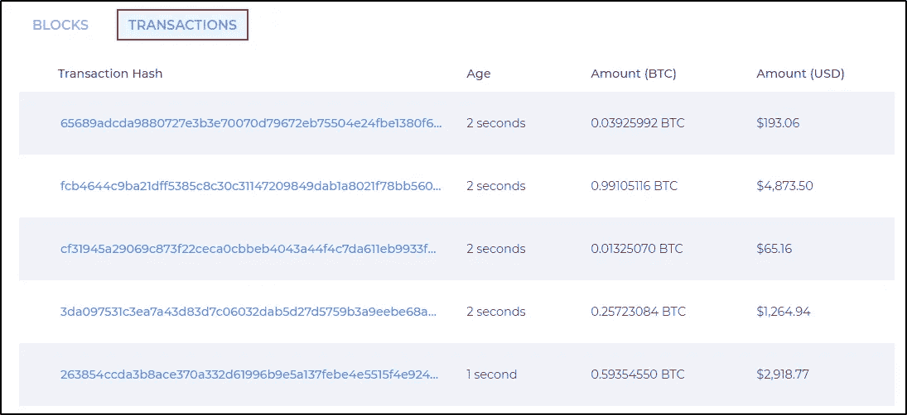

# 不同类型的区块链以及我们为什么需要它们

> 原文：<https://medium.com/edureka/different-types-of-blockchain-560c9abf6203?source=collection_archive---------2----------------------->

区块链凭借比特币进军 IT 行业，改变了世界看待在线交易的方式。随着区块链的流行，人们意识到区块链可以超越比特币。多年来，医疗保健、房地产、政治等各种行业。，一直在尝试采用区块链技术。因为每个行业都有独特的工作方式，区块链必须演变成不同的类型。在这篇博客中，我将解释不同类型的区块链及其基本原理。

本博客涵盖的主题有:

*   为什么我们需要不同类型的区块链？
*   不同类型的区块链

# 为什么我们需要不同类型的区块链？

如前所述，不同行业使用区块链技术的方式不同。因此，在谈论不同类型的区块链之前，我想讨论一些区块链的应用，其中应用使用区块链的要求和方式是不同的。

我先从向世界介绍区块链技术的应用说起:**比特币**！

## 比特币

比特币是最受欢迎的加密货币之一。比特币是一种无需任何中间环节的在线货币交易方式。假设你想把一些比特币从你的账户转到另一个账户。你用收款人的账号 ID 转账比特币。交易被发送到区块链挖掘进行验证，以避免欺诈。在交易被确认和验证之后，交易被添加到区块链块中，并且接收者接收比特币。

当谈到比特币这样的加密货币时，任何人都应该能够访问它，进行交易并成为验证者。这就是为什么比特币对谁可以访问它没有限制。打开网页浏览器，进入 https://www.blockchain.com/explorer 的。在这里你会看到许多细节，如价格，散列，难度等。

当谈到比特币这样的加密货币时，任何人都应该能够访问它，进行交易并成为验证者。这就是为什么比特币对谁可以访问它没有限制。打开网页浏览器，进入 https://www.blockchain.com/explorer 的。在这里你会看到许多细节，如价格，散列，难度等。

如果您向下滚动同一页面，您将看到每个块和交易的更多详细信息。

你可以看到很多信息是公开的。但这并不意味着数据不安全。这些都是加密数据，敏感数据仍然是安全的。

## 多链

多链是区块链的一种应用，组织使用它来增强安全性。通过设置多链，您可以防止对敏感数据的未授权访问。在这里，区块链不对公众开放，它只对同一组织中的授权实体开放。

如果你拥有一个组织，并决定在区块链上存储金融交易的详细信息，你不会希望这些数据公开。数据应仅限于相关人员(财务部门、管理层、董事会等)。).

在区块链的这类应用中，应该限制可以加入网络和访问区块链的节点。只有受到网络管理员的邀请，才能加入网络。此外，参与者和验证者的访问受到限制。

多链(Multichain)是一种仅由单个组织使用的区块链。银行业使用的版本略有不同。

## 银行业的区块链

类似于 Multichain 只限于同一组织的人员，银行业中使用的区块链限制了该特定银行对区块链的访问。但这里的区别是，区块链应该对银行的所有分支机构开放，可能对不同银行的内部交易开放。

在这种应用中，区块链不仅仅局限于一个节点，而是局限于其他可信节点。有权访问区块链的节点应该得到授权。这就像区块链被信任的节点共享和限制。

现在，您已经了解了区块链如何以不同的方式用于不同的应用，让我们看看有哪些不同类型的区块链。

# 不同类型的区块链

根据应用的需要，区块链可以分为 3 种类型:

1.  公共区块链
2.  私有区块链
3.  财团区块链

## 公共区块链

顾名思义，公共区块链是公开可访问的，对谁可以参与或作为验证者没有限制。在公共区块链，没有人能完全控制网络。这确保了数据安全性，并有助于不变性，因为单个人无法操纵区块链。

区块链上的权限在网络中的每个节点之间平均分配，因此，已知公共区块链是完全分布式的。

公共区块链主要用于**比特币**、**以太坊**、**莱特币**等加密货币。

## 私有区块链

私有区块链(也称为许可区块链)对谁可以访问它以及参与交易和验证有限制。只有预先选择的实体有权访问区块链。这些实体由各自的机构选择，并在构建区块链应用程序时由区块链开发者给予许可。假设需要向新用户授予权限或撤销现有用户的权限，网络管理员可以负责。

私有区块链主要在私有组织中使用，用于存储只对组织中的某些人可用的敏感信息。因为私有区块链是一个**封闭的**区块链，数据在组织内部，任何外部实体都无法触及。

## 财团区块链

在财团区块链中，一些节点控制共识过程，一些其他节点可能被允许参与交易。财团区块链就像是公有和私有区块链的混合体。它是公共的，因为区块链正被不同的节点共享，它是私有的，因为可以访问区块链的节点受到限制。因此，它一部分是公有的，一部分是私有的。

这里有两种类型的用户:第一，对区块链拥有控制权并决定谁应该有权访问区块链的用户，第二，可以访问区块链的用户。

当组织准备共享区块链时，可以使用这种类型的区块链，但限制对他们自己的数据访问，并防止公众访问。如果你想查看更多关于人工智能、DevOps、道德黑客等市场最潮流技术的文章，那么你可以参考 [Edureka 的官方网站。](https://www.edureka.co/blog/?utm_source=medium&utm_medium=content-link&utm_campaign=types-of-blockchain)

请留意本系列中解释区块链其他各方面的其他文章。

> *1。* [*以太坊教程*](/edureka/ethereum-tutorial-with-smart-contracts-db7f80175646)
> 
> *2。* [*以太坊专用网络*](/edureka/ethereum-private-network-tutorial-22ef4119e4c3)
> 
> *3。* [*什么是智能合约？*](/edureka/smart-contracts-301d39565b76)
> 
> *4。* [*坚固性教程*](/edureka/solidity-tutorial-ca49906bdd47)
> 
> *5。* [*松露以太坊教程*](/edureka/developing-ethereum-dapps-with-truffle-7533289c8b2)
> 
> *6。* [*最好的以太坊开发工具*](/edureka/ethereum-development-tools-7175503a1ac7)
> 
> *7。* [*总账架构*](/edureka/hyperledger-fabric-184667460-edc184667460)
> 
> *8。* [*Hyperledge vs 以太坊*](/edureka/hyperledger-vs-ethereum-bdc868e10817)

*原载于 2019 年 5 月 22 日 https://www.edureka.co**T21*[。](https://www.edureka.co/blog/blockchain-architecture/)