# 使用 Oracle Analytics 实现机器学习的不同方式

> 原文：<https://medium.com/oracledevs/different-ways-to-implement-machine-learning-with-oracle-analytics-6d272cf26c92?source=collection_archive---------1----------------------->

预测分析是最广泛使用的分析方式之一。如今，许多客户希望利用机器学习(ML)技术来基于历史数据识别未来结果的可能性。为了预测未来的 KPI，需要开发适当的机器学习模型并用于预测分析。

这篇博客主要关注如何使用 Oracle analytics 实现机器学习，以预测未来的 KPI，然后在 Oracle Analytics Cloud(OAC)或 Oracle Analytics Server(OAS)中执行分析。"*请不要使用本博客来引用和验证机器学习概念"*

我们可以在 Oracle 分析云/Oracle 分析服务器或 Oracle 数据库中实施 ML。数据流是 OAC/OAS 中基于图形用户界面的工具，可用于开发 ML 模型，但在数据库中，它可以使用 Oracle Data Miner 或任何编程语言(如 Python、R 等)来实现。我们将在这篇博客中讨论这三个选项。

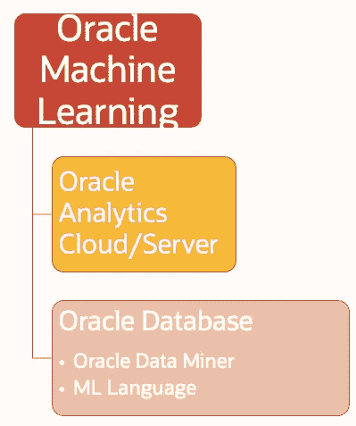

## 示例使用案例

一家零售银行要求对其当前客户数据执行流失预测分析。他们拥有各种属性的历史客户流失数据，例如客户 ID、姓名、信用评分、地理位置、性别、年龄、任期、余额、产品数量、拥有信用卡、活跃、估计工资、退出(流失)。

我们将在历史客户流失数据上训练一个 ML 模型，然后在当前客户数据上使用该模型来预测流失概率。

*注意:Github 存储库中提供了样本银行客户数据集，可以导入到 Oracle 数据库中。*

# ***使用 Oracle 分析云/Oracle 分析服务器进行机器学习***

## *特性*

*   基于图形用户界面的实施工具
*   各种内置算法
*   不需要编码技能
*   预测数据准备好快速可视化
*   可以在非工作时间进行预先计算
*   更适合小型数据集

## 训练机器学习模型

1.  根据银行客户流失历史数据创建数据集。
2.  创建数据流，以银行客户流失历史数据为数据源。
3.  选择对客户流失预测有重要意义的属性。例如，对于 Rownum，不需要客户 ID 和姓氏。
4.  选择适当的 ML 算法，例如在这种情况下训练二进制分类器，并选择在这种情况下退出的目标属性。
5.  用适当的名称保存模型。
6.  运行数据流，它将在 OAS 美洲国家组织中创建一个机器学习模型。

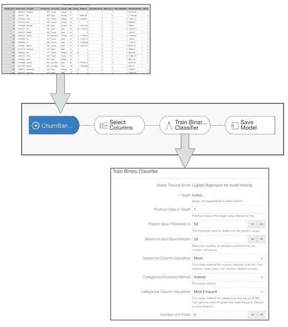

7.从主页汉堡菜单导航到机器学习选项卡，然后检查模型的准确性。

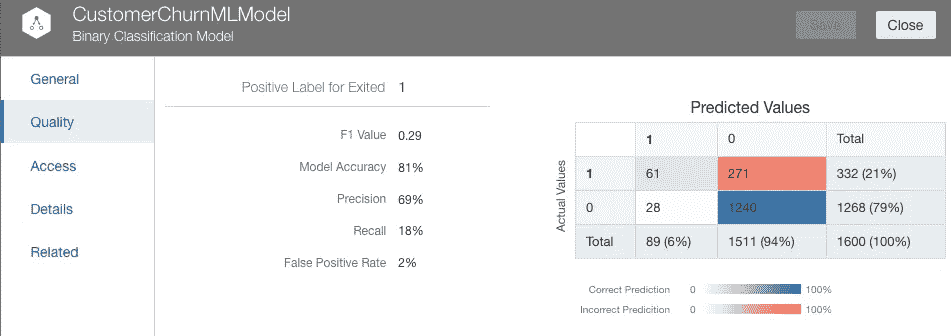

## 使用经过训练的机器学习模型进行预测

机器学习模型已经在第一步进行了训练，现在它可以应用于当前的客户数据，以预测客户流失的概率。

1.  创建另一个数据流并获取当前客户数据(请注意，该数据集没有“退出”(流失)属性，这将使用之前训练的模型进行预测)

2 .应用上一步中已训练的 ml 模型(“训练模型”)并保存该数据集以执行分析。

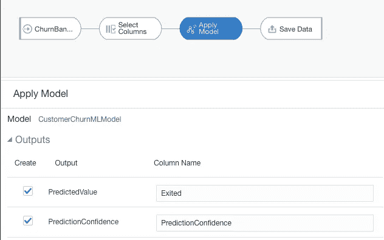

3.该数据集将具有流失预测(0 或 1)和流失概率。现在这可以用于分析。

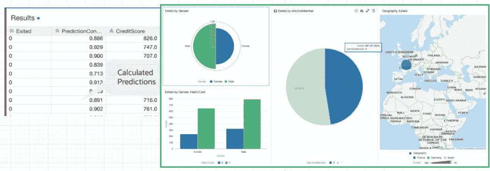

# 在 Oracle 数据库中使用 Oracle 数据挖掘器进行机器学习

Oracle Data Miner 使数据科学家、业务和数据分析师能够使用图形化的“拖放”工作流编辑器直接处理数据库中的数据。Oracle Data Miner 是 Oracle SQL Developer 的扩展，它在图形分析工作流中捕获和记录用户在探索数据和开发机器学习方法时采取的步骤。

## *特性*

*   处理大量数据
*   基于图形用户界面的工具
*   不需要编码技能
*   从工作流中生成 SQL 和 PL/SQL 脚本，以自动化和加速整个企业的模型部署
*   使用大数据源，包括 Oracle 数据库、Spark、Hadoop 等

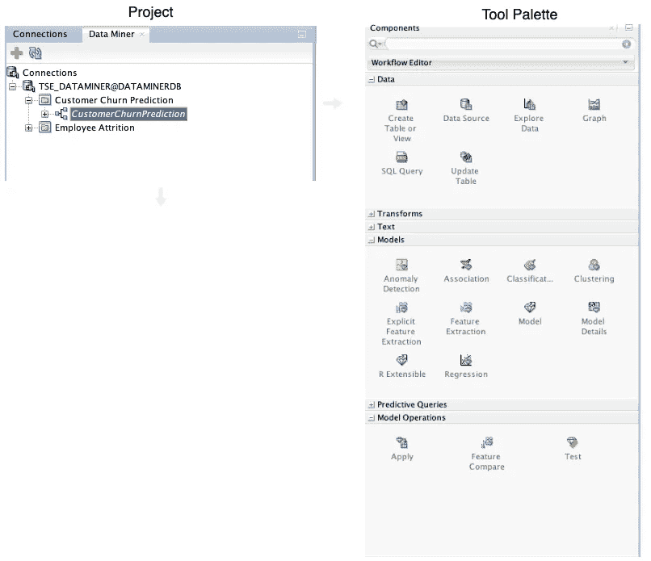

## 训练机器学习模型并将其用于预测

1.  在 SQL developer 中打开数据挖掘器选项卡，并创建一个新项目。
2.  创建新的工作流程，并以任何名称保存，例如“CustomerChurn”
3.  从工具面板中拖放数据源节点，并选择 customer_churn_history 表(包含客户的历史数据)。
4.  拖放样本节点并为训练模型配置样本大小。
5.  拖放分类模型以使用一组分类算法。
6.  运行所有节点，通过右键单击并选择分类模型节点的“比较剩余结果”,检查所有四种算法的准确性结果。
7.  或者，您可以从 customer_churn_history 中再抽取一个样本，重新测试模型的准确性。
8.  现在从工具面板中再选择一个数据源节点，并选择 customer_churn_current 表(客户的当前数据)
9.  从工具面板中放置应用模型节点，并在当前数据源上应用模型。
10.  使用 create table 或 update table 节点在数据库中写回流失预测。

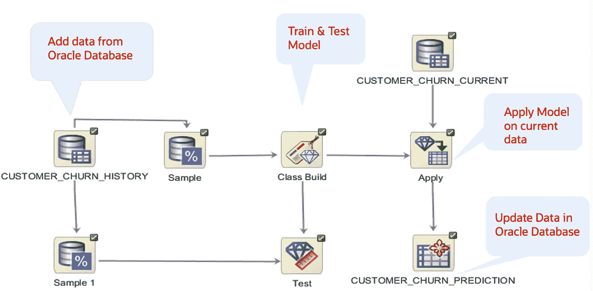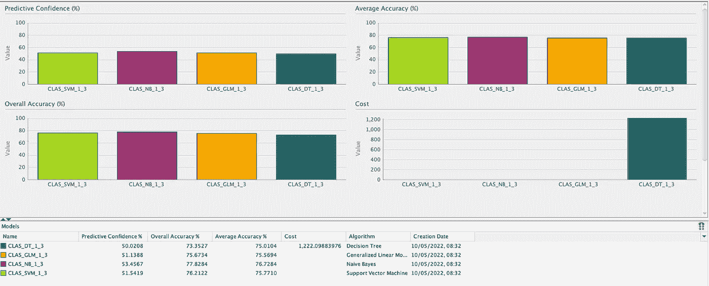

11.将 OAS 办公自动化系统与数据库连接，并对预测数据进行分析。

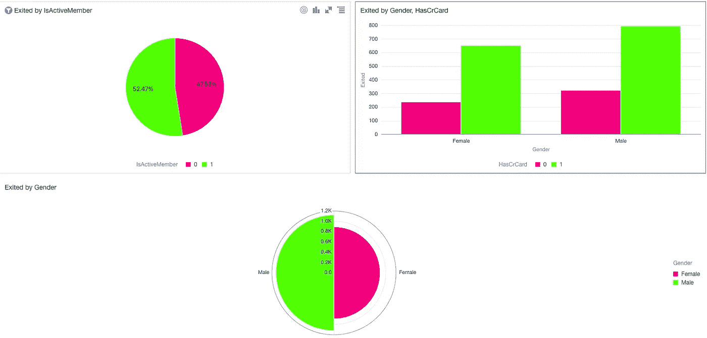

要了解更多关于 Oracle Data Miner 的信息，请阅读本文档。

 [## 数据挖掘器

### Oracle Data Miner 是对 Oracle SQL Developer 的扩展，使数据科学家、业务和数据分析师能够…

www.oracle.com](https://www.oracle.com/big-data/technologies/dataminer/) 

使用此 oracle 文档来设置和配置 oracle data miner。

 [## 设置 Oracle Data Miner 4.1

### 目的本教程介绍了设置 Oracle Data Miner 4.1 以便在 Oracle SQL Developer 4.1 中使用的过程…

www.oracle.com](https://www.oracle.com/webfolder/technetwork/tutorials/obe/db/12c/r1/dm/dm_41/ODM12c-41_SetUp.html) 

# Oracle 数据库中编程语言的机器学习

在 Oracle 数据库中利用机器学习的另一种方式是使用任何编程语言，例如 Python、R、Java 等。这里我以 Python 为例。

## 特征

*   使用所有开源库的灵活性
*   所需的编码技能
*   处理大量数据

## 训练机器学习模型并将其用于预测

1.  使用 cx_oracle 或任何其他 python 库连接 Oracle 数据库
2.  获取银行历史数据来训练 ml 模型
3.  测试 ml 模型的准确性
4.  获取 customer_churn_current 表(当前客户数据)以预测客户流失
5.  写回/更新数据库中的预测数据
6.  将 Oracle 分析云/Oracle 分析服务器与数据库连接并执行分析。

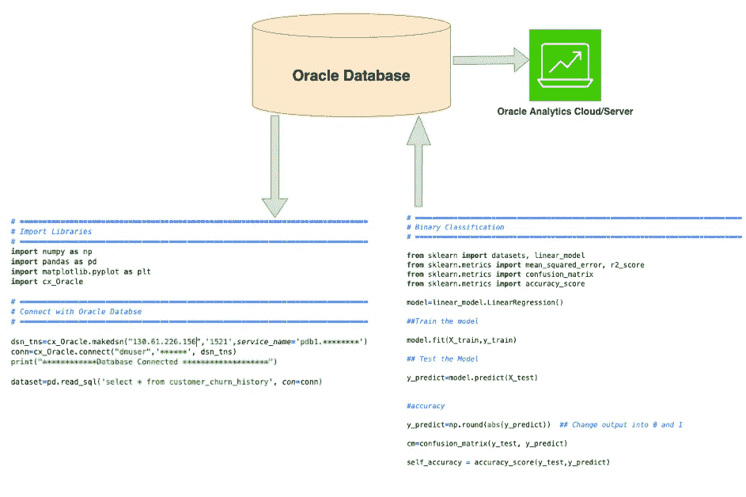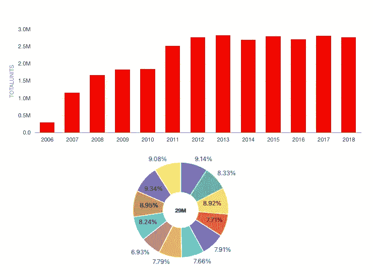

# 示例数据文件和脚本

*免责声明——请注意，这些示例脚本展示了如何通过 Oracle 分析云/Oracle 分析服务器和 Oracle 数据库使用机器学习，请勿参考机器学习概念*

[Churn Bank customershistory . CSV](https://github.com/amittyagi27/MachineLearning/blob/main/ChurnBank%20CustomersHistory.csv):-银行的客户流失历史数据

[churnbankcustomerscurrent . CSV](https://github.com/amittyagi27/MachineLearning/blob/main/ChurnBankCustomersCurrent.csv):-银行的客户当前数据

CustomerChurn.xml :- Oracle 数据挖掘器工作流 xml 文件(可以在 Sql Developer 中导入)

ChurnBankCustClsDBPredict.py:-连接 Oracle 数据库、训练模型和执行预测的示例 Python 脚本

 [## GitHub-amittyagi 27/机器学习

### 此时您不能执行该操作。您已使用另一个标签页或窗口登录。您已在另一个选项卡中注销，或者…

github.com](https://github.com/amittyagi27/MachineLearning.git) 

想谈谈吗？在这里加入我们的公共休闲频道。