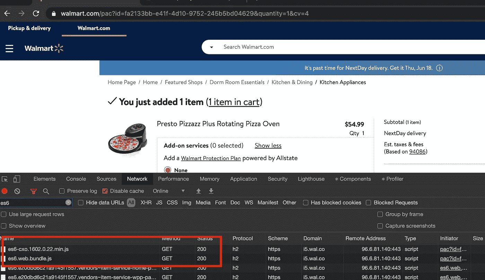

# 差异化服务——最新浏览器的食物

> 原文：<https://medium.com/walmartglobaltech/differential-serving-food-for-latest-browsers-ba96192eb0ad?source=collection_archive---------8----------------------->

Credit: [pixabay](https://pixabay.com/illustrations/browsers-internet-web-design-1273344/).com

差异服务是一种为现代浏览器提供最新 javascript 包的现代技术。

有一段时间围绕这个话题有很多问题。在 WalmartLabs，我们看到缩小的包大小减少了大约 10%到 25%,并使用这种技术来帮助我们的整体站点速度。

在这篇博客中，我将回答其中的一些问题。(什么、为什么和如何)

什么是差别服务？

我们为什么需要它？

我们如何实现它？

**什么**？

差异化服务背后的想法是，应用程序生成两个包

1.  默认捆绑包:在捆绑你的应用程序时，这个 JS 捆绑包必须已经生成了——受所有浏览器支持，因为它和一些 polyfills 一起被传输到 ES5。
2.  ES6 bundle:作为 differential serving 的一部分，这个 bundle 具有完全相同的功能，但是没有附加 polyfills，这使得它的大小要小得多，并且只能在受支持的现代浏览器中工作。

**为什么？**

这里的好处是，旧浏览器可以有一个单独的包，支持 polyfills 或 transforms 等功能，对于现代浏览器，它将有一个单独的包，支持 es6-这是小尺寸，因此执行速度更快-这意味着更高的网站速度和更好的性能。

此外，超过 80%的沃尔玛用户使用现代 JS 支持的浏览器，这一功能有助于我们的大部分人获得更好的用户体验。

**如何？**

实现它有两个主要步骤:

1.  生成两个不同的捆绑包—默认捆绑包和 es6 捆绑包
2.  向浏览器提供正确的捆绑包。

为了生成同一个应用程序的两个版本，需要为目标浏览器进行一些巴别塔配置。

在 WalmartLabs，所有应用都是基于[电极](https://github.com/electrode-io/electrode)的。它的通天塔配置是从这里的[继承而来的](https://github.com/electrode-io/electrode/blob/v6.x.x/packages/electrode-archetype-react-app-dev/config/babel/babelrc-client.js#L133)，在应用级配置必须设置目标和浏览器列表。为了简化配置层，webpack 配置如下所示:

上面的配置将生成 es6 包，其中一些重要的配置是:" [@babel/preset-env](https://babeljs.io/docs/en/babel-preset-env) "在" targets "中使用现代浏览器版本预设，以及" [useBuiltIns](https://babeljs.io/docs/en/babel-preset-env#usebuiltins) "值到" entry "。此外，基于生产版本，“[模块](https://babeljs.io/docs/en/babel-preset-env#modules)”值为“auto”或“commonjs”。

为了服务于 es6 捆绑包，第一个任务是检测浏览器类型和版本，以便有资格作为现代浏览器来理解 es6 捆绑包。一个好方法是使用用户代理来检查浏览器类型。使用名为[的库 bowser](https://www.npmjs.com/package/bowser)

一些开发者使用 [Browserslist Useragent](https://www.npmjs.com/package/browserslist-useragent) 库，但是我发现[布瑟](https://www.npmjs.com/package/bowser)有更小的尺寸和优化的多平台支持。

在电极专用应用程序中，要在这些最新浏览器中选择 es6 捆绑包，需要将此参数“ [request.query.__dist”值设置为 es6](https://github.com/electrode-io/electrode/blob/c15be2efcd137931abc5d6c856e827cb087bd6f6/packages/electrode-redux-router-engine/lib/util.js#L25)

在任何电极应用程序中使用这种配置，在构建 babel transpiles 时，整个应用程序不包括 es6 捆绑包的节点模块，但您可以添加逻辑来包括和排除 babel transpiling 中的某些节点模块，但我将保持这篇博客简单，以便清楚地理解主要步骤。

最后，当您运行应用程序时，您会看到这个 es6.web.bundle.js 捆绑包提供给现代浏览器，否则它会提供 defaut.web.bundle.js

全新闪亮的 es6 捆绑包比默认捆绑包小 10%到 25%。我们期望性能和网站速度的提高是一致的，但实际上有点不同。

但事实并非如此。自从我们开始在生产中使用 [Brotli 压缩](https://github.com/google/brotli)以来，这种压缩机制在默认捆绑包上的效果比 es6 捆绑包好得多 es6 捆绑包将这些捆绑包之间的大小差异缩小到大约 3–5%。这很好地解释了为什么性能增益低于预期。

**总结**

我们在 2019 年年初至年中开始实施差别服务，这在整个行业中处于相当早期的阶段。我们在实验中了解了它的性能增益和优缺点。

沃尔玛是一家大公司，尤其是购物车和收银台的表现对业务和收入至关重要。随着时间的推移，随着代码库随着新特性和功能的增加，差异服务在站点速度和性能方面提供了更好的收益。

此外，这建立了一个平台，使我们能够随着 JS 中新特性的发布，继续为受支持的浏览器提供现代 JS。