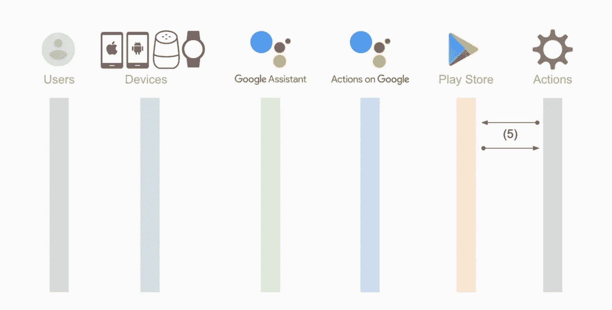

# 谷歌上的数字商品交易行为(消费产品)

> 原文：<https://medium.com/google-developer-experts/digital-goods-transaction-of-actions-on-google-consume-products-e40e534512e1?source=collection_archive---------4----------------------->

作为最后一个故事，我在这个故事中描述了如何实现一个功能来消费数字商品。

[](https://developers.google.com/actions/transactions/digital/dev-guide-digital) [## 构建数字交易| Google 上的行动| Google 开发者

### 要向数字采购 API 发送请求，您需要下载一个与您的……

developers.google.com](https://developers.google.com/actions/transactions/digital/dev-guide-digital) 

# 消耗品？非消耗品？

您的操作可以支持两种产品类型:被管理产品和订购产品。特别是，被管理产品还有两种类型:

*   **消耗性产品**:可以多次购买，比如一定数量的游戏内货币。购买商品后，发送消费请求以使商品再次可供购买。
*   **非消耗性产品**:每个用户只能购买一次，比如无广告体验的付费升级，或者有附加内容的游戏资料片。

在 Google Play 主机上两者没有区别。相反，你的行动需要处理这种差异。

# 检查用户已经购买的产品

当用户购买了您的产品后访问您的操作时，Actions on Google 会将购买的产品信息包含到对您的操作的每个请求中。您可以通过以下助手功能检索产品信息:

```
const findEntitlement = (conv, skuType, id) => {
    const entitlementGroups = conv.user.entitlements;
    const entitlementGroup = entitlementGroups.find(x => {
        return x.packageName === packageName;
    });
    if (entitlementGroup) {
        return entitlementGroup.entitlements.find(x => {
            return x.skuType === skuType.substring(9)
                && x.sku === id;
        });
    }
    return undefined;
};
```

在 Google Webhook 的行为协议中，用户已经购买的产品被称为“授权”。你可以通过`conv.user.entitlements`得到它们。结果的类是一个`[GoogleActionsV2PackageEntitlement](https://actions-on-google.github.io/actions-on-google-nodejs/interfaces/actionssdk_api_v2.googleactionsv2packageentitlement.html)`的数组。也就是说，您可以根据 Android 应用程序的包名检索多个权限。

每个`GoogleActionsV2PackageEntitlement`都有一个或多个`GoogleActionsV2Entitlement`，你可以通过`elements`属性访问它们。这个类有 SKU 的 ID 和类型。这意味着通过的授权代表用户已经购买的产品。您的行动可以知道包括包名称，SKU ID 和 SKU 类型的集合列表。

# 购买 _ 状态 _ 已拥有

当用户试图购买已经购买的产品时(这意味着您的操作响应具有产品的 SKU ID 和类型的`CompletePurchase`对象)，Google 上的操作返回`PURCHASE_STATUS_ALREADY_OWNED`状态作为结果。也就是说，购买请求失败。

非消耗品是指只能购买一次的产品。因此，对于非消耗性产品，这种行为是合适的。换句话说，基本上所有带有`CompletePurchase`的请求都被视为非消耗性采购。

# 重新购买被管理产品

对于易耗品，有必要采用其他方式重新采购(又名。消费)被管理产品。Google 上的 Actions 提供了一个 API 来消费产品。API 是操作 API 的一部分。



您应该已经拥有一个服务帐户，可以使用 Actions API 从 Google Play 检索产品信息。您可以使用同一个服务帐户来消费产品。

消费产品的代码如下:

```
const consume = (tokens, conv, entitlement) => {
    return new Promise((resolve, reject) => {
        const convId = conv.request.conversation.conversationId;
        const purchaseToken = entitlement.inAppDetails.inAppPurchaseData.purchaseToken;
        const url = `[https://actions.googleapis.com/v3/conversations/${convId}/entitlement:consume`](https://actions.googleapis.com/v3/conversations/${convId}/entitlement:consume`);
        request.post(url, {
            auth: {
                bearer: tokens.access_token
            },
            json: true,
            body: {
                purchaseToken
            }
        }, (err, httpResponse, body) => {
            if (err) {
                reject(err);
            } else {
                const statusCode = httpResponse.statusCode;
                const statusMessage = httpResponse.statusMessage;
                console.log(`${statusCode}: ${statusMessage}`);
                resolve();
            }
        });
    });
};
```

每项权利都有一个购买令牌，在购买后即可使用。可以通过权限对象的`inAppDetails.inAppPurchaseData.purchaseToken`获得令牌。您需要在端点的请求体中指定购买令牌来消费产品。

# 支持耗材和非耗材

因此，您可以像下面这样更新您的`actions_intent_OPTION`意图句柄函数:

```
const consumableProducts = ["coins"];app.intent("actions.intent.OPTION", (conv, params, option) => {
    if (option === "cancel") {
        conv.ask("Canceled");
        return;
    }
    const [skuType, id] = option.split(",");
    const entitlement = findEntitlement(conv, skuType, id);
    if (entitlement && consumableProducts.includes(id)) {
        return new Promise((resolve, reject) => {
            createJwtClient().authorize((err, tokens) => {
                if (err) {
                    reject(`Auth error: ${err}`);
                    return;
                }
                consume(tokens, conv, entitlement).then(() => {
                    conv.close(`You purchased ${id} successfully.`);
                    resolve();
                }).catch(err => {
                    reject(`API request error: ${err}`);
                });
            });
        });
    } else {
        conv.ask(new CompletePurchase({
            skuId: {
                skuType: skuType,
                id: id,
                packageName: packageName
            }
        }));
    }
});
```

# 结论

为了解释如何使用数字商品交易，有必要写 9 个故事…我认为数字商品交易的规范是如此糟糕。太多的步骤。太复杂了。而且，太难了。此外，官方文件没有提供足够的信息。我猜想大多数开发者不能通过阅读官方文件来实现你的数字商品交易行为。

我希望你能通过阅读我写的故事，用数字商品交易来实施你的行动，并从中获利。