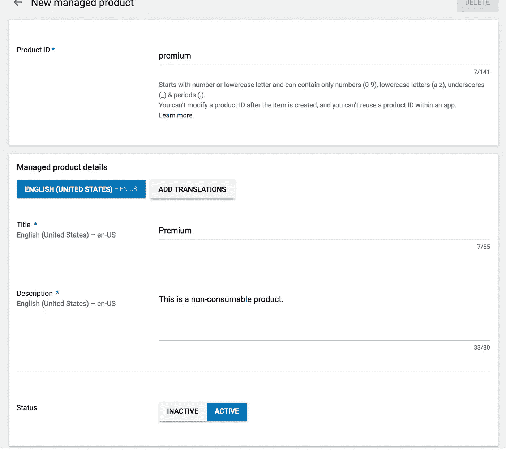
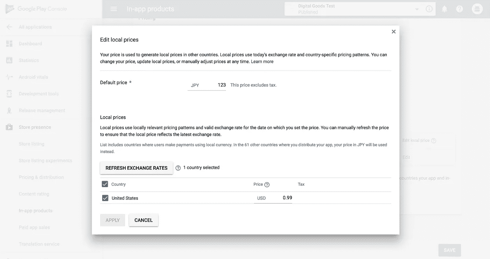
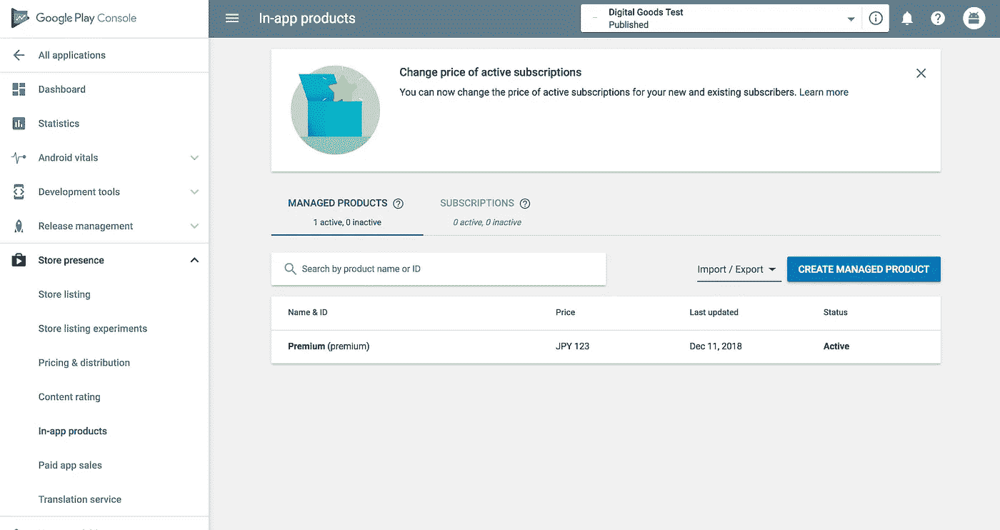
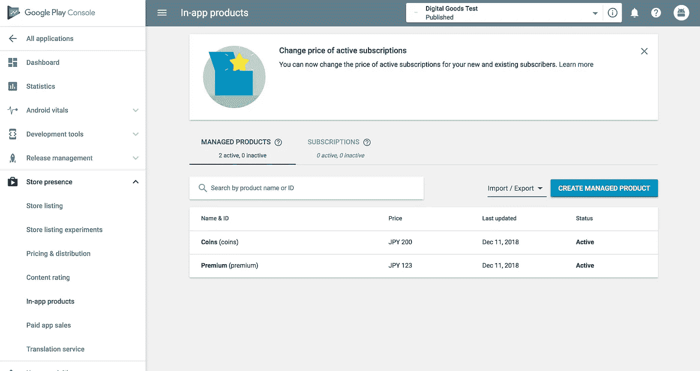

# 谷歌上的数字商品交易行为(注册产品)

> 原文：<https://medium.com/google-developer-experts/digital-goods-transaction-of-actions-on-google-register-products-e17e0136ab74?source=collection_archive---------2----------------------->

通过前面的故事，你已经有了一个测试数字商品交易的环境。现在，您可以在 Google Play 控制台上管理您的数字商品，并通过您的操作为用户销售它们。

 [## 构建数字交易| Google 上的行动| Google 开发者

### 要向数字采购 API 发送请求，您需要下载一个与您的……

developers.google.com](https://developers.google.com/actions/transactions/digital/dev-guide-digital) 

在这个故事中，我描述了如何在 Google Play 控制台上注册数字商品。

# 打开应用内产品页面

首先，打开 Google Play 控制台的应用内产品页面。单击 Google Play 控制台左侧导航页面上的“应用内产品”菜单项。

您可以在页面上注册您的产品。有两种类型的数字商品:管理产品和订阅。在本案例中，您创建了一些产品作为被管理产品。

# 注册被管理产品

被管理产品有两层含义:可消耗的和不可消耗的。基本上 Google Play 主机没什么区别。您可以将消耗性和非消耗性产品注册为被管理产品。

确认选择了“被管理产品”选项卡。如果未选择，请单击“被管理产品”选项卡。然后，单击“创建被管理产品”按钮。

您会看到新被管理产品的注册页面。这里注册两个被管理产品:“溢价”和“币”。“高级”是非消耗品，即用户只能购买一次。另一方面，“硬币”是消费品。所以用户可以多次购买这个。

为“高级”产品填写以下字段:

*   **产品 ID** :输入“premium”。
*   **标题**:输入“溢价”。
*   **描述**:输入“此为非消耗品”。
*   **状态**:选择“激活”。

然后，点击“添加价格”链接。然后，您会看到“编辑本地价格”对话框。填写以下内容:

*   **默认价格**:输入“123”。
*   **地区价格**:选择“国家”复选框。

单击“应用”按钮，然后对话框关闭。最后，单击页面底部的“保存”按钮。返回上一页时，您应该会在产品列表中看到注册的产品。

好了，让我们使用以下值将另一个产品注册为消耗品:

*   **产品 ID** :输入“硬币”。
*   **标题**:输入“硬币”。
*   **描述**:输入“这是一个消耗品”。
*   **状态**:选择“激活”。
*   **默认价格**:输入“200”。
*   **地区价格**:选择“国家”复选框。

因此，被管理产品列表应如下所示:

# 下一步行动

在本案例中，您注册了一些被管理产品。但是，你也可以用几乎相同的方式注册一些订阅。

最后，作为下一个行动，你将开始实施你的行动。我打算描述如何用 Dialogflow 和 Node.js 实现您的测试数字商品交易的操作。

 [## 谷歌上的数字商品交易行为(编写代码和测试)

### 从第 1 部分到第 6 部分，我描述了如何准备使用数字商品交易功能。现在，你…

medium.com](/@yoichiro/digital-goods-transaction-of-actions-on-google-write-code-and-test-9cb352e8d3db)