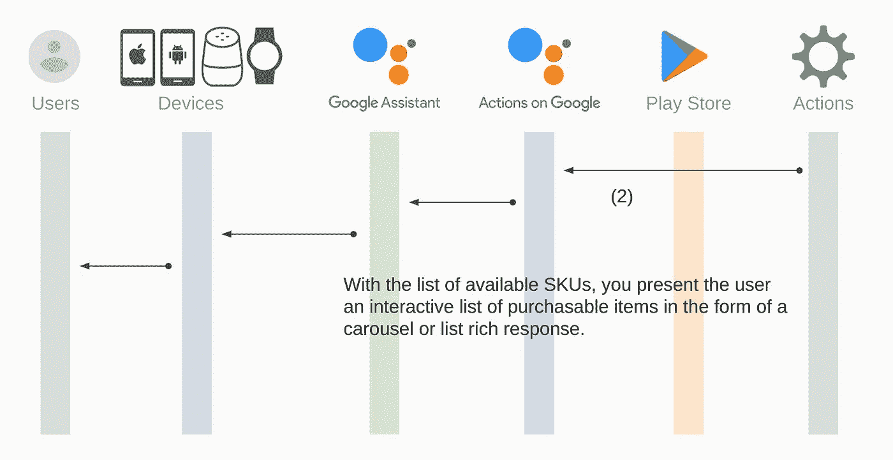

# 谷歌上的数字商品交易行为(编写代码和测试)

> 原文：<https://medium.com/google-developer-experts/digital-goods-transaction-of-actions-on-google-write-code-and-test-9cb352e8d3db?source=collection_archive---------1----------------------->

从第 1 部分到第 6 部分，我描述了如何准备使用数字商品交易功能。现在，您应该有一个测试该特性的环境。最后，你开始用这个故事中的数字商品交易来实施你的行动。

[](https://developers.google.com/actions/transactions/digital/dev-guide-digital) [## 构建数字交易| Google 上的行动| Google 开发者

### 要向数字采购 API 发送请求，您需要下载一个与您的……

developers.google.com](https://developers.google.com/actions/transactions/digital/dev-guide-digital) 

让我们开始吧。

# 交易流程

我已经描述了数字商品交易功能的交易流程。我再一次向你介绍这里的流程。

1.  收集信息
2.  构建订单
3.  完成购买
4.  描述购买状态
5.  使购买可重复

# 先决条件

现在，你应该有你的谷歌项目和 Dialogflow 代理的行动。但是，我没有描述到目前为止的成就。我不会在这里描述如何创造满足感。相反，请阅读以下指南:

[](https://developers.google.com/actions/dialogflow/fulfillment) [## 构建实现| Google 上的操作| Google 开发者

### 如果为此目的启用了实现，则活动定义要传递给实现的数据。这包括解析的数据…

developers.google.com](https://developers.google.com/actions/dialogflow/fulfillment) 

我假设您有自己的实现代码，可以将其部署到您拥有的某个服务器或某个云服务上，并且您已经为您的 Dialogflow 代理配置了实现 URL。例如，您的履行 URL 应设置如下:


我假设您的履行代码如下:

```
"use strict";const functions = require("firebase-functions");
const {
    dialogflow,
    List,
    CompletePurchase
} = require("actions-on-google");
const request = require("request");
const {google} = require("googleapis");const serviceAccount = require("<YOUR_SERVICE_ACCOUNT_PATH>");
const packageName = "<YOUR_ANDROID_APP_PACKAGE_NAME>";const app = dialogflow({
    debug: true
});// TODO: Write code here.exports.digitalGoodsTest = functions.https.onRequest(app);
```

`<YOUR_SERVICE_ACCOUNT_PATH`是您在第 5 部分从 Google 云平台控制台获取的服务帐户 JSON 文件路径。并且，`<YOUR_ANDROID_APP_PACKAGE_NAME>`是您在第 2 部分创建 Android 应用程序时决定的包名(我当时使用“jp.eisbahn.digitalgoodstest”作为示例)。

从属库如下:

*   谷歌上的行动
*   消防基地-功能
*   firebase-管理
*   请求
*   谷歌 API

通过`npm install`或`yarn add`将这些库添加到您的实现项目中。

我假设您可以在动作模拟器中调用您的动作，如下所示:


请注意，您需要使用 Dialogflow 控制台左侧导航菜单中的“集成”菜单，将您的 Dialogflow 代理集成到您在 Google project 上的操作中。

# 收集信息

首先，从 Google Play 收集有关您的数字商品的信息。在这里，您创建一个意向来订购收集可用的数字商品，并将意向处理程序功能实现到您的实现代码中。


单击 Dialogflow 控制台左侧导航菜单上“Intents”菜单项旁边的“+”图标。然后，创建新意向的页面打开。如下所示，在每个字段中填入值:

*   **意图名称**:输入“收集信息”。
*   **训练短语:**键入“收集信息”。
*   **履行**:开启“为此意图启用 webhook 调用”。


点击页面顶部的“保存”按钮。

好了，让我们开始编写预期的处理程序代码。您编写三个助手函数，然后编写处理函数。第一个助手函数是创建 JWT 客户端对象。

```
const createJwtClient = () => {
    const scopes = [
        "[https://www.googleapis.com/auth/actions.purchases.digital](https://www.googleapis.com/auth/actions.purchases.digital)"
    ];   
    return new google.auth.JWT(
        serviceAccount.client_email,
        null,
        serviceAccount.private_key,
        scopes,
        null
    );
};
```

第二个助手功能是从 Google Play with Actions API 获取 SKU 信息。

```
const getSkus = (tokens, conv) => {
    return new Promise((resolve, reject) => {
        const url = `[https://actions.googleapis.com/v3/packages/${packageName}/skus:batchGet`](https://actions.googleapis.com/v3/packages/${packageName}/skus:batchGet`);
        const convId = conv.request.conversation.conversationId;
        const param = {
            conversationId: convId,
            skuType: "SKU_TYPE_IN_APP",
            ids: [
                "premium",
                "coins"
            ]
        };
        request.post(url, {
            auth: {
                bearer: tokens.access_token
            },
            json: true,
            body: param
        }, (err, httpResponse, body) => {
            if (err) {
                reject(err);
            } else {
                const statusCode = httpResponse.statusCode;
                const statusMessage = httpResponse.statusMessage;
                console.log(`${statusCode}: ${statusMessage}`);
                console.log(JSON.stringify(body));
                resolve(body);
            }
        });
    });
};
```

上面的代码通过`request`库访问 Actions API。API 请求具有以下参数:

*   conversationId:您可以检索`conv`参数的对话 Id。
*   skuType:您想要获取产品的 SKU 类型字符串。如果要访问被管理产品，您指定`SKU_TYPE_IN_APP`。另一方面，如果你想访问订阅，你需要使用`SKU_TYPE_SUBSCRIPTION`。
*   ids:您想要知道的产品 id 的数组。

在调用动作 API 时，需要为请求头`Authorization`设置一个访问令牌。

# 构建订单

其次，您需要基于检索到的 SKU 信息构建响应，以便用户可以订购您的操作提供的产品。



下面的代码是第三个帮助器函数，用于构建和响应收集到的信息。

```
const respondSkus = (conv, body) => {
    const skus = body.skus || [];
    if (skus.length > 0) {
        const list = {
            title: "Products",
            items: {}
        };
        skus.forEach(sku => {
            const key = `${sku.skuId.skuType},${sku.skuId.id}`;
            const description = sku.description;
            const price = sku.formattedPrice;
            list.items[key] = {
                title: sku.title,
                description: `${description} | ${price}`
            };
        });
        list.items["cancel"] = {
            title: "Cancel",
            description: "Cancel purchase"
        };
        conv.ask("Which product do you want to order?");
        conv.ask(new List(list));
    } else {
        conv.ask("No products.");
    }
};
```

在上面的代码中，您用`List`可视组件构建了一个响应。列表中的每个项目都有一个标识每个产品的键。密钥由两个元素组成:SKU 类型和 SKU ID。

带有上述三个辅助函数的意图处理函数如下:

```
app.intent("Gather information", conv => {
    const SCREEN_OUTPUT = 'actions.capability.SCREEN_OUTPUT';
    if (!conv.surface.capabilities.has(SCREEN_OUTPUT)) {
        conv.ask("Sorry, try this on a screen device or " +
            "select the phone surface in the simulator.");
            return;
    }
    return new Promise((resolve, reject) => {
        createJwtClient().authorize((err, tokens) => {
            if (err) {
                reject(`Auth error: ${err}`);
            } else {
                getSkus(tokens, conv).then(body => {
                    respondSkus(conv, body);
                    resolve();
                }).catch(err => {
                    reject(`API request error: ${err}`);
                });
            }
        });
    });
});
```

你要做的第一件事是检查用户的表面。如果用户的设备没有屏幕，您的操作会拒绝购买请求，并回复代表这种情况的消息。

如果用户的设备支持屏幕，您可以继续购买。你应该有上一部分发布的服务账号密钥 JSON 文件。您不能使用 JSON 文件直接访问 Actions API。相反，您可以从服务帐户密钥 JSON 文件中发出一个访问令牌。为此，您需要调用`createJwtClient`函数结果的`authorize`函数。如果颁发访问令牌成功，您的操作用`getSkus`函数获取 SKU 信息，并用`respondSkus`函数响应它们。

# 完成购买

第三，当用户点击列表中的产品时，您需要实现处理程序。在 handler 函数中，您编写一个代码来请求与本节中的`CompletePurchase`对象的事务。


当用户点击列表中的一项时，Google 上的操作会向 Dialogflow 代理发送一个`actions_intent_OPTION`事件。您添加一个新的意图来处理 Dialogflow 控制台上的事件。单击 Dialogflow 控制台左侧导航菜单上“Intents”菜单项旁边的“+”图标。然后，创建新意向的页面打开。如下所示，在每个字段中填入值:

*   **意图名称**:输入“actions.intent.OPTION”。
*   **事件**:输入“动作 _ 意图 _ 选项”。
*   **履行**:打开网页挂钩。


单击“保存”按钮以反映填写的值。

好了，让我们开始写处理函数。将以下代码添加到您的履行代码中:

```
app.intent("actions.intent.OPTION", (conv, params, option) => {
    if (option !== "cancel") {
        const [skuType, id] = option.split(",")
        conv.ask(new CompletePurchase({
            skuId: {
                skuType: skuType,
                id: id,
                packageName: packageName
            }
        }));
    } else {
        conv.ask("Canceled");
    }
});
```

这段代码检查用户是否点击了“取消”项。如果不是，它从意图处理程序的第三个参数中检索 SKU 类型和 SKU ID，然后响应`CompletePurchase`对象。您需要为该对象指定三个参数:SKU 类型、SKU ID 和您的 Android 应用程序的包名。

在响应了`CompletePurchase`对象后，Google Assistant 向用户显示订单信息，包括价格，并询问用户是否真的购买。


# 描述购买状态

用户决定是否接受和购买订单。之后，Google 上的 Actions 将`actions_intent_COMPLETE_PURCHASE`事件发送到您的 Dialogflow 代理，并显示购买状态。


您的操作需要确认状态，并需要回复用户来描述购买的状态。


要接收`actions_intent_COMPLETE_PIRCHASE`事件，请在 Dialogflow 控制台上创建一个新的意图。单击 Dialogflow 控制台左侧导航菜单上“Intents”菜单项旁边的“+”图标。然后，创建新意向的页面打开。如下所示，在每个字段中填入值:

*   **意向名称**:输入“actions . Intent . complete _ PURCHASE”。
*   **事件**:输入“actions _ intent _ COMPLETE _ PURCHASE”。
*   **履行**:打开 webhook。


并且，添加下面的代码来处理意图。

```
app.intent("actions.intent.COMPLETE_PURCHASE", conv => {
    const arg = conv.arguments.get("COMPLETE_PURCHASE_VALUE");
    console.log("User Decision: " + JSON.stringify(arg));
    if (!arg || !arg.purchaseStatus) {
        conv.close("Purchase failed. Please check logs.");
        return;
    }
    if (arg.purchaseStatus === "PURCHASE_STATUS_OK") {
        conv.close("Purchase completed! You are all set!");
    } else if (arg.purchaseStatus === "PURCHASE_STATUS_ALREADY_OWNED") {
        conv.close("Purchase failed. You have already owned the item.");
    } else if (arg.purchaseStatus === "PURCHASE_STATUS_ITEM_UNAVAILABLE") {
        conv.close("Purchase failed. Item is not available.");
    } else if (arg.purchaseStatus === "PURCHASE_STATUS_ITEM_CHANGE_REQUESTED") {
        conv.close("Purchase failed. Item change requested.");
    } else {
        conv.close("Purchase Failed:" + arg.purchaseStatus);
    }
});
```

购买结果可从`conv.arguments.get("COMPLETE_PURCHASE_VALUE")`检索。并且您可以通过调用`arg.purchaseStatus`来获得购买状态。每个值代表每个购买状态，如下所示:

*   **采购状态确认**:采购可以完成。
*   **购买 _ 状态 _ 已拥有**:用户已经购买了该产品。
*   **PURCHASE _ STATUS _ ITEM _ UNAVAILABLE**:用户尝试购买的商品目前没有。
*   **PURCHASE _ STATUS _ ITEM _ CHANGE _ REQUESTED**:用户决定购买其他东西。
*   **购买 _ 状态 _ 用户 _ 取消**:用户取消了购买流程。
*   **PURCHASE_STATUS_ERROR** :交易失败，原因不明。
*   **PURCHASE _ STATUS _ UNSPECIFIED**:交易失败，原因不明，状态不明。

在此示例中，您的操作在响应根据每个购买状态决定的消息后结束对话。

好，写完所有代码后，将其部署到您的服务器/云服务。

# 释放你的阿尔法行动

在测试你的动作之前，你需要释放你的动作作为 Alpha。单击 Google 控制台操作左侧导航菜单中的“发布”菜单项。展开“ALPHA”部分，然后单击“提交 Alpha”按钮。


将打开“协议”页面。选中所有复选框，然后单击“提交”按钮。


此外，您需要应用最新的快照(称为“草稿”)作为测试的目标。单击左侧导航菜单中的“模拟器”菜单，然后单击页面顶部的“更改版本”按钮。


在打开的对话框中，选择“版本-草稿”作为目标版本，然后单击“完成”按钮。


干得好！一切准备就绪，考验你的行动。

# 测试您的行动

现在，您可以测试您的操作。谷歌建议使用 Android 设备测试数字商品交易。在 Android 上启动谷歌助手，然后对助手说“与<your_action_name>对话”。</your_action_name>


对助理说“收集信息”。


点击列表中的“高级(数字商品测试)”。


点击“立即购买”建议芯片。


要完成购买，请将手指放在传感器上或输入密码。


几十秒钟后，


你看到了购物的收据。点击“继续”建议芯片。


恭喜你！购买已完成，您的操作收到了`PURCHASE_STATUS_OK`值。

# 下一步行动

最后，您可以用数字商品交易来实现您的操作。也就是说，您已经知道如何使用数字商品交易的简单场景来构建您的操作。

在下一个故事中，我打算描述数字商品交易的其他部分。