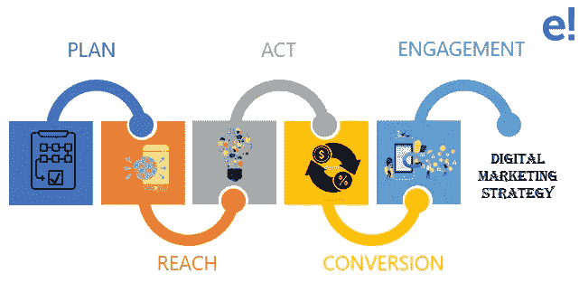

# 数字营销策略:如何规划自己的事业？

> 原文：<https://medium.com/edureka/digital-marketing-strategy-d522a6d34a32?source=collection_archive---------1----------------------->

在当今的在线交流和交易世界中，*数字营销*非常重要。除非你有一个合适的计划，并且知道数字营销策略，否则你所在的组织的规模或类型并不重要。因此，为了帮助你制定一个合理的计划，这篇关于数字营销策略的文章是你的一站式解决方案。

本博客将带您了解以下主题:

*   为什么需要数字营销策略？
*   什么是数字营销战略？
*   如何入门？
*   需要注意的要点
*   如何构建数字营销计划？
*   应对挑战的策略

我们开始吧！

# 为什么需要数字营销策略？

每个公司都有其特定的目标，但大多数公司只专注于推动销售，寻找新的成功之路是一项令人厌倦的任务。这就是营销策略发挥作用的地方。为了使你公司的工作更有效，你必须利用所有最有价值的营销资源和技术，互联网名列前茅。

因此，收集一些资源并规划出合适的商业策略肯定会让你的公司受益。

# 什么是数字营销战略？

一个*数字营销*策略基本上是实现你的数字营销目标的行动计划。战略是通过特定目标实现的行动计划。

付费、收入和社交媒体等营销渠道都属于这一策略。根据你的工作规模，策略可能包括计划，每个都有不同的议程和最终结果。

当我说战略时，最确定的是它需要更多的创造性思维，并且也很难创造。因此，让我们看看如何开始制定您的业务运营战略。

# 如何入门？

这些是影响任何组织成长的几个必须知道的因素。

*   **品牌**:概述你的组织方针，这有助于在线活动。此外，更多地关注 USP(独特卖点),以实现销售转化。
*   创建 SMART 目标 : SMART 代表具体的、可衡量的、可实现的、现实的和及时的结果。因此，以对客户和组织都有利的方式来规划你的业务。
*   **建立买家角色**:确定你的业务范围。瞄准一批合适的客户，赢得他们的信任。
*   **选择合适的营销策略**:设定目标后，需要在策略上挑三拣四。专注于为你的业务和流行策略提供最大价值的一些技术。
*   **制定适当的营销预算**:预算在你的生意中扮演着重要的角色。你需要知道在哪里投资，应该投资什么。
*   **启动您的营销活动**:经过适当的规划后，通过营销渠道启动您的营销活动。确保您的所有渠道都有适当的跟踪信息。
*   **跟踪你的结果**:你必须监控和衡量绩效策略。这可以通过跟踪他们的结果来实现。像谷歌分析这样的工具在这种情况下非常有用。

接下来，我们有你在制定业务流程战略时应该考虑的要点。

# 需要注意的要点

*   **了解你的企业需要什么，并设定相应的目标**

你必须对你的商业目标非常挑剔，还要设定一个目标:数字营销任务必须符合你令人印象深刻的计划。您还应该能够设置和衡量您的 KPI。通过确定你想要达到的数字来熟悉这些。能够分析您以前的数字营销工作，以获得更好的 KPI。此外，确定和衡量你的每一个关键绩效指标。

*   分析你过去的努力，试着不要犯同样的错误

分析你过去的数字营销努力、失败和成功，并纠正自己，这足以让企业顺利运营。这些确实有助于设定最佳 KPI。

*   **沟通**

永远记住你在和谁说话，试着用他们的语言谈生意。不要让计划带走你试图接触的人。你很了解你的观众，所以尽量多互动。

*   **确定你的方式**

确定你的手段有三个非常重要的因素:你的预算、你的数字渠道和你的营销团队。没有这些，还不如没有市场部。在决定下一阶段还需要什么之前，储备好所有的资源是很重要的。

*   **制定有效的计划**

创建一个富有成效的计划是一项单调乏味的任务，但你应该小心翼翼地根据一系列有见地的假设和分析精心制定一个计划，你可以准确预测你的客户将会如何行动。所以，监控你的数字营销策略的表现是非常重要的。

接下来，让我们看看如何构建数字营销计划。

# 如何构建数字营销计划？

整合的数字营销策略将为您提供所有关键在线营销活动的基础。以下是一些营销活动:

*   **计划:**考虑使用数据驱动的方法来审查您当前的数字营销效果、定制分析、KPI 仪表盘和 SMART 目标，创建一个优先改进您如何部署数字营销媒体、技术和数据的战略，以增加销售线索并进而增加销售额。
*   **Reach** :你应该能够利用社交媒体、搜索引擎优化、内容营销等在线营销渠道来建立知名度，这将增加你网站的访问量。
*   **行动**:总是鼓励在你的网站上互动，有时也鼓励在社交媒体上互动，这将有助于你创造商机。
*   **转化**:最大的目标是通过重新定位、培育和转化率优化(CRO)来产生收入，以提醒和说服你的受众通过其中一个营销渠道购买。
*   **参与度**:通过使用网络、电子邮件和社交媒体营销改善个性化沟通，增加现有客户的销售额。

到现在为止，你应该已经知道如何策划你的商业目标了。现在，让我们看看在制定营销策略时，你将面临哪些不同的挑战。

# 应对挑战的策略

你可以通过由许多不同策略组成的数字战略来应对数字营销。当所有这些策略一起使用时，它们创造了一个整体的方法来让您的企业获得更多的线索。

*   **将你的重点转移到内容营销**上，因为这有助于许多行业宣传他们的产品和公司。
*   **了解你的数字营销战略中的有机内容和付费广告**，因为有很多噪音在争夺你的客户的注意力。每天都有无数的文章、视频、广告在他们眼前闪过。虽然有机内容对你的 SEO 排名和社交媒体活动仍然很重要。

此外，我们以“*数字营销策略*”结束这篇文章。我希望你们都清楚所涵盖的主题，据我所知，这将真正有助于你的追求。如果您有任何疑问，请在评论区提出，我们会尽快回复您。