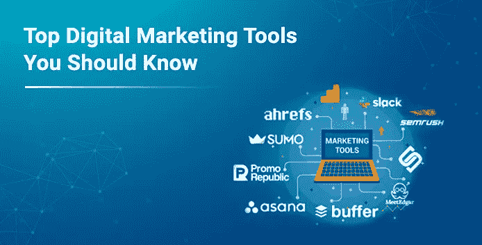
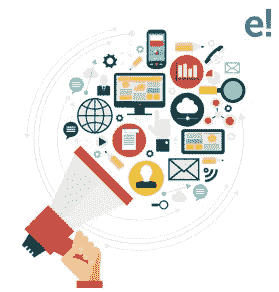
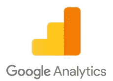
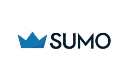
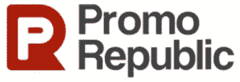
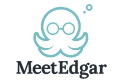
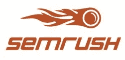
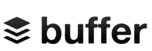
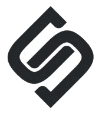
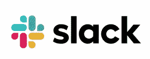

# 你应该知道的顶级数字营销工具

> 原文：<https://medium.com/edureka/digital-marketing-tools-43ddc4ddc835?source=collection_archive---------1----------------------->

最近几天，你会发现市场上有很多数字营销工具，有点不知道从哪里开始。每种营销工具都需要你投入时间和金钱。选择合适的营销工具是一项繁琐的任务，因此，我写了这篇文章，帮助你详细了解 10 大营销工具。

本博客将带您了解以下主题:

*   营销工具有哪些？
*   为什么需要数字营销工具？
*   十大工具

我们开始吧！

# 营销工具有哪些？

当我说数字营销时，有几样东西和我们完成工作所依赖的工具一样重要。您应该拥有一套合适的软件工具来管理数据洞察、内容和所有其他任务，数字营销至关重要！如果没有正确的方法，你就无法制定一个能够触及目标客户并跟随他们走过客户之旅的策略。

主要目的是提供可用的不同工具的列表，以及各种行业、产品或服务的功能比较。如果使用得当，它可以帮助你提高数字营销的效率。

这些工具作为一种策略，利用社交媒体的力量，使用搜索引擎优化(SEO)来提高流量，并充分利用现有的媒体营销进步。

# 为什么需要数字营销工具？

近年来，有这么多不同的在线营销工具已经进入市场，很难知道从哪里开始。每一种新的营销工具都需要你投入时间和血汗钱，所以要明智地选择。如果你现在选择了一个错误的，然后最终切换到另一个可能是一个麻烦。

实际上，现在市场上有各种各样的免费工具。据说，这是当今数字营销工作中令人愉快的方面之一。

当我说工具时，它们包括一切，从脸书和 Instagram 等社交媒体平台到谷歌分析。这些工具允许营销人员创建、测试和衡量他们正在进行的活动的表现。它们还确保营销人员能够快速有效地发起和测试营销活动。

现在，让我们来看看将使您的组织受益的 10 大数字营销工具。

# 十大工具

谈到工具，我列出了市场上需求量非常大的十大数字营销工具。我还根据营销渠道对他们进行了分类。

它们是:

1.  数据和分析
2.  社交媒体营销
3.  搜索引擎优化
4.  内容
5.  项目管理

在这些类别下，我们将讨论有助于公司成功的两个重要工具。

首先，让我们从数据和分析开始。

# 数据和分析

*   谷歌分析
*   SumoMe

这两个属于数据和分析的范畴。

## 谷歌分析

谷歌分析是任何寻求扩大业务规模的数字营销人员的必备工具。这个免费的工具给你所有关于你的网站性能的详细信息，包括观众人口统计，热门关键词，你执行的操作，等等。这个奇妙的工具还能让你知道你在哪里丢失了流量。

## SumoMe

这个工具允许你在浏览者还在你的网站上的时候跟踪他们的行为，并做出相应的调整。你可以使用热图来查看人们在哪里点击，使用内容分析来查看人们在哪里停止阅读。数据和分析类别下的最佳工具之一。

名单上的下一个是社会媒体营销。让我们看看应该使用什么工具。

# 社交媒体营销

*   促进共和
*   遇见埃德加

## 促进共和

PromoRepublic 基本上是一个一体化的工具，有助于在自动驾驶模式下运行您的内容。它为机构和自由职业者提供内容创建、日程安排、社交媒体监控、协作和报告功能。

它也可以作为一种白标解决方案(一家公司的产品，其他公司将其更名，使其看起来好像是他们制造的)。该工具可以简化您的工作流程，每月可以为您节省 20 个小时。

## 遇见埃德加

MeetEdgar 实际上是创建鼓舞人心的内容的最佳数字营销工具之一。你可以将推文、LinkedIn 更新和脸书帖子添加到你的库中，然后可以根据你的需要分成多个类别。此外，您可以设置一个日历来安排每个类别在指定时间发布到选定的社交媒体帐户。

接下来是搜索引擎优化(SEO)。

# 搜索引擎优化

两个免费工具正被广泛使用。

*   UberSuggest :这个工具只需使用一个简单的建议工具，就能帮你想出新的关键词或博客主题。
*   **谷歌关键词规划器**:它让你知道你的潜在关键词中哪一个的搜索量更大。

最常用的 SEO 工具有:

*   Ahrefs
*   塞姆拉什

## AHREFS

这个搜索引擎优化工具是最受欢迎的数字营销工具之一，用于分析，准备反向分析，审计报告，网址排名等等。Ahrefs 工具也用于关键字分析。

这不是一个免费的版本，但是这个工具拥有的特性是值得花一美元购买的。

该工具处理大量点击流数据，以维护**全球最大的第三方搜索查询数据库**。这基本上是估计的每月搜索量和高级关键字研究指标。

几乎所有的顶级公司都使用 Ahrefs，如脸书、Linked In、网飞等等。

## 塞姆拉什

嗯，这是搜索引擎优化营销的另一个宏伟的工具。SEMRush 对你的关键词进行研究，跟踪你的商业策略，并对你的博客进行搜索引擎优化审计。该工具的主要目的是为所有数字营销领域创造最佳的竞争情报解决方案。

SEMRush 非常适合 PPC(点击付费),因为它允许大量的关键字研究，有助于规划和跟踪您的付费搜索活动的表现。

所以，伙计们！这是最好的搜索引擎优化营销工具之一，目前在市场上蓬勃发展。

下一组工具将处理内容创建。

# 内容

*   缓冲器
*   Snip.ly

## 缓冲器

Buffer 是一种快速分享你正在阅读的任何内容的方式。它有助于建立你的受众，并努力在社交媒体上发展你的品牌。你只需要简单地下载扩展或应用程序和你的工具链接。它会自动将您的帖子添加到您的队列中，并发布到您选择的社交媒体平台。

## Snip.ly

该工具允许您在社交媒体平台上分享的每个博客和帖子上添加行动号召选项。除此之外，您甚至可以使用主题、徽标、颜色等来个性化您的链接。例如，您可以在您发布到社交媒体的页面上附加一个链接到您网站的按钮，这样人们在阅读时就可以更容易地发现您。

接下来是项目管理。

# 项目管理

*   阿萨纳
*   松弛的

## 阿萨纳

Asana 是最好的工作管理平台工具之一。这个工具有助于你更快地完成工作。它很容易阅读项目的进度报告，也有能力将对话转化为任务，甚至项目模板。

这个工具可以帮助你的团队专注于你当前的优先事项，同时也提高了工作效率。

## 松弛的

这个工具是一个基于云的专有即时消息系统，允许你与你的团队或客户快速沟通。它基本上是你整个组织的一个聊天室，旨在取代电子邮件作为你交流和分享的主要方式。举行针对特定话题的私人谈话或聊天频道。

这些是你应该掌握的十大数字营销工具，以把握你公司的发展。不仅仅是这 10 条，还有一些有助于营销你的产品。

说到这里，我们来结束这篇关于“数字营销工具”的文章。我希望你清楚所讨论的话题，并增加数字营销知识的价值。如果你想查看更多关于人工智能、DevOps、道德黑客等市场最热门技术的文章，你可以参考 Edureka 的官方网站。

请留意本系列中的其他文章，它们将解释数字营销的各个方面

> *1。什么是数字营销？
> 2。75 大数字营销面试问答*

*原载于 2019 年 12 月 3 日【https://www.edureka.co】**。***