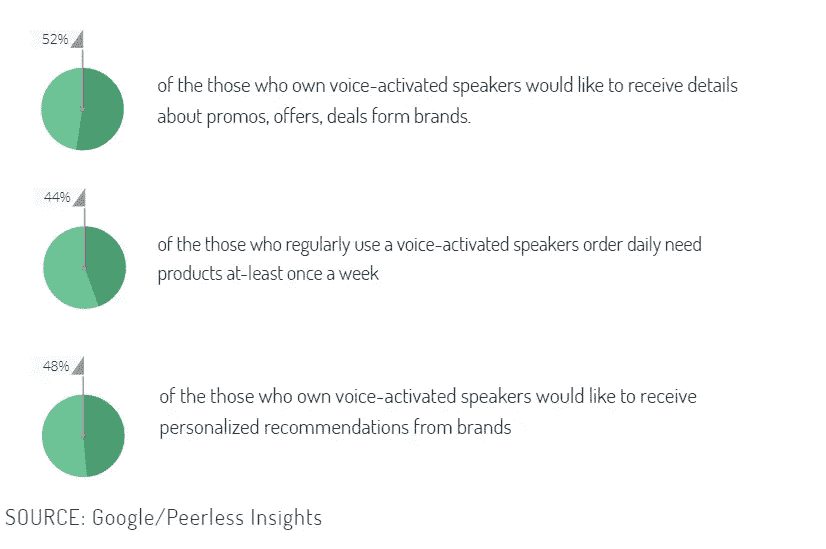

# 数字个人助理:新的营销渠道及其分析

> 原文：<https://medium.com/globant/digital-personal-assistants-new-marketing-channel-and-its-analysis-5d5c9b39bed8?source=collection_archive---------3----------------------->

## **数字个人(语音)助理:前提**

使用数字个人助理(DPA)或通常称为语音助理(VAs)是访问网络信息的最新方式的例子，它们在最终用户中的使用正在增加。

从市场调查中可以明显看出，随着 DPA 的不断发展，越来越多的人开始采用这项技术来完成工作。这使得 DPA 成为企业联系客户的重要渠道，反之亦然。

people who took the survey were familiar with voice-enabled services and apps

57% of them used smartphones to interact with voice assistant.

65% interacted of them with DPAs at-least once per day

## **你准备好发声了吗？？**

*   这对您的业务意味着什么，语音助手与您的业务有多大关联。
*   对您的目标受众/消费者以及该群体中语音助手的使用趋势进行市场调查，并决定您的企业是否需要 DPA。
*   其次，确定您的关键业务产品，并将它们集成到 DPA 中，并允许用户执行重要的业务操作，而不必拿起他们的物理设备。

**数字营销生态系统中的数字助理**

*采集通道*

就像社交，电子邮件和有机，语音助手应该被视为一个渠道，为您的应用程序带来流量。

*用户行为*

语音助手代表用户与您的应用程序进行交互，因此，跟踪语音助手执行的重要业务操作非常重要。

*营销渠道*

随着语音助手的使用不断增长，企业需要在这个平台上针对目标用户制定营销策略。

**数字语音助手的用户活动分析**

跟踪由 VAs 执行的活动及其分析将帮助企业扩展和改善用户体验。

尽管虚拟助理市场有 3 个主要参与者(即谷歌助手、亚马逊 Alexa 和苹果的 Siri)，但在这篇博客中，让我们探索用户行为分析如何与谷歌助手*和安卓移动应用*联系起来**

***先决条件***

*   与 Google Actions 集成:为了让用户通过 VA 在他们的应用程序上完成事情，企业需要确保应用程序的功能与使用 Google Actions 平台的 Google Assistant 集成。
*   Firebase analytics 与应用程序集成。

***交互类别***

用户交互可以有两种类型:

a.语音搜索——这类似于谷歌分析中的“浏览量”概念

b.语音操作——这类似于谷歌分析中的“事件”

**数据收集**

何时触发数据收集请求:

1.  当虚拟设备向您的应用程序发送请求时，或者
2.  当应用程序发送响应时。

***用户 ID***

一旦按照 Google 的建议完成了与 Firebase 的基本集成，就可以使用

*mfirebase analytics . set userid(" 123456 ")；*

***观众***

一旦设置了用户 id:

1.  在 Firebase Analytics 的用户属性部分创建和注册自定义“用户属性”。
2.  当用户使用语音助手打开应用程序时，要求您的开发人员使用设置用户属性

*mfirebase analytics . set user property(" Google _ assistant "，mGoogleAssistant)；对于使用您的应用程序的个人*

**跟踪语音搜索和语音动作**

可以使用以下命令将用户交互发送到 Google Analytics，该命令跟踪 Firebase 的自定义事件。

*Bundle params = new Bundle()；*

*params . putstring(" voice _ search term "，term)；*

*mfirebase analytics . log event(" voice _ search "，params)；*

**您的语音助手绩效 KPI**

1.  语音助手的会话持续时间/计数

2.语音搜索次数

3.通过语音助手执行的转换。

4.没有回应/回应无效

5.会话长度

6.增长率

7.会话深度

8.平均值。每个会话的屏幕。

9.应用程序的响应时间

10.每日活跃用户