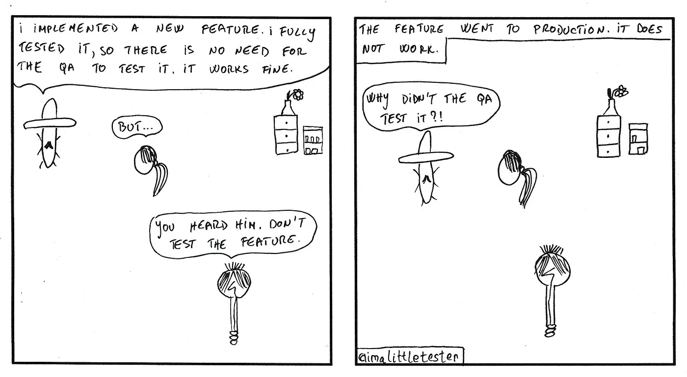

# A Story From QA Tester

> 原文：<https://medium.easyread.co/dilema-seorang-qa-tester-bd25822eac5b?source=collection_archive---------1----------------------->

## Sebuah dilema yang sering dihadapi oleh seorang QA Tester

Photo by [Obi Onyeador](https://unsplash.com/@thenewmalcolm?utm_source=unsplash&utm_medium=referral&utm_content=creditCopyText) on [Unsplash](https://unsplash.com/s/photos/quality?utm_source=unsplash&utm_medium=referral&utm_content=creditCopyText)

***Halo semua, gimana kabarnya?***Mudah-mudahan sehat selalu *yah* , mengingat pada saat ini virus corona atau sering disebut covid-19 sedang marak menyebar di seluruh penjuru dunia, jadi bagi kamu semua, selalu jaga kesehatan ya *readers* 😉!!

*Well* , tidak terasa waktu berjalan sangat cepat. Sebelumnya saya menggunakan medium ini untuk menulis artikel tentang *design thinking,* kebutuhan perkuliahan. Sekarang saya mau mengalih-fungsikan medium untuk menjadi *diary saya* tentang apa saja problematika yang saya hadapi dan rasakan mengenai pekerjaan saya. *Nah* , saat ini saya sudah bekerja sebagai seorang ***Quality Assurance*** atau sering disingkat **QA** di suatu perusahaan swasta yang bergerak dalam pengembangan IT *service.* Saya sudah bekerja di perusahan ini selama hampir 10 bulan sebagai QA.

*Nah,* bicara soal QA, QA itu ada QA manual/QA tester dan QA Engineer. Bedanya apa ya? Nanti saya buka tanya jawab soal itu ya.

Sesuai dengan judul tulisan saya, kali ini saya akan sedikit bercerita mengenai pengalaman saya selama menjadi seorang QA Tester. Jadi selama menjadi QA Tester, ada hal yang membuat saya kesal, salah satunya adalah pandangan orang-orang terhadap QA. Ada banyak orang yang menganggap menjadi seorang QA itu gampang karena kerjanya cuma *nge-test doang* . ***Nge-test doang?*** Sedih nih aku dengernya. *Well* , tidak dapat dipungkiri, mungkin ada beberapa lingkungan bisnis yang membentuk QA-nya menjadi pekerjaan yang gampang karena hanya melakukan *test* saja. Tapi nyatanya, “ *ngetest doang* ” itu gak segampang yang kita pikirkan *loh* . Karena berdasarkan skenario *test* yang kita buat, itu akan menentukan gimana *sih* kualitas produk yang mau kita hasilkan.

*Image taken from Google Images*

Sebagai contoh, anggap saja, QA tester itu guru. Guru akan mengajar kemudian memberikan ujian atau test kecil-kecilan buat para siswanya. Untuk melihat bagaimana kualitas materi pelajaran yang dia sampaikan kepada siswanya, maka si guru akan buat soal ujian yang akan dikerjakan siswa. Ada standard nilai yang dijadikan sebagai tolak ukur untuk menilai apakah materi yang diberikan dapat dipahami siswa dengan baik atau tidak. Begitu juga dengan produk atau *software* yang akan di- *test* , ada *test result* yang dijadikan tolak ukur buat menilai aplikasinya *ready to use* atau tidak. *Nah* , soal ujian yang digunakan akan menentukan apakah siswa lulus test dan paham materi apa tidak, begitu juga dengan kelayakan sebuah produk *software* . Ketika di test menggunakan *test scenario* yang telah disusun, apakah produk *software* itu *passing the test well* atau tidak. Kalau tidak, maka bisa ada anggapan bahwa kualitasnya tidak sebaik yang diharapkan.

*Nah* , untuk melakukan pengujian tersebut tidaklah gampang. Kita harus mengetahi bagaimana *business prosess-* nya, struktur *database* -nya, algoritma yang dipakai, bahasa pemogramannya, apakah produk akan terintegrasi dengan sistem lain atau tidak. Banyak hal yang akan diukur. Oleh karena itu, menjadi QA tidak segampang kelihatannya. Kalau kita berpikir akan menjadi seorang QA untuk menghindari aktivitas ngoding. **No!** Berarti anda salah tujuan menjadi QA. Kalau ada yang masih berpikir, *ya elah jadi QA mah semua orang bisa* . **No!** Saya mau mengatakan prinsip yang ada dalam *software quality assurance* tidak semudah asal aplikasi lolos test saja dan bisa digunakan oleh user. Tapi dia akan memikirkan berapa *cost* yang akan keluar jika terjadi kegagalan transaksi pada sistem yang diuji, apakah memperbaikinya lama. Pasti rugi sekali.

Karena pertama sekali orang-orang akan menyalahkan QA. Berarti aplikasinya diuji secara asal. ***That’s why is not easy to be QA* .** QA itu bakal menjadi orang yang parnoan kalau aplikasi itu *launching* . Dia akan sangat merasa bersalah ketika sistem rusak saat digunakan.

*Nah,* itu adalah sebuah cerita yang mau aku sampaikan buat teman-teman mengenai dunia QA. Jangan berpikir menjadi QA itu gampang dan mudah. Coba pikir ulang, apa tujuan kita jadi QA. Apakah cuma mau menghindari ngoding? Karena kenyataannya , QA juga ngoding *kok* .

Tidak ada pekerjaan yang mudah untuk dilakukan, semua pastinya memiliki *value* dan bagiannya sendiri. Sekian semoga bermanfaat. Tapi jangan jadi takut juga ya menjadi QA. **Happy testing!!!** 😉